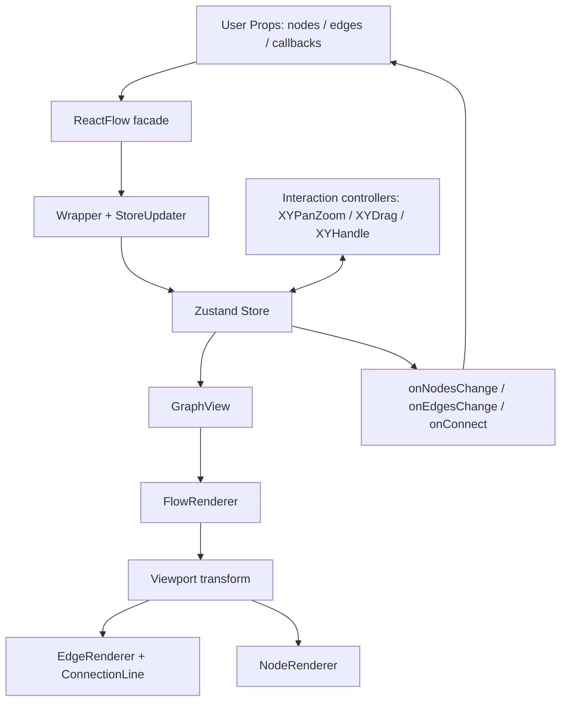
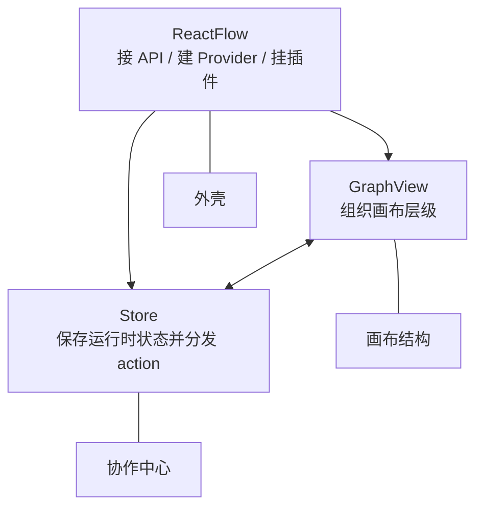

# 《读懂 React Flow 源码》系列导读

这组文章想回答的不是“React Flow 怎么用”，而是一个更工程化的问题：

**一个节点编辑器库，到底是怎么从 `nodes` 和 `edges` 这两个数组，长成一套能渲染、能缩放、能拖拽、能连线、能选择、能扩展、还能把变化稳定交还给用户的运行时系统的？**

很多人第一次接触 React Flow，会从一个很轻的例子开始：

```tsx
<ReactFlow nodes={nodes} edges={edges} />
```

然后自然以为它主要就是一个“画节点和线的 React 组件”。这个理解能帮你入门，但不能帮你读源码。因为源码里真正承重的部分，不是 JSX 怎么写，而是这几个问题：

```txt
用户传入的 Node 为什么要变成 InternalNode？
Edge 为什么只是关系，不是 path？
Handle 为什么要单独建模？
Viewport 和 Transform 为什么不能混用？
拖拽为什么最后产生 NodeChange，而不是直接改 DOM？
React 包为什么要重新导出 system 的工具？
GraphView 为什么要分成 FlowRenderer / Viewport / EdgeRenderer / NodeRenderer？
```

这些问题连起来，才是 React Flow 源码的主线。

## 一、这组文章的阅读约定

这组文章不按目录树扫源码。

目录树会让人误以为每个文件都同等重要，但源码阅读最怕“平铺”。更稳的方式是先抓承重链路：

```txt
用户 API
  -> ReactFlow 门面组件
  -> Wrapper / StoreUpdater
  -> Zustand Store
  -> GraphView 渲染总装层
  -> Viewport / EdgeRenderer / NodeRenderer / ConnectionLine
  -> system 层的 graph / viewport / drag / handle / panzoom 工具
  -> changes / callbacks 回流到用户状态
```

这个链路立住后，再去看每个文件，就不会觉得它们只是散点。

发布时所有源码证据都使用 xyflow 仓库相对路径，比如 `packages/react/src/container/ReactFlow/index.tsx`。如果正文出现行号，默认基于 `xyflow@7e972983b392b747342cda68ece4e5bf082860a1`；如果你用的是更新版本，行号可能会漂移，但文件边界和调用关系仍然是这组文章要验证的重点。

这组文章还会反复使用一个贯穿例子：拖动一个节点。它足够小，但能穿过几乎所有核心模块：

```txt
用户拖动节点
  -> XYDrag 按 viewport / snapGrid / nodeExtent 计算位置
  -> store.updateNodePositions 生成 position changes
  -> triggerNodeChanges 分流 controlled / uncontrolled
  -> onNodesChange 把变化交给用户
  -> 用户更新 nodes
  -> StoreUpdater 调用 setNodes
  -> adoptUserNodes 更新 InternalNode / lookup
  -> NodeRenderer / EdgeRenderer 更新画布
```

后面每读到一个模块，都可以问一句：它在这条拖拽链路里负责哪一步？

每篇都遵守一个写法：

```txt
先讲为什么要有这个机制
再讲它在用户 API 里表现成什么
再回源码里找承重文件
再讲关键数据结构和调用链
最后讲如果自己实现，最小版本应该怎么写
```

这不是为了绕远路，而是为了避免源码解析最常见的问题：把代码翻译成中文，却没有解释它为什么长这样。

## 二、先建立整体图景

如果你已经会用 React Flow，只想最快读到承重部分，可以先跳读：

```txt
03 / 04 / 06 / 07 / 09 / 11 / 12
```

如果你是第一次系统读源码，还是建议按 01 到 07 顺着走。前两篇抽象会稍多，这是这套读法的代价：先建立问题域和词汇表，后面进入 store、renderer、interaction 时才不会被文件数量淹没。

React Flow 可以粗略拆成五层：

```txt
数据模型层：Node / Edge / Handle / Connection
视口系统层：Viewport / Transform / bounds / fitView
渲染系统层：GraphView / Viewport / NodeRenderer / EdgeRenderer / portal
交互系统层：PanZoom / Drag / Handle Connect / Selection / Keyboard
对外 API 层：ReactFlow / hooks / callbacks / plugin components
```

画成一张运行时图：



这张图里有两个方向。

第一个方向是“数据往下变成画布”：

```txt
nodes / edges
-> store
-> GraphView
-> DOM / SVG
```

第二个方向是“交互往上变成变化”：

```txt
pointer / wheel / keyboard
-> interaction controller
-> store action
-> NodeChange / EdgeChange / Connection
-> user callback
```

React Flow 的源码难点，正是在这两个方向的交汇处。它既要像 React 组件一样声明式，又要像图编辑器一样持续响应高频交互。

## 三、源码阅读的三条主线

### 1. 包边界主线：为什么有 system / react / svelte？

xyflow 不是单包项目。它把框架无关的类型、几何计算和交互控制器拆到 `@xyflow/system`，再用 `@xyflow/react` 和 `@xyflow/svelte` 包装成不同框架的 API。这里的 `system` 不是完整运行时；完整运行时还包括 React/Svelte 各自的 store、renderer、provider、hooks 和插件层。

这条主线回答的是：

```txt
哪些能力属于图编辑器核心？
哪些能力只是 React 绑定？
哪些能力可以被 Svelte 复用？
```

如果不先理解这条线，读 React 包时就会频繁疑惑：为什么这个函数从 `@xyflow/system` 来？为什么拖拽逻辑不直接写在 React 组件里？为什么边路径工具从 React 包导出，但源码却在 system？

### 2. 运行时主线：ReactFlow 如何组织一棵可交互画布？

这一条从 `ReactFlow` 主组件进入：

```txt
ReactFlow
  -> Wrapper
  -> StoreUpdater
  -> GraphView
  -> FlowRenderer
  -> Viewport
  -> EdgeRenderer / ConnectionLine / NodeRenderer
```

它回答的是：

```txt
外部 props 怎么进入 store？
store 怎么驱动渲染？
渲染层为什么要分层？
children 插件为什么能接进来？
```

### 3. 交互主线：用户动作如何回流成数据变化？

这一条从 system 的交互控制器进入：

```txt
XYPanZoom：管理 viewport
XYDrag：管理节点拖拽
XYHandle：管理 handle 连接
Selection / Keyboard：管理选择和删除
```

它回答的是：

```txt
鼠标坐标怎么转成 flow 坐标？
拖拽为什么要考虑 zoom / snapGrid / nodeExtent？
连接为什么不是 EdgeRenderer 的职责？
交互为什么最终产生 changes，而不是直接修改用户数据？
```

## 四、文章目录

第一部分先建立概念模型：

1. [React Flow 解决的到底是什么问题？](./01-what-problem-react-flow-solves.md)
2. [React Flow 的核心概念：Node、Edge、Handle、Viewport、Store](./02-core-concept-map.md)
3. [xyflow monorepo 架构：system / react / svelte 为什么要拆开？](./03-xyflow-monorepo-architecture.md)
4. [从入口文件看公共 API 设计](./04-public-api-entrypoints.md)

第二部分进入源码核心模块：

5. ReactFlow 主组件：门面组件如何组织运行时？
6. GraphView：节点、边、连接线和 viewport 的渲染分层
7. Store：React Flow 的状态中心
8. InternalNode：为什么用户节点需要被增强？
9. 坐标系统：screen、container、flow、viewport
10. XYPanZoom：缩放和平移系统
11. XYDrag：节点拖拽系统
12. XYHandle：Handle 和连线系统
13. Edge path：边路径与图工具函数
14. controlled / uncontrolled：交互变化如何回流给用户？
15. Selection：点击、框选、多选和删除
16. Hooks API：useReactFlow、useNodes、useEdges、useViewport
17. 插件组件：Controls、Background、MiniMap、Panel
18. 性能设计：lookup map、selector、memo、visible elements

其中 05 到 07 是一组，要一起读：



然后先补一篇性能优化落地总结，再进入 mini-flow：

19. React Flow 性能优化手段与原理
20. 实战：实现最小 Graph Renderer
21. 实战：实现 viewport、pan、zoom、fitView
22. 实战：实现节点拖拽和 onNodesChange
23. 实战：实现 Handle、ConnectionLine 和 onConnect
24. 实战：实现 store、Provider 和 hooks
25. 实战：实现 Controls、Background、MiniMap
26. 总结：React Flow 源码的架构模式和可复用经验

## 五、怎么读最稳？

如果你第一次读 React Flow 源码，建议按这个顺序：

```txt
01 -> 02 -> 03 -> 04
先建立问题域、概念地图、包边界和 API 地图。

05 -> 06 -> 07 -> 08
再看 React 包内部：门面组件、渲染总装、store、InternalNode。

09 -> 10 -> 11 -> 12
然后看交互系统：坐标、panzoom、drag、handle。

13 -> 14 -> 15 -> 16 -> 17 -> 18 -> 19
最后补边路径、状态模式、选择、hooks、插件、源码性能设计和项目性能优化。
```

如果你已经会用 React Flow，但源码读不进去，优先看：

```txt
03 / 04 / 06 / 07 / 09 / 11 / 12
```

这几篇能最快解释“为什么源码不是一个大组件”。

如果你想自己写 mini-flow，先不要急着看第 20 篇。先读完前 12 篇，因为 mini-flow 的价值不是“把功能做出来”，而是验证你是否理解：

```txt
数据模型为什么这样拆？
viewport 为什么是交互地基？
drag 为什么不是简单 left/top？
connect 为什么要独立于 edge rendering？
changes 为什么是受控 API 的核心？
```

## 六、这组文章的统一判断

整个系列会反复回到一个判断：

> React Flow 值得学习的不是某个组件写法，而是它如何把图数据、视口、渲染和交互拆成稳定协作的运行时架构。

为了避免几个词混在一起，本系列统一这样使用：

```txt
runtime：完整运行系统，包含 store、renderer、interaction controllers、callbacks 和插件接入。
system：@xyflow/system，框架无关核心包，不等于完整运行时。
store：React 包里的运行时状态中心，负责 state、lookup、actions、callbacks 的协作。
renderer：GraphView 下面的画布分层，把 store 状态变成 DOM / SVG。
interaction：panzoom、drag、handle、selection 等把用户动作变成 changes 的机制。
```

如果你只想用 React Flow，知道 API 就够了。

但如果你想读源码、改高级行为、写自定义节点编辑器，或者设计自己的图形化编排工具，就必须读懂这套运行时。

从下一篇开始，我们先回答最基本的问题：

**React Flow 解决的到底是什么问题？**
