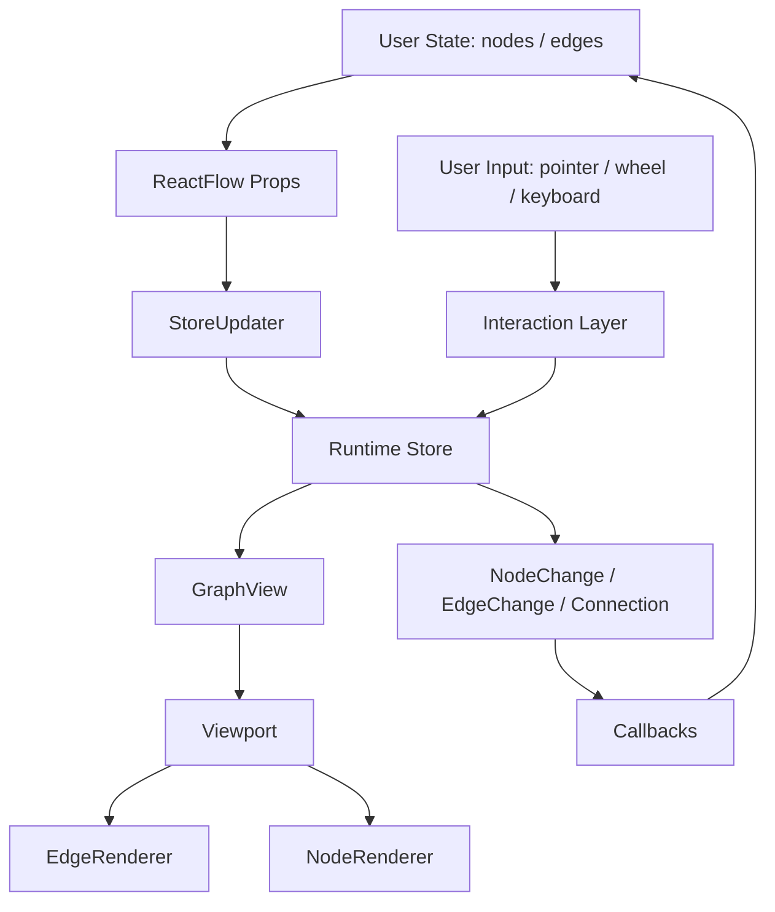

# 第 1 篇：React Flow 解决的到底是什么问题？

很多人第一次看 React Flow，会把它理解成一个“能把节点和线画出来的 React 组件”。

这个理解不能说错，但太浅了。

如果只是画节点和线，我们完全可以自己写：

```tsx
nodes.map((node) => (
  <div style={{ transform: `translate(${node.x}px, ${node.y}px)` }} />
));

edges.map((edge) => (
  <svg>
    <path d={`M ${x1},${y1} L ${x2},${y2}`} />
  </svg>
));
```

这类 demo 一下午就能写出来。真正把事情变复杂的，不是“画出来”，而是“画出来之后还能被稳定地操作”。

用户会拖动节点。节点移动后，边要跟着变。用户会缩放画布。缩放以后，鼠标坐标和图坐标不再是一回事。用户会从一个 handle 拉出连接线。连接过程中要判断目标 handle、连接是否合法、松手后要不要生成 edge。用户会框选、多选、删除、撤销、受控更新、外部同步状态。每一个动作都不是孤立 UI，而是会改变图运行时。

所以这篇先不急着读 `ReactFlow/index.tsx`。我们要先把问题域看清楚：

**React Flow 不是一个“图形展示组件”，而是一套“图编辑器运行时”。**

## 1. 这一篇要解决的问题

如果只看页面效果，React Flow 很容易被误解成一个“能画节点和线的 React 组件”。这是一种危险的低估。

因为画两个节点、一条线并不难。真正难的是：当用户拖动节点、缩放画布、从一个连接点拉到另一个连接点、框选一批节点、删除元素、撤销变化、同步外部状态时，这些行为还能稳定地回到同一套图数据里。

所以本系列开篇先不搭 monorepo，也不写 mini-flow。我们先回答一个更根本的问题：

> React Flow 到底在替我们解决什么问题？

这篇的结论先放在前面：

> React Flow 处理的是三件连在一起的事：图数据是什么，也就是 `nodes` 和 `edges`；用户怎么看这张图，也就是 `viewport` / `transform`；用户操作以后变化怎么回到数据里，也就是 `onNodesChange`、`onEdgesChange`、`onConnect` 这类回调。

如果这个判断站不稳，后面读 `ReactFlow`、`GraphView`、store、`XYPanZoom`、`XYDrag`、`XYHandle` 都会变成“文件好多、props 好多、事件好多”的流水账。只有先看清问题域，源码才会开始有方向。

可以把 React Flow 的问题域拆成三层：

```txt
第一层：图是什么？
  Node / Edge / Handle / Connection

第二层：用户看见什么？
  Viewport / Transform / Bounds / Renderer

第三层：用户怎么改变它？
  PanZoom / Drag / Connect / Selection / Changes
```

这三层互相咬合。图数据决定渲染什么，viewport 决定怎么看，interaction-to-change pipeline 决定用户动作如何变成新的图状态。静态画线只解决第一步，React Flow 真正难的是把后两步也稳定接起来。

## 2. 先看用户 API 或运行效果

用户看到的入口通常很简单：

```tsx
<ReactFlow
  nodes={nodes}
  edges={edges}
  onNodesChange={onNodesChange}
  onEdgesChange={onEdgesChange}
  onConnect={onConnect}
/>
```

这段 API 表面上像普通 React 组件：传数据，传回调，渲染 UI。

但它和普通组件的差别在于：这里的 UI 会持续产生新的图状态。

- 用户拖动节点，会产生 node position change。
- 用户选中节点或边，会产生 selection change。
- 用户从 handle 拉出一条线，会产生 connection。
- 用户缩放和平移画布，会改变 viewport。
- 用户删除元素，会同时影响 nodes、edges 和 selection。

这不是单向的“props -> DOM”。更准确的流向是：

```txt
User Props
  ↓
React Flow runtime
  ↓
DOM / SVG / interaction
  ↓
Change objects / callbacks
  ↓
User state
```

源码证据可以先看 React 包的 props 类型。`ReactFlowProps` 里，`nodes` 是 controlled flow 的节点数组，`edges` 是 controlled flow 的边数组，`defaultNodes` / `defaultEdges` 是 uncontrolled flow 的初始值。事件部分里，`onNodesChange` 会在拖拽、选择、移动时被调用，`onEdgesChange` 会在边选择和删除时被调用。证据见 `packages/react/src/types/component-props.ts:71`、`packages/react/src/types/component-props.ts:84`、`packages/react/src/types/component-props.ts:167`、`packages/react/src/types/component-props.ts:186`。

换句话说，React Flow 的 public API 一开始就在暗示：这不是静态渲染器，而是可交互图编辑器。

再细一点看，这几个 callback 其实暴露了 React Flow 的运行时边界：

```txt
onNodesChange：节点相关交互发生了，但最终状态由你决定。
onEdgesChange：边相关交互发生了，但最终状态由你决定。
onConnect：用户建立了一个连接，你决定要不要把它变成 edge。
onViewportChange：视口变化了，你可以选择受控管理。
```

React Flow 没有假装自己永远拥有最终状态。它把交互变化结构化之后交给用户。这就是 controlled flow 能成立的基础。

## 3. 核心概念解释

先把最重要的几个词翻成人话。

`nodes` 是图里的实体。它们不只是 DOM 块，而是有 `id`、`position`、`data`、选中状态、拖拽能力、连接能力、尺寸、父子关系等信息的图对象。源码里的 `NodeBase` 明确包含 `id`、`position`、`data`、`selected`、`dragging`、`draggable`、`selectable`、`connectable`、`width`、`height`、`parentId`、`handles` 等字段，证据见 `packages/system/src/types/nodes.ts:11`。

`edges` 是实体之间的关系。它们不只是 SVG 线，而是有 `source`、`target`、`sourceHandle`、`targetHandle`、marker、selection、interactionWidth 等信息的连接对象。源码里的 `EdgeBase` 直接暴露了这些字段，证据见 `packages/system/src/types/edges.ts:3`。

`connection` 是连接动作本身。它描述“从哪个节点的哪个 handle 到哪个节点的哪个 handle”。源码里 `Connection` 是一个最小对象：`source`、`target`、`sourceHandle`、`targetHandle`，证据见 `packages/system/src/types/general.ts:75`。

`viewport` 是用户当前看到画布的方式。它不是节点数据的一部分，而是视口状态：`x`、`y`、`zoom`。源码里的 `Viewport` 就是这三个字段，证据见 `packages/system/src/types/general.ts:209`。

这四个概念合起来，才是 React Flow 的最低理解门槛：

```txt
nodes / edges 负责图是什么
viewport 负责用户看到哪里
interaction-to-change pipeline 负责用户怎么改变它们
callbacks 负责把变化交还给应用
```

这里还要补一个容易被忽略的词：runtime。

普通组件的核心状态往往很小，比如一个 dropdown 只需要知道 open / close，一个 table 只需要知道 sorting / pagination。React Flow 的运行时状态要大得多：

```txt
nodes / edges
nodeLookup / edgeLookup / connectionLookup
transform / width / height
selection / connection
panZoom instance
callbacks / options
```

这些状态不是为了“代码写得复杂”，而是因为画布交互本来就是持续运行的系统。你拖动一个节点时，系统要同时知道：当前 viewport 缩放是多少、这个节点是不是可拖、是否选中了多个节点、是否要吸附网格、是否受 nodeExtent 约束、是否需要 auto pan、拖拽过程中是否要持续触发 `onNodeDrag` 和 `onNodesChange`。

这就是运行时的含义：它不只是保存数据，而是在用户动作发生时持续协调数据、渲染和事件。

这也解释了它的设计代价：

| 取舍 | 得到什么 | 代价是什么 |
| --- | --- | --- |
| 用 `NodeChange` / `EdgeChange` 回流 | controlled / uncontrolled 可以共用一套交互协议 | 读源码时要多追一层 changes，而不是直接找 setState |
| 对外保留数组，对内维护 lookup | 用户 API 简单，内部查询和渲染更快 | `nodes` / `edges` 和 lookup 必须保持同步 |
| 把 viewport 独立出来 | pan、zoom、drag、selection 可以共用坐标规则 | 每个 pointer 交互都要处理坐标换算 |

## 4. 源码入口在哪里

这篇只需要建立问题域，不深入源码。但我们已经可以知道后面应该从哪里读。

第一类入口是 React public API：

```txt
packages/react/src/index.ts
packages/react/src/types/component-props.ts
```

`packages/react/src/index.ts` 导出 `ReactFlow`、`Handle`、内置边组件、Provider、Panel、hooks、changes utils、types，并从 `@xyflow/system` 转导出大量系统类型和工具。证据见 `packages/react/src/index.ts:1`、`packages/react/src/index.ts:15`、`packages/react/src/index.ts:36`、`packages/react/src/index.ts:128`。

第二类入口是系统类型：

```txt
packages/system/src/types/nodes.ts
packages/system/src/types/edges.ts
packages/system/src/types/general.ts
```

这些文件告诉我们：React Flow 的基础语言不是 JSX，而是 Node、Edge、Connection、Viewport、Transform、Change。

第三类入口是运行时组合：

```txt
packages/react/src/container/GraphView/index.tsx
packages/react/src/store/initialState.ts
packages/react/src/store/index.ts
```

`GraphView` 负责把 `FlowRenderer`、`Viewport`、`EdgeRenderer`、`ConnectionLineWrapper`、`NodeRenderer` 组合起来。证据见 `packages/react/src/container/GraphView/index.tsx:116`。store 则保存 nodes、edges、lookup maps、transform、selection、connection、panZoom 等运行时状态，证据见 `packages/react/src/store/initialState.ts:83`。

如果借用样文里的“承重链路”说法，React Flow 的源码承重链路可以先压成一句：

```txt
ReactFlow 收 API，Store 管运行时，GraphView 管渲染分层，system 管跨框架核心交互。
```

这句话后面会被不断展开。

## 5. 源码调用链

这一篇先画一条大链路，不追到函数内部：

```txt
用户传入 nodes / edges / callbacks
  ↓
<ReactFlow />
  ↓
Wrapper / StoreUpdater
  ↓
store: nodes, edges, lookup maps, transform, connection
  ↓
GraphView
  ↓
FlowRenderer / Viewport / EdgeRenderer / NodeRenderer / ConnectionLine
  ↓
DOM + SVG
  ↓
交互系统产生 changes 或 connection
  ↓
onNodesChange / onEdgesChange / onConnect
```

这条链路有两个方向。

向下，是声明式渲染：用户给 `nodes` / `edges`，React Flow 渲染画布。

向上，是交互回流：用户拖拽、连接、选择，React Flow 产生 changes 或 callbacks，让用户决定如何更新外部状态。

如果只看向下的方向，你会把 React Flow 看成普通组件。如果同时看到向上的方向，才会意识到它是一个运行时。

把它画成一张图会更清楚：



源码阅读时要不断问：我现在读的文件在图上哪一层？

`NodeRenderer` 在渲染层，`XYDrag` 在交互层，`applyNodeChanges` 在 change 回流层，`useReactFlow` 在 API 适配层。这样读起来就不会乱。

## 6. 关键数据结构

第 1 篇只需要记住五组数据。

第一组：图数据。

```ts
type Node = {
  id: string;
  position: { x: number; y: number };
  data: Record<string, unknown>;
};

type Edge = {
  id: string;
  source: string;
  target: string;
};
```

第二组：连接数据。

```ts
type Connection = {
  source: string;
  target: string;
  sourceHandle: string | null;
  targetHandle: string | null;
};
```

第三组：视口数据。

```ts
type Viewport = {
  x: number;
  y: number;
  zoom: number;
};
```

第四组：变化数据。

```txt
NodeChange / EdgeChange
```

它们不是完整节点或完整边，而是“发生了什么变化”。例如 position 变了、selected 变了、元素被 remove 了。

第五组：运行时索引。

```txt
nodeLookup
edgeLookup
connectionLookup
```

这些 map 不一定暴露给普通用户，但对内部高频查询很重要。store 初始化时会创建 `nodeLookup`、`parentLookup`、`connectionLookup`、`edgeLookup`，证据见 `packages/react/src/store/initialState.ts:48`。

为什么 public API 用数组，内部却用 lookup？

因为这两种结构服务的是不同问题。

数组适合用户：

```txt
容易声明
容易序列化
容易用 React state 管理
容易 diff 和持久化
```

Map 适合运行时：

```txt
通过 id 高频查节点
通过 edge.source / edge.target 找两端节点
拖拽时快速更新当前节点
框选时快速判断候选节点
连接时快速查 handle bounds
```

这就是源码里常见的一种模式：对外 API 保持声明式，对内运行时使用更高效的索引结构。

## 7. 关键实现思路

React Flow 的关键实现思路不是“组件很多”，而是把问题拆成五层。

第一层是数据模型：nodes、edges、handles、connections。

第二层是视口模型：transform、viewport、bounds、fitView。

第三层是渲染模型：节点用 DOM，边用 SVG，临时连接线单独渲染，portal 提供浮层出口。

第四层是交互模型：pan/zoom、drag、connect、selection 各自有独立逻辑。

第五层是 API 适配：React 组件、hooks、controlled/uncontrolled、callbacks。

这五层的协作关系可以压缩成一句话：

> 用户给图数据，运行时维护可交互状态，渲染层展示当前状态，交互层产生变化，API 层把变化交还给用户。

再往下拆，React Flow 至少处理了十类问题：

1. 图数据：Node / Edge 怎么表达。
2. 内部增强：用户 Node 怎么变成 InternalNode。
3. 图查询：从一个节点怎么找 incomers / outgoers / connected edges。
4. 视口：x / y / zoom 怎么应用到画布。
5. 坐标：screen 坐标怎么转成 flow 坐标。
6. 边路径：source / target handle 怎么变成 SVG path。
7. 拖拽：pointer move 怎么变成 node position change。
8. 连线：handle drag 怎么变成 connection / edge。
9. 选择：click / box select / keyboard 怎么影响 selected state。
10. 扩展：自定义节点、边、插件组件怎么接入同一个 runtime。

如果你只看某一个组件，很难看到这些问题之间的关系。源码导读要做的，就是把它们重新串成主线。

## 8. 这部分源码的设计取舍

这个设计最明显的收益是边界清楚。

Node / Edge / Connection / Viewport 这些概念不依赖 React，所以它们沉到 `@xyflow/system`。React 包负责把这些概念变成组件、hooks 和 Provider。这解释了为什么 `@xyflow/react` 会从 `@xyflow/system` 转导出类型和工具，而不是把所有东西都写在 React 包内部。

代价也很明显：初学者会觉得源码分散。一个拖拽行为可能牵涉 React 组件、store action、system 工具、d3 controller、change callback。它不像小组件那样“一个文件从头看到尾”。

但对一个图编辑器运行时来说，这个复杂度是合理的。因为它要解决的不是“怎么画”，而是“怎么让图在持续交互中保持一致”。

这里可以做一个判断：

```txt
如果一个库只负责展示图，复杂度主要在 layout 和 rendering。
如果一个库负责编辑图，复杂度主要在 runtime consistency。
```

React Flow 属于后者。

它必须处理状态一致性：

- 节点移动后，边的位置要一致。
- handle 重新测量后，连接位置要一致。
- 受控模式下，内部交互不能越过用户状态。
- viewport 改变后，坐标转换要一致。
- selection 改变后，拖拽对象、删除对象、样式都要一致。

所以源码里会出现 store、lookup、changes、controller、renderer 分层。这些不是装饰，而是为了让运行时一致性可维护。

## 9. 如果我们自己实现，最小版本应该怎么写

现在不要急着写项目，只写一个思想草图：

```ts
type Node = {
  id: string;
  position: { x: number; y: number };
  data: { label: string };
};

type Edge = {
  id: string;
  source: string;
  target: string;
};

type Viewport = {
  x: number;
  y: number;
  zoom: number;
};

type NodeChange =
  | { type: 'position'; id: string; position: { x: number; y: number }; dragging?: boolean }
  | { type: 'select'; id: string; selected: boolean }
  | { type: 'remove'; id: string };
```

如果我们后面写 mini-flow，第一步不是搭工程，而是确认这四件事：

```txt
图数据长什么样？
视口状态长什么样？
交互变化如何表达？
变化如何回流给用户？
```

这才是“读懂源码后再手写”的正确顺序。

一个更贴近 React Flow 的最小运行时可以写成：

```ts
type RuntimeState = {
  nodes: Node[];
  edges: Edge[];
  nodeLookup: Map<string, Node>;
  viewport: Viewport;
  selection: Set<string>;
};

type RuntimeActions = {
  setNodes(nodes: Node[]): void;
  setViewport(viewport: Viewport): void;
  updateNodePosition(id: string, position: XYPosition): NodeChange;
  connect(connection: Connection): Edge;
};
```

这个草图的重点不是代码，而是职责分布：

```txt
state 保存当前世界
actions 改变当前世界
changes 把交互结果交还用户
renderer 只渲染 state
```

后面写 mini-flow 时，我们会反复用这个草图对照 xyflow 的真实源码。

## 10. 本篇总结

React Flow 解决的不是“画节点和线”这么小的问题。

它解决的是：

- 如何用 nodes / edges 表达图。
- 如何用 viewport 表达画布视角。
- 如何把 DOM / SVG 分层渲染成图编辑器。
- 如何把拖拽、缩放、连接、选择这些交互变成稳定的数据变化。
- 如何在 controlled / uncontrolled 两种使用方式下把变化交还给用户。

记住这一句就够了：

> React Flow 是图编辑器运行时，React 只是它的对外适配层之一。

也可以换成更工程化的说法：

> React Flow 的价值不是替你画几条线，而是替你维护一套可交互图编辑器的状态一致性。

## 11. 下一篇读什么

下一篇读概念地图：

> **React Flow 的核心概念：Node、Edge、Handle、Viewport、Store**

我们会把 Node、Edge、Handle、Connection、Viewport、Transform、Store、Renderer、Interaction、Plugin 放到同一张图里，先建立源码阅读的词汇表。
