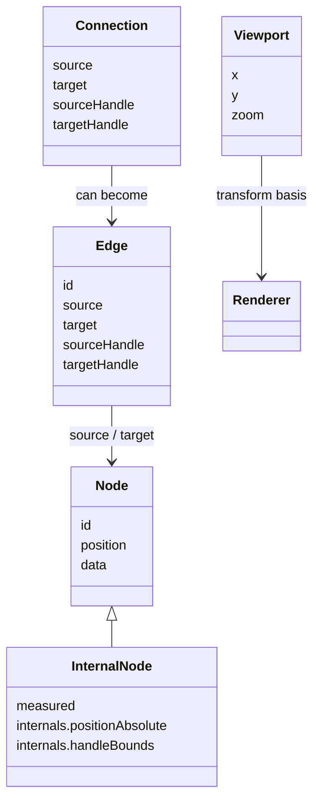

# 第 2 篇：React Flow 的核心概念：Node、Edge、Handle、Viewport、Store

上一篇我们说，React Flow 不是“画节点和线”的小组件，而是一个图编辑器运行时。

但“运行时”这个词如果不落到具体概念上，还是会显得有点虚。这一篇就把 React Flow 的核心概念摊开来：`Node`、`Edge`、`Handle`、`Connection`、`Viewport`、`Transform`、`Store`、`Renderer`、`Interaction`、`Plugin`。

这几个词不是并列名词表，而是一条协作链：

```txt
Node / Edge 描述图
Handle / Connection 描述连接关系如何被创建
Viewport / Transform 描述用户怎么看图
Store 描述运行时如何保存状态
Renderer 描述状态如何变成 DOM / SVG
Interaction 描述用户动作如何改变状态
Plugin 描述扩展 UI 如何接入同一套运行时
```

很多源码阅读的困难，来自把这些概念混在一起。比如把 Edge 当成 path，把 Viewport 当成 CSS transform，把 Connection 当成 Edge，把 Node 当成 DOM 元素。混了以后，源码自然越看越乱。

所以这一篇的任务，是先建立词汇表。词汇表不是为了背概念，而是为了后面读源码时能知道：这个文件到底在处理哪类问题。

## 1. 这一篇要解决的问题

上一篇我们把 React Flow 定位成图编辑器运行时。这一篇要补一张“概念地图”。

为什么要先讲概念，而不是直接读 `ReactFlow/index.tsx`？

因为源码里的文件名会让人误判重点。你看到 `NodeRenderer`，可能以为核心是 React 渲染；看到 `EdgeRenderer`，可能以为核心是 SVG path；看到 `XYPanZoom`，可能以为核心是 wheel 事件。其实这些都是同一套概念系统的不同切面。

我们要先建立这张图：

```txt
React Flow
  = 数据模型
  + 视口系统
  + 渲染系统
  + 交互系统
  + 对外 API
```

有了这张图，后面读 `GraphView`、store、`XYDrag`、`XYHandle` 时，就不是在一堆文件里找路，而是在验证这些概念如何落到源码里。

这篇会特别强调一个阅读原则：

> 不要用 DOM 心智模型读 React Flow，要用 graph runtime 心智模型读。

DOM 心智模型会问：这个节点 div 怎么渲染？这条线 path 怎么画？这个事件绑定在哪？

graph runtime 心智模型会问：这个节点在图数据里是什么？这个节点在运行时增强了哪些信息？这条边如何从关系变成路径？这个 pointer 坐标怎么映射到 flow 坐标？这个交互最终会产生什么 change？

后者才是读源码更稳的方式。

先把核心对象放到一张关系图里：



## 2. 先看用户 API 或运行效果

还是从最小用户 API 看：

```tsx
<ReactFlow
  nodes={nodes}
  edges={edges}
  nodeTypes={nodeTypes}
  edgeTypes={edgeTypes}
  onNodesChange={onNodesChange}
  onEdgesChange={onEdgesChange}
  onConnect={onConnect}
  fitView
>
  <Background />
  <Controls />
  <MiniMap />
</ReactFlow>
```

这段代码里已经出现了所有核心概念：

- `nodes` / `edges`：图数据。
- `nodeTypes` / `edgeTypes`：渲染扩展。
- `onNodesChange` / `onEdgesChange`：交互变化回流。
- `onConnect`：连接系统出口。
- `fitView`：视口系统。
- `Background` / `Controls` / `MiniMap`：插件组件。

它看起来像一个组件，其实更像一个被 React 包起来的运行时：

```txt
User Props
  ↓
ReactFlow Component
  ↓
Store
  ↓
GraphView
  ↓
Viewport
  ↓
NodeRenderer / EdgeRenderer / ConnectionLine
  ↓
DOM / SVG

Interaction Layer
  ↕
Store
```

`GraphView` 源码也能印证这张图。它把 `FlowRenderer`、`Viewport`、`EdgeRenderer`、`ConnectionLineWrapper`、edge label portal、`NodeRenderer`、viewport portal 组合在一起，证据见 `packages/react/src/container/GraphView/index.tsx:116`。

这个 API 还有一个隐藏信息：用户并没有直接传 `store`。

用户传的是 `nodes`、`edges` 和 callback，但 React Flow 内部一定要有一个 store。原因很简单：图编辑器运行时需要保存的东西远不止用户传入的数据。

比如：

```txt
用户传入 nodes
运行时还需要 nodeLookup、parentLookup、nodesInitialized、hasSelectedNodes。

用户传入 edges
运行时还需要 edgeLookup、connectionLookup、edge z-index、reconnect 状态。

用户传入 viewport 或 defaultViewport
运行时还需要 transform、panZoom instance、width、height、minZoom、maxZoom。
```

这就是为什么 `Store` 是核心概念，而不是实现细节。

## 3. 核心概念解释

### Node：图上的实体

Node 是图上的主要实体。对用户来说，它至少有 `id`、`position`、`data`。对运行时来说，它还可能有 selected、dragging、draggable、connectable、width、height、parentId、handles 等信息。

源码里的 `NodeBase` 是框架无关类型，说明 Node 不是 React 私有概念。证据见 `packages/system/src/types/nodes.ts:4` 和 `packages/system/src/types/nodes.ts:11`。

Node 最容易被误解成“节点组件”。但在 React Flow 里，Node 首先是数据对象，然后才有对应的 React 组件。

一个用户节点像这样：

```ts
const node = {
  id: 'task-1',
  position: { x: 100, y: 200 },
  data: { label: 'Build' },
};
```

这只是声明：“图里有一个节点，它的位置和数据是这样。”

至于它最终渲染成 default node、custom node、input node，或者是否可拖拽、是否可连接、是否有 handle，那是运行时和渲染层继续解释这个数据对象的结果。

所以源码里会出现 `NodeBase` 和 `NodeProps` 的区别。`NodeBase` 是图数据，`NodeProps` 是传给自定义节点组件的渲染 props。证据见 `packages/system/src/types/nodes.ts:114`。

### Edge：两个节点之间的关系

Edge 连接 source node 和 target node。它可能连到节点本身，也可能连到某个 handle。

源码里的 `EdgeBase` 包含 `source`、`target`、`sourceHandle`、`targetHandle`，还包含 marker、selected、interactionWidth 等字段，证据见 `packages/system/src/types/edges.ts:3`。

这说明 Edge 不是一条普通线。它既是图关系，也是交互对象。

Edge 也容易被误解成 SVG path。

但在数据层，Edge 只是关系：

```ts
const edge = {
  id: 'task-1-task-2',
  source: 'task-1',
  target: 'task-2',
};
```

它还不是 path。要把它变成 path，渲染层必须做更多事情：

```txt
找到 source node
找到 target node
找到 source handle / target handle
拿到两个端点坐标
选择 edge type
调用 getBezierPath / getStraightPath / getSmoothStepPath
渲染 SVG path
```

这就是为什么边路径工具在 system utils 里，而不是 Edge 数据结构里。Edge 表达关系，path 表达视觉。

### Handle：节点上的连接点

Handle 是 Node 和 Connection 之间的桥。

如果一个节点只有一个默认输入和一个默认输出，你可能感觉不到 handle 的存在。但一旦一个节点有多个输入输出，比如“成功分支”“失败分支”“重试分支”，Edge 就必须知道自己连接的是哪个 handle。

这就是为什么 `EdgeBase` 里有 `sourceHandle` 和 `targetHandle`，`Connection` 里也有 `sourceHandle` 和 `targetHandle`。

Handle 的存在，解决的是一个很现实的问题：

```txt
节点不是只有一个连接点。
一个节点可能有多个输入、多个输出。
同一个 source node 到同一个 target node，也可能代表不同语义。
```

比如一个判断节点可能有两个输出：

```txt
success handle -> 成功流程
failure handle -> 失败流程
```

如果 Edge 只记录 `source` 和 `target`，这两条边就分不清语义。所以 Handle 不是 UI 小圆点那么简单，它是图关系语义的一部分。

后面读 `XYHandle` 时要带着这个判断：连接系统真正管理的是“从哪个 handle 到哪个 handle”的关系，而不是“鼠标画了一条线”。

### Connection：连接动作和连接结果

Connection 是“从一个 source handle 到一个 target handle”的最小描述。

源码里的 `Connection` 只包含四个字段：`source`、`target`、`sourceHandle`、`targetHandle`。注释里还说明 `addEdge` 可以把 `Connection` 升级成 `Edge`，证据见 `packages/system/src/types/general.ts:68`。

这给我们一个重要线索：

```txt
用户拖拽连线时产生 Connection
连接确认后再变成 Edge
```

所以连接系统不应该塞进 EdgeRenderer。EdgeRenderer 负责已有边；Connection 负责正在发生的连接。

Connection 和 Edge 的区别很关键：

```txt
Connection 是过程中的连接意图。
Edge 是确认后的图关系。
```

用户从 source handle 按下鼠标、移动到 target handle、松手之前，这段时间还没有 Edge。系统只能说“当前有一个 connection in progress”。只有当 pointer up 时连接合法，才会触发 `onConnect`，用户再决定是否调用 `addEdge` 把它加入 edges。

这套设计让连接过程可以被中断、校验、吸附、auto pan，也可以在 controlled 模式下交给用户决定最终状态。

### Viewport：用户正在看哪里

Viewport 是画布视角。它包含 `x`、`y`、`zoom`。

源码里的 `Viewport` 注释强调 React Flow 内部维护了一个独立于页面的坐标系，`Viewport` 告诉你当前在这个坐标系里显示哪里、缩放多少，证据见 `packages/system/src/types/general.ts:198`。

Viewport 是后面所有交互的地基：

- pan 改变 `x` / `y`。
- zoom 改变 `zoom`。
- fitView 根据节点 bounds 计算新的 viewport。
- screenToFlowPosition 要用 viewport 反算图坐标。

Viewport 的核心不是“缩放动画”，而是坐标系统。

当 zoom = 1 时，鼠标移动 10px，节点也可以移动 10 个 flow units。可当 zoom = 2 时，屏幕上 10px 对应 flow 坐标里的 5。拖拽、连线、框选、minimap 全都会受影响。

所以后面第 9 篇会专门讲坐标系统。那里会解释为什么很多画布 bug 都来自一个误解：

> screen 坐标不等于 flow 坐标。

### Transform：渲染层真正应用的变换

Transform 通常是 `[x, y, zoom]`，用于实际 CSS transform 或底层 d3 zoom transform。

源码里 `Transform` 是 `[number, number, number]`，证据见 `packages/system/src/types/utils.ts:46`。

Viewport 和 Transform 很像，但阅读源码时不要混用：

```txt
Viewport 更像 public / semantic state
Transform 更像 renderer / internal representation
```

React Flow 源码也提醒过这两个概念相似但不同，证据见 `packages/system/src/types/general.ts:203`。

在 React 包 store 里，主要保存的是 `transform: [x, y, zoom]`；对外 helper、props 和实例 API 再经常把它包装成 `Viewport { x, y, zoom }`。所以读第 7 篇 store 时，不要奇怪为什么字段叫 `transform`：那是渲染和 panzoom 更顺手的内部表示。

### Store：运行时状态中心

Store 是 React Flow 的心脏。

它不只存 nodes 和 edges，还存 lookup maps、transform、selection、connection、panZoom、callbacks、options。初始化 store 时，源码创建了 `nodeLookup`、`parentLookup`、`connectionLookup`、`edgeLookup`，并把 `nodes` 交给 `adoptUserNodes`，证据见 `packages/react/src/store/initialState.ts:48`、`packages/react/src/store/initialState.ts:58`。

这就是 React Flow 对内不是普通 React state 的原因。它需要一个可以被渲染层、交互层、hooks、插件组件共同访问的运行时状态中心。

可以把 Store 想成 React Flow 的“控制面”。

它要同时服务四类消费者：

```txt
渲染层：NodeRenderer / EdgeRenderer 需要读节点、边和 transform。
交互层：XYDrag / XYPanZoom / XYHandle 需要读写位置、视口、连接状态。
hooks：useReactFlow / useNodes / useViewport 要把能力暴露给用户。
插件：Controls / MiniMap / Background 要接入同一个运行时。
```

如果没有 Store，所有这些模块就会通过 props 层层传递，最后变成一个巨大的 React 组件泥球。

Store 的意义不是“换一种状态管理库”，而是让图编辑器运行时有一个稳定的状态中心。

### Renderer：把状态变成 DOM / SVG

Renderer 不是一个单独文件，而是一组层：

- `FlowRenderer`
- `Viewport`
- `EdgeRenderer`
- `ConnectionLineWrapper`
- `NodeRenderer`
- portal containers

`GraphView` 负责把它们组装起来。边、临时连接线、节点和浮层不是随便排的，它们共享 viewport，但各自有自己的层级职责。

渲染层还有一个重要选择：节点用 DOM，边用 SVG。

这很自然，但也带来一个架构要求：DOM 节点和 SVG 边必须共享同一个坐标系。否则节点移动了，边的端点就会漂。

所以 `Viewport` 这一层很关键。它把边层、连接线层、节点层和 portal 层包在同一个 transform 下：

```txt
Viewport transform
  -> EdgeRenderer
  -> ConnectionLine
  -> NodeRenderer
  -> viewport portal
```

这就是为什么第 6 篇要单独讲 GraphView。它不是简单组合组件，而是在组织画布层级。

### Interaction：改变状态的交互系统

Interaction 包括：

- pan / zoom
- node drag
- handle connect
- selection
- reconnect
- keyboard delete

这些交互最后不会直接“改 DOM”，而是更新 store 或触发 change callback。比如 `updateNodePositions` 会生成 `NodeChange`，再通过 `triggerNodeChanges` 回流；证据见 `packages/react/src/store/index.ts:210` 和 `packages/react/src/store/index.ts:264`。

这里最重要的设计是：交互不应该直接写死最终状态。

以拖拽为例：

```txt
pointer move
-> 计算 flow 坐标
-> 计算下一步 node position
-> 考虑 snapGrid / nodeExtent / 多选
-> 生成 NodeChange
-> triggerNodeChanges
-> controlled 模式交给用户更新 nodes
```

这比直接 `node.position = nextPosition` 麻烦得多，但它换来一个能力：React Flow 可以同时支持 controlled 和 uncontrolled。

这也是源码看起来复杂的原因之一。它不是只服务内部状态，它还要尊重用户对状态的所有权。

### Plugin：共享运行时上的扩展组件

Controls、Background、MiniMap、Panel 这些组件不是外挂脚本。它们作为 React 包的 additional components 导出，和主画布共享同一个 Provider / store。React 入口里的 `export * from './additional-components'` 就是公共 API 线索，证据见 `packages/react/src/index.ts:39`。

## 4. 源码入口在哪里

这一篇对应的源码入口可以分成五类：

```txt
概念类型：
packages/system/src/types/nodes.ts
packages/system/src/types/edges.ts
packages/system/src/types/general.ts
packages/system/src/types/utils.ts

React API：
packages/react/src/index.ts
packages/react/src/types/component-props.ts

运行时状态：
packages/react/src/store/initialState.ts
packages/react/src/store/index.ts

渲染总装：
packages/react/src/container/GraphView/index.tsx

插件出口：
packages/react/src/additional-components
packages/react/src/components/Panel
```

这不是让你马上逐个文件读完，而是告诉你：概念在源码里不是散的。每类概念都有对应的落点。

这也是后续阅读路线：

```txt
想理解数据模型 -> types
想理解运行时状态 -> store
想理解渲染分层 -> GraphView
想理解交互闭环 -> xypanzoom / xydrag / xyhandle
想理解用户入口 -> react/src/index.ts
```

不要在第一次读源码时横向扫目录。先按概念找承重文件。

## 5. 源码调用链

先看一条从用户数据到画布的链：

```txt
nodes / edges props
  ↓
ReactFlow
  ↓
StoreUpdater / store.setNodes / store.setEdges
  ↓
adoptUserNodes / updateConnectionLookup
  ↓
nodeLookup / edgeLookup / connectionLookup
  ↓
GraphView
  ↓
Viewport
  ↓
EdgeRenderer / NodeRenderer
```

再看一条从交互回到用户状态的链：

```txt
pointer / keyboard / wheel event
  ↓
interaction controller
  ↓
store action
  ↓
NodeChange / EdgeChange / Connection
  ↓
onNodesChange / onEdgesChange / onConnect
  ↓
user state update
```

这两条链拼起来，才是完整的 React Flow。

只看第一条，会以为它是渲染库。

只看第二条，会以为它是事件库。

两条一起看，才会明白它是图编辑器运行时。

如果用更工程化的语言描述，这两条链就是：

```txt
Render pipeline：把状态投影成画布。
Interaction pipeline：把用户动作归约成状态变化。
```

React Flow 的源码就是在维护这两条 pipeline 的一致性。

## 6. 关键数据结构

可以用一张表记住：

| 概念 | 数据结构 | 源码位置 | 主要问题 |
| --- | --- | --- | --- |
| Node | `NodeBase` / `InternalNodeBase` | `system/src/types/nodes.ts` | 图上有哪些实体，它们在哪里 |
| Edge | `EdgeBase` | `system/src/types/edges.ts` | 哪些实体彼此相连 |
| Handle | `Handle` / `NodeHandle` | `system/src/types` | 边连接到节点的哪个点 |
| Connection | `Connection` / `ConnectionState` | `system/src/types/general.ts` | 用户正在怎么连线 |
| Viewport | `Viewport` | `system/src/types/general.ts` | 用户看到画布哪里 |
| Transform | `Transform` | `system/src/types/utils.ts` | 渲染层如何平移缩放 |
| Store | `ReactFlowStore` | `react/src/store` | 运行时状态如何集中管理 |
| Change | `NodeChange` / `EdgeChange` | `system/src/types` | 交互如何回流给用户 |

这里最容易忽略的是 `InternalNodeBase`。

用户传进来的 Node 适合做 API，但不够运行时使用。源码里的 `InternalNodeBase` 会补上 `measured`、`internals.positionAbsolute`、`internals.z`、`internals.userNode`、`internals.handleBounds` 等字段，证据见 `packages/system/src/types/nodes.ts:90`。

这也预告了第 8 篇：为什么用户节点需要被增强。

`InternalNodeBase` 是整套运行时里非常关键的概念。

用户节点只知道：

```txt
我想放在哪里
我带什么 data
我是什么 type
```

内部节点还要知道：

```txt
我实际测量出来多大
我的绝对坐标是多少
我的 handle bounds 在哪里
我在 z-index 上应该怎么排
我的原始 userNode 是哪个对象
```

这些信息都不适合要求用户手动维护。它们是运行时从 DOM 测量、父子关系、选择状态、布局规则里推导出来的。

这就是“用户数据”和“运行时数据”的分界。

## 7. 关键实现思路

这张概念地图背后的实现思路是：用不同结构服务不同场景。

对外，React Flow 用数组：

```txt
nodes: Node[]
edges: Edge[]
```

数组适合用户声明、序列化、受控更新。

对内，React Flow 用 lookup：

```txt
nodeLookup
edgeLookup
connectionLookup
parentLookup
```

lookup 适合高频查询。比如渲染一条边时，需要快速从 edge.source 找 source node，从 edge.target 找 target node。拖拽、选择、连线也都需要快速查节点。

对交互，React Flow 用 change objects：

```txt
NodeChange
EdgeChange
Connection
```

change 适合把“发生了什么”告诉用户，而不是替用户直接决定最终状态。

这三个层次不要混：

```txt
数组是 public data contract
lookup 是 runtime index
change 是 interaction output
```

这三层也对应后续三类源码：

```txt
public data contract -> ReactFlowProps / NodeBase / EdgeBase
runtime index -> initialState / adoptUserNodes / updateConnectionLookup
interaction output -> NodeChange / EdgeChange / applyNodeChanges
```

当你在源码里看到一个函数，要问它服务哪一层。比如 `getNodesBounds` 服务图查询和视口计算，`applyNodeChanges` 服务 change 回流，`NodeWrapper` 服务单节点渲染与交互绑定。

## 8. 这部分源码的设计取舍

这个概念模型的好处是可扩展。

Node 和 Edge 可以扩展类型。Handle 和 Connection 可以支持复杂连接。Viewport 可以独立控制画布。Store 可以让 hooks、renderer、plugin 共享状态。Interaction controller 可以单独演化，不必塞进一个大组件。

代价是学习门槛变高。

比如初学者可能会问：为什么我传了 `nodes`，源码里还要有 `nodeLookup`？为什么有 `Viewport`，又有 `Transform`？为什么 `Connection` 不直接就是 `Edge`？为什么拖拽后不是直接 set node，而是产生 `NodeChange`？

这些问题都不是偶然复杂。它们来自同一个约束：

> React Flow 要让声明式 React API 和高频交互式画布同时成立。

这两件事天然有张力。源码的很多设计，就是在这股张力之间做折中。

更具体地说，这里有三组取舍。

第一组：易用 API vs 内部效率。

用户喜欢数组，运行时需要 Map。于是源码同时维护 `nodes` 和 `nodeLookup`。

第二组：声明式状态 vs 即时交互。

React 的声明式更新适合稳定状态，但 pointer move 是高频事件。于是拖拽系统要尽量把高频计算限制在局部，并通过 change 机制回流。

第三组：统一概念 vs 框架适配。

Node / Edge / Viewport 是跨框架概念，但 React hooks、Svelte store 是框架特有表达。于是 system 和 framework package 被拆开。

这些取舍，比单个函数实现更值得学。

## 9. 如果我们自己实现，最小版本应该怎么写

如果要写 mini-flow，先不要照搬 xyflow 的所有字段。只保留概念骨架：

```ts
type Node = {
  id: string;
  position: { x: number; y: number };
  data: Record<string, unknown>;
  selected?: boolean;
};

type Edge = {
  id: string;
  source: string;
  target: string;
  sourceHandle?: string | null;
  targetHandle?: string | null;
};

type Viewport = {
  x: number;
  y: number;
  zoom: number;
};

type Store = {
  nodes: Node[];
  edges: Edge[];
  nodeLookup: Map<string, Node>;
  viewport: Viewport;
};
```

然后给自己定一个边界：

```txt
第一个 mini-flow 只验证：
- nodes / edges 能渲染
- viewport 能 transform
- edge 能通过 source / target 找节点
- 拖拽时能产生 NodeChange
```

不要一开始就做 MiniMap、selection、parent node、reconnect、a11y。那些是后续机制，不是第一层概念。

同时要保留一个小小的内部增强步骤：

```ts
type InternalNode = Node & {
  measured: { width?: number; height?: number };
  internals: {
    positionAbsolute: { x: number; y: number };
    userNode: Node;
  };
};

function adoptUserNodes(nodes: Node[]) {
  const nodeLookup = new Map<string, InternalNode>();

  for (const node of nodes) {
    nodeLookup.set(node.id, {
      ...node,
      measured: {},
      internals: {
        positionAbsolute: node.position,
        userNode: node,
      },
    });
  }

  return nodeLookup;
}
```

这个草图非常简化，但它保留了 xyflow 的核心思想：用户给声明式节点，运行时把它增强成可交互节点。

## 10. 本篇总结

这一篇建立了 React Flow 的概念地图：

```txt
React Flow
  = 数据模型：Node / Edge / Handle / Connection
  + 视口系统：Viewport / Transform
  + 渲染系统：GraphView / Viewport / NodeRenderer / EdgeRenderer
  + 交互系统：PanZoom / Drag / Handle / Selection
  + 对外 API：ReactFlow / hooks / callbacks / plugins
```

最重要的是三句话：

- Node / Edge 是 public data，不等于内部运行时结构。
- Viewport / Transform 是交互系统的地基。
- Store 把渲染、交互、hooks、插件接到同一个运行时上。

如果只记一个图，就记这个：

```txt
Node / Edge / Handle
  -> 描述图

Viewport / Transform
  -> 描述怎么看图

Store
  -> 保存当前运行时

Renderer
  -> 把运行时画出来

Interaction
  -> 把用户动作变成 changes

API / hooks / plugins
  -> 让用户接入运行时
```

## 11. 下一篇读什么

下一篇开始进入仓库结构：

> **xyflow monorepo 架构：system / react / svelte 为什么要拆开？**

我们会读根 `package.json`、`pnpm-workspace.yaml` 和三个核心包的 package 信息，先弄清楚为什么 React Flow 的核心不完全在 React 包里。
