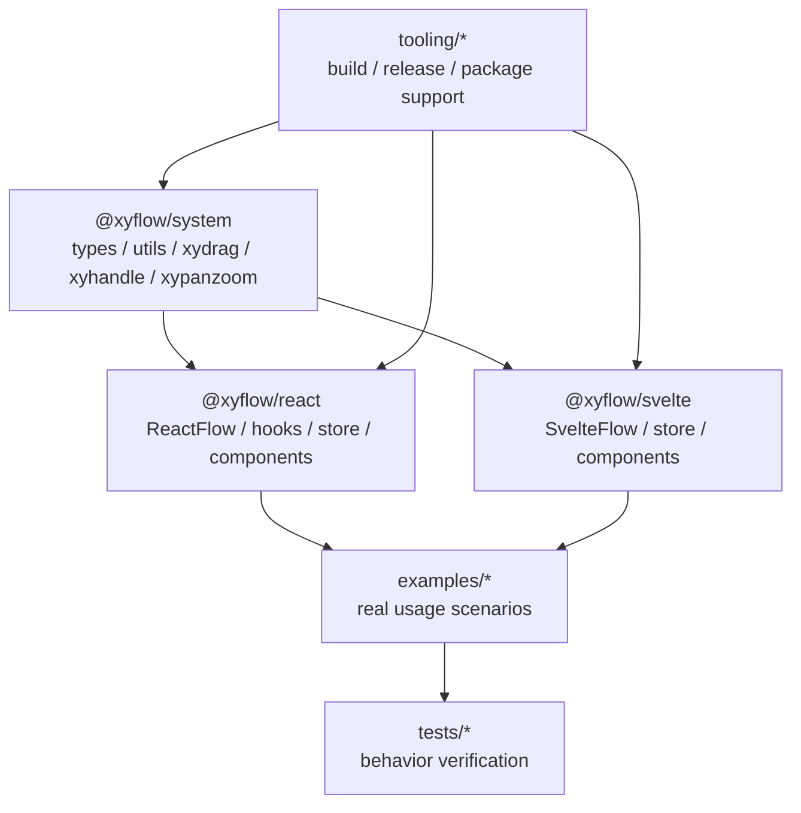

# 第 3 篇：xyflow monorepo 架构：system / react / svelte 为什么要拆开？

## 1. 这一篇要解决的问题

前两篇我们先建立了问题域和概念地图：React Flow 不是普通组件库，而是一个图编辑器运行时。

现在进入源码。第一站不是 `ReactFlow/index.tsx`，而是仓库根目录。

这听起来有点绕：我们不是要读 React Flow 吗，为什么先看 monorepo？

因为 xyflow 的源码边界本身就在回答一个架构问题：

> 图编辑器的核心能力，哪些属于框架无关系统，哪些属于 React 绑定，哪些又可以被 Svelte 复用？

如果跳过这个问题，直接读 React 包，很容易误以为 React Flow 的所有复杂度都来自 React 组件。实际上，xyflow 把大量核心能力沉到了 `@xyflow/system`，React 和 Svelte 只是不同的框架适配层。

这一篇要建立的结论是：

> xyflow 的 monorepo 不是工程组织癖，而是在用包边界表达架构边界：system 负责框架无关核心，react / svelte 负责各自框架里的运行时绑定。

先给这一篇一个局部公式：

```txt
xyflow monorepo
  = framework-agnostic graph core
  + React runtime binding
  + Svelte runtime binding
  + examples / tests / tooling
```

如果把上一篇的概念模型带过来，这个公式会更具体：

```txt
Graph Data / Geometry / Interaction Controller
  -> @xyflow/system

React Store / React Components / Hooks / Provider
  -> @xyflow/react

Svelte Store / Svelte Components / Actions / Provider
  -> @xyflow/svelte
```

所以这一篇不是在讲“这个仓库有几个文件夹”。它真正要解决的是一个源码阅读前的定位问题：

> 当我们看到一个函数、类型、组件或 hook 时，应该先判断它属于图编辑器核心，还是属于某个框架的适配层。

这个判断会直接影响后面每一篇怎么读。比如 `getBezierPath` 这种能力，你应该先把它理解成几何算法；`useReactFlow` 这种能力，你应该先把它理解成 React 用户访问运行时的门；`XYDrag` 这种能力，则更接近跨框架的交互控制器。

很多源码阅读一开始就乱，是因为没有先做这层归类。看见文件在 `packages/react` 里，就以为逻辑一定是 React 特有；看见函数从 `@xyflow/react` 导出，就以为实现也在 React 包里。xyflow 的包边界会专门打破这个直觉。

## 2. 先看用户 API 或运行效果

用户写 React Flow 时，通常只接触：

```tsx
import { ReactFlow, Background, Controls } from '@xyflow/react';

<ReactFlow nodes={nodes} edges={edges}>
  <Background />
  <Controls />
</ReactFlow>
```

用户写 Svelte Flow 时，入口会变成 Svelte 包：

```svelte
<script lang="ts">
  import { SvelteFlow, Background, Controls } from '@xyflow/svelte';
</script>

<SvelteFlow {nodes} {edges}>
  <Background />
  <Controls />
</SvelteFlow>
```

表层 API 不同，但底层问题相同：

- Node / Edge 数据结构怎么表达？
- 边路径怎么计算？
- viewport 怎么转成 transform？
- 拖拽怎么计算节点位置？
- pan / zoom 怎么约束缩放范围？
- handle 连接怎么校验？

这些问题不应该分别在 React 和 Svelte 里重复实现。重复实现会带来两个成本：一是行为不一致，二是维护两套复杂交互。

所以 monorepo 的第一层动机就出现了：

```txt
同一个图编辑器核心
  -> React 绑定
  -> Svelte 绑定
```

再把这个例子展开一点。用户拖动一个节点时，表面上看到的是 React 组件重新渲染：

```txt
鼠标按下节点
  -> 节点跟着鼠标移动
  -> onNodesChange 收到 position change
  -> 外部 nodes 更新
  -> ReactFlow 重新渲染节点
```

但这条链路里，并不是每一步都应该写在 React 包里。

真正跨框架的部分是：

```txt
pointer 在当前 zoom 下对应哪个 flow position？
节点移动时是否需要 snap grid？
节点是否被 nodeExtent 限制？
多选拖拽时每个节点如何保持相对关系？
拖拽到边缘时是否需要 auto pan？
```

这些问题和 React 的 `useState`、`useEffect`、JSX 都没有本质关系。Svelte 用户拖节点时，也要面对完全相同的问题。

React 特有的部分是：

```txt
drag controller 如何接到 React 生命周期？
drag 结果如何进入 Zustand store？
store 变化如何让 NodeRenderer 重新渲染？
onNodesChange 如何以 React props callback 的形式暴露？
```

这就是 monorepo 要表达的分界线：底层行为尽量共享，框架体验分别适配。

## 3. 核心概念解释

xyflow 仓库里最值得先记住的是三个包。

| 包 | 角色 | 更像什么 |
| --- | --- | --- |
| `@xyflow/system` | 框架无关核心 | 跨框架行为与几何核心 |
| `@xyflow/react` | React 绑定层 | React runtime adapter |
| `@xyflow/svelte` | Svelte 绑定层 | Svelte runtime adapter |

`@xyflow/system` 的 package 描述非常直白：它是 powering React Flow and Svelte Flow 的 core system。证据见 `packages/system/package.json:2` 和 `packages/system/package.json:4`。

这句话比目录树更重要。它说明：React Flow 的一些核心能力并不“属于 React”。比如：

- edge path 计算
- graph utils
- viewport bounds
- pan / zoom controller
- node drag controller
- handle connection controller
- minimap / resizer 的底层交互

React 包的角色则是把这些 system 能力包装成 React 组件、hooks、store 和 public API。`@xyflow/react` 依赖 `@xyflow/system`、`classcat`、`zustand`，同时把 React / React DOM 放在 peer dependencies，证据见 `packages/react/package.json:63` 和 `packages/react/package.json:68`。

Svelte 包同样依赖 `@xyflow/system`，但它的框架依赖是 Svelte 生态。证据见 `packages/svelte/package.json:53` 和 `packages/svelte/package.json:89`。

这就是包边界传达出的设计语言：

```txt
system 讲“图编辑器怎么工作”
react 讲“图编辑器怎么变成 React API”
svelte 讲“图编辑器怎么变成 Svelte API”
```

这里要特别小心一个词：`system`。

它不是“公共工具箱”的意思。很多项目里会有一个 `shared` 或 `utils` 包，里面放一些零散函数，比如 `clamp`、`debounce`、`isObject`。但 `@xyflow/system` 不只是这种工具包。

从它的导出和依赖看，它更像“跨框架图编辑器核心”：

```txt
types
  -> 定义图编辑器世界里的基本对象

utils
  -> 处理 graph、bounds、edge path、viewport 等计算

xydrag / xyhandle / xypanzoom
  -> 处理节点拖拽、连接、画布缩放平移这些交互控制器

xyminimap / xyresizer
  -> 支撑高级插件背后的底层交互
```

也就是说，system 里既有纯函数，也有带生命周期的控制器。它不负责“渲染 React 组件”，也不包含 React store、Provider、hooks、GraphView 这些完整运行时结构；但它负责“让一个图编辑器可以被正确操作”的框架无关部分。

可以用一张能力归属表校准边界：

| 能力 | 应归属 | 原因 |
| --- | --- | --- |
| `getBezierPath` | system | 几何计算，不依赖框架 |
| `XYDrag` | system | 拖拽控制器，核心计算跨框架复用 |
| `XYPanZoom` | system | pan / zoom 行为不依赖 React 或 Svelte |
| `ReactFlowProvider` | react | React context/provider 绑定 |
| Zustand store | react | React 包运行时状态中心 |
| `SvelteFlow` | svelte | Svelte 组件入口和框架绑定 |

React 包也不是简单的 UI 外壳。它承担的是另一类复杂度：

```txt
把用户传入的 props 同步进 store
把内部状态暴露成 hooks
把 system controller 接到 DOM 和 React 生命周期
把 nodes / edges 渲染成 React 组件树
把 children 插件放进同一个运行时上下文
```

Svelte 包同理，只是框架语法和响应式机制换成 Svelte。

所以更准确的三层关系是：

```txt
@xyflow/system
  解决“图编辑器行为如何成立”

@xyflow/react
  解决“这些行为如何以 React 的方式被使用”

@xyflow/svelte
  解决“这些行为如何以 Svelte 的方式被使用”
```

## 4. 源码入口在哪里

这一篇的源码入口很少，但信息密度很高：

```txt
package.json
pnpm-workspace.yaml
turbo.json
packages/system/package.json
packages/react/package.json
packages/svelte/package.json
```

根 `package.json` 说明这是一个私有 monorepo：`name` 是 `@xyflow/monorepo`，`private` 是 `true`，脚本里有 `dev`、`dev:react`、`dev:svelte`、`test:react`、`test:svelte`、`build:all`、`build`、`lint`、`typecheck`、`release`。证据见 `package.json:2`、`package.json:7`、`package.json:8`。

`pnpm-workspace.yaml` 说明 workspace 覆盖：

```yaml
packages/*
examples/*
tooling/*
tests/*
```

证据见 `pnpm-workspace.yaml:1`。

`turbo.json` 说明构建是跨包任务：`build` 依赖上游包的 `^build`，产物输出到 `dist/**`；`dev` 是持久任务且不缓存。证据见 `turbo.json:5` 和 `turbo.json:9`。

这几个文件组合起来告诉我们：xyflow 不是“一个 React 包旁边放了点示例”，而是一个多包协作系统。

把这些入口放在一起，可以读出三种工作流。

第一种是开发工作流：

```txt
pnpm dev
  -> 同时服务 packages / examples
  -> 让开发者在真实示例里验证包行为
```

第二种是构建工作流：

```txt
pnpm build:all
  -> turbo 根据包依赖顺序构建
  -> system 先产出 dist
  -> react / svelte 再引用 workspace 依赖构建
```

第三种是验证工作流：

```txt
test:react / test:svelte
  -> 分别验证两个框架绑定的行为
  -> 共同约束 system 层的共享语义
```

这三种工作流对应三种源码阅读姿势：

```txt
想知道包怎么拆 -> 看 package.json / pnpm-workspace / turbo
想知道能力怎么复用 -> 看 packages/system 与 framework packages 的依赖
想知道行为怎么保证一致 -> 看 examples / tests 如何覆盖 React 和 Svelte
```

对源码导读来说，最重要的是第二种。因为我们后面读 `GraphView`、`store`、`XYPanZoom`、`XYDrag` 时，会反复在 React 包和 system 包之间跳转。

## 5. 源码调用链

monorepo 层面的调用链不是函数调用，而是包依赖：

```txt
@xyflow/system
  ↑
  ├─ @xyflow/react
  └─ @xyflow/svelte

examples/*
  ↓
@xyflow/react 或 @xyflow/svelte

tests/*
  ↓
examples / packages behavior
```

React 包的依赖能验证这条链：`@xyflow/react` 的 dependencies 里有 `@xyflow/system: workspace:*`。证据见 `packages/react/package.json:63`。

Svelte 包也一样：`@xyflow/svelte` 的 dependencies 里有 `@xyflow/system: workspace:*`。证据见 `packages/svelte/package.json:53`。

这条依赖链隐含了一个方向：

```txt
framework package 可以依赖 system
system 不应该依赖 framework package
```

所以后面读源码时，如果我们发现某个能力在 `system` 里，要先把它当成跨框架核心；如果某个能力在 `react` 里，要问它是不是 React store、hooks、component 或 DOM 生命周期绑定。

这里可以用“节点拖拽”作为第一条承重链路。

先看行为：

```txt
用户在 ReactFlow 里拖动一个 node
  ↓
React 组件层接收 pointer / drag 相关事件
  ↓
React 包把 DOM、store action、配置项交给 system 的拖拽控制器
  ↓
system 计算 pointer position、snap、extent、auto pan、drag items
  ↓
React store 更新 internal nodes
  ↓
triggerNodeChanges 生成 NodeChange
  ↓
用户的 onNodesChange 被调用
```

这条链路里，包边界大概是：

```txt
React 负责接入：
  DOM ref / component lifecycle / Zustand action / props callbacks

system 负责计算：
  pointer -> flow position
  next node position
  snap grid
  node extent
  auto pan
  drag lifecycle data

用户负责回流：
  controlled 模式下把 changes 应用回 nodes
```

如果你直接从 React 包开始读，会觉得拖拽逻辑散在组件、hooks、store、utils 里。但先看 monorepo 边界后，就会知道：真正要找“拖拽算法和控制器”，应该去 `packages/system/src/xydrag`；要找“React 怎么接上拖拽结果”，才回到 `packages/react`。

再看“边路径”这条链路：

```txt
用户渲染一条 Bezier edge
  ↓
React Edge 组件拿到 source / target 坐标
  ↓
调用 system utils 里的 getBezierPath
  ↓
得到 SVG path d
  ↓
React BaseEdge 渲染 path
```

这里同样有清晰边界：

```txt
路径算法：system
SVG 组件：react
用户自定义边入口：react public API
```

这些承重链路会在后面章节展开。现在先记住：monorepo 的意义，就是把这些链路拆成可复用的核心层和框架层。

## 6. 关键数据结构

这一篇不是读类型定义，但 package 文件里已经能看到几个“结构信号”。

第一，`@xyflow/system` 标记了 `sideEffects: false`。证据见 `packages/system/package.json:36`。

这说明 system 包被设计成更接近纯工具和控制器集合。它可以有 d3 交互依赖，但不应该像框架组件那样依赖渲染副作用。

第二，`@xyflow/system` 的依赖主要是 d3 drag / zoom / selection / interpolate 这一组底层交互工具。证据见 `packages/system/package.json:52`。

这和我们前两篇的判断一致：pan、zoom、drag 不是 React 特有问题，而是画布交互问题。

第三，`@xyflow/react` 的 peer dependencies 是 React / React DOM。证据见 `packages/react/package.json:68`。

这说明 React 包不把 React 打进去，而是作为组件库适配宿主应用。

第四，React 和 Svelte 包都导出了 CSS 入口。React 包 exports 包含 `./dist/base.css` 和 `./dist/style.css`，证据见 `packages/react/package.json:45`；Svelte 包也有对应 CSS exports，证据见 `packages/svelte/package.json:43`。

这说明“框架绑定层”不只负责 JS API，也负责框架侧的样式交付。

这些 package 字段虽然不是业务类型，但它们在源码导读里很像“地质层”。

`dependencies` 告诉我们运行时依赖方向：

```txt
react -> system
svelte -> system
system -> d3 interaction libraries
```

`peerDependencies` 告诉我们宿主框架由用户应用提供：

```txt
@xyflow/react 不内置 React
@xyflow/svelte 不内置 Svelte
```

`exports` 告诉我们包作者愿意承诺的入口：

```txt
JS module entry
CSS entry
package metadata
```

`sideEffects: false` 则传递出另一个信号：system 层希望构建工具可以更放心地做 tree-shaking。它不是说 system 内部完全没有状态，也不是说 `XYPanZoom` 这类控制器没有副作用；它更像在包级别声明：模块导入本身不应该偷偷改全局环境。

这几个字段组合起来，可以帮我们避免两个误判。

第一个误判：以为 `@xyflow/react` 是完整实现，`@xyflow/system` 只是附属工具。

事实更接近反过来：system 承载了很多核心行为，React 包把它们接成 React 运行时。

第二个误判：以为 `@xyflow/system` 是纯函数集合。

它确实有大量纯工具，但也包含 `xydrag`、`xyhandle`、`xypanzoom` 这种控制器模块。它是“框架无关”，不是“无状态”。

## 7. 关键实现思路

xyflow 的 monorepo 分层可以理解成三条线。

第一条线：核心能力下沉。

```txt
types / graph utils / edge path / drag / handle / panzoom / minimap / resizer
  -> @xyflow/system
```

这些能力尽量不绑定 React 或 Svelte。

第二条线：框架适配上浮。

```txt
ReactFlow / hooks / zustand store / React components / CSS exports
  -> @xyflow/react

SvelteFlow / Svelte store-context / Svelte components / CSS exports
  -> @xyflow/svelte
```

框架包负责把 system 能力变成对应生态里自然的使用方式。

第三条线：行为验证外置。

```txt
examples/*
tests/*
```

examples 不是源码主线，但它们很重要，因为图编辑器的很多行为必须通过真实交互验证。根脚本里有 `test:react` 和 `test:svelte`，证据见 `package.json:13`。

把这三条线画出来，就是这篇文章的架构图：



注意这张图的箭头不是严格的 import 图，而是阅读关系图。它想表达的是：

```txt
system 是共享语义的来源
framework packages 是用户体验的入口
examples 和 tests 是行为被验证的地方
tooling 是 monorepo 可以持续发布的支撑
```

源码阅读时，我们可以按这个顺序走：

```txt
先看 framework public API
  -> 知道用户怎么使用

再找 framework runtime
  -> 知道 React / Svelte 怎么组织状态和组件

再跳到 system
  -> 知道核心行为怎么计算

最后回到 examples / tests
  -> 知道这个行为在真实场景里怎么表现
```

这比从目录树第一行读到最后一行更稳。

## 8. 这部分源码的设计取舍

这种拆法的收益很大。

第一，避免 React 和 Svelte 重复实现同一套几何与交互规则。

比如 edge path 算法、viewport bounds、drag position 计算，如果 React 写一套、Svelte 写一套，很快会出现行为偏差。放到 system 后，两个框架包可以共享核心语义。

第二，框架包可以更专注。

React 包关心 Zustand store、React components、hooks、children 插件；Svelte 包关心 Svelte 组件、store/context、Svelte 5 reactivity。它们不用重新发明图编辑器核心。

第三，public API 更容易统一。

React 和 Svelte 虽然语法不同，但都可以暴露类似的概念：Node、Edge、Handle、Connection、Viewport、path utils、graph utils。

代价也存在。

第一，源码阅读会变成跨包跳转。你看 React 组件时，经常要跳到 system 看工具函数和控制器。

第二，边界设计要更谨慎。某个能力放 system 还是 react，不是随便选目录，而是要判断它是否真正框架无关。

第三，构建和发布更复杂。根项目需要 pnpm workspace、turbo、rollup、Svelte package、CSS 构建和 changesets 协作。

所以这不是小项目一开始就该照搬的结构。它适合已经明确要支持多框架、复杂交互和长期维护的图编辑器库。

这里还要补一层更实际的取舍：这种拆法会让“源码归属”和“用户导入入口”不再一致。

用户从 `@xyflow/react` 导入 `getBezierPath`，但实现可以来自 system；用户使用 `Controls`，但它通过 React provider 读取 store；用户拖动节点，事件入口在 React DOM，关键计算却可能在 system controller。

这对使用者是好事，因为入口统一：

```tsx
import { ReactFlow, BaseEdge, getBezierPath, addEdge } from '@xyflow/react';
```

但对读源码的人是挑战，因为你必须接受一件事：

> public API 的位置，不一定等于实现的归属。

这也是为什么本系列先读 monorepo，再读入口文件，再读 ReactFlow 主组件。顺序不能反。先知道边界，再看 API，再进入运行时，读起来才不会在跨包跳转里迷路。

如果我们把所有东西都塞进 `@xyflow/react`，初看会简单很多：

```txt
ReactFlow
components
hooks
utils
drag
panzoom
handle
minimap
resizer
```

但这样一来，Svelte 包要么重写一份，要么反向依赖 React 包。前者带来行为分叉，后者让架构关系变得荒唐。

xyflow 选择了更长期主义的拆法：

```txt
共享行为向下沉
框架体验向上浮
```

这句话也是我们后面写 mini-flow 时可以借鉴的原则。但借鉴不等于复刻。mini-flow 第一版如果只有 React 目标，就没必要立刻把 monorepo、workspace、Svelte 适配全部搬过来。我们要借的是边界意识，不是工程规模。

## 9. 如果我们自己实现，最小版本应该怎么写

如果我们后面写 mini-flow，不应该一上来复刻完整 monorepo。

更合理的最小结构是：

```txt
packages/system
  src/types.ts
  src/graph.ts
  src/viewport.ts
  src/edges.ts

packages/react
  src/MiniFlow.tsx
  src/store.ts
  src/components/*
  src/hooks/*

examples/react-basic
```

但要记住：这是第三部分实战，不是源码导读开篇。

实战时可以借鉴 xyflow 的边界：

```txt
纯数据和几何：system
React 组件和 hooks：react
真实行为验证：examples
```

不要一开始就引入：

- Svelte 包
- tests monorepo
- changesets
- full CSS publishing
- d3 controller 抽象

这些是生产级演进方向，不是验证理解的第一步。

更具体一点，mini-flow 的第一阶段可以只保留两个层：

```txt
src/system
  types.ts
  geometry.ts
  viewport.ts
  edges.ts

src/react
  MiniFlow.tsx
  store.ts
  NodeRenderer.tsx
  EdgeRenderer.tsx
  hooks.ts
```

先不做真正的 npm package 拆分，只在源码目录里保持边界。这样能同时得到两个好处：

```txt
边界足够清楚：哪些逻辑是框架无关的，哪些逻辑是 React 绑定的。
工程足够轻：不被 workspace、构建发布和多框架适配拖走注意力。
```

比如第一版边路径可以这样放：

```ts
// src/system/edges.ts
export type Point = { x: number; y: number };

export function getStraightPath(source: Point, target: Point) {
  return `M ${source.x},${source.y} L ${target.x},${target.y}`;
}
```

React 组件只负责消费它：

```tsx
// src/react/EdgeRenderer.tsx
import { getStraightPath } from '../system/edges';

export function EdgeRenderer({ source, target }: { source: Point; target: Point }) {
  const d = getStraightPath(source, target);
  return <path d={d} />;
}
```

这就是对 xyflow monorepo 的最小借鉴：不是先搭完整 monorepo，而是先把“计算”和“渲染”拆开。

## 10. 本篇总结

xyflow monorepo 的关键不是“文件夹多”，而是它用包边界表达了三层架构：

```txt
@xyflow/system：框架无关图编辑器核心
@xyflow/react：React 运行时绑定
@xyflow/svelte：Svelte 运行时绑定
```

从这一篇开始，后面读源码要带着一个问题：

> 我正在读的这段逻辑，是图编辑器核心，还是 React/Svelte 适配？

这个问题会帮你判断一个文件真正的职责。

## 11. 下一篇读什么

下一篇读公共 API 入口：

```txt
packages/system/src/index.ts
packages/react/src/index.ts
packages/svelte/src/lib/index.ts
```

入口文件很像一张公开地图。它告诉我们：作者认为哪些模块应该被外部使用，哪些能力属于 system，哪些能力由 React / Svelte 包装后对外提供。
