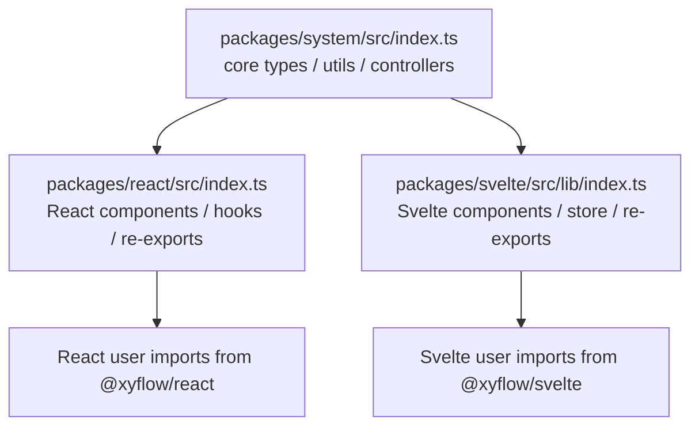

# 第 4 篇：从入口文件看公共 API 设计

## 1. 这一篇要解决的问题

很多人读源码时会从最复杂的文件开始，比如 `ReactFlow/index.tsx`、store、`XYDrag`。这当然能看到细节，但容易迷路。

更稳的第一步是读入口文件。

入口文件回答的是一个架构问题：

> 作者希望外部用户通过哪些概念使用这个库？

也就是说，入口文件不是简单的 `export` 清单。它是公共 API 地图。它告诉我们：

- 哪些能力被认为稳定到可以公开。
- 哪些内部模块被包装后对外提供。
- 哪些 system 能力会被 React / Svelte 重新导出。
- 框架包和核心包之间的边界在哪里。

这一篇要读三个入口：

```txt
packages/system/src/index.ts
packages/react/src/index.ts
packages/svelte/src/lib/index.ts
```

先把三者压成一张对比表：

| 入口 | 导出的主要能力 | 说明 |
| --- | --- | --- |
| `packages/system/src/index.ts` | types / utils / xydrag / xyhandle / xypanzoom | 框架无关核心 |
| `packages/react/src/index.ts` | ReactFlow / hooks / components / changes / system re-exports | React 一站式入口 |
| `packages/svelte/src/lib/index.ts` | SvelteFlow / plugins / store / system re-exports | Svelte 一站式入口 |

目标不是背 API，而是学会从入口文件反推架构。

这一篇的局部公式是：

```txt
Public API Entry
  = 用户可见概念清单
  + 内部模块边界投影
  + 框架适配层聚合
  + 源码阅读导航图
```

入口文件之所以值得单独写一篇，是因为它有一个非常特殊的位置：它站在“用户使用方式”和“内部实现结构”的交界处。

如果只看文档，我们知道用户应该怎么写代码；如果只看内部实现，我们知道模块之间怎么调用。但入口文件同时暴露了两件事：

```txt
哪些概念被作者允许用户直接使用？
这些概念被作者归到哪个 package 的语义边界里？
```

这也是为什么我不建议一开始就冲进 `ReactFlow/index.tsx`。主组件会给你很多 props、context、store、memo、事件处理；但入口文件会先告诉你：React Flow 这套系统在对外语言里到底由哪些“名词”和“动词”组成。

可以把入口文件理解成一本书的目录。不过它不是给读者看的目录，而是给编译器、包管理器和高级用户看的目录。它的每一行 export 都在说：

```txt
这个东西足够重要，应该成为公共语言的一部分。
```

## 2. 先看用户 API 或运行效果

React 用户通常这样导入：

```tsx
import {
  ReactFlow,
  Handle,
  Background,
  Controls,
  MiniMap,
  useReactFlow,
  useNodesState,
  addEdge,
  getBezierPath,
} from '@xyflow/react';
```

这个导入里混了四类东西：

- 组件：`ReactFlow`、`Handle`、`Background`、`Controls`、`MiniMap`
- hooks：`useReactFlow`、`useNodesState`
- 图工具：`addEdge`
- 路径工具：`getBezierPath`

问题来了：这些东西真的都在 React 包里实现吗？

答案是否定的。React 包确实导出了它们，但其中一部分来自 `@xyflow/system`。

这就是入口文件最值得读的地方：它会告诉你，一个 package 的“对外 API”并不等于“内部实现来源”。

为了让这个问题更具体，我们沿用一个常见场景：用户想写一条自定义边。

用户可能会这么写：

```tsx
import { BaseEdge, EdgeProps, getBezierPath } from '@xyflow/react';

export function CustomEdge(props: EdgeProps) {
  const [edgePath] = getBezierPath({
    sourceX: props.sourceX,
    sourceY: props.sourceY,
    targetX: props.targetX,
    targetY: props.targetY,
    sourcePosition: props.sourcePosition,
    targetPosition: props.targetPosition,
  });

  return <BaseEdge path={edgePath} />;
}
```

这段代码看起来完全属于 `@xyflow/react`。但它其实混合了三层能力：

```txt
EdgeProps
  -> 类型语言，描述一条边渲染时需要什么数据

getBezierPath
  -> 几何算法，把 source / target 坐标变成 SVG path

BaseEdge
  -> React 组件，把 path 渲染成 SVG 元素
```

这三层能力被聚合到同一个导入入口里，是为了让用户体验顺滑。但源码阅读时不能被这个顺滑入口骗过去：`BaseEdge` 和 `getBezierPath` 的实现归属不一样。

再举一个更容易误读的例子：

```md
不要看到 `addEdge` 从 `@xyflow/react` 导出，就断定它是 React 特有能力。
它是 connection -> edge 的数据工具，只是 React 用户最常用，所以被 React 包转导出。
```

所以入口文件要回答的不只是“能导入什么”，而是：

```txt
哪些 API 是框架组件？
哪些 API 是运行时 hooks？
哪些 API 是纯工具？
哪些 API 是 system 层能力的转导出？
```

## 3. 核心概念解释

先区分三个词。

`source entry` 是源码入口，比如：

```txt
packages/react/src/index.ts
```

它告诉开发者和构建工具：这个包从哪里开始暴露模块。

`package exports` 是包发布入口，比如：

```json
"exports": {
  ".": {
    "import": "./dist/esm/index.js"
  },
  "./dist/style.css": "./dist/style.css"
}
```

它告诉 npm 用户：安装后可以从哪些路径导入。

`public API` 是语义入口，也就是库作者承诺用户可以使用的概念，比如 `ReactFlow`、`Handle`、`useReactFlow`、`getBezierPath`。

这一篇主要读 source entry，但会顺带理解 public API。

这三个词对应三种不同的问题。

`source entry` 回答：

```txt
源码里从哪里汇总导出？
```

`package exports` 回答：

```txt
发布到 npm 后，外部能从哪些路径 import？
```

`public API` 回答：

```txt
用户被鼓励用哪些概念组织自己的代码？
```

这三者经常重叠，但不能混为一谈。比如源码入口可能从很多内部文件转导出；package exports 可能只暴露构建后的 `dist` 文件；public API 则是更高层的语义承诺。

对源码导读来说，最重要的是第三个问题。因为它能帮助我们看清作者希望用户如何理解 React Flow：

```txt
ReactFlow 是运行时门面
Handle 是连接系统暴露在节点上的接口
hooks 是访问 store 和 viewport 的窗口
changes utils 是 controlled 模式的数据回流工具
path utils 是自定义边和布局计算的几何工具
additional components 是共享 store 的插件 UI
```

所以入口文件其实在帮我们建立“用户语言”。后面读源码时，我们会不断把内部实现翻译回这些用户语言。

## 4. 源码入口在哪里

### system 入口

`packages/system/src/index.ts` 很短：

```ts
export * from './constants';
export * from './types';
export * from './utils';
export * from './xydrag';
export * from './xyhandle';
export * from './xyminimap';
export * from './xypanzoom';
export * from './xyresizer';
```

证据见 `packages/system/src/index.ts:1`。

它暴露出 system 的核心职责：

| 导出 | 暗示的职责 |
| --- | --- |
| `constants` | 共享常量和默认配置 |
| `types` | Node、Edge、Viewport、Connection、Change 等核心类型 |
| `utils` | 图工具、坐标、bounds、edge path 等纯工具 |
| `xydrag` | 节点拖拽控制器 |
| `xyhandle` | handle 与连接控制器 |
| `xyminimap` | minimap 底层交互 |
| `xypanzoom` | pan / zoom 控制器 |
| `xyresizer` | node resize 控制器 |

这份清单很有信息量。它说明 system 不只是类型包，也不只是 utils 包，而是图编辑器核心交互层。

换句话说，system 入口暴露的是“框架无关核心语汇”：

```txt
constants / types
  -> 这个世界有哪些基础名词和默认规则

utils
  -> 这些名词之间如何计算和转换

xydrag / xyhandle / xypanzoom
  -> 用户交互如何改变图编辑器运行时

xyminimap / xyresizer
  -> 高级插件如何复用底层交互能力
```

这一点很关键。因为如果 system 只导出 `types` 和 `utils`，我们可以把它理解成一个普通共享包；但它还导出了拖拽、连接、缩放、小地图、resize 这些模块，说明 system 是行为核心，而不是类型附录。

### react 入口

`packages/react/src/index.ts` 更长。它先导出 React 组件：

- `ReactFlow`
- `Handle`
- 内置边组件
- `ReactFlowProvider`
- `Panel`
- `EdgeLabelRenderer`
- `ViewportPortal`

证据见 `packages/react/src/index.ts:1`。

然后导出 hooks：

- `useReactFlow`
- `useUpdateNodeInternals`
- `useNodes`
- `useEdges`
- `useViewport`
- `useKeyPress`
- `useNodesState`
- `useEdgesState`
- `useStore`
- `useStoreApi`
- `useOnViewportChange`
- `useOnSelectionChange`
- `useNodesInitialized`
- connection / node data 相关 hooks

证据见 `packages/react/src/index.ts:15`。

接着导出 changes utils 和 additional components：

```ts
export { applyNodeChanges, applyEdgeChanges } from './utils/changes';
export * from './additional-components';
```

证据见 `packages/react/src/index.ts:36` 和 `packages/react/src/index.ts:39`。

最后，React 包重新导出 system types 和 system utils。证据见 `packages/react/src/index.ts:43` 和 `packages/react/src/index.ts:128`。

这一段是关键：

> React 包不仅暴露 React 组件，也把用户常用的框架无关工具一起转交给 React 用户。

React 入口可以分成五层读：

```txt
第一层：运行时门面
  ReactFlow / ReactFlowProvider

第二层：图元素组件
  Handle / built-in edges / BaseEdge

第三层：运行时访问窗口
  useReactFlow / useStore / useStoreApi / useNodes / useEdges / useViewport

第四层：数据回流工具
  applyNodeChanges / applyEdgeChanges

第五层：system 转导出
  types / graph utils / edge path utils / viewport utils
```

这五层正好对应 React Flow 的使用深度。

新手只需要第一层：

```tsx
<ReactFlow nodes={nodes} edges={edges} />
```

自定义节点和边时会进入第二层：

```tsx
<Handle type="source" position={Position.Right} />
```

做编辑器功能时会进入第三层：

```tsx
const { fitView, getNodes } = useReactFlow();
```

做受控状态时会进入第四层：

```tsx
setNodes((nodes) => applyNodeChanges(changes, nodes));
```

做布局、自定义边、视口计算时会进入第五层：

```tsx
const bounds = getNodesBounds(nodes);
const viewport = getViewportForBounds(bounds, width, height, minZoom, maxZoom);
```

一个好的 public API 不是把所有东西藏起来，而是让用户可以按需求逐层深入。`@xyflow/react` 的入口文件就是这种分层暴露。

### svelte 入口

`packages/svelte/src/lib/index.ts` 的结构和 React 包相似：

- main component：`SvelteFlow`
- components：Panel、Provider、ViewportPortal、edges、Handle、EdgeLabel、EdgeReconnectAnchor
- plugins：Controls、Background、Minimap、NodeToolbar、EdgeToolbar、NodeResizer
- store：`useStore`
- utils
- hooks
- types
- system types
- system utils

证据见 `packages/svelte/src/lib/index.ts:1`、`packages/svelte/src/lib/index.ts:20`、`packages/svelte/src/lib/index.ts:65`、`packages/svelte/src/lib/index.ts:131`。

这说明 React 和 Svelte 包不是两个完全不同的产品，而是围绕同一套 system 概念做出的两种框架 API。

这也是对上一篇 monorepo 架构的验证：如果 system / react / svelte 的拆分只是工程目录上的巧合，那么两个框架包的入口语言不会这么相似。现在它们都在导出组件、插件、store/hook、types、system utils，说明它们背后确实共享一套概念骨架。

可以把三个入口画成这样：



这张图里最重要的是中间那两条箭头：

```txt
system -> react
system -> svelte
```

它们说明框架包并不是把 system 藏在内部只给自己用，而是会选择性地把 system 的 types 和 utils 重新暴露给最终用户。这是一种非常典型的 adapter package 设计。

## 5. 源码调用链

从入口文件可以反推出三层 public API 调用链。

第一层：用户入口。

```txt
@xyflow/react
  -> ReactFlow / hooks / components / plugins / utils

@xyflow/svelte
  -> SvelteFlow / hooks / components / plugins / utils
```

第二层：框架包内部。

```txt
ReactFlow
  -> Wrapper / StoreUpdater / GraphView
  -> React store / React components / hooks

SvelteFlow
  -> Svelte store / Svelte components / hooks
```

第三层：system 复用。

```txt
framework package
  -> @xyflow/system types
  -> @xyflow/system utils
  -> @xyflow/system interaction controllers
```

入口文件不会直接展示所有内部调用，但它展示了“哪些能力被设计成对外可见”。这比随便打开一个深层实现文件更适合作为阅读起点。

更贴近源码阅读的承重链路应该这样看：

```txt
用户从 @xyflow/react 导入 ReactFlow
  ↓
入口文件导出 container/ReactFlow
  ↓
ReactFlow 组织 Wrapper / StoreUpdater / GraphView
  ↓
GraphView 组织 FlowRenderer / Viewport / NodeRenderer / EdgeRenderer
  ↓
交互模块和 store action 共同驱动画布变化
```

这是主组件链路。

再看 hooks 链路：

```txt
用户从 @xyflow/react 导入 useReactFlow
  ↓
入口文件导出 hooks/useReactFlow
  ↓
hook 读取 store api 和 viewport helper
  ↓
用户获得 fitView / getNodes / setViewport 等命令式能力
```

这是运行时访问链路。

再看 system utils 链路：

```txt
用户从 @xyflow/react 导入 getBezierPath
  ↓
React 入口从 @xyflow/system 转导出
  ↓
system utils 计算 SVG path
  ↓
React 自定义边组件消费结果
```

这是几何工具链路。

这三条链路说明：入口文件不是一个“扁平出口”，它背后其实连着三种不同深度的源码区域。

```txt
components -> React runtime source
hooks -> React store and helper source
system utils -> framework-agnostic source
```

读源码时要先判断自己正在跟哪条链路。

## 6. 关键数据结构

从 public API 入口看，React Flow 的用户语言可以分成六组。

第一组：主组件。

```txt
ReactFlow / SvelteFlow
```

这是运行时门面。

第二组：图元素组件。

```txt
Handle
StraightEdge / BezierEdge / SmoothStepEdge / BaseEdge
```

这是节点和边相关的可视化扩展点。

第三组：运行时 hooks。

```txt
useReactFlow
useNodes
useEdges
useViewport
useStore
useStoreApi
```

这是用户访问内部运行时的方式。

第四组：变化处理工具。

```txt
applyNodeChanges
applyEdgeChanges
addEdge
reconnectEdge
```

这是 controlled 模式下常用的 change -> state 辅助工具。

第五组：几何和图工具。

```txt
getBezierPath
getSmoothStepPath
getStraightPath
getViewportForBounds
getNodesBounds
getIncomers
getOutgoers
getConnectedEdges
```

这是自定义边、自定义布局、fit view、图查询会用到的纯工具。

第六组：插件组件。

```txt
Background
Controls
MiniMap
Panel
NodeToolbar
EdgeToolbar
NodeResizer
```

这是共享同一个运行时状态的扩展 UI。

这些组加起来，正好呼应第 2 篇的概念地图：

```txt
数据模型 + 视口系统 + 渲染系统 + 交互系统 + 对外 API
```

把这六组 API 放回运行时里，会得到一张更有用的图：

```txt
主组件
  ReactFlow / SvelteFlow
  -> 创建运行时外壳

图元素组件
  Handle / Edge components
  -> 给节点和边提供可扩展渲染点

运行时 hooks / store
  useReactFlow / useStore / useViewport
  -> 让用户读写运行时状态

变化处理工具
  applyNodeChanges / applyEdgeChanges
  -> 把交互产生的 changes 回流到用户数据

几何和图工具
  getBezierPath / getNodesBounds / getIncomers
  -> 让用户复用 system 层计算语义

插件组件
  Background / Controls / MiniMap / Panel
  -> 共享同一个 provider 和 store
```

这张图很重要，因为它把 public API 从“列表”变成了“运行时角色”。

比如 `Background` 和 `Controls` 都是 additional components，但它们不是普通 children。它们能工作，是因为它们被放在 `ReactFlowProvider` 下面，可以读同一个 store 和 viewport 状态。

比如 `applyNodeChanges` 看起来只是一个数组工具函数，但它对应的是 controlled 模式的核心契约：

```txt
交互系统不直接替用户修改外部 nodes
而是产出 NodeChange
用户决定如何 apply
```

比如 `getViewportForBounds` 看起来只是几何函数，但它对应的是 fit view 能力背后的计算模型：

```txt
已知节点 bounds 和容器尺寸
计算一个合适的 x / y / zoom
```

入口文件里的每一组 API，都可以反推出一个后续章节。

## 7. 关键实现思路

入口文件暴露出一个很重要的 API 策略：

> 框架包替用户聚合常用能力，让用户多数时候只需要从 `@xyflow/react` 或 `@xyflow/svelte` 导入。

这就是为什么 `@xyflow/react` 会重新导出 system utils。

比如用户写自定义边时，很自然会这样写：

```tsx
import { BaseEdge, getBezierPath } from '@xyflow/react';
```

`BaseEdge` 是 React 组件，`getBezierPath` 是 system 几何工具。用户不需要关心它们来自不同包。

这是一种 API 适配层设计：

```txt
内部实现来源可以分层
外部使用入口要尽量统一
```

React 包的入口文件就是这个适配层的集中体现。

这里有一个很值得学习的 API 设计取向：

> 用户不应该为内部架构分层付出过多导入成本。

如果 React 用户写自定义边时必须这样导入：

```tsx
import { BaseEdge } from '@xyflow/react';
import { getBezierPath } from '@xyflow/system';
```

这在架构上更“真实”，但在体验上更割裂。用户会被迫知道 `BaseEdge` 和 `getBezierPath` 分属两个包。

xyflow 选择把常用 system 能力转导出到框架包：

```tsx
import { BaseEdge, getBezierPath } from '@xyflow/react';
```

这是一种“内部边界清楚，外部入口顺滑”的设计。

但它也要求维护者非常克制。不是所有 system 内部东西都应该被框架包转导出。只有那些构成用户公共语言、且长期稳定的能力，才适合进入入口文件。

所以我们读 `packages/react/src/index.ts` 时，不要只问“这里导出了什么”，还要问：

```txt
为什么这个能力值得公开？
公开后用户会用它解决什么问题？
它是不是足够稳定，能被长期承诺？
它来自 React 层，还是 system 层？
```

这些问题会帮我们判断一个 API 是“运行时核心”，还是“实现细节暂时暴露”。

## 8. 这部分源码的设计取舍

这种 public API 设计有三个收益。

第一，用户体验更顺。

用户安装 `@xyflow/react` 后，不需要再显式安装或理解 `@xyflow/system`，就可以拿到常用的 path utils、graph utils 和 types。

第二，内部边界仍然清楚。

虽然 React 包转导出 system 能力，但实现仍然在 system。这样既统一了用户入口，又保留了跨框架核心。

第三，框架包可以保持一致语言。

React 和 Svelte 都导出类似的 path utils、graph utils、types。用户从 React 切到 Svelte 时，很多概念不会变。

代价是入口文件会很长。

`packages/react/src/index.ts` 同时承担组件出口、hooks 出口、types 出口、system 转导出。初学者读起来会觉得“这包什么都导出”。但如果按概念分组，它其实很有秩序：

```txt
components
hooks
utils
types
system re-exports
```

这也是读入口文件的方法：不要一行行背 export，而是按“用户要解决的问题”分组。

入口文件长，还有另一个代价：它会降低初学者对“实现归属”的敏感度。

用户从 `@xyflow/react` 导入 `addEdge`，很自然会以为 addEdge 是 React 专属能力。但 `addEdge` 本质上是 connection 到 edge 的纯数据转换。它之所以从 React 包导出，是因为 React 用户太常用了。

用户从 `@xyflow/react` 导入 `getNodesBounds`，也可能以为它依赖 React DOM。但它本质上是围绕节点数据计算 bounds 的工具。

所以入口文件是一把双刃剑：

```txt
对用户：
  入口越统一越好

对读源码的人：
  入口越统一，越要分清实现来源
```

这就是为什么本文要把 API 分成“组件、hooks、changes、geometry、plugins、types”几组。分组之后，长入口就不再是一团 export，而是一张公共语言地图。

还有一个取舍是：React 包转导出 system types，会让用户很少直接依赖 `@xyflow/system`。这降低了使用门槛，但也让 system 包更像内部核心，而不是面向终端用户的主入口。

这是合理的。大多数 React 用户关心的是：

```txt
我能不能在 React 项目里快速完成图编辑器？
```

而不是：

```txt
这个几何函数到底由哪个 workspace package 提供？
```

框架包承担这种“概念聚合”职责，正是 adapter package 的价值。

## 9. 如果我们自己实现，最小版本应该怎么写

如果后面写 mini-flow，我们的入口文件不要一开始就学得很大。

第一版 `packages/system/src/index.ts` 可以只有：

```ts
export * from './types';
export * from './graph';
export * from './viewport';
export * from './edges';
```

第一版 `packages/react/src/index.ts` 可以只有：

```ts
export { MiniFlow } from './MiniFlow';
export { Handle } from './components/Handle';
export { useMiniFlow } from './hooks/useMiniFlow';
export { applyNodeChanges } from './utils/changes';

export type { Node, Edge, Viewport, Connection } from '@mini-flow/system';
export { addEdge, getBezierPath, getStraightPath } from '@mini-flow/system';
```

关键不是 export 数量，而是边界：

```txt
system 负责框架无关能力
react 负责 React 用户的一站式入口
```

等功能变多后，再把 Controls、MiniMap、Background、NodeResizer 加进入口。

但是 mini-flow 的入口文件不要一开始就做成“大杂烩”。第一版更重要的是把 API 分层写清楚。

可以用注释把 public API 分成几组：

```ts
// runtime
export { MiniFlow } from './MiniFlow';
export { MiniFlowProvider } from './MiniFlowProvider';

// components
export { Handle } from './components/Handle';
export { BaseEdge } from './components/BaseEdge';

// hooks
export { useMiniFlow } from './hooks/useMiniFlow';
export { useNodes } from './hooks/useNodes';
export { useEdges } from './hooks/useEdges';

// controlled-state helpers
export { applyNodeChanges, applyEdgeChanges } from './utils/changes';

// system re-exports
export type { Node, Edge, Connection, Viewport } from '@mini-flow/system';
export { addEdge, getStraightPath, getNodesBounds } from '@mini-flow/system';
```

这段代码的重点不是“要导出这么多东西”，而是给未来扩展留下秩序。

如果后面我们实现 `Controls`，它应该进入 components 或 additional components。

如果实现 `fitView` 的纯计算，它应该进 system。

如果实现 `useViewport`，它应该进 hooks。

如果实现 `NodeResizer`，要判断它是纯 system controller + React UI，还是先只做 React 组件。

入口文件就是这种判断的最终呈现。一个混乱的入口，通常意味着内部边界也开始混乱。

mini-flow 第一版可以很小，但入口文件最好从第一天就表达清楚：

```txt
哪些是运行时门面
哪些是用户扩展点
哪些是 hooks
哪些是纯工具
哪些只是 system 转导出
```

## 10. 本篇总结

入口文件是源码导读里很值得先读的地图。

system 入口告诉我们：

> xyflow 把类型、工具函数、drag、handle、minimap、panzoom、resizer 都视为框架无关核心。

React 入口告诉我们：

> `@xyflow/react` 是用户的一站式入口，它导出 React 组件、hooks、变化工具、插件组件，并转导出 system 的类型和工具。

Svelte 入口告诉我们：

> Svelte 包沿用同一套 system 概念，只是换成 Svelte 组件、store 和 hooks 形态。

读完入口文件，我们就知道后面该怎么读：

```txt
想理解运行时门面 -> ReactFlow
想理解渲染分层 -> GraphView
想理解状态中心 -> store
想理解交互控制器 -> system/xydrag, xyhandle, xypanzoom
想理解自定义边 -> system/utils/edges + react/components/Edges
```

## 11. 下一篇读什么

下一篇正式进入 React 包内部：

> **ReactFlow 主组件：门面组件如何组织运行时？**

我们会读：

```txt
packages/react/src/container/ReactFlow/index.tsx
packages/react/src/container/ReactFlow/Wrapper.tsx
packages/react/src/container/ReactFlow/StoreUpdater.tsx
```

重点不是逐个 props 解释，而是看 `ReactFlow` 如何把外部 API、store 初始化、props 同步、GraphView 渲染和 children 插件入口组织成一个运行时外壳。
