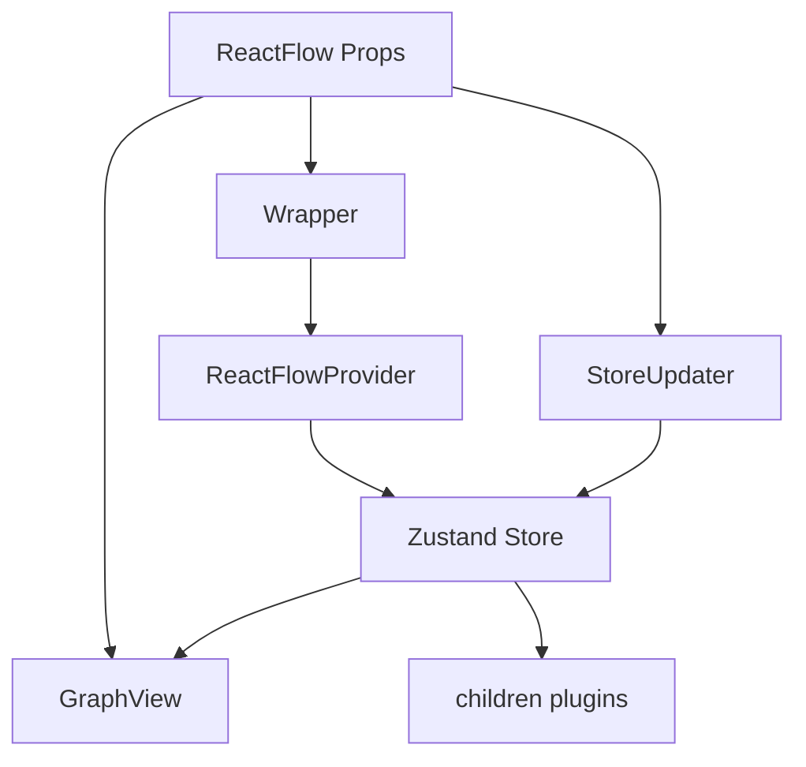

# 第 5 篇：ReactFlow 主组件：门面组件如何组织运行时？

## 1. 这一篇要解决的问题

很多人第一次打开 `ReactFlow/index.tsx`，会本能地把它当成一个“超大 React 组件”。

这个理解不能说错，但太浅了。

`ReactFlow` 真正重要的地方，不是它返回了一个 `div`，也不是它接收了一大堆 props。它更像一个运行时外壳：外面接用户的声明式 API，里面创建或复用 store，把 props 同步成运行时状态，再把渲染、交互、选择监听、插件 children、无障碍描述这些东西组织到同一棵树里。

如果只盯着 JSX，很容易误判它的职责：

```txt
ReactFlow = 渲染 nodes 和 edges 的组件
```

但从源码链路看，更准确的说法应该是：

```txt
ReactFlow = 外部 API 门面 + Store Provider 边界 + Props 同步器 + GraphView 入口 + 插件挂载点
```

这一篇要回答的问题是：

> `ReactFlow` 主组件如何把用户传入的 props，组织成一个可持续运行的图编辑器运行时？

我们不会逐个解释所有 props。那会变成 API 文档复读。

这一篇只抓承重链路：

```txt
用户传入 nodes / edges / callbacks / options / children
  ↓
ReactFlow 收拢外部 API，并补默认值
  ↓
Wrapper 判断是否已有 StoreContext
  ↓
ReactFlowProvider 创建 Zustand store
  ↓
StoreUpdater 把 props 同步进 store
  ↓
GraphView 负责真实画布渲染和交互装配
  ↓
SelectionListener / children / Attribution / A11yDescriptions 挂到同一个运行时下面
```

这一条链路，是从公共 API 进入 React 包内部的第一条主路。

源码入口：

```txt
packages/react/src/container/ReactFlow/index.tsx
packages/react/src/container/ReactFlow/Wrapper.tsx
packages/react/src/components/ReactFlowProvider/index.tsx
packages/react/src/components/StoreUpdater/index.tsx
packages/react/src/store/index.ts
packages/react/src/types/component-props.ts
```

先给这一篇一个局部公式：

```txt
ReactFlow 主组件
  = Props Facade
  + Store Boundary
  + Store Synchronizer
  + Graph Runtime Mount
  + Plugin Slot
```

也就是：

```txt
ReactFlow 不只是“渲染器”
ReactFlow 是 React Flow 运行时在 React 世界里的入口壳
```

先把 JSX 骨架缩到最小，会更容易读后面的源码：

```tsx
<div className="react-flow">
  <Wrapper>
    <StoreUpdater />
    <GraphView />
    <SelectionListener />
    {children}
  </Wrapper>
</div>
```

真实源码当然有更多 props、默认值、无障碍描述、署名和事件配置，但承重结构就是这几个角色：`Wrapper` 定边界，`StoreUpdater` 同步 props，`GraphView` 挂画布，children 插件共享同一个 provider。

## 2. 先看用户 API 或运行效果

用户通常这样使用：

```tsx
<ReactFlow
  nodes={nodes}
  edges={edges}
  onNodesChange={onNodesChange}
  onEdgesChange={onEdgesChange}
  onConnect={onConnect}
  nodeTypes={nodeTypes}
  edgeTypes={edgeTypes}
  fitView
>
  <Background />
  <Controls />
</ReactFlow>
```

这段代码看起来很简单。

但它背后有几类完全不同的问题：

```txt
数据问题：
  nodes / edges 是用户传入的数据，它们要进入内部 store。

变化回流问题：
  onNodesChange / onEdgesChange / onConnect 是交互后的回调出口。

渲染扩展问题：
  nodeTypes / edgeTypes 让用户替换节点和边的渲染方式。

视口问题：
  fitView / defaultViewport / viewport / onViewportChange 决定画布看到哪里。

交互问题：
  pan / zoom / drag / connect / selection 要被配置和监听。

插件问题：
  Background / Controls 作为 children 接入，却要读同一个 store。
```

所以 `ReactFlow` 不能只是：

```tsx
return (
  <>
    {nodes.map(renderNode)}
    {edges.map(renderEdge)}
  </>
);
```

它至少要做五件事：

```txt
1. 接住用户 API。
2. 初始化或复用运行时状态。
3. 把 props 变化同步进运行时状态。
4. 把画布交给 GraphView 渲染。
5. 让 children 插件共享同一个运行时上下文。
```

这就是为什么 `ReactFlow/index.tsx` 看起来像一个 props 大漏斗。它的复杂度不是偶然的，而是因为图编辑器的外部 API 本身就横跨数据、视口、交互、渲染和插件。

从类型定义也能看到这个事实。

`ReactFlowProps` 在 `packages/react/src/types/component-props.ts:56` 开始定义。它先声明 controlled flow 的 `nodes` 和 `edges`，证据见 `packages/react/src/types/component-props.ts:71` 和 `packages/react/src/types/component-props.ts:84`；又声明 uncontrolled flow 的 `defaultNodes` 和 `defaultEdges`，证据见 `packages/react/src/types/component-props.ts:85` 和 `packages/react/src/types/component-props.ts:88`。

同一个 props 类型里，还能看到 `onNodesChange`、`onEdgesChange` 和 `onConnect` 这些交互回流出口。证据见 `packages/react/src/types/component-props.ts:167`、`packages/react/src/types/component-props.ts:186`、`packages/react/src/types/component-props.ts:218`。

这说明 `ReactFlow` 的 API 从第一层就不是纯渲染 API。

它接收的是一整套运行时契约。

## 3. 核心概念解释

读 `ReactFlow` 前，要先区分四个角色。

第一，`ReactFlow` 是门面组件。

它站在最外面，接用户传入的所有 props。源码里它在 `packages/react/src/container/ReactFlow/index.tsx:24` 定义，并在 `packages/react/src/container/ReactFlow/index.tsx:26` 到 `packages/react/src/container/ReactFlow/index.tsx:153` 解构大量 props。

这些 props 可以粗略分成：

```txt
graph data:
  nodes / edges / defaultNodes / defaultEdges

render extension:
  nodeTypes / edgeTypes / connectionLineComponent

event callbacks:
  onNodeClick / onEdgeClick / onConnect / onNodesChange / onEdgesChange

interaction options:
  nodesDraggable / nodesConnectable / panOnDrag / zoomOnScroll / selectionMode

viewport options:
  defaultViewport / viewport / onViewportChange / minZoom / maxZoom / translateExtent

plugin and host options:
  children / proOptions / attributionPosition / ariaLabelConfig / colorMode
```

第二，`Wrapper` 是 store 边界判断器。

它不是普通布局组件。它会检查当前是否已经存在 `StoreContext`。如果已经被外部 `ReactFlowProvider` 包住，就直接返回 children；如果没有，就创建一个新的 `ReactFlowProvider`。

证据在 `packages/react/src/container/ReactFlow/Wrapper.tsx:39` 到 `packages/react/src/container/ReactFlow/Wrapper.tsx:67`。

这层逻辑解决的是：

```txt
ReactFlow 可以自己创建 store
也可以复用用户放在外层的 ReactFlowProvider
```

第三，`ReactFlowProvider` 是 store 创建者。

它用 `useState(() => createStore(...))` 创建一个稳定 store，并通过 `StoreContext.Provider` 提供给子树。证据见 `packages/react/src/components/ReactFlowProvider/index.tsx:104` 到 `packages/react/src/components/ReactFlowProvider/index.tsx:126`。

这层逻辑解决的是：

```txt
ReactFlow 内部所有组件和 hooks 读写同一个运行时状态
```

第四，`StoreUpdater` 是 props 同步器。

它的文件开头就写得很直白：这个组件帮助把用户传入的值更新到 store。证据见 `packages/react/src/components/StoreUpdater/index.tsx:1` 到 `packages/react/src/components/StoreUpdater/index.tsx:4`。

这层逻辑解决的是：

```txt
用户 props 变了，内部运行时状态也要跟着变
```

这里不能把所有字段都简单理解成 `store.setState(props)`。普通配置可以直接写进 store，但 `nodes`、`edges`、`minZoom`、`maxZoom`、`translateExtent`、`viewport` 这类字段必须走专门 setter：`nodes` 要触发 `adoptUserNodes` 更新 lookup，`edges` 要触发 `updateConnectionLookup`，zoom / extent 要同步 `panZoom` 实例，viewport 还要和 controlled / uncontrolled 规则配合。

第五，`GraphView` 是画布运行时挂载点。

`ReactFlow` 把大量事件、交互配置、viewport 配置传给 `GraphView`，证据见 `packages/react/src/container/ReactFlow/index.tsx:254` 到 `packages/react/src/container/ReactFlow/index.tsx:319`。

这层逻辑解决的是：

```txt
真正的节点、边、连接线、viewport 和 pane 交互由 GraphView 继续组织
```

所以 `ReactFlow` 不是单点实现全部能力，而是把运行时分给几个角色：

```txt
ReactFlow
  -> 接 API

Wrapper
  -> 决定 provider 边界

ReactFlowProvider
  -> 创建 store

StoreUpdater
  -> 同步 props

GraphView
  -> 组织画布渲染和交互

SelectionListener / children / Attribution / A11yDescriptions
  -> 接入选择监听、插件、署名、无障碍辅助
```

## 4. 源码入口在哪里

这一篇主要读五个文件。

第一，主组件：

```txt
packages/react/src/container/ReactFlow/index.tsx
```

重点看三段。

第一段是 props 解构和默认值：

```txt
lines 24-154
```

这里可以看到 `ReactFlow` 把数据、事件、交互、viewport、样式、children 全部收进来。

第二段是外层 wrapper div：

```txt
lines 169-179
```

它设置 `data-testid`、`onScroll`、style、ref、className、id 和 `role="application"`。

第三段是内部运行时结构：

```txt
lines 180-324
```

这里能看到 `Wrapper`、`StoreUpdater`、`GraphView`、`SelectionListener`、`children`、`Attribution`、`A11yDescriptions` 的相对顺序。

第二，provider 边界：

```txt
packages/react/src/container/ReactFlow/Wrapper.tsx
```

重点看：

```txt
lines 39-47:
  如果已有 StoreContext，就不再创建 Provider。

lines 49-67:
  如果没有 StoreContext，就创建 ReactFlowProvider。
```

第三，provider 实现：

```txt
packages/react/src/components/ReactFlowProvider/index.tsx
```

重点看：

```txt
lines 104-120:
  useState(() => createStore(...))

lines 122-126:
  Provider value={store} + BatchProvider
```

第四，props 同步器：

```txt
packages/react/src/components/StoreUpdater/index.tsx
```

重点看：

```txt
lines 14-74:
  需要追踪并同步进 store 的字段列表。

lines 87-96:
  从 store 取出专门 setter。

lines 128-136:
  mount 时设置 default nodes / edges，unmount 时 reset。

lines 140-168:
  逐个比较 props 和 previousFields，把变化写入 store。
```

第五，store 创建：

```txt
packages/react/src/store/index.ts
```

重点看：

```txt
lines 26-55:
  createStore 接收初始 nodes / edges / viewport 配置。

lines 83-98:
  getInitialState 建立初始状态。

lines 99-125:
  setNodes 会调用 adoptUserNodes，把用户节点增强成内部可操作结构。
```

这五个文件连起来，就是 `ReactFlow` 主组件的真实含义。

它不是一个“巨型 JSX 文件”，而是一条运行时初始化链。

## 5. 源码调用链

先看最外层。

`ReactFlow/index.tsx` 在 `packages/react/src/container/ReactFlow/index.tsx:169` 开始返回一个外层 `div`。

这个 `div` 有几个细节值得注意：

```txt
style:
  合并用户 style 和内部 wrapperStyle。

className:
  react-flow + 用户 className + colorModeClassName。

role:
  application。

onScroll:
  wrapperOnScroll 会把 scroll 归零，避免 focus 到 viewport 外节点时 wrapper 自己滚动。
```

这里已经能看出一个思路：

```txt
React Flow 的视口移动应该由 viewport transform 管
不应该由外层 DOM scroll 管
```

源码里 `wrapperOnScroll` 会调用 `scrollTo({ top: 0, left: 0 })`，证据见 `packages/react/src/container/ReactFlow/index.tsx:160` 到 `packages/react/src/container/ReactFlow/index.tsx:167`。

这不是装饰逻辑。它在守住画布运行时的一个边界：

```txt
画布位置 = viewport transform
不是 wrapper scrollTop / scrollLeft
```

再往里，是 `Wrapper`：

```tsx
<Wrapper
  nodes={nodes}
  edges={edges}
  width={width}
  height={height}
  fitView={fitView}
  fitViewOptions={fitViewOptions}
  minZoom={minZoom}
  maxZoom={maxZoom}
  nodeOrigin={nodeOrigin}
  nodeExtent={nodeExtent}
  zIndexMode={zIndexMode}
>
  ...
</Wrapper>
```

`Wrapper` 只接初始化相关的少数参数。它不接所有事件回调，也不接所有交互配置。

这很有意思。

因为 `Wrapper` 的职责不是同步所有 props，而是决定 store 初始状态和 provider 边界。

它的逻辑是：

```txt
读取 StoreContext
  ↓
如果已经存在 store
  ↓
直接返回 children

否则
  ↓
用 ReactFlowProvider 创建 store
  ↓
把 initial nodes / edges / viewport options 放进去
```

这让 React Flow 支持两种用法。

第一种，普通用法：

```tsx
<ReactFlow nodes={nodes} edges={edges} />
```

这时 `Wrapper` 会自动创建 provider。

第二种，外部 provider 用法：

```tsx
<ReactFlowProvider>
  <Sidebar />
  <ReactFlow nodes={nodes} edges={edges} />
</ReactFlowProvider>
```

这时 `Wrapper` 发现已有 `StoreContext`，就不会再套一层 provider。

这个设计让 hooks 可以在 `ReactFlow` 外部但 provider 内部使用。`ReactFlowProvider` 的注释也说明，它让用户可以在 `<ReactFlow />` 组件外访问 flow 的 internal state，许多 hooks 都依赖它。证据见 `packages/react/src/components/ReactFlowProvider/index.tsx:54` 到 `packages/react/src/components/ReactFlowProvider/index.tsx:87`。

然后是 `StoreUpdater`：

```txt
Wrapper 建好 store
  ↓
StoreUpdater 读取 store setter
  ↓
监听用户 props 的变化
  ↓
把 nodes / edges / callbacks / options 写入 store
```

它的 `reactFlowFieldsToTrack` 列表很长，证据见 `packages/react/src/components/StoreUpdater/index.tsx:14` 到 `packages/react/src/components/StoreUpdater/index.tsx:74`。

这份列表本身就是 React Flow 的运行时配置地图：

```txt
nodes / edges / defaultNodes / defaultEdges
callbacks
draggable / connectable / focusable
minZoom / maxZoom / translateExtent / nodeExtent
snapGrid / snapToGrid
fitView / fitViewOptions
delete callbacks
drag callbacks
move callbacks
connection options
debug / aria / zIndexMode
```

然后 `StoreUpdater` 在 effect 里逐个比较字段：

```txt
如果 fieldValue 没变
  -> 跳过

如果 fieldValue 是 undefined
  -> 跳过

如果是 nodes / edges / zoom / extent 等特殊字段
  -> 调专门 setter

否则
  -> store.setState({ [fieldName]: fieldValue })
```

证据见 `packages/react/src/components/StoreUpdater/index.tsx:140` 到 `packages/react/src/components/StoreUpdater/index.tsx:168`。

这就是 props 到 store 的同步桥。

最后是 `GraphView`：

```txt
StoreUpdater
  -> 让 store 拿到最新配置

GraphView
  -> 根据 store 和 props 组织真实画布
```

`ReactFlow` 把大量事件和配置传给 `GraphView`，比如节点事件、边事件、连接线配置、选择配置、键盘配置、pan/zoom 配置、viewport 配置。证据见 `packages/react/src/container/ReactFlow/index.tsx:254` 到 `packages/react/src/container/ReactFlow/index.tsx:319`。

然后它把这些挂到 `Wrapper` 的同一棵子树里：

```tsx
<StoreUpdater />
<GraphView />
<SelectionListener />
{children}
<Attribution />
<A11yDescriptions />
```

证据见 `packages/react/src/container/ReactFlow/index.tsx:193` 到 `packages/react/src/container/ReactFlow/index.tsx:323`。

这段顺序说明：

```txt
GraphView 是主画布
SelectionListener 是选择状态回调桥
children 是插件插槽
Attribution 和 A11yDescriptions 是运行时附属组件
```

`children` 放在同一个 provider 下，所以 `Background`、`Controls`、`MiniMap` 这类组件才能通过 hooks 或 store 读到画布状态。

## 6. 关键数据结构

这一篇最关键的数据结构不是某个 TypeScript interface，而是几组 props 如何进入不同阶段。

第一组：初始化字段。

```txt
nodes
edges
defaultNodes
defaultEdges
width
height
fitView
fitViewOptions
minZoom
maxZoom
nodeOrigin
nodeExtent
zIndexMode
```

这些字段会从 `ReactFlow` 传给 `Wrapper`，再传给 `ReactFlowProvider`，最后进入 `createStore`。

证据链：

```txt
ReactFlow -> Wrapper:
  packages/react/src/container/ReactFlow/index.tsx:180

Wrapper -> ReactFlowProvider:
  packages/react/src/container/ReactFlow/Wrapper.tsx:49

ReactFlowProvider -> createStore:
  packages/react/src/components/ReactFlowProvider/index.tsx:104

createStore -> getInitialState:
  packages/react/src/store/index.ts:83
```

这组字段回答：

```txt
运行时第一次创建时，应该以什么数据和视口配置启动？
```

第二组：可变运行时字段。

这些字段由 `StoreUpdater` 追踪：

```txt
nodes / edges
onConnect / onNodesChange / onEdgesChange
nodesDraggable / nodesConnectable / elementsSelectable
minZoom / maxZoom / translateExtent
snapGrid / snapToGrid
fitView / fitViewOptions
drag callbacks
move callbacks
connection options
debug / aria / zIndexMode
```

这组字段回答：

```txt
React props 更新后，运行时 store 需要同步哪些值？
```

第三组：渲染和交互字段。

这些字段主要传给 `GraphView`：

```txt
nodeTypes / edgeTypes
connectionLineType / connectionLineComponent
selectionKeyCode / deleteKeyCode
panOnDrag / zoomOnScroll / zoomOnPinch
onPaneClick / onNodeClick / onEdgeClick
viewport / onViewportChange
```

这组字段回答：

```txt
画布如何渲染，交互如何响应，事件如何回调给用户？
```

第四组：插件和辅助组件。

```txt
children
Attribution
A11yDescriptions
SelectionListener
```

这组字段和组件回答：

```txt
运行时周边能力如何接入同一个 store？
```

如果把这些数据结构画成图：



这张图就是本篇的重点。

`ReactFlow` 不是把 props 一次性传到底。它会把不同类型的 props 分发给不同职责的模块：

```txt
初始化字段 -> Provider / createStore
动态字段 -> StoreUpdater
渲染交互字段 -> GraphView
插件 children -> Provider 子树
```

## 7. 关键实现思路

### 第一层：门面组件不直接做重活

`ReactFlow` 接了很多 props，但它没有在主组件里直接实现拖拽、连线、pan/zoom、节点测量、边路径计算。

它做的是分发。

```txt
Store 初始化
  -> Wrapper / ReactFlowProvider

Props 同步
  -> StoreUpdater

画布渲染和交互
  -> GraphView

选择回调
  -> SelectionListener

插件扩展
  -> children
```

这是大型组件常见的正确形态：

> 外层门面负责组织运行时，不负责吃掉所有实现细节。

如果 `ReactFlow` 自己实现所有细节，文件会迅速变成一个无法维护的巨型运行时组件。现在它把职责拆开，后面每篇源码导读也能顺着这些边界继续深入。

### 第二层：Provider 可以自动创建，也可以由用户外置

`Wrapper` 的设计很关键。

它让下面两种写法都成立：

```tsx
<ReactFlow nodes={nodes} edges={edges} />
```

以及：

```tsx
<ReactFlowProvider>
  <Sidebar />
  <ReactFlow nodes={nodes} edges={edges} />
</ReactFlowProvider>
```

如果没有 `Wrapper` 的判断，`ReactFlow` 要么强制用户永远自己包 provider，要么永远内部创建 provider，导致外部组件无法稳定访问同一个 store。

现在它选择了更柔性的方式：

```txt
如果用户没包，我替你包。
如果用户已经包了，我不重复包。
```

这就是为什么 `Wrapper` 不是一个可有可无的小组件。它承担的是 provider ownership 的判断。

### 第三层：StoreUpdater 把声明式 props 变成运行时状态

React 的 props 是声明式输入。

但 React Flow 内部是一个交互式运行时。

这两者之间必须有桥。

`StoreUpdater` 就是这座桥。

它有两个非常明确的策略。

第一，只有被追踪的字段才同步。

字段列表在 `packages/react/src/components/StoreUpdater/index.tsx:14` 到 `packages/react/src/components/StoreUpdater/index.tsx:74`。

这避免了“所有 props 都粗暴塞进 store”的混乱。

第二，部分字段走专门 setter。

比如：

```txt
nodes -> setNodes
edges -> setEdges
minZoom -> setMinZoom
maxZoom -> setMaxZoom
translateExtent -> setTranslateExtent
nodeExtent -> setNodeExtent
ariaLabelConfig -> mergeAriaLabelConfig 后 setState
fitView -> fitViewQueued
```

证据见 `packages/react/src/components/StoreUpdater/index.tsx:149` 到 `packages/react/src/components/StoreUpdater/index.tsx:159`。

为什么不能全部 `store.setState({ [fieldName]: value })`？

因为有些字段不是普通赋值。

`nodes` 进入 store 时，需要调用 `setNodes`；而 `setNodes` 里会调用 system 层的 `adoptUserNodes`，把用户传入的 node 增强成内部运行时可操作的数据。证据见 `packages/react/src/store/index.ts:99` 到 `packages/react/src/store/index.ts:125`。

也就是说：

```txt
ReactFlow props.nodes
  ↓
StoreUpdater
  ↓
store.setNodes
  ↓
adoptUserNodes
  ↓
InternalNode / nodeLookup / parentLookup
```

这条链路就是第 8 篇会详细讲的“用户节点为什么需要被增强”。

### 第四层：GraphView 接管真实画布

`ReactFlow` 把画布交给 `GraphView`。

这一点很重要。因为主组件本身不应该知道所有渲染层细节。

`GraphView` 继续负责：

```txt
FlowRenderer
Viewport
EdgeRenderer
ConnectionLineWrapper
NodeRenderer
portal containers
```

这会成为下一篇的主题。

在本篇只要记住一件事：

```txt
ReactFlow 组织运行时外壳
GraphView 组织画布内部结构
```

这两个角色不要混。

## 8. 这部分源码的设计取舍

这种设计的第一个收益，是把用户体验做得很平滑。

用户不用显式理解 provider、store、store updater、GraphView：

```tsx
<ReactFlow nodes={nodes} edges={edges} />
```

这就能跑。

但当用户需要在外部组件访问运行时状态时，又可以自己放 `ReactFlowProvider`：

```tsx
<ReactFlowProvider>
  <Toolbar />
  <ReactFlow />
</ReactFlowProvider>
```

这就是“简单用法低门槛，高级用法有出口”。

第二个收益，是把 props 同步逻辑集中到 `StoreUpdater`。

如果每个子组件自己监听自己关心的 props，整个运行时会变得很散：

```txt
GraphView 同步 zoom 配置
NodeRenderer 同步 nodesDraggable
ConnectionLine 同步 isValidConnection
FlowRenderer 同步 pan 配置
```

这样很容易出现状态来源混乱。

现在 `StoreUpdater` 集中维护“哪些 props 要进入 store”，而 `GraphView` 等组件从 store 或传入 props 获取自己需要的值。

代价是 `StoreUpdater` 会变成一个很长的字段同步器。

这也是源码阅读时要注意的：长不一定等于乱。`StoreUpdater` 长，是因为 `ReactFlow` 的运行时配置面本来就很大。它至少比“配置散落在十几个组件里”更容易审计。

第三个收益，是 `ReactFlow` 主组件保留了清晰骨架。

从 JSX 结构看，它非常像：

```tsx
<div className="react-flow">
  <Wrapper>
    <StoreUpdater />
    <GraphView />
    <SelectionListener />
    {children}
    <Attribution />
    <A11yDescriptions />
  </Wrapper>
</div>
```

这个骨架很稳定。

读者不需要先理解每个 prop，先记住这个骨架就够了。

代价也很明显：`ReactFlow/index.tsx` 的 props 列表非常长，初学者会被淹没。

解决办法不是逐行背，而是分组：

```txt
数据输入
事件回调
渲染扩展
交互配置
视口配置
插件和辅助 UI
```

第四个取舍，是 controlled / uncontrolled 的复杂度提前进入主组件。

`ReactFlow` 同时支持：

```tsx
<ReactFlow nodes={nodes} edges={edges} />
```

和：

```tsx
<ReactFlow defaultNodes={nodes} defaultEdges={edges} />
```

这让 API 友好，但让 store 初始化和 props 同步更复杂。`StoreUpdater` mount 时会调用 `setDefaultNodesAndEdges`，证据见 `packages/react/src/components/StoreUpdater/index.tsx:128` 到 `packages/react/src/components/StoreUpdater/index.tsx:136`；store 里也有 `setDefaultNodesAndEdges`，证据见 `packages/react/src/store/index.ts:149` 到 `packages/react/src/store/index.ts:160`。

这部分后面会在 controlled / uncontrolled 章节专门展开。

现在先记住：

> ReactFlow 主组件从一开始就在兼容两种状态所有权：用户控制和内部控制。

## 9. 如果我们自己实现，最小版本应该怎么写

如果我们手写 mini-flow，第一版不需要复刻全部 props。

但这条结构值得保留：

```txt
MiniFlow
  -> MiniFlowProvider / Wrapper
  -> StoreUpdater
  -> GraphView
  -> children
```

最小版本可以这样写：

```tsx
type MiniFlowProps = {
  nodes?: Node[];
  edges?: Edge[];
  defaultNodes?: Node[];
  defaultEdges?: Edge[];
  onNodesChange?: (changes: NodeChange[]) => void;
  onEdgesChange?: (changes: EdgeChange[]) => void;
  onConnect?: (connection: Connection) => void;
  children?: React.ReactNode;
};

export function MiniFlow(props: MiniFlowProps) {
  return (
    <MiniFlowWrapper
      nodes={props.nodes}
      edges={props.edges}
      defaultNodes={props.defaultNodes}
      defaultEdges={props.defaultEdges}
    >
      <MiniFlowStoreUpdater
        nodes={props.nodes}
        edges={props.edges}
        onNodesChange={props.onNodesChange}
        onEdgesChange={props.onEdgesChange}
        onConnect={props.onConnect}
      />
      <MiniGraphView />
      {props.children}
    </MiniFlowWrapper>
  );
}
```

`MiniFlowWrapper` 可以先做最简单的 provider 判断：

```tsx
function MiniFlowWrapper({
  children,
  nodes,
  edges,
  defaultNodes,
  defaultEdges,
}: {
  children: React.ReactNode;
  nodes?: Node[];
  edges?: Edge[];
  defaultNodes?: Node[];
  defaultEdges?: Edge[];
}) {
  const existingStore = useContext(MiniFlowStoreContext);

  if (existingStore) {
    return <>{children}</>;
  }

  return (
    <MiniFlowProvider
      initialNodes={nodes}
      initialEdges={edges}
      defaultNodes={defaultNodes}
      defaultEdges={defaultEdges}
    >
      {children}
    </MiniFlowProvider>
  );
}
```

`MiniFlowStoreUpdater` 可以先只同步 nodes / edges / callbacks：

```tsx
function MiniFlowStoreUpdater({
  nodes,
  edges,
  onNodesChange,
  onEdgesChange,
  onConnect,
}: Pick<MiniFlowProps, 'nodes' | 'edges' | 'onNodesChange' | 'onEdgesChange' | 'onConnect'>) {
  const store = useMiniFlowStoreApi();

  useEffect(() => {
    if (nodes) {
      store.getState().setNodes(nodes);
    }
  }, [nodes, store]);

  useEffect(() => {
    if (edges) {
      store.getState().setEdges(edges);
    }
  }, [edges, store]);

  useEffect(() => {
    store.setState({
      onNodesChange,
      onEdgesChange,
      onConnect,
    });
  }, [onNodesChange, onEdgesChange, onConnect, store]);

  return null;
}
```

第一版不用做：

```txt
minZoom / maxZoom
translateExtent
selection key codes
auto pan
aria label config
zIndexMode
debug
```

但要保留这个思想：

```txt
用户 API 不直接等于内部 store。
中间要有一层同步器，把外部声明式输入转成运行时状态。
```

这就是从 ReactFlow 主组件里最值得借的东西。

## 10. 本篇总结

这一篇我们没有深入 `GraphView`、store action、节点拖拽、连线系统。

我们只做了一件事：读懂 `ReactFlow` 主组件作为运行时外壳的职责。

它的承重链路是：

```txt
ReactFlow
  -> 接收用户 API，并补默认值

Wrapper
  -> 判断是否需要创建 Provider

ReactFlowProvider
  -> 创建并提供 Zustand store

StoreUpdater
  -> 把用户 props 同步进 store

GraphView
  -> 组织真实画布渲染和交互

children
  -> 插件组件共享同一个运行时上下文
```

最重要的结论是：

> ReactFlow 主组件不是画布实现本身，而是 React Flow 运行时的门面和装配层。

这也解释了为什么 `ReactFlow/index.tsx` 会接收那么多 props。它站在用户 API 和内部运行时之间，必须把数据、事件、交互、视口、插件这些入口都收拢起来，然后分发到正确的内部模块。

读完这一篇，后面再读 `GraphView` 就不会误解它和 `ReactFlow` 的关系：

```txt
ReactFlow 负责装配运行时外壳
GraphView 负责装配画布内部结构
```

## 11. 下一篇读什么

下一篇读：

```txt
packages/react/src/container/GraphView/index.tsx
packages/react/src/container/FlowRenderer
packages/react/src/container/Viewport
packages/react/src/container/EdgeRenderer
packages/react/src/container/NodeRenderer
packages/react/src/components/ConnectionLine
```

主题是：

> `GraphView` 如何把 pane、viewport、edges、connection line、nodes 和 portal containers 组织成分层画布？

如果说 `ReactFlow` 是运行时外壳，那么 `GraphView` 就是画布的总装层。
