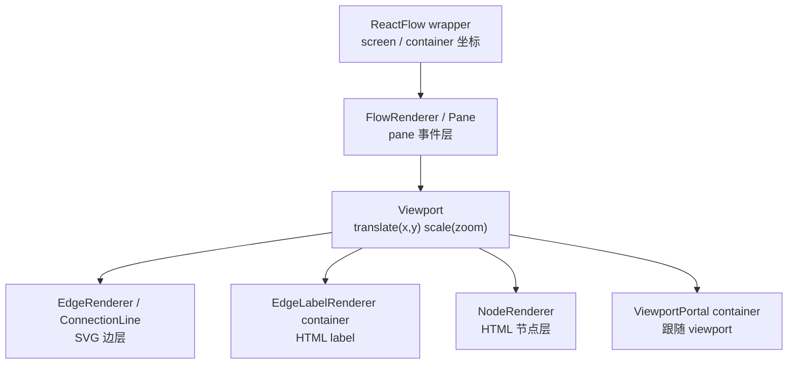

# 第 6 篇：GraphView：节点、边、连接线和 viewport 的渲染分层

## 1. 这一篇要解决的问题

上一篇我们读了 `ReactFlow` 主组件。

它接住用户 API，创建或复用 store，把 props 同步进运行时，然后把真正的画布交给 `GraphView`。

所以这一篇进入 `GraphView`。

很多人第一次看 React Flow 的画布，会以为它大概是这样渲染的：

```tsx
<div className="canvas">
  {edges.map(renderEdge)}
  {nodes.map(renderNode)}
</div>
```

这个想象太简单了。

React Flow 的画布不是一个平铺的列表渲染，而是一个分层运行时。它至少要同时解决这些问题：

```txt
画布怎么响应 pan / zoom？
节点和边怎么一起吃到 viewport transform？
边为什么要在节点下面？
正在连接的临时线应该放在哪一层？
Edge label 为什么不能直接塞进 SVG path 里？
ViewportPortal 为什么能跟着画布缩放和平移？
框选为什么属于 pane 交互，而不是节点渲染？
```

如果只说“GraphView 渲染节点和边”，就看不到它真正的职责。

更准确的说法是：

```txt
GraphView = pane interaction shell + viewport transform layer + edge layer + connection layer + node layer + portal slots
```

这一篇要回答：

> `GraphView` 如何把 React Flow 的画布拆成可协作的渲染层和交互层？

承重链路先放出来：

```txt
ReactFlow
  ↓
GraphView
  ↓
FlowRenderer
  ↓
ZoomPane
  ↓
Pane
  ↓
Viewport
  ↓
EdgeRenderer
  ↓
ConnectionLineWrapper
  ↓
EdgeLabelRenderer container
  ↓
NodeRenderer
  ↓
ViewportPortal container
```

这条链路不是单纯的组件嵌套图。它表达的是：

```txt
外层先处理画布级交互
中间应用 viewport transform
内层按视觉和语义顺序渲染边、临时连接线、节点、portal
```

严格对照源码时要注意一个细节：从 `GraphView` 的 JSX 看，是 `<FlowRenderer><Viewport>...</Viewport></FlowRenderer>`；从完整运行时看，`FlowRenderer` 内部还会继续接入 `ZoomPane` 和 `Pane`。所以本文的层级图表达的是运行时职责顺序，不是逐行 JSX 缩进。

源码入口：

```txt
packages/react/src/container/GraphView/index.tsx
packages/react/src/container/FlowRenderer/index.tsx
packages/react/src/container/ZoomPane/index.tsx
packages/react/src/container/Pane/index.tsx
packages/react/src/container/Viewport/index.tsx
packages/react/src/container/EdgeRenderer/index.tsx
packages/react/src/container/NodeRenderer/index.tsx
packages/react/src/components/ConnectionLine/index.tsx
packages/react/src/components/EdgeLabelRenderer/index.tsx
packages/react/src/components/ViewportPortal/index.tsx
```

先给这一篇一个局部公式：

```txt
GraphView
  = FlowRenderer(pane interaction + panzoom)
  + Viewport(transform)
  + EdgeRenderer(edges)
  + ConnectionLineWrapper(active connection)
  + NodeRenderer(nodes)
  + Portal Containers(labels and viewport overlays)
```

如果上一篇的 `ReactFlow` 是运行时外壳，那么这一篇的 `GraphView` 就是画布总装层。

## 2. 先看用户 API 或运行效果

还是从最常见的用户代码开始：

```tsx
<ReactFlow
  nodes={nodes}
  edges={edges}
  onNodesChange={onNodesChange}
  onEdgesChange={onEdgesChange}
  onConnect={onConnect}
  fitView
>
  <Background />
  <Controls />
</ReactFlow>
```

用户看到的是一个画布。

但这个画布里其实有很多层同时工作：

```txt
滚轮缩放：
  外层 ZoomPane 接收 wheel / pinch / double click。

拖动画布：
  FlowRenderer 和 ZoomPane 协作处理 pan。

点击空白区域：
  Pane 处理 pane click，并清空选择。

框选：
  Pane 维护 userSelectionRect，并触发 selection changes。

节点渲染：
  NodeRenderer 只负责节点列表层。

边渲染：
  EdgeRenderer 只负责边列表层。

临时连线：
  ConnectionLineWrapper 只在 connection in progress 时渲染。

edge label：
  EdgeLabelRenderer 通过 portal 放进专门的 div。

viewport overlay：
  ViewportPortal 通过 portal 放进跟随 viewport transform 的容器。
```

这些能力如果全部写在一个组件里，会变成一个巨大的“画布怪物组件”。

React Flow 的拆法是：

```txt
GraphView 只负责分层装配。
每一层负责自己的行为和性能边界。
```

从用户角度看，这种拆分的结果是自然的：

```txt
缩放时，节点和边一起缩放。
拖动节点时，边会跟着更新。
创建连接时，临时线在节点和边之间出现。
自定义 edge label 可以用 HTML 渲染。
插件 UI 可以选择跟随 viewport，或固定在 Panel 里。
```

从源码角度看，这些“自然”都来自明确的层次安排。

## 3. 核心概念解释

先区分几个概念。

`FlowRenderer` 不是渲染 nodes / edges 的组件。

它更像画布交互壳，负责把 pan / zoom / pane click / selection / global key handler 这些 pane 级能力包起来。源码里 `GraphView` 从 `packages/react/src/container/GraphView/index.tsx:116` 开始返回 `FlowRenderer`。

`ZoomPane` 是 panzoom 接入层。

它创建 system 层的 `XYPanZoom`，把 DOM 节点、minZoom、maxZoom、translateExtent、defaultViewport、回调交进去。证据见 `packages/react/src/container/ZoomPane/index.tsx:68` 到 `packages/react/src/container/ZoomPane/index.tsx:107`。

`Pane` 是空白画布交互层。

它处理 pane click、context menu、wheel、pointer selection、selection auto pan。证据见 `packages/react/src/container/Pane/index.tsx:112` 到 `packages/react/src/container/Pane/index.tsx:123`，以及 `packages/react/src/container/Pane/index.tsx:143` 到 `packages/react/src/container/Pane/index.tsx:181`。

`Viewport` 是 transform 层。

它从 store 读取 `transform`，生成 CSS：

```txt
translate(x, y) scale(zoom)
```

证据见 `packages/react/src/container/Viewport/index.tsx:6` 到 `packages/react/src/container/Viewport/index.tsx:17`。

`EdgeRenderer` 是边层。

它读取 visible edge ids，渲染 marker definitions 和每个 `EdgeWrapper`。证据见 `packages/react/src/container/EdgeRenderer/index.tsx:59` 到 `packages/react/src/container/EdgeRenderer/index.tsx:92`。

`ConnectionLineWrapper` 是临时连接线层。

它只在画布有尺寸、nodes 可连接、connection 正在进行时渲染。证据见 `packages/react/src/components/ConnectionLine/index.tsx:32` 到 `packages/react/src/components/ConnectionLine/index.tsx:57`。

`NodeRenderer` 是节点层。

它读取 visible node ids，并把单节点工作交给 `NodeWrapper`。证据见 `packages/react/src/container/NodeRenderer/index.tsx:38` 到 `packages/react/src/container/NodeRenderer/index.tsx:98`。

两个 portal container 是扩展层。

`GraphView` 里直接放了：

```tsx
<div className="react-flow__edgelabel-renderer" />
<div className="react-flow__viewport-portal" />
```

证据见 `packages/react/src/container/GraphView/index.tsx:181` 和 `packages/react/src/container/GraphView/index.tsx:198`。

它们分别被 `EdgeLabelRenderer` 和 `ViewportPortal` 查询并 `createPortal`。证据见 `packages/react/src/components/EdgeLabelRenderer/index.tsx:54` 到 `packages/react/src/components/EdgeLabelRenderer/index.tsx:61`，以及 `packages/react/src/components/ViewportPortal/index.tsx:34` 到 `packages/react/src/components/ViewportPortal/index.tsx:41`。

这些概念放在一起，才是 React Flow 的画布。

```txt
画布不是一层 DOM
画布是一组有顺序、有坐标关系、有交互边界的渲染层
```

坐标空间可以这样看：



## 4. 源码入口在哪里

这一篇从 `GraphView/index.tsx` 开始。

它的核心结构非常清楚：

```tsx
<FlowRenderer>
  <Viewport>
    <EdgeRenderer />
    <ConnectionLineWrapper />
    <div className="react-flow__edgelabel-renderer" />
    <NodeRenderer />
    <div className="react-flow__viewport-portal" />
  </Viewport>
</FlowRenderer>
```

源码证据在 `packages/react/src/container/GraphView/index.tsx:116` 到 `packages/react/src/container/GraphView/index.tsx:200`。

这个结构就是本篇最重要的源码。

不要急着进入每个子组件。先看顺序：

```txt
FlowRenderer 在最外层
Viewport 在 FlowRenderer 里面
EdgeRenderer 在 Viewport 里面
ConnectionLineWrapper 在 EdgeRenderer 后面
edge label container 在 connection line 后面
NodeRenderer 在 edge label container 后面
viewport portal container 在最后
```

这个顺序意味着：

```txt
边先渲染
临时连接线再渲染
edge label 容器在边之上
节点再渲染
viewport portal 容器最后
```

这不是随手排的。

如果节点和边在同一个平铺列表里，z-index 和 pointer 交互会很难控制。React Flow 选择用层来表达语义：

```txt
Edge layer:
  已经存在的关系。

Connection layer:
  正在创建的关系。

Node layer:
  主要实体。

Portal layer:
  用户扩展内容。
```

同时，这些层全部放在 `Viewport` 里面，所以它们共享同一个 transform。

这就解释了一个关键行为：

```txt
pan / zoom 时，节点、边、连接线、edge label、viewport portal 内容一起移动和缩放。
```

接着读 `FlowRenderer/index.tsx`。

它外面是 `ZoomPane`，里面是 `Pane`，再把 children 放进去。证据见 `packages/react/src/container/FlowRenderer/index.tsx:88` 到 `packages/react/src/container/FlowRenderer/index.tsx:138`。

所以更完整的结构是：

```txt
FlowRenderer
  ↓
ZoomPane
  ↓
Pane
  ↓
Viewport
  ↓
Edges / ConnectionLine / Nodes / Portals
```

`ZoomPane` 负责 panzoom controller，`Pane` 负责 pane 事件和框选，`Viewport` 负责 transform，内层 renderers 负责图元素。

这就是 GraphView 的层次分工。

## 5. 源码调用链

先从 `ReactFlow` 传入 `GraphView` 的 props 看。

上一篇已经看到，`ReactFlow` 会把节点事件、边事件、连接线配置、选择配置、键盘配置、pan/zoom 配置、viewport 配置传给 `GraphView`。证据见 `packages/react/src/container/ReactFlow/index.tsx:254` 到 `packages/react/src/container/ReactFlow/index.tsx:319`。

`GraphView` 接住后分发。

第一条链路：初始化和 controlled viewport。

```txt
GraphView
  ↓
useOnInitHandler(onInit)
  ↓
viewport 初始化完成后调用 onInit

GraphView
  ↓
useViewportSync(viewport)
  ↓
把 controlled viewport 同步给 panZoom 和 store.transform
```

源码里 `GraphView` 调用 `useOnInitHandler(onInit)` 和 `useViewportSync(viewport)`，证据见 `packages/react/src/container/GraphView/index.tsx:113` 到 `packages/react/src/container/GraphView/index.tsx:114`。

`useOnInitHandler` 会等 `rfInstance.viewportInitialized` 后调用 `onInit`，证据见 `packages/react/src/hooks/useOnInitHandler.ts:17` 到 `packages/react/src/hooks/useOnInitHandler.ts:22`。

`useViewportSync` 会调用 `panZoom.syncViewport`，并设置 store 的 `transform`，证据见 `packages/react/src/hooks/useViewportSync.ts:19` 到 `packages/react/src/hooks/useViewportSync.ts:24`。

第二条链路：pan / zoom。

```txt
GraphView
  ↓
FlowRenderer
  ↓
ZoomPane
  ↓
XYPanZoom
  ↓
onTransformChange
  ↓
store.transform 或 onViewportChange
  ↓
Viewport style transform
```

`ZoomPane` 在 mount 时创建 `XYPanZoom`，证据见 `packages/react/src/container/ZoomPane/index.tsx:68` 到 `packages/react/src/container/ZoomPane/index.tsx:93`。

创建后，它把 `panZoom` 实例、初始 transform、domNode 写进 store，证据见 `packages/react/src/container/ZoomPane/index.tsx:95` 到 `packages/react/src/container/ZoomPane/index.tsx:101`。

当 transform 变化时，`onTransformChange` 会触发 `onViewportChange`，并在非受控 viewport 下更新 store.transform。证据见 `packages/react/src/container/ZoomPane/index.tsx:57` 到 `packages/react/src/container/ZoomPane/index.tsx:66`。

`Viewport` 再从 store 取 transform，拼出 CSS transform。证据见 `packages/react/src/container/Viewport/index.tsx:6` 到 `packages/react/src/container/Viewport/index.tsx:17`。

这条链路解释了为什么 pan / zoom 最后不是直接改每个节点位置。

它改的是一层统一的 transform。

第三条链路：pane click 和框选。

```txt
FlowRenderer
  ↓
Pane
  ↓
onClick 清空选择
  ↓
pointer selection 计算 userSelectionRect
  ↓
getNodesInside 找出框选节点
  ↓
triggerNodeChanges / triggerEdgeChanges
```

`Pane` 的 click 会调用 `resetSelectedElements` 并关闭 `nodesSelectionActive`，证据见 `packages/react/src/container/Pane/index.tsx:112` 到 `packages/react/src/container/Pane/index.tsx:123`。

框选从 `onPointerDownCapture` 开始，记录 selection 起点，证据见 `packages/react/src/container/Pane/index.tsx:143` 到 `packages/react/src/container/Pane/index.tsx:181`。

移动过程中，`commitUserSelectionRect` 会用 `getNodesInside` 计算命中的节点，并触发 node/edge selection changes。证据见 `packages/react/src/container/Pane/index.tsx:183` 到 `packages/react/src/container/Pane/index.tsx:253`。

这说明框选不是 `NodeRenderer` 的职责。

节点层只负责渲染节点。框选是 pane 级交互，需要知道容器 bounds、transform、nodeLookup、edgeLookup、connectionLookup，所以它属于 `Pane`。

第四条链路：边和节点渲染。

```txt
GraphView
  ↓
Viewport
  ↓
EdgeRenderer
  ↓
EdgeWrapper for visible edge ids

GraphView
  ↓
Viewport
  ↓
NodeRenderer
  ↓
NodeWrapper for visible node ids
```

`EdgeRenderer` 使用 `useVisibleEdgeIds`，并 map 出 `EdgeWrapper`。证据见 `packages/react/src/container/EdgeRenderer/index.tsx:59` 到 `packages/react/src/container/EdgeRenderer/index.tsx:91`。

`NodeRenderer` 使用 `useVisibleNodeIds`，并 map 出 `NodeWrapper`。证据见 `packages/react/src/container/NodeRenderer/index.tsx:38` 到 `packages/react/src/container/NodeRenderer/index.tsx:98`。

注意 `EdgeRenderer` 在 `NodeRenderer` 前面。

这对应视觉层级：

```txt
edges below nodes
```

第五条链路：连接线。

```txt
GraphView
  ↓
ConnectionLineWrapper
  ↓
读取 connection state
  ↓
如果 connection in progress
  ↓
根据 connection line type 计算 path
  ↓
渲染 SVG path 或用户自定义 component
```

`ConnectionLineWrapper` 只有在 `width && nodesConnectable && inProgress` 时渲染，证据见 `packages/react/src/components/ConnectionLine/index.tsx:38` 到 `packages/react/src/components/ConnectionLine/index.tsx:43`。

内部 `ConnectionLine` 会通过 `useConnection` 读取 from/to/pointer，然后根据 `ConnectionLineType` 调用 `getBezierPath`、`getSmoothStepPath`、`getStraightPath` 等 path utils。证据见 `packages/react/src/components/ConnectionLine/index.tsx:72` 到 `packages/react/src/components/ConnectionLine/index.tsx:131`。

这条链路会在第 12 篇 `XYHandle` 里继续展开。

现在只要记住：

> 正在连接的临时线不是 EdgeRenderer 的一部分。

它有自己的 connection state 和渲染层。

## 6. 关键数据结构

GraphView 这一层最重要的数据结构，是 props 被分发到不同子层后的形状。

第一组：交互壳配置，进入 `FlowRenderer`。

```txt
onPaneClick
onPaneMouseEnter / Move / Leave
onPaneContextMenu
onPaneScroll
paneClickDistance
deleteKeyCode
selectionKeyCode
selectionOnDrag
selectionMode
multiSelectionKeyCode
panActivationKeyCode
zoomActivationKeyCode
elementsSelectable
zoomOnScroll
zoomOnPinch
zoomOnDoubleClick
panOnScroll
panOnDrag
autoPanOnSelection
defaultViewport
translateExtent
minZoom / maxZoom
noWheelClassName / noPanClassName
onViewportChange
isControlledViewport
```

这组字段回答：

```txt
画布外壳如何响应键盘、鼠标、滚轮、选择和视口控制？
```

第二组：边层配置，进入 `EdgeRenderer`。

```txt
edgeTypes
onEdgeClick
onEdgeDoubleClick
onReconnect
onReconnectStart / End
onlyRenderVisibleElements
onEdgeContextMenu
onEdgeMouseEnter / Move / Leave
reconnectRadius
defaultMarkerColor
noPanClassName
disableKeyboardA11y
rfId
```

这组字段回答：

```txt
已有边如何渲染、交互、重连和标记 marker？
```

第三组：临时连接线配置，进入 `ConnectionLineWrapper`。

```txt
connectionLineStyle
connectionLineType
connectionLineComponent
connectionLineContainerStyle
```

这组字段回答：

```txt
连接进行中时，临时线如何显示？
```

第四组：节点层配置，进入 `NodeRenderer`。

```txt
nodeTypes
onNodeClick
onNodeDoubleClick
onNodeMouseEnter / Move / Leave
onNodeContextMenu
nodeClickDistance
onlyRenderVisibleElements
noPanClassName
noDragClassName
disableKeyboardA11y
nodeExtent
rfId
```

这组字段回答：

```txt
节点如何渲染、响应事件、参与拖拽和约束？
```

第五组：store 派生数据。

这些不是 `GraphView` props，而是子层从 store 里取：

```txt
FlowRenderer:
  nodesSelectionActive
  userSelectionActive

ZoomPane:
  userSelectionActive
  connection.inProgress
  panZoom
  transform
  domNode

Viewport:
  transform

EdgeRenderer:
  edgesFocusable
  edgesReconnectable
  elementsSelectable
  connectionMode
  onError
  visible edge ids

NodeRenderer:
  nodesDraggable
  nodesConnectable
  nodesFocusable
  elementsSelectable
  onError
  visible node ids

ConnectionLineWrapper:
  nodesConnectable
  connection.isValid
  connection.inProgress
  width / height
```

这组数据说明一个事实：

```txt
GraphView 不是单纯 props drilling。
它把 props 分发给子层，同时让子层从 store 订阅自己需要的运行时状态。
```

这一点很重要。

如果所有状态都由 GraphView 收集再传下去，它会变成另一个巨大中枢。React Flow 的做法是：

```txt
GraphView 负责结构分层。
子 renderer 自己订阅所需 store slice。
```

这也是性能设计的基础。

## 7. 关键实现思路

### 第一层：先处理 pane 级交互，再进入 viewport

`GraphView` 外层先包 `FlowRenderer`，不是先包 `Viewport`。

原因是 pan、zoom、pane click、框选这些能力属于画布容器，不属于某个节点或某条边。

`FlowRenderer` 内部用 `ZoomPane` 接入 `XYPanZoom`，再用 `Pane` 处理空白画布事件和框选。

这一层负责的是：

```txt
用户如何操作画布？
```

不是：

```txt
节点和边如何显示？
```

这两个问题必须分开。

### 第二层：Viewport 用一个 transform 统一移动所有图元素

`Viewport` 的实现短到有点反直觉。

它只是：

```tsx
const selector = (s) =>
  `translate(${s.transform[0]}px,${s.transform[1]}px) scale(${s.transform[2]})`;

return (
  <div className="react-flow__viewport" style={{ transform }}>
    {children}
  </div>
);
```

证据见 `packages/react/src/container/Viewport/index.tsx:6` 到 `packages/react/src/container/Viewport/index.tsx:17`。

短不代表不重要。

它是坐标系统的视觉落点：

```txt
store.transform = [x, y, zoom]
  ↓
CSS transform
  ↓
edges / connection line / nodes / viewport portals 一起移动缩放
```

如果没有这一层，pan / zoom 就要分别作用在每个节点、每条边、每个 label 上。那会让渲染和交互全部复杂化。

### 第三层：边、连接线、节点分层，而不是混合渲染

`GraphView` 在 `Viewport` 里按顺序放：

```txt
EdgeRenderer
ConnectionLineWrapper
edge label container
NodeRenderer
viewport portal container
```

这解决了三个问题。

第一个是视觉层级：

```txt
边在节点下面
节点是主要实体
临时连接线独立于已有边
```

第二个是交互职责：

```txt
已有边的 click / reconnect / marker 由 EdgeRenderer 管
连接进行中的状态由 ConnectionLineWrapper 管
节点 click / drag / handle 由 NodeRenderer 和 NodeWrapper 管
```

第三个是扩展出口：

```txt
EdgeLabelRenderer 放进 edge label container
ViewportPortal 放进 viewport portal container
```

这就是分层渲染的价值。

### 第四层：visible ids 是性能边界

`EdgeRenderer` 和 `NodeRenderer` 都不是直接订阅完整对象数组。

`EdgeRenderer` 用 `useVisibleEdgeIds`，证据见 `packages/react/src/container/EdgeRenderer/index.tsx:59` 到 `packages/react/src/container/EdgeRenderer/index.tsx:60`。

`NodeRenderer` 用 `useVisibleNodeIds`，证据见 `packages/react/src/container/NodeRenderer/index.tsx:38` 到 `packages/react/src/container/NodeRenderer/index.tsx:40`。

尤其 `NodeRenderer` 里有一段非常关键的注释。

它解释说，`NodeRenderer` 只订阅 node ids，是为了避免拖动单个节点时整层 `nodes.map()` 高频重跑。证据见 `packages/react/src/container/NodeRenderer/index.tsx:47` 到 `packages/react/src/container/NodeRenderer/index.tsx:70`。

这段注释很重要，因为它直接揭示了 React Flow 的性能哲学：

```txt
列表层只关心列表结构变化。
单项层关心单个节点细节变化。
共享工作放到列表层做一次。
逐节点工作下沉到 NodeWrapper 并 memoize。
```

这不是小优化。

图编辑器里，拖拽节点会以每秒多次的频率更新。如果每次都让整个 `NodeRenderer` 重新 map 所有节点，大图场景很快会卡。

所以第 18 篇性能设计里还会回到这里。

### 第五层：portal 是解决“坐标空间”和“DOM 能力”的桥

为什么需要 `EdgeLabelRenderer`？

因为边本质上是 SVG path，但复杂 label 往往更适合用 HTML 渲染。`EdgeLabelRenderer` 的注释也说，如果想渲染复杂 label，可以用这个 portal 访问一个 div-based renderer。证据见 `packages/react/src/components/EdgeLabelRenderer/index.tsx:13` 到 `packages/react/src/components/EdgeLabelRenderer/index.tsx:18`。

为什么需要 `ViewportPortal`？

因为用户有时想把自定义内容放进同一个 viewport 坐标系，让它跟节点和边一起缩放和平移。`ViewportPortal` 的注释明确说明，它用于把组件加到 nodes 和 edges 所在的同一个 viewport。证据见 `packages/react/src/components/ViewportPortal/index.tsx:9` 到 `packages/react/src/components/ViewportPortal/index.tsx:14`。

所以 portal container 不是随便放两个 div。

它们是两类扩展需求的稳定锚点：

```txt
EdgeLabelRenderer:
  我想用 HTML 渲染 edge label，但位置跟随边。

ViewportPortal:
  我想渲染自定义 overlay，但坐标跟随 viewport。
```

## 8. 这部分源码的设计取舍

这种分层设计的收益很明显。

第一，视觉层级清楚。

边、临时连接线、节点、portal 不会混在同一个 map 里。阅读 JSX 时就能看出画布的层级结构。

第二，交互边界清楚。

pane click 和框选在 `Pane`，panzoom 在 `ZoomPane`，transform 在 `Viewport`，节点和边各自有 renderer。

第三，性能边界清楚。

`NodeRenderer` 的注释已经说明，列表层只订阅 ids，可以降低单节点频繁更新时的成本。

第四，扩展点清楚。

用户要自定义节点，走 `nodeTypes`；自定义边，走 `edgeTypes`；自定义 edge label，走 `EdgeLabelRenderer`；自定义 viewport overlay，走 `ViewportPortal`。

代价也存在。

第一，源码阅读会变成跨层跳转。

你看到 `GraphView` 只有一个结构，但真正的 panzoom 要去 `ZoomPane`，框选要去 `Pane`，节点性能要去 `NodeRenderer`，单节点实现还要去 `NodeWrapper`。

第二，层之间必须非常小心地共享 store。

比如 `ZoomPane` 更新 transform，`Viewport` 读取 transform；`Pane` 修改 selection changes，`NodeRenderer` 和 `EdgeRenderer` 反映 selected 状态；`ConnectionLineWrapper` 读取 connection state，而 connection state 又由 handle 系统更新。

第三，DOM 顺序和 CSS class 成为架构的一部分。

`react-flow__edgelabel-renderer` 和 `react-flow__viewport-portal` 不是普通 class。`EdgeLabelRenderer` 和 `ViewportPortal` 会通过 `domNode?.querySelector(...)` 找到它们。证据见 `packages/react/src/components/EdgeLabelRenderer/index.tsx:7` 和 `packages/react/src/components/ViewportPortal/index.tsx:7`。

这意味着这些容器的存在和类名就是公共组件能工作的前提。

第四，层次多会让初学者误以为复杂度过度设计。

但图编辑器不是普通 list UI。它需要：

```txt
多坐标系
多渲染介质：HTML + SVG
高频交互
局部性能优化
可插拔节点和边
可扩展 overlay
受控 viewport
```

这些需求叠在一起，分层不是装饰，而是必要的复杂度管理。

## 9. 如果我们自己实现，最小版本应该怎么写

mini-flow 第一版可以借 GraphView 的结构，但不要一口气复刻所有能力。

最小结构可以是：

```tsx
function MiniGraphView() {
  return (
    <MiniFlowRenderer>
      <MiniViewport>
        <MiniEdgeRenderer />
        <MiniConnectionLine />
        <MiniNodeRenderer />
      </MiniViewport>
    </MiniFlowRenderer>
  );
}
```

第一版 `MiniFlowRenderer` 只处理 pan 和 pane click：

```tsx
function MiniFlowRenderer({ children }: { children: React.ReactNode }) {
  const resetSelection = useMiniFlowStore((s) => s.resetSelection);

  return (
    <div
      className="mini-flow__renderer"
      onClick={(event) => {
        if (event.target === event.currentTarget) {
          resetSelection();
        }
      }}
    >
      {children}
    </div>
  );
}
```

第一版 `MiniViewport` 只做 transform：

```tsx
function MiniViewport({ children }: { children: React.ReactNode }) {
  const { x, y, zoom } = useMiniFlowStore((s) => s.viewport);

  return (
    <div
      className="mini-flow__viewport"
      style={{
        transform: `translate(${x}px, ${y}px) scale(${zoom})`,
      }}
    >
      {children}
    </div>
  );
}
```

第一版 `MiniEdgeRenderer` 和 `MiniNodeRenderer` 可以先直接 map：

```tsx
function MiniEdgeRenderer() {
  const edges = useMiniFlowStore((s) => s.edges);

  return (
    <svg className="mini-flow__edges">
      {edges.map((edge) => (
        <MiniEdge key={edge.id} edge={edge} />
      ))}
    </svg>
  );
}

function MiniNodeRenderer() {
  const nodes = useMiniFlowStore((s) => s.nodes);

  return (
    <div className="mini-flow__nodes">
      {nodes.map((node) => (
        <MiniNode key={node.id} node={node} />
      ))}
    </div>
  );
}
```

但要提前留下这个结构：

```txt
FlowRenderer:
  pane 级交互

Viewport:
  统一 transform

EdgeRenderer:
  已有边

ConnectionLine:
  正在连接的临时线

NodeRenderer:
  节点
```

第一版可以先不做：

```txt
visible ids 优化
EdgeLabelRenderer portal
ViewportPortal
NodesSelection
复杂 selection auto pan
XYPanZoom controller
受控 viewport sync
```

但不能省掉的是：

```txt
画布外壳和 viewport transform 分开
节点层和边层分开
已有边和临时连接线分开
```

因为这三个边界一旦混在一起，后面实现 drag、connect、selection、fitView 时都会变得别扭。

## 10. 本篇总结

这一篇读完，应该把 `GraphView` 从“渲染节点和边的组件”升级成“画布总装层”。

它的核心结构是：

```txt
FlowRenderer
  -> 处理 pane 级交互和 panzoom 外壳

Viewport
  -> 把 store.transform 应用成 CSS transform

EdgeRenderer
  -> 渲染已有边

ConnectionLineWrapper
  -> 渲染正在连接的临时线

EdgeLabelRenderer container
  -> 给 HTML edge label 留 portal 锚点

NodeRenderer
  -> 渲染节点

ViewportPortal container
  -> 给 viewport 坐标系下的自定义内容留 portal 锚点
```

最重要的结论是：

> React Flow 的画布不是平铺结构，而是分层渲染系统。

这个分层同时服务四件事：

```txt
视觉层级
交互边界
性能优化
扩展能力
```

也正因为有这层结构，后面读 `Store`、`InternalNode`、坐标系统、`XYPanZoom`、`XYDrag`、`XYHandle` 时才会有落点。

接下来我们要进入状态中心。

## 11. 下一篇读什么

下一篇读：

```txt
packages/react/src/store/index.ts
packages/react/src/store/initialState.ts
```

主题是：

> `Store` 为什么是 React Flow 的心脏？

前两篇我们已经看到：

```txt
ReactFlow 负责装配运行时外壳
GraphView 负责装配画布分层
```

但这些层能协作，是因为它们背后都在读写同一个 store。

下一篇会把这个状态中心拆开看：nodes、edges、lookup maps、transform、selection、connection、panZoom、callbacks 和 actions 到底如何组成 React Flow 的交互式运行时中心。
