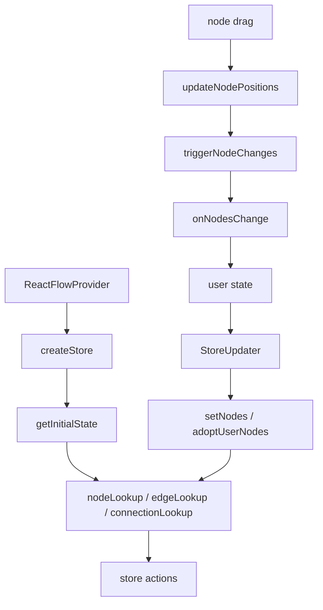

# 第 7 篇：Store：React Flow 的状态中心

## 1. 这一篇要解决的问题

前两篇我们已经看清楚了 React 包的两层结构。

第 5 篇里，`ReactFlow` 是运行时外壳：

```txt
ReactFlow
  -> Wrapper
  -> ReactFlowProvider
  -> StoreUpdater
  -> GraphView
  -> children plugins
```

第 6 篇里，`GraphView` 是画布总装层：

```txt
FlowRenderer
  -> ZoomPane
  -> Pane
  -> Viewport
  -> EdgeRenderer
  -> ConnectionLineWrapper
  -> NodeRenderer
  -> Portal containers
```

现在问题来了：

> 这些层为什么能协作？

节点拖拽发生在 `NodeWrapper` 和 system 的 drag 控制器里；框选发生在 `Pane`；视口变化发生在 `ZoomPane`；节点渲染发生在 `NodeRenderer`；边渲染发生在 `EdgeRenderer`；连接线发生在 `ConnectionLineWrapper`。

如果每一层都自己维护状态，React Flow 很快会变成一堆互相同步的局部状态：

```txt
NodeRenderer 有自己的 nodes
EdgeRenderer 有自己的 edges
ZoomPane 有自己的 viewport
Pane 有自己的 selection
ConnectionLine 有自己的 connection
Controls 有自己的 zoom state
MiniMap 有自己的 node snapshot
```

这样会直接失控。

React Flow 的答案是：

```txt
把图编辑器运行时状态集中到一个 store
让不同渲染层和交互层订阅自己需要的 slice
让交互通过 action 产生 changes
再由 controlled / uncontrolled 模式决定变化如何回流
```

所以这一篇要建立的结论是：

> React Flow 对外是声明式组件，对内更像一个围绕 store 运转的交互式状态机。

这里的“状态机”是类比，不是说源码真的实现了一套有限状态机框架。更准确地说：store 保存当前运行时状态，actions 描述状态如何变化，changes 再把交互结果交还给用户。

这篇不是 Zustand 教程。Zustand 只是容器。

我们真正要读的是：

```txt
Store 里保存了哪些运行时状态？
用户传入的 nodes / edges 如何变成内部 lookup？
拖拽、框选、连接、viewport 如何通过 action 修改状态？
controlled / uncontrolled 为什么要靠 triggerNodeChanges / triggerEdgeChanges 分流？
React hooks 和插件组件如何通过 store 访问同一套运行时？
```

源码入口：

```txt
packages/react/src/store/index.ts
packages/react/src/store/initialState.ts
packages/react/src/types/store.ts
packages/react/src/hooks/useStore.ts
packages/react/src/hooks/useReactFlow.ts
packages/react/src/hooks/useViewportHelper.ts
```

先给这一篇一个局部公式：

```txt
React Flow Store
  = graph data
  + internal lookup maps
  + viewport transform
  + interaction state
  + callbacks
  + runtime controllers
  + actions
```

更具体一点：

```txt
Store
  = nodes / edges
  + nodeLookup / edgeLookup / connectionLookup / parentLookup
  + transform / panZoom / dimensions
  + selection / connection / dragging
  + callbacks / options
  + setNodes / setEdges / updateNodePositions / triggerChanges / panBy / setCenter
```

如果把 React Flow 看成一个图编辑器运行时，store 就是它的心脏。

## 2. 先看用户 API 或运行效果

用户写代码时，经常只看到这些 props：

```tsx
<ReactFlow
  nodes={nodes}
  edges={edges}
  onNodesChange={onNodesChange}
  onEdgesChange={onEdgesChange}
  onConnect={onConnect}
/>
```

从用户角度看，这像是普通的 controlled component。

但用户一拖节点，内部发生的事情大概是：

```txt
用户按住节点并移动鼠标
  ↓
拖拽系统计算新的节点位置
  ↓
store.updateNodePositions 生成 NodeChange
  ↓
store.triggerNodeChanges 处理变化
  ↓
如果是 uncontrolled/defaultNodes，内部 applyNodeChanges 并 setNodes
  ↓
无论是否 uncontrolled，都调用用户 onNodesChange
  ↓
用户在 controlled 模式下把 changes 应用回 nodes
  ↓
StoreUpdater 看到 props.nodes 更新
  ↓
store.setNodes 重新 adoptUserNodes
  ↓
NodeRenderer 订阅到变化并更新画布
```

这条链路说明一件事：

> React Flow 的交互并不是直接改用户的 nodes，而是产生 changes，再通过状态所有权规则回流。

把初始化和拖拽回流画在一起，会更容易看出 store 的位置：



再看 viewport。

用户滚轮缩放时：

```txt
ZoomPane 中的 XYPanZoom 接收 wheel / pinch
  ↓
panZoom 计算新的 viewport
  ↓
onTransformChange 触发
  ↓
非 controlled viewport 下写入 store.transform
  ↓
Viewport 读取 transform
  ↓
CSS transform 更新
```

如果用户使用 controlled viewport：

```tsx
<ReactFlow viewport={viewport} onViewportChange={setViewport} />
```

那么 store 不再单方面拥有视口。`useViewportSync` 会把外部 viewport 同步给 panZoom 和 store.transform。证据见 `packages/react/src/hooks/useViewportSync.ts:19` 到 `packages/react/src/hooks/useViewportSync.ts:24`。

再看 hooks。

用户调用：

```tsx
const reactFlow = useReactFlow();

reactFlow.getNodes();
reactFlow.setCenter(100, 200);
reactFlow.screenToFlowPosition({ x: event.clientX, y: event.clientY });
```

这些能力也不是凭空来的。

`useReactFlow` 内部拿到 `useStoreApi` 和 viewport helpers，再组合出 `ReactFlowInstance`。证据见 `packages/react/src/hooks/useReactFlow.ts:58` 到 `packages/react/src/hooks/useReactFlow.ts:67`。

也就是说，React Flow 的公共实例 API，本质上也是 store 的一个友好外壳。

所以这一篇读 store，不是为了知道“它用了 Zustand”。

而是为了知道：

```txt
React Flow 如何把组件、交互、hooks、插件和用户回调连接到同一个运行时状态中心？
```

## 3. 核心概念解释

先把 store 分成两部分。

第一部分是 state。

它保存当前运行时是什么样：

```txt
nodes / edges
nodeLookup / edgeLookup / connectionLookup / parentLookup
transform
width / height
selection state
connection state
panZoom instance
callbacks
options
```

为了不被字段数量吓到，可以先按七组记：

| 组 | 代表字段 | 解决的问题 |
| --- | --- | --- |
| graph | `nodes` / `edges` | 用户图数据当前是什么 |
| lookup | `nodeLookup` / `edgeLookup` / `connectionLookup` | 高频查询和渲染定位 |
| viewport | `transform` / `panZoom` / `width` / `height` | 画布怎么看、怎么缩放 |
| selection | selected nodes / edges 相关 action | 点击、框选、多选如何统一 |
| connection | `connection` / `cancelConnection` | 正在连线的临时状态 |
| callbacks | `onNodesChange` / `onEdgesChange` / `onConnect` | 交互结果如何回给用户 |
| actions | `setNodes` / `updateNodePositions` / `triggerNodeChanges` | 状态如何被合法修改 |

第二部分是 actions。

它描述运行时可以怎样变化：

```txt
setNodes
setEdges
updateNodeInternals
updateNodePositions
triggerNodeChanges
triggerEdgeChanges
addSelectedNodes
addSelectedEdges
unselectNodesAndEdges
resetSelectedElements
panBy
setCenter
cancelConnection
updateConnection
```

这个区分可以直接从类型里看到。

`ReactFlowStore` 在 `packages/react/src/types/store.ts:54` 开始定义，包含 `nodes`、`edges`、`transform`、lookup maps、selection、connection、callbacks 等状态字段。`ReactFlowActions` 在 `packages/react/src/types/store.ts:162` 开始定义，包含 `setNodes`、`setEdges`、`updateNodePositions`、`triggerNodeChanges`、`panBy`、`setCenter` 等 action。最后 `ReactFlowState` 把二者合并，证据见 `packages/react/src/types/store.ts:185` 到 `packages/react/src/types/store.ts:189`。

这说明 React Flow 的 store 不是普通 data store。

它更接近一台交互式运行时：

```txt
当前状态
  +
可以改变状态的动作
  =
图编辑器运行时
```

再看另一个关键概念：对外数组和内部 lookup。

用户传入的是：

```txt
nodes: Node[]
edges: Edge[]
```

这是对外 API 友好的形式。

但内部高频查询不能只靠数组。

拖拽要按 id 找节点；边渲染要按 source/target 找节点；框选要遍历内部节点 bounds；连接系统要找某个节点的所有连接；parent node 要维护 parent/child 关系。

所以 store 同时维护：

```txt
nodes
nodeLookup
parentLookup

edges
edgeLookup
connectionLookup
```

这些 lookup 在 `initialState` 里初始化。证据见 `packages/react/src/store/initialState.ts:48` 到 `packages/react/src/store/initialState.ts:51`。

这就是 React Flow 内部结构的一个核心原则：

```txt
数组适合对外声明。
Map 适合内部运行时高频查询。
```

第三个关键概念是 transform。

store 里不保存一个完整 viewport 对象，而是保存 `Transform`：

```txt
transform: [x, y, zoom]
```

类型里能看到 `transform: Transform`，证据见 `packages/react/src/types/store.ts:58`。

第 6 篇已经讲过，`Viewport` 会把这个 transform 应用成 CSS：

```txt
translate(x, y) scale(zoom)
```

所以 store.transform 是画布视觉坐标的中心。

第四个关键概念是 interaction state。

比如：

```txt
nodesSelectionActive
userSelectionActive
userSelectionRect
connection
connectionMode
connectionClickStartHandle
paneDragging
multiSelectionActive
```

这些不是用户直接传入的数据，而是交互过程中的运行时状态。它们决定框选、连接、拖拽、快捷键、多选如何协作。

这就是为什么这里会用“状态机”做类比：store 不只是数据缓存，还记录交互处在什么阶段，以及下一步应该通过哪个 action 改变。

## 4. 源码入口在哪里

先读 `initialState.ts`。

入口函数是：

```txt
getInitialState(...)
```

证据见 `packages/react/src/store/initialState.ts:19`。

它做了四件事。

第一，创建 lookup maps：

```ts
const nodeLookup = new Map<string, InternalNode>();
const parentLookup = new Map();
const connectionLookup = new Map();
const edgeLookup = new Map();
```

证据见 `packages/react/src/store/initialState.ts:48` 到 `packages/react/src/store/initialState.ts:51`。

第二，决定初始 nodes / edges 来源：

```txt
defaultEdges ?? edges ?? []
defaultNodes ?? nodes ?? []
```

证据见 `packages/react/src/store/initialState.ts:53` 到 `packages/react/src/store/initialState.ts:54`。

这个顺序很重要。

它说明 uncontrolled 的 `defaultNodes/defaultEdges` 在初始化时会成为 store 内部数据来源。

第三，建立 lookup：

```txt
updateConnectionLookup(connectionLookup, edgeLookup, storeEdges)
adoptUserNodes(storeNodes, nodeLookup, parentLookup, ...)
```

证据见 `packages/react/src/store/initialState.ts:58` 到 `packages/react/src/store/initialState.ts:63`。

这里已经埋下第 8 篇的主题：

```txt
用户传入 Node
  ↓
adoptUserNodes
  ↓
InternalNode + nodeLookup + parentLookup
```

第四，计算初始 transform。

如果 `fitView && width && height`，它会通过 `getInternalNodesBounds` 和 `getViewportForBounds` 计算初始 `[x, y, zoom]`。证据见 `packages/react/src/store/initialState.ts:65` 到 `packages/react/src/store/initialState.ts:81`。

然后返回完整初始 store，证据见 `packages/react/src/store/initialState.ts:83` 到 `packages/react/src/store/initialState.ts:156`。

再读 `store/index.ts`。

它用：

```ts
createWithEqualityFn<ReactFlowState>((set, get) => {
  ...
}, Object.is)
```

创建 Zustand store。证据见 `packages/react/src/store/index.ts:55` 和 `packages/react/src/store/index.ts:452`。

它先展开 `getInitialState(...)`，再补上 actions。证据见 `packages/react/src/store/index.ts:83` 到 `packages/react/src/store/index.ts:99`。

所以源码结构是：

```txt
initialState.ts
  -> 定义运行时初始状态

store/index.ts
  -> 把初始状态和 actions 组合成 Zustand store

types/store.ts
  -> 定义 state 和 actions 的类型边界

hooks/useStore.ts
  -> 让 React 组件按 selector 订阅 store

hooks/useReactFlow.ts
  -> 把 store 包装成用户可用的 ReactFlowInstance
```

这几个文件组合起来，才是“Store”。

## 5. 源码调用链

### 链路一：初始化

从 `ReactFlowProvider` 开始：

```txt
ReactFlowProvider
  ↓
useState(() => createStore(...))
  ↓
createStore
  ↓
getInitialState
  ↓
adoptUserNodes / updateConnectionLookup / getViewportForBounds
  ↓
Provider value={store}
```

第 5 篇里已经看到，`ReactFlowProvider` 用 `useState(() => createStore(...))` 创建稳定 store。证据见 `packages/react/src/components/ReactFlowProvider/index.tsx:104` 到 `packages/react/src/components/ReactFlowProvider/index.tsx:120`。

`createStore` 接收 nodes、edges、defaultNodes、defaultEdges、width、height、fitView、minZoom、maxZoom 等初始参数，证据见 `packages/react/src/store/index.ts:26` 到 `packages/react/src/store/index.ts:54`。

然后 `getInitialState` 把这些参数变成内部状态。

这条链路回答：

```txt
React Flow 第一次 mount 时，运行时状态怎么建立？
```

### 链路二：props.nodes 更新

上一篇讲过，`StoreUpdater` 会监听 props 变化。nodes 变化时，它调用 `setNodes`。证据见 `packages/react/src/components/StoreUpdater/index.tsx:149`。

store 里的 `setNodes` 做的不是简单赋值。

它会：

```txt
读取 nodeLookup / parentLookup / nodeOrigin / nodeExtent 等内部上下文
  ↓
调用 adoptUserNodes
  ↓
更新 nodesInitialized 和 selection active 状态
  ↓
必要时 resolve fitView
  ↓
set({ nodes, nodesInitialized, ... })
```

证据见 `packages/react/src/store/index.ts:99` 到 `packages/react/src/store/index.ts:140`。

这条链路回答：

```txt
为什么用户传入的 nodes 不能直接原样当成内部数据？
```

因为内部需要：

```txt
positionAbsolute
measured
handleBounds
parent/child lookup
z-index
selection active 判断
fitView 初始化条件
```

这些会在第 8 篇细讲。

### 链路三：props.edges 更新

edges 变化时，`StoreUpdater` 调用 `setEdges`。证据见 `packages/react/src/components/StoreUpdater/index.tsx:150`。

store 的 `setEdges` 会先更新 connection lookup：

```txt
updateConnectionLookup(connectionLookup, edgeLookup, edges)
set({ edges })
```

证据见 `packages/react/src/store/index.ts:142` 到 `packages/react/src/store/index.ts:148`。

这说明 edges 也不是普通数组。

对外是：

```txt
edges: Edge[]
```

对内还要维护：

```txt
edgeLookup
connectionLookup
```

否则连接查询、框选联动、删除节点时找关联边、重连边都会很麻烦。

### 链路四：节点拖拽

节点拖拽最终会走 `updateNodePositions`。

这条 action 会：

```txt
遍历 nodeDragItems
  ↓
为每个节点生成 position change
  ↓
如果正在从这个节点连接，更新 connection.from
  ↓
处理 expandParent
  ↓
执行 onNodesChange middleware
  ↓
triggerNodeChanges(changes)
```

证据见 `packages/react/src/store/index.ts:210` 到 `packages/react/src/store/index.ts:263`。

这里有一个小细节很关键。

如果拖拽的节点正好是正在连接的 source node，store 会重新计算 handle position 并 `updateConnection`。证据见 `packages/react/src/store/index.ts:232` 到 `packages/react/src/store/index.ts:235`。

这说明 store 是交互协作中心：

```txt
节点拖拽
  会影响节点位置
  也可能影响正在连接的临时线
```

如果 drag state 和 connection state 分散在不同组件里，这种协作会很难维护。

### 链路五：changes 回流

`triggerNodeChanges` 是理解 controlled / uncontrolled 的关键。

它的逻辑是：

```txt
如果 changes 非空
  ↓
如果 hasDefaultNodes
    applyNodeChanges(changes, nodes)
    setNodes(updatedNodes)
  ↓
debug log
  ↓
onNodesChange?.(changes)
```

证据见 `packages/react/src/store/index.ts:264` 到 `packages/react/src/store/index.ts:279`。

`triggerEdgeChanges` 同理，证据见 `packages/react/src/store/index.ts:280` 到 `packages/react/src/store/index.ts:295`。

这条链路解释了 React Flow controlled/uncontrolled 的核心策略：

```txt
交互产生 changes
  ↓
uncontrolled/default 模式：
    store 内部 apply changes

controlled 模式：
    用户通过 onNodesChange/onEdgesChange 自己 apply

两种模式：
    都会通知用户 callbacks
```

所以 React Flow 不会简单地说：

```txt
拖拽时直接改外部 nodes
```

它说的是：

```txt
拖拽时产生 NodeChange
状态所有权决定这个 change 由谁应用
```

这会在第 14 篇再专门展开。

### 链路六：选择系统

选择相关 action 包括：

```txt
addSelectedNodes
addSelectedEdges
unselectNodesAndEdges
resetSelectedElements
```

`addSelectedNodes` 会根据 `multiSelectionActive` 决定是追加选择，还是用 `getSelectionChanges` 重算 node/edge selection。证据见 `packages/react/src/store/index.ts:296` 到 `packages/react/src/store/index.ts:307`。

`addSelectedEdges` 同理，证据见 `packages/react/src/store/index.ts:308` 到 `packages/react/src/store/index.ts:319`。

`unselectNodesAndEdges` 会生成 selection changes，并且在取消 node 选择前先更新 internal node 的 selected 状态。证据见 `packages/react/src/store/index.ts:320` 到 `packages/react/src/store/index.ts:357`。

`resetSelectedElements` 会遍历当前 nodes / edges，把 selected 的元素转成 selection changes。证据见 `packages/react/src/store/index.ts:375` 到 `packages/react/src/store/index.ts:393`。

选择不是 UI 小状态。

它会影响：

```txt
节点样式
边样式
多选拖拽
删除
z-index
selection change callback
```

所以选择必须进入 store。

### 链路七：viewport 和 panZoom

store 里保存：

```txt
transform
panZoom
minZoom
maxZoom
translateExtent
width
height
```

`setMinZoom` 和 `setMaxZoom` 会同步更新 panZoom 的 scale extent。证据见 `packages/react/src/store/index.ts:358` 到 `packages/react/src/store/index.ts:369`。

`setTranslateExtent` 会更新 panZoom 的 translate extent。证据见 `packages/react/src/store/index.ts:370` 到 `packages/react/src/store/index.ts:374`。

`panBy` 会调用 system 层 `panBySystem`，证据见 `packages/react/src/store/index.ts:416` 到 `packages/react/src/store/index.ts:420`。

`setCenter` 会根据画布宽高和 zoom 算出 viewport，然后调用 panZoom.setViewport。证据见 `packages/react/src/store/index.ts:421` 到 `packages/react/src/store/index.ts:440`。

这说明 viewport 不是只在 `ZoomPane` 里。

`ZoomPane` 接用户事件，system 的 `XYPanZoom` 处理底层控制，store 保存当前 transform 和 panZoom 实例，hooks 再把这些能力包装成用户 API。

### 链路八：连接状态

store 里有：

```txt
connection
connectionMode
connectionClickStartHandle
connectOnClick
connectionRadius
isValidConnection
```

初始 connection 来自 `initialConnection`，证据见 `packages/react/src/store/initialState.ts:134`。

store 也提供：

```txt
cancelConnection
updateConnection
```

证据见 `packages/react/src/store/index.ts:441` 到 `packages/react/src/store/index.ts:448`。

第 6 篇里我们看到 `ConnectionLineWrapper` 会读 connection state 来决定是否渲染临时线。

第 12 篇读 `XYHandle` 时会看到，handle pointer down / move / up 会通过 store action 更新这份 connection state。

现在先记住：

```txt
连接过程不是 EdgeRenderer 的状态。
连接过程是 store 里的独立 interaction state。
```

## 6. 关键数据结构

把 store 字段按职责分组，会比按源码顺序更清楚。

### 图数据

```txt
nodes
edges
```

这是对外 API 的核心数据。

但内部并不只靠它们。

### Lookup maps

```txt
nodeLookup
parentLookup
edgeLookup
connectionLookup
```

这些是运行时高频查询的核心。

用途大概是：

```txt
nodeLookup:
  按 id 快速找 InternalNode。

parentLookup:
  维护 parent node 和 child node 关系。

edgeLookup:
  按 id 快速找 Edge。

connectionLookup:
  按节点和 handle 查相关连接。
```

没有这些 lookup，很多能力都会退化成反复遍历数组。

### Viewport state

```txt
width
height
transform
panZoom
minZoom
maxZoom
translateExtent
```

这组状态支撑：

```txt
Viewport CSS transform
fitView
pan / zoom
screenToFlowPosition
flowToScreenPosition
setCenter
```

`useViewportHelper` 里的 `screenToFlowPosition` 就从 store 读取 `transform`、`snapGrid`、`snapToGrid`、`domNode`，证据见 `packages/react/src/hooks/useViewportHelper.ts:84` 到 `packages/react/src/hooks/useViewportHelper.ts:103`。

### Selection state

```txt
nodesSelectionActive
userSelectionActive
userSelectionRect
multiSelectionActive
elementsSelectable
```

这组状态支撑：

```txt
点击选择
框选
多选
删除
拖拽选区
selection change callback
```

第 15 篇会专门讲。

### Connection state

```txt
connection
connectionMode
connectionClickStartHandle
connectOnClick
connectionRadius
isValidConnection
```

这组状态支撑：

```txt
Handle 连接
ConnectionLine
isValidConnection
Strict / Loose connection mode
auto pan on connect
```

第 12 篇会专门讲。

### Behavior options

```txt
nodesDraggable
nodesConnectable
nodesFocusable
edgesFocusable
edgesReconnectable
snapToGrid
snapGrid
nodeExtent
nodeOrigin
autoPanOnConnect
autoPanOnNodeDrag
autoPanSpeed
```

这些是用户 props 进入 store 后的运行时配置。

### Callbacks

```txt
onNodesChange
onEdgesChange
onNodeDrag
onMove
onConnect
onNodesDelete
onEdgesDelete
onDelete
onBeforeDelete
onError
```

这些 callback 让内部交互能通知外部用户。

### Middleware maps

```txt
onNodesChangeMiddlewareMap
onEdgesChangeMiddlewareMap
```

它们在 initial state 里是空 Map，证据见 `packages/react/src/store/initialState.ts:154` 到 `packages/react/src/store/initialState.ts:155`。

`updateNodePositions` 会遍历 `onNodesChangeMiddlewareMap` 来处理 changes，证据见 `packages/react/src/store/index.ts:258` 到 `packages/react/src/store/index.ts:260`。

这个细节说明 React Flow 给变化流留了中间层，不是所有 change 都直接发给用户。

## 7. 关键实现思路

### 第一层：Store 不是数据仓库，而是交互式运行时中心

React Flow 的 store 同时有 state 和 actions。

这让它更像一台交互式状态机：

```txt
当前 nodes / edges / transform / selection / connection
  ↓
用户交互或 props 更新
  ↓
action 计算 changes 或更新 controller
  ↓
store 更新
  ↓
组件订阅对应 slice 重新渲染
  ↓
用户 callback 收到事件
```

这个模型比“把数据放进 Zustand”更准确。

### 第二层：用户数据进入 store 时会被增强

`setNodes` 调用 `adoptUserNodes`。

这就是从用户数据到内部运行时数据的入口。

这一步会产生：

```txt
InternalNode
nodeLookup
parentLookup
nodesInitialized
```

为什么要这样做？

因为用户的 `Node` 适合声明：

```txt
id
position
data
type
```

内部的 `InternalNode` 适合运行：

```txt
absolute position
measured dimensions
handle bounds
z-index
userNode reference
```

第 8 篇会专门把这件事展开。

### 第三层：changes 是交互和用户状态之间的协议

React Flow 不把拖拽、选择、删除直接变成“最终 nodes 数组”塞给用户。

它用 changes：

```txt
NodeChange[]
EdgeChange[]
```

这样做的好处是：

```txt
内部可以统一表达 position / select / remove / dimensions 等变化。
controlled 用户可以自己决定怎么应用。
uncontrolled 模式可以内部 apply。
middleware 可以改写 changes。
debug 可以打印 changes。
```

这就是 `triggerNodeChanges` 和 `triggerEdgeChanges` 的价值。

### 第四层：Store 是跨层协作点

前几篇看到的组件都在读写 store。

```txt
StoreUpdater:
  把用户 props 写进 store。

GraphView:
  使用 onInit 和 viewport sync。

ZoomPane:
  写 panZoom、transform、domNode。

Viewport:
  读 transform。

Pane:
  读 selection state，写 selection changes。

NodeRenderer:
  读 nodesDraggable / nodesConnectable / visible node ids。

EdgeRenderer:
  读 edgesFocusable / edgesReconnectable / visible edge ids。

ConnectionLineWrapper:
  读 connection state。

Controls / Background / MiniMap:
  通过 provider 读同一个 store。
```

这就是为什么 store 是“心脏”。

它不只是某一个组件的内部状态，而是所有运行时模块的协作中心。

### 第五层：Store 对外暴露两种访问方式

第一种是底层访问：

```tsx
const nodes = useStore((state) => state.nodes);
const store = useStoreApi();
```

`useStore` 要求组件处在 `StoreContext` 下，否则抛错。证据见 `packages/react/src/hooks/useStore.ts:34` 到 `packages/react/src/hooks/useStore.ts:45`。

`useStoreApi` 返回 `getState`、`setState`、`subscribe`，证据见 `packages/react/src/hooks/useStore.ts:60` 到 `packages/react/src/hooks/useStore.ts:76`。

第二种是高层访问：

```tsx
const reactFlow = useReactFlow();
```

`useReactFlow` 把 store 包装成 `getNodes`、`getEdges`、`setNodes`、`setEdges`、`deleteElements`、`getNodesBounds` 等实例方法。证据见 `packages/react/src/hooks/useReactFlow.ts:131` 到 `packages/react/src/hooks/useReactFlow.ts:280`。

这两种访问方式的定位不同：

```txt
useStore:
  给高级用户和内部组件按 selector 订阅 store slice。

useReactFlow:
  给普通用户一个更稳定、更语义化的实例 API。
```

## 8. 这部分源码的设计取舍

这种集中 store 设计的收益很大。

第一，跨层协作变简单。

节点拖拽能更新 connection line；pane 框选能影响 node 和 edge selection；controls 能改 viewport；minimap 能读节点和 transform。这些都因为它们共享同一个 store。

第二，性能可控。

组件可以用 selector 只订阅自己需要的 slice。`useStore` 文档注释里也建议用 selector 和 equality function 避免不必要重渲染，证据见 `packages/react/src/hooks/useStore.ts:11` 到 `packages/react/src/hooks/useStore.ts:23`。

第三，受控和非受控可以共用同一套交互逻辑。

无论用户用 `nodes` 还是 `defaultNodes`，拖拽产生的都是 changes。区别只在于 `triggerNodeChanges` 是否内部 apply。

第四，system 层能力可以被 React store 接住。

比如：

```txt
adoptUserNodes
updateConnectionLookup
fitViewport
panBySystem
updateNodeInternalsSystem
```

这些来自 `@xyflow/system`，但 React store 负责把它们接到 React 运行时里。

代价也明显。

第一，store 很大。

它同时保存 graph data、viewport、interaction state、callbacks、controllers、actions。初学者打开 `types/store.ts` 会被字段数量吓到。

但这不是随意膨胀，而是图编辑器运行时本身复杂。

第二，store action 会变成跨领域逻辑的交汇点。

比如 `updateNodePositions` 不只处理位置，还要处理 parent expand、connection update、middleware、trigger changes。

这让 action 变复杂，但也让行为链路集中可追踪。

第三，内部 lookup 和外部数组必须保持一致。

这是所有图编辑器库都绕不开的问题。

```txt
nodes array 适合用户
nodeLookup 适合内部
```

两者一旦不同步，渲染、拖拽、连接、选择都会出问题。

React Flow 通过 `setNodes`、`setEdges`、`adoptUserNodes`、`updateConnectionLookup` 来维护这条边界。

第四，callback 存在 store 里会让“状态”和“事件出口”混在同一容器里。

这是运行时库常见的取舍。好处是任何内部 action 都能拿到最新 callback；代价是 store 不再是纯数据。

但对 React Flow 这种交互密集型库来说，这是合理的。因为事件出口本身就是运行时的一部分。

## 9. 如果我们自己实现，最小版本应该怎么写

mini-flow 第一版可以借鉴 store 的结构，但不要一开始做得这么大。

最小 store 可以只有：

```ts
type Viewport = {
  x: number;
  y: number;
  zoom: number;
};

type MiniFlowState = {
  nodes: Node[];
  edges: Edge[];
  nodeLookup: Map<string, InternalNode>;
  edgeLookup: Map<string, Edge>;
  viewport: Viewport;
  selectedNodeIds: Set<string>;
  connection: ConnectionState | null;

  setNodes: (nodes: Node[]) => void;
  setEdges: (edges: Edge[]) => void;
  updateNodePositions: (changes: NodePositionChange[]) => void;
  triggerNodeChanges: (changes: NodeChange[]) => void;
  triggerEdgeChanges: (changes: EdgeChange[]) => void;
  setViewport: (viewport: Viewport) => void;
};
```

初始化时先建立 lookup：

```ts
function createNodeLookup(nodes: Node[]) {
  const lookup = new Map<string, InternalNode>();

  for (const node of nodes) {
    lookup.set(node.id, {
      ...node,
      internals: {
        positionAbsolute: node.position,
        userNode: node,
      },
    });
  }

  return lookup;
}
```

`setNodes` 不要只赋值：

```ts
function setNodes(nodes: Node[]) {
  set({
    nodes,
    nodeLookup: createNodeLookup(nodes),
  });
}
```

changes 回流可以先写简化版：

```ts
function triggerNodeChanges(changes: NodeChange[]) {
  const { onNodesChange, nodes, uncontrolled } = get();

  if (uncontrolled) {
    setNodes(applyNodeChanges(changes, nodes));
  }

  onNodesChange?.(changes);
}
```

第一版不要急着做：

```txt
parentLookup
connectionLookup
fitViewResolver
middleware maps
panZoom instance
full selection model
delete lifecycle
aria live message
```

但要保留三条边界：

```txt
外部 nodes/edges 数组
  ≠
内部 lookup maps

交互产生 changes
  ≠
直接修改用户数据

viewport 视觉状态
  ≠
每个节点自己的 position
```

只要这三条边界保住，mini-flow 后面加 drag、connect、selection 时就不会乱。

## 10. 本篇总结

这一篇我们读了 React Flow 的 store。

最重要的不是“它用了 Zustand”，而是：

> React Flow 用 store 把 graph data、viewport、selection、connection、callbacks、controllers 和 actions 组织成一个交互式运行时中心。

承重链路是：

```txt
ReactFlowProvider
  ↓
createStore
  ↓
getInitialState
  ↓
nodes / edges / lookup maps / transform / selection / connection
  ↓
StoreUpdater 把 props 同步进 store
  ↓
GraphView / ZoomPane / Pane / Renderers / Hooks 读写 store
  ↓
actions 产生 changes
  ↓
controlled / uncontrolled 决定 changes 如何回流
```

这篇之后，你应该能理解为什么前面的层能协作：

```txt
ReactFlow 是外壳
GraphView 是画布分层
Store 是它们共同读写的运行时中心
```

下一篇我们继续往 store 里面钻一层。

## 11. 下一篇读什么

下一篇读：

```txt
packages/system/src/types/nodes.ts
packages/system/src/types/edges.ts
packages/system/src/utils/store.ts
packages/system/src/utils/graph.ts
```

主题是：

> `InternalNode`：为什么用户节点需要被增强？

这一篇已经看到 `setNodes` 和 `initialState` 都会调用 `adoptUserNodes`。

下一篇就专门回答：

```txt
用户传入的 Node 为什么不够？
InternalNode 多了哪些字段？
nodeLookup / parentLookup 如何支撑拖拽、连接、边渲染、框选和性能？
```
