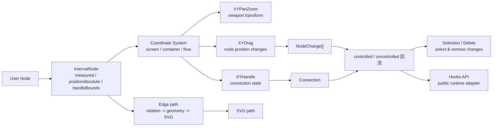
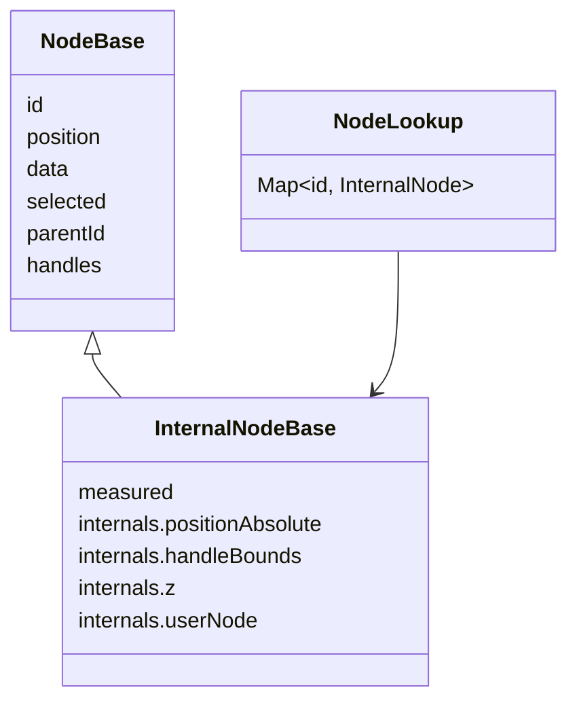

# 第 8 篇：InternalNode：为什么用户节点需要被增强？

## 1. 这一篇要解决的问题

上一篇我们读了 Store。

里面有一条非常关键的链路：

```txt
StoreUpdater 接收到 props.nodes
  ↓
store.setNodes(nodes)
  ↓
adoptUserNodes(nodes, nodeLookup, parentLookup, ...)
  ↓
用户 Node 被转换成 InternalNode
  ↓
NodeRenderer / EdgeRenderer / XYDrag / XYHandle / selection / fitView 共同使用
```

这一篇专门拆这条链。

从这一篇开始，系列进入 08-16 的“核心交互闭环”。先看总图：



这组文章的主线是：先把用户数据增强成运行时可用结构，再把 pointer / wheel / keyboard 这类用户动作变成结构化 changes，最后通过 API 和 hooks 回到用户代码。

很多人第一次看 React Flow，会以为用户传入的 `Node` 就是内部渲染和交互用的节点。

这个理解非常自然。

毕竟用户写的是：

```tsx
const nodes = [
  {
    id: 'a',
    position: { x: 100, y: 100 },
    data: { label: 'A' },
  },
];

<ReactFlow nodes={nodes} edges={edges} />
```

看起来 `ReactFlow` 只要把这个 node 渲染到 `{ x: 100, y: 100 }` 就好了。

但源码不是这么做的。

React Flow 会把用户节点转换成内部节点：

```txt
NodeBase
  ↓
InternalNodeBase
```

为什么？

因为用户节点适合“声明图”，但不够支撑“运行图编辑器”。

用户 `Node` 主要回答：

```txt
这个节点是谁？
它在图里的逻辑位置是什么？
它带什么业务数据？
它是什么类型？
它是否被选中？
```

但运行时还需要回答：

```txt
这个节点的绝对坐标是多少？
它的真实 DOM 尺寸是多少？
它的 handle 连接点在哪？
它是不是 parent node 的 child？
它的 z-index 应该是多少？
拖拽时鼠标到节点左上角的距离是多少？
边的端点应该落在节点哪个 handle 上？
框选时这个节点是否落在选区里？
```

这些问题不能只靠用户传入的 `Node` 解决。

所以这一篇要建立的结论是：

> React Flow 的 Node 是用户声明语言，InternalNode 是运行时工作语言。

局部公式：

```txt
InternalNode
  = User Node
  + measured dimensions
  + absolute position
  + handle bounds
  + z-index
  + parent relationship indexes
  + original userNode reference
```

结构上可以这样看：



但要先压住一个边界：`InternalNode` 是运行时工作语言，不是所有交互状态的垃圾桶。连接中的 `connection`、框选中的 `userSelectionRect`、panzoom 实例、callbacks 等仍然放在 store 的其他字段里。`InternalNode` 只补“节点要被渲染、测量、拖拽、连线和计算边端点所必须的信息”。

承重链路：

```txt
用户传入 Node[]
  ↓
Store.setNodes / getInitialState
  ↓
adoptUserNodes
  ↓
nodeLookup / parentLookup
  ↓
InternalNode
  ↓
NodeWrapper 用 positionAbsolute 渲染节点
  ↓
EdgeWrapper 用 handleBounds / positionAbsolute 计算边端点
  ↓
XYDrag 用 measured / positionAbsolute 构造 dragItems
  ↓
XYHandle 用 handleBounds 查找连接目标
  ↓
graph utils 用 measured / positionAbsolute 做 bounds / selection / fitView
```

源码入口：

```txt
packages/system/src/types/nodes.ts
packages/system/src/utils/store.ts
packages/system/src/utils/graph.ts
packages/system/src/utils/edges/positions.ts
packages/system/src/xydrag/utils.ts
packages/system/src/xyhandle/utils.ts
packages/react/src/components/NodeWrapper/index.tsx
packages/react/src/components/EdgeWrapper/index.tsx
```

谁会消费 `InternalNode`？先记这张表：

| 消费者 | 需要 InternalNode 的原因 |
| --- | --- |
| `NodeWrapper` | 用 `positionAbsolute` 和 `z` 渲染节点 |
| `EdgeWrapper` | 用 `positionAbsolute + handleBounds` 计算边端点 |
| `XYDrag` | 用 `measured`、`positionAbsolute`、extent 构造 dragItems |
| `XYHandle` | 用 `handleBounds` 查找连接目标 |
| graph utils | 用 bounds 做框选、fitView、selection |

## 2. 先看用户 API 或运行效果

先看用户眼里的 node。

```tsx
const nodes = [
  {
    id: 'task-1',
    type: 'task',
    position: { x: 240, y: 120 },
    data: {
      title: 'Parse input',
    },
  },
];
```

这个对象非常适合业务代码。

它简洁、稳定、容易序列化，也容易存进数据库。

但用户拖动这个节点时，React Flow 需要更多信息：

```txt
鼠标按下时，鼠标距离节点左上角多少？
当前 zoom 是多少？
拖动后的绝对坐标是多少？
如果节点在 parent 里，它的相对位置是多少？
如果开启 snap grid，位置要吸附到哪里？
如果设置 nodeExtent，位置要 clamp 到哪里？
如果节点尺寸还没测出来，拖拽和边渲染能不能开始？
```

用户创建边时，也需要更多信息：

```txt
source handle 在节点内部的 x / y 是多少？
target handle 在节点内部的 x / y 是多少？
handle 加上节点绝对坐标后，边端点在哪里？
Strict 模式下 target 必须找 target handle，Loose 模式下能不能连 source handle？
```

用户框选时，又需要更多信息：

```txt
节点的矩形范围是多少？
节点是否 hidden？
节点是否 selectable？
选区矩形从 screen 坐标转成 flow 坐标后，和节点是否重叠？
```

这些都不是业务数据。

它们是运行时数据。

所以 React Flow 内部不会只拿 `nodes` 数组到处传。

它会维护：

```txt
nodes: Node[]
nodeLookup: Map<string, InternalNode>
parentLookup: Map<string, Map<string, InternalNode>>
```

`nodes` 继续作为对外数据源。

`nodeLookup` 和 `parentLookup` 则服务内部运行时。

这就是第 7 篇里说的：

```txt
数组适合对外 API
Map 适合内部高频查询
```

## 3. 核心概念解释

先看用户节点类型。

`NodeBase` 定义在 `packages/system/src/types/nodes.ts:11`。

它包含：

```txt
id
position
data
sourcePosition / targetPosition
hidden
selected / dragging
draggable / selectable / connectable / deletable
dragHandle
width / height / initialWidth / initialHeight
parentId
zIndex
extent
expandParent
origin
handles
measured
type
```

证据见 `packages/system/src/types/nodes.ts:15` 到 `packages/system/src/types/nodes.ts:88`。

注意，`NodeBase` 里已经有不少运行相关字段，比如 `selected`、`dragging`、`width`、`height`、`parentId`、`handles`。

这说明用户节点不是纯业务对象。

但它仍然不够。

`InternalNodeBase` 定义在 `packages/system/src/types/nodes.ts:90`。

它在用户 node 基础上增加了更严格的内部结构：

```txt
measured:
  width
  height

internals:
  positionAbsolute
  z
  rootParentIndex
  userNode
  handleBounds
  bounds
```

证据见 `packages/system/src/types/nodes.ts:90` 到 `packages/system/src/types/nodes.ts:107`。

几个字段非常关键。

`measured` 是节点真实尺寸。

用户可以给 `width`、`height`、`initialWidth`、`initialHeight`，但 React Flow 还会通过 DOM 测量得到真实尺寸。很多能力必须等尺寸存在才能稳定工作，比如：

```txt
fitView
edge position
selection bounds
drag extent
parent expand
node resize
```

`internals.positionAbsolute` 是节点在 flow 坐标系里的绝对位置。

用户的 `position` 不一定等于绝对位置。原因包括：

```txt
nodeOrigin 可能不是 [0, 0]
节点可能有 parentId
节点可能被 extent 限制
parent node 本身也有 positionAbsolute
```

`internals.handleBounds` 是 handle 的测量结果。

边路径和连接系统不只需要节点坐标，还需要 handle 坐标。没有它，就不知道边应该从节点哪个点出发。

`internals.userNode` 是原始用户节点引用。

注释里写得很清楚：它保存用户提供的原始 node 引用，用于优化某些操作。证据见 `packages/system/src/types/nodes.ts:99` 到 `packages/system/src/types/nodes.ts:103`。

这个字段还让内部事件回调可以把“用户语义的 node”传回去。

比如 `NodeWrapper` 调用用户的 `onNodeMouseEnter` 时，传的是 `{ ...internals.userNode }`。证据见 `packages/react/src/components/NodeWrapper/index.tsx:92` 到 `packages/react/src/components/NodeWrapper/index.tsx:106`。

这说明 React Flow 内部可以用 InternalNode 工作，但对外回调仍然尽量返回用户熟悉的 Node。

## 4. 源码入口在哪里

这一篇先读四组文件。

第一组：类型定义。

```txt
packages/system/src/types/nodes.ts
```

重点看：

```txt
NodeBase:
  lines 11-88

InternalNodeBase:
  lines 90-107

NodeProps:
  lines 114-125

NodeDragItem:
  lines 143-155

NodeLookup / ParentLookup:
  lines 177-178
```

`NodeProps` 也值得看。它是 custom node 组件实际收到的 props。里面有 `positionAbsoluteX`、`positionAbsoluteY`，证据见 `packages/system/src/types/nodes.ts:121` 到 `packages/system/src/types/nodes.ts:124`。

这说明即使给用户自定义节点，React Flow 也会把内部绝对坐标的一部分作为公开 props 暴露出去。

第二组：转换函数。

```txt
packages/system/src/utils/store.ts
```

重点看：

```txt
adoptUserNodes:
  lines 129-192

updateAbsolutePositions:
  lines 61-77

updateChildNode:
  lines 214-266

updateNodeInternals:
  lines 401-505
```

这里是用户节点变成内部节点、内部节点被 DOM 测量更新、parent/child 绝对坐标更新的核心。

第三组：消费 InternalNode 的图工具。

```txt
packages/system/src/utils/graph.ts
packages/system/src/utils/edges/positions.ts
```

重点看：

```txt
getInternalNodesBounds:
  graph.ts lines 240-255

getNodesInside:
  graph.ts lines 257-296

calculateNodePosition:
  graph.ts lines 393-451

getEdgePosition / getHandlePosition:
  positions.ts lines 27-72, 99-125
```

第四组：React 渲染消费点。

```txt
packages/react/src/components/NodeWrapper/index.tsx
packages/react/src/components/EdgeWrapper/index.tsx
```

`NodeWrapper` 从 `nodeLookup` 取 `InternalNode`，证据见 `packages/react/src/components/NodeWrapper/index.tsx:44` 到 `packages/react/src/components/NodeWrapper/index.tsx:53`。

它用 `internals.positionAbsolute` 和 `internals.z` 渲染 DOM style，证据见 `packages/react/src/components/NodeWrapper/index.tsx:203` 到 `packages/react/src/components/NodeWrapper/index.tsx:210`。

`EdgeWrapper` 从 `nodeLookup` 取 source/target internal nodes，再调用 `getEdgePosition` 计算边端点，证据见 `packages/react/src/components/EdgeWrapper/index.tsx:63` 到 `packages/react/src/components/EdgeWrapper/index.tsx:84`。

这四组文件连起来，就是本篇的主线。

## 5. 源码调用链

### 链路一：初始化时 adopt user nodes

第 7 篇已经看到，`initialState` 会创建 lookup maps：

```txt
nodeLookup
parentLookup
connectionLookup
edgeLookup
```

证据见 `packages/react/src/store/initialState.ts:48` 到 `packages/react/src/store/initialState.ts:51`。

然后它调用：

```txt
adoptUserNodes(storeNodes, nodeLookup, parentLookup, ...)
```

证据见 `packages/react/src/store/initialState.ts:58` 到 `packages/react/src/store/initialState.ts:63`。

`setNodes` 也会调用同一个函数。证据见 `packages/react/src/store/index.ts:119` 到 `packages/react/src/store/index.ts:125`。

所以只要用户节点进入 React Flow，就会走这条转换链。

### 链路二：adoptUserNodes 如何构造 InternalNode

`adoptUserNodes` 会先复制旧 lookup：

```txt
const tmpLookup = new Map(nodeLookup)
```

然后清空 `nodeLookup` 和 `parentLookup`。证据见 `packages/system/src/utils/store.ts:137` 到 `packages/system/src/utils/store.ts:144`。

接着遍历用户 nodes。

如果 `checkEquality` 开启，并且当前 `userNode` 和旧 internal node 的 `internals.userNode` 是同一个引用，它会复用旧 internal node。证据见 `packages/system/src/utils/store.ts:146` 到 `packages/system/src/utils/store.ts:151`。

这就是 `internals.userNode` 的一个优化用途：

```txt
用户 node 引用没变
  ↓
复用之前的 InternalNode
  ↓
避免不必要的重新计算
```

如果不能复用，就创建新的 internal node：

```txt
positionWithOrigin = getNodePositionWithOrigin(...)
extent = userNode.extent 或全局 nodeExtent
clampedPosition = clampPosition(...)

internalNode = {
  ...defaults,
  ...userNode,
  measured,
  internals: {
    positionAbsolute: clampedPosition,
    handleBounds: parseHandles(...),
    z: calculateZ(...),
    userNode,
  }
}
```

证据见 `packages/system/src/utils/store.ts:152` 到 `packages/system/src/utils/store.ts:172`。

这段代码就是“用户节点增强”的核心。

它不是简单地加一个 `internals` 字段。

它同时做了：

```txt
origin 处理
extent clamp
measured 初始化
handleBounds 初始化或复用
z-index 计算
用户 node 引用保存
lookup 写入
```

### 链路三：parent node 和 absolute position

如果 user node 有 `parentId`，`adoptUserNodes` 会调用 `updateChildNode`。证据见 `packages/system/src/utils/store.ts:184` 到 `packages/system/src/utils/store.ts:186`。

`updateChildNode` 做三件事。

第一，把 child 记录进 `parentLookup`。证据见 `packages/system/src/utils/store.ts:194` 到 `packages/system/src/utils/store.ts:208`，以及 `packages/system/src/utils/store.ts:232`。

第二，计算 child 的绝对坐标和 z-index。证据见 `packages/system/src/utils/store.ts:250` 到 `packages/system/src/utils/store.ts:264`。

第三，内部调用 `calculateChildXYZ`，把 parent 的 `positionAbsolute`、child 的 origin、extent、parent extent、z-index 一起考虑进去。证据见 `packages/system/src/utils/store.ts:278` 到 `packages/system/src/utils/store.ts:311`。

这解释了为什么 `positionAbsolute` 必须存在。

用户的 `position` 是相对语义。

对于 root node，它通常接近绝对位置。

对于 child node，它是相对于 parent 的位置。

运行时渲染、边路径、框选、拖拽都需要统一坐标，所以要维护：

```txt
node.position
  -> 用户语义位置，可能相对 parent

node.internals.positionAbsolute
  -> flow 坐标系中的真实绝对位置
```

### 链路四：DOM 测量更新 measured 和 handleBounds

`adoptUserNodes` 只能基于用户数据初始化 internal node。

但节点真实 DOM 尺寸和 handle 位置，必须等节点渲染到 DOM 后才能测。

这个任务由 `updateNodeInternals` 完成。

它先找到 viewport DOM，然后读取 zoom。证据见 `packages/system/src/utils/store.ts:401` 到 `packages/system/src/utils/store.ts:419`。

对每个 update，它会：

```txt
从 nodeLookup 找 node
  ↓
如果 node hidden，清掉 handleBounds
  ↓
测量 DOM dimensions
  ↓
判断 dimensions 是否变化，或 handleBounds 是否缺失，或 force update
  ↓
读取 node bounds
  ↓
重新 clamp positionAbsolute
  ↓
写入 measured
  ↓
写入 handleBounds.source / target
  ↓
必要时 updateChildNode
  ↓
产生 dimensions changes
```

证据见 `packages/system/src/utils/store.ts:423` 到 `packages/system/src/utils/store.ts:504`。

这条链路解释了两个现象。

第一，节点初次渲染前，某些边可能不能渲染。

因为 `getEdgePosition` 会检查节点是否 initialized：

```txt
必须有 handleBounds 或 handles
必须有 measured.width 或 width 或 initialWidth
```

证据见 `packages/system/src/utils/edges/positions.ts:19` 到 `packages/system/src/utils/edges/positions.ts:25`。

第二，handleBounds 不是用户手写坐标就一定有。

如果用户没有提供 `handles`，React Flow 需要从 DOM 中测量 handle bounds。`updateNodeInternals` 调用 `getHandleBounds('source', ...)` 和 `getHandleBounds('target', ...)`，证据见 `packages/system/src/utils/store.ts:466` 到 `packages/system/src/utils/store.ts:469`。

### 链路五：NodeWrapper 用 InternalNode 渲染节点

`NodeRenderer` 只 map node ids。

真正单节点渲染在 `NodeWrapper`。

`NodeWrapper` 从 store 取：

```txt
node = s.nodeLookup.get(id)
internals = node.internals
isParent = s.parentLookup.has(id)
```

证据见 `packages/react/src/components/NodeWrapper/index.tsx:44` 到 `packages/react/src/components/NodeWrapper/index.tsx:53`。

然后它用 `internals.z` 和 `internals.positionAbsolute` 生成 DOM style：

```tsx
style={{
  zIndex: internals.z,
  transform: `translate(${internals.positionAbsolute.x}px,${internals.positionAbsolute.y}px)`,
  ...
}}
```

证据见 `packages/react/src/components/NodeWrapper/index.tsx:203` 到 `packages/react/src/components/NodeWrapper/index.tsx:210`。

这很关键。

节点不是用用户的 `position` 直接渲染。

它用的是内部绝对坐标：

```txt
render position = internals.positionAbsolute
```

同时，自定义 node component 会收到 `positionAbsoluteX` 和 `positionAbsoluteY`。证据见 `packages/react/src/components/NodeWrapper/index.tsx:229` 到 `packages/react/src/components/NodeWrapper/index.tsx:247`。

对外事件则尽量传用户 node：

```txt
onMouseEnter(event, { ...internals.userNode })
onClick(event, { ...internals.userNode })
```

证据见 `packages/react/src/components/NodeWrapper/index.tsx:92` 到 `packages/react/src/components/NodeWrapper/index.tsx:125`。

这就是内部/外部模型的边界：

```txt
渲染和交互用 InternalNode
用户回调用 userNode
```

### 链路六：EdgeWrapper 用 InternalNode 计算边端点

边本身只有：

```txt
source
target
sourceHandle
targetHandle
```

证据见 `packages/system/src/types/edges.ts:11` 到 `packages/system/src/types/edges.ts:18`。

但渲染边需要：

```txt
sourceX
sourceY
targetX
targetY
sourcePosition
targetPosition
```

这些从哪里来？

`EdgeWrapper` 从 store 的 `nodeLookup` 找 source node 和 target node，然后调用 `getEdgePosition`。证据见 `packages/react/src/components/EdgeWrapper/index.tsx:63` 到 `packages/react/src/components/EdgeWrapper/index.tsx:84`。

`getEdgePosition` 会：

```txt
检查 source/target node 是否 initialized
  ↓
读取 sourceNode.internals.handleBounds
  ↓
读取 targetNode.internals.handleBounds
  ↓
根据 connectionMode 找 handle
  ↓
调用 getHandlePosition
  ↓
返回 edge position
```

证据见 `packages/system/src/utils/edges/positions.ts:27` 到 `packages/system/src/utils/edges/positions.ts:72`。

`getHandlePosition` 的关键就是：

```txt
handle.x + node.internals.positionAbsolute.x
handle.y + node.internals.positionAbsolute.y
```

证据见 `packages/system/src/utils/edges/positions.ts:99` 到 `packages/system/src/utils/edges/positions.ts:125`。

这说明边路径本质上依赖 InternalNode。

没有 `positionAbsolute` 和 `handleBounds`，Edge 只有 source/target id，根本不知道 SVG path 应该画到哪里。

### 链路七：XYDrag 用 InternalNode 构造 dragItems

拖拽系统也不是直接改 user node。

`getDragItems` 会遍历 `nodeLookup`，把当前要拖拽的节点转换成 `NodeDragItem`。

证据见 `packages/system/src/xydrag/utils.ts:34` 到 `packages/system/src/xydrag/utils.ts:76`。

这个 `NodeDragItem` 包含：

```txt
position
distance
extent
parentId
origin
expandParent
internals.positionAbsolute
measured.width / height
```

证据见 `packages/system/src/xydrag/utils.ts:52` 到 `packages/system/src/xydrag/utils.ts:70`。

这里的 `distance` 是：

```txt
mousePos - internalNode.internals.positionAbsolute
```

证据见 `packages/system/src/xydrag/utils.ts:55` 到 `packages/system/src/xydrag/utils.ts:58`。

这说明拖拽计算必须在 flow 绝对坐标里进行。

用户 node 的 `position` 不够，因为它可能是相对 parent 的。

### 链路八：XYHandle 用 InternalNode 查找连接目标

连接系统也依赖 InternalNode。

`getClosestHandle` 会先用 `nodeToRect(node)` 找鼠标附近的节点，再遍历这些节点的 `internals.handleBounds`。证据见 `packages/system/src/xyhandle/utils.ts:4` 到 `packages/system/src/xyhandle/utils.ts:40`。

每个 handle 的绝对位置通过 `getHandlePosition(node, handle, handle.position, true)` 计算。证据见 `packages/system/src/xyhandle/utils.ts:48` 到 `packages/system/src/xyhandle/utils.ts:51`。

`getHandle` 也会从 `nodeLookup` 取 node，再根据 Strict / Loose 模式从 `node.internals.handleBounds` 里找 handle。证据见 `packages/system/src/xyhandle/utils.ts:78` 到 `packages/system/src/xyhandle/utils.ts:100`。

这说明：

```txt
Handle 不是简单的 DOM 子元素。
它在运行时会被测量成 handleBounds，并挂到 InternalNode 上。
```

连接系统只要拿到 `nodeLookup`，就能在 flow 坐标里找到连接目标。

## 6. 关键数据结构

这一篇最重要的是三个结构。

### NodeBase

用户节点：

```ts
type NodeBase = {
  id: string;
  position: XYPosition;
  data: Record<string, unknown>;
  type?: string;
  selected?: boolean;
  dragging?: boolean;
  draggable?: boolean;
  selectable?: boolean;
  connectable?: boolean;
  width?: number;
  height?: number;
  parentId?: string;
  extent?: 'parent' | CoordinateExtent | null;
  handles?: NodeHandle[];
};
```

它适合：

```txt
业务声明
序列化
受控状态
用户回调
自定义节点数据
```

### InternalNodeBase

内部节点：

```ts
type InternalNodeBase<NodeType extends NodeBase = NodeBase> = Omit<NodeType, 'measured'> & {
  measured: {
    width?: number;
    height?: number;
  };
  internals: {
    positionAbsolute: XYPosition;
    z: number;
    rootParentIndex?: number;
    userNode: NodeType;
    handleBounds?: NodeHandleBounds;
    bounds?: NodeBounds;
  };
};
```

它适合：

```txt
渲染定位
边路径计算
拖拽
框选
连接
fitView
parent node
z-index 管理
性能缓存
```

### NodeLookup / ParentLookup

内部索引：

```ts
type NodeLookup = Map<string, InternalNodeBase>;
type ParentLookup = Map<string, Map<string, InternalNodeBase>>;
```

它适合：

```txt
按 id 找节点
按 parent 找 children
多选拖拽时快速取节点
框选时遍历内部节点
边渲染时找 source/target node
连接时找最近 handle
```

这三个结构的关系可以画成：

```txt
User Node[]
  ↓ adoptUserNodes
InternalNode
  ↓
nodeLookup: id -> InternalNode
  ↓
NodeWrapper / EdgeWrapper / XYDrag / XYHandle / graph utils

parentId
  ↓ updateChildNode
parentLookup: parentId -> children map
```

## 7. 关键实现思路

### 第一层：用户 API 保持简单，内部结构承担复杂度

React Flow 没有要求用户手动提供：

```txt
positionAbsolute
handleBounds
z
parentLookup
```

这是正确的。

用户只应该描述图：

```txt
有哪些节点
节点在哪里
节点有什么 data
节点之间有哪些边
```

运行时自己负责补足：

```txt
DOM 尺寸
绝对坐标
handle 测量
parent / child 索引
z-index
```

这就是 `adoptUserNodes` 的价值。

### 第二层：InternalNode 是跨模块共享语言

InternalNode 被很多模块消费：

```txt
NodeWrapper:
  渲染节点 DOM。

EdgeWrapper:
  计算边端点。

XYDrag:
  构造 dragItems。

XYHandle:
  找 handle 和校验连接。

graph utils:
  bounds、selection、fitView。

store:
  setNodes、updateNodeInternals、updateNodePositions。
```

所以它不是 React 层细节。

它在 `@xyflow/system` 里定义，是跨框架的图编辑器运行时语言。

### 第三层：position 和 positionAbsolute 分离

这是理解源码的关键。

```txt
position:
  用户节点位置，可能受 nodeOrigin 和 parentId 影响。

positionAbsolute:
  flow 坐标系里的绝对位置，供渲染、边路径、拖拽、框选使用。
```

没有这个分离，parent node 和 nodeOrigin 会让所有坐标计算变混乱。

### 第四层：measured 和 handleBounds 来自 DOM 测量

用户数据不能完全决定节点尺寸和 handle 位置。

因为自定义节点可能由任意 React 组件渲染：

```txt
文字长度不同
CSS 不同
动态内容不同
handle DOM 位置不同
```

所以 React Flow 必须等节点真正渲染后测量。

这就是 `updateNodeInternals` 的职责。

### 第五层：userNode 保留外部语义

内部运行时用 InternalNode，但用户回调不能暴露太多内部结构。

`internals.userNode` 让 React Flow 可以做到：

```txt
内部使用增强结构
外部仍返回用户熟悉的 Node
```

这是一种很好的 API 边界设计。

## 8. 这部分源码的设计取舍

这种设计的收益很明显。

第一，用户 API 简洁。

用户不需要理解内部测量、绝对坐标、handleBounds、parentLookup。

第二，内部计算稳定。

所有需要坐标、尺寸、handle 的模块都可以依赖 InternalNode。

第三，性能更可控。

`nodeLookup` 让按 id 查询不需要反复遍历数组；`userNode` 引用让 `adoptUserNodes` 可以判断是否复用 internal node。

第四，复杂能力有落点。

parent node、extent、expandParent、selection、edge path、handle connection、fitView 都可以围绕 InternalNode 实现。

代价也存在。

第一，内部/外部数据要同步。

`nodes` 数组和 `nodeLookup` 必须保持一致。`setNodes`、`adoptUserNodes`、`updateNodeInternals` 都在维护这个一致性。

第二，源码阅读会多一层模型转换。

你看用户 API 时看到的是 `Node`；看渲染和交互时看到的是 `InternalNode`。初学者很容易混淆。

第三，测量是异步进入的。

节点初次渲染时可能还没有 `measured` 和 `handleBounds`。所以边可能要等节点 initialized 后才能稳定渲染。

第四，InternalNode 很容易变成“什么都往里塞”的地方。

xyflow 目前把它控制在运行时必要字段上：

```txt
measured
positionAbsolute
z
rootParentIndex
userNode
handleBounds
bounds
```

这是合理的。它没有把所有 UI 状态都塞进 `internals`。

## 9. 如果我们自己实现，最小版本应该怎么写

mini-flow 第一版也应该区分 `Node` 和 `InternalNode`。

不要一开始就把用户 node 直接当运行时 node。

可以这样定义：

```ts
type Node = {
  id: string;
  position: { x: number; y: number };
  data: { label: string };
  selected?: boolean;
  parentId?: string;
};

type InternalNode = Node & {
  measured: {
    width?: number;
    height?: number;
  };
  internals: {
    positionAbsolute: { x: number; y: number };
    userNode: Node;
    handleBounds?: {
      source: HandleBounds[];
      target: HandleBounds[];
    };
  };
};
```

第一版 `adoptUserNodes` 可以先只做 positionAbsolute 和 lookup：

```ts
function adoptUserNodes(nodes: Node[]) {
  const nodeLookup = new Map<string, InternalNode>();

  for (const node of nodes) {
    nodeLookup.set(node.id, {
      ...node,
      measured: {},
      internals: {
        positionAbsolute: node.position,
        userNode: node,
      },
    });
  }

  return nodeLookup;
}
```

如果要支持 parent node，再加：

```ts
function updateChildPosition(child: InternalNode, parent: InternalNode) {
  child.internals.positionAbsolute = {
    x: parent.internals.positionAbsolute.x + child.position.x,
    y: parent.internals.positionAbsolute.y + child.position.y,
  };
}
```

如果要支持边连接，再加 handleBounds：

```ts
type HandleBounds = {
  id?: string;
  type: 'source' | 'target';
  x: number;
  y: number;
  width: number;
  height: number;
};

function getHandlePosition(node: InternalNode, handle: HandleBounds) {
  return {
    x: node.internals.positionAbsolute.x + handle.x + handle.width / 2,
    y: node.internals.positionAbsolute.y + handle.y + handle.height / 2,
  };
}
```

第一版不要做：

```txt
rootParentIndex
zIndexMode
expandParent
DOM ResizeObserver
handle DOM measurement
connectionLookup
full extent clamp
```

但要保留三条关键边界：

```txt
用户 Node 和 InternalNode 分开。
用户 position 和内部 positionAbsolute 分开。
用户回调用 userNode，内部计算用 InternalNode。
```

这三条边界会让后续 drag、connect、selection 都更顺。

## 10. 本篇总结

这一篇的核心结论是：

> 用户 Node 适合声明图，InternalNode 适合运行图编辑器。

它们的关系是：

```txt
NodeBase
  -> 用户传入，适合业务声明和受控状态

InternalNodeBase
  -> 内部增强，适合渲染、拖拽、连接、框选、边路径、fitView
```

承重链路是：

```txt
nodes props
  ↓
StoreUpdater / initialState
  ↓
setNodes / adoptUserNodes
  ↓
nodeLookup / parentLookup
  ↓
InternalNode
  ↓
NodeWrapper / EdgeWrapper / XYDrag / XYHandle / graph utils
```

最值得记住的是这几个字段：

```txt
measured:
  DOM 尺寸。

internals.positionAbsolute:
  flow 坐标系中的绝对位置。

internals.handleBounds:
  handle 的测量结果。

internals.z:
  内部 z-index。

internals.userNode:
  原始用户节点引用。
```

到这里，我们已经能解释为什么 Store 里不能只有 `nodes` 数组。

下一篇要继续往交互底层走：坐标系统。

## 11. 下一篇读什么

下一篇读：

```txt
packages/system/src/utils/general.ts
packages/system/src/utils/graph.ts
packages/react/src/hooks/useViewportHelper.ts
packages/react/src/container/ZoomPane/index.tsx
```

主题是：

> 坐标系统：screen、container、flow、viewport。

这一篇已经反复出现 `position`、`positionAbsolute`、`transform`、`handle position`。

下一篇要把这些坐标统一起来：

```txt
浏览器事件坐标
  ↓
container 坐标
  ↓
renderer / flow 坐标
  ↓
viewport transform
```

坐标系统讲清楚后，`XYPanZoom`、`XYDrag`、`XYHandle` 才会真正好读。
