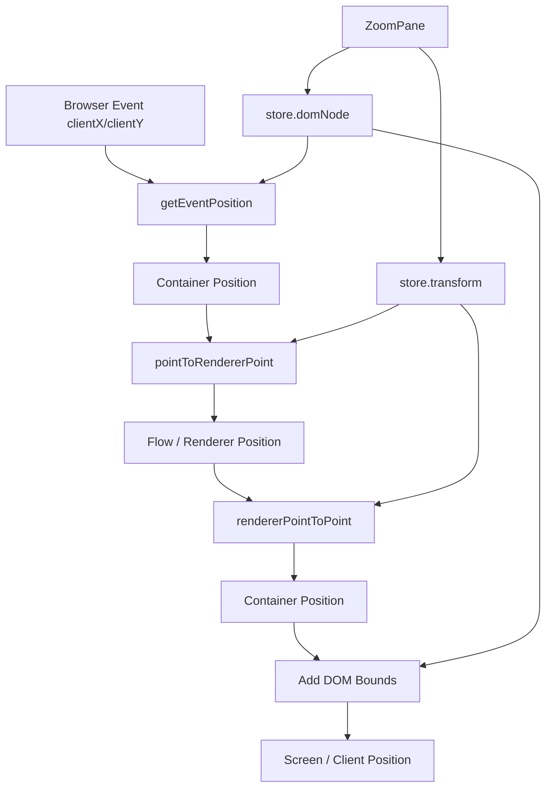

# 第 9 篇：坐标系统：screen、container、flow、viewport

很多人第一次写节点编辑器时，会把坐标问题想得很简单：

> 鼠标在哪儿，节点就去哪儿。

于是代码里很自然地出现：

```ts
node.position = {
  x: event.clientX,
  y: event.clientY,
};
```

这段代码在一个普通拖拽列表里可能还能凑合。但在 React Flow 这样的图编辑器里，它很快会失效：

- 画布被平移之后，`event.clientX` 不再等于节点应该落下的位置。
- 画布被缩放之后，鼠标移动 10px 不等于节点在图里移动 10 个单位。
- React Flow 容器不一定贴着浏览器左上角，必须减掉 wrapper 的边界。
- 节点可能有 parent，用户传入的 `position` 和内部渲染用的 `positionAbsolute` 不是同一个概念。
- 框选矩形要显示在屏幕坐标里，但判断哪些节点被选中要回到 flow 坐标。
- 连线时，鼠标位置、handle 位置、connection line 端点会同时出现在不同坐标空间里。

所以这篇要先建立一个结论：

> React Flow 的很多交互能力，本质上不是“事件处理”，而是“坐标空间转换”。

拖拽、缩放、框选、连线、fitView、可见性裁剪，都站在同一条地基上：

```txt
browser event
  ↓
screen / client position
  ↓ 减去 React Flow wrapper bounds
container position
  ↓ 反解 viewport transform
flow / renderer position
```

先把术语压清楚：

| 术语 | 原点 | 用途 |
| --- | --- | --- |
| screen / client | 浏览器 viewport 左上角 | 浏览器事件坐标，如 `event.clientX` |
| container | React Flow wrapper 左上角 | pane 内部事件、selection UI |
| flow / renderer | 图世界原点 | node position、edge path、handle bounds |
| viewport / transform | 不是独立坐标空间 | flow 和 container 之间的映射规则 |

本文会把 `flow` 和 `renderer` 放在一起说，是因为在这些交互链路里，它们都指向“被 viewport transform 投影之前的图世界坐标”。React Flow 的 public API 更常说 flow position，system 工具里有时叫 renderer point；读源码时把它们先理解成同一类空间，再到具体函数签名里看命名即可。

这里还有一个容易踩坑的点：`XYPosition` 只是 `{ x, y }` 的形状，不代表坐标空间。一个 `{ x, y }` 可能是 screen 坐标，也可能是 container 坐标、flow 坐标、handle 绝对坐标或 node absolute position。读源码时要先问“这个点属于哪个空间”，再看它的类型。

如果这条链路没有读懂，后面读 `XYPanZoom`、`XYDrag`、`XYHandle` 时会一直觉得源码在“绕”。

但它不是绕。

它是在保证每一个交互动作都能回答同一个问题：

> 这个点，在用户看到的屏幕里在哪里？在图内部的世界里又在哪里？

---

## 1. 这一篇要解决的问题

第 8 篇我们讲了 `InternalNode`，重点是说明为什么用户传入的节点还不够，React Flow 需要在内部补充 `measured`、`positionAbsolute`、`handleBounds`、`z` 等运行时信息。

这一篇继续往下走：当节点已经有了内部结构，交互系统要怎么移动它、连接它、选择它？

表面上看，这是几个不同问题：

- 拖拽节点：鼠标移动，节点跟着移动。
- 拖拽画布：背景移动，节点和边整体移动。
- 滚轮缩放：画布放大或缩小。
- 框选：拖出一个矩形，选中矩形覆盖的节点。
- 连线：从一个 handle 拖到另一个 handle。
- fitView：把一组节点缩放平移到视口里。

但源码里它们共享一个底层语言：

```ts
type Transform = [number, number, number]; // [x, y, zoom]
```

也就是：

```txt
transform = [translateX, translateY, scale]
```

这个 transform 同时服务两件事：

1. 渲染时，把 flow 坐标投影到屏幕上的位置。
2. 交互时，把屏幕上的事件坐标反解回 flow 坐标。

所以这篇不是要孤立讲一个工具函数，而是要把这条坐标承重链路读出来：

```txt
ZoomPane
  ↓ 创建 XYPanZoom
  ↓ 写入 store.transform / store.domNode
Viewport
  ↓ 使用 CSS transform 渲染画布
useViewportHelper
  ↓ 暴露 screenToFlowPosition / flowToScreenPosition
Pane / XYDrag / XYHandle
  ↓ 在交互中反复转换 screen、container、flow 坐标
```

这条链路一旦建立，后面读 pan、zoom、drag、connect 就会轻很多。

---

## 2. 先看现象：从用户 API 出发

用户通常不会直接接触 `Transform`，但会在很多 API 里间接感受到它。

比如你可能会写：

```tsx
function Flow() {
  const { screenToFlowPosition } = useReactFlow();

  const onDrop = useCallback((event: React.DragEvent) => {
    const position = screenToFlowPosition({
      x: event.clientX,
      y: event.clientY,
    });

    addNode({
      id: crypto.randomUUID(),
      position,
      data: { label: 'New node' },
    });
  }, []);

  return <ReactFlow onDrop={onDrop} />;
}
```

这里最容易被忽略的是：`event.clientX` / `event.clientY` 并不能直接成为 node 的 `position`。

原因很简单：`clientX/clientY` 是浏览器窗口坐标，node 的 `position` 是图内部坐标。

当画布没有平移、没有缩放，并且 React Flow 容器正好从浏览器左上角开始时，这两个坐标“看起来”差不多。可只要发生以下任意一种情况，它们就会分叉：

- 页面上方有 header，React Flow 容器不是从 `y = 0` 开始。
- 用户已经把画布往右拖了 300px。
- 当前 zoom 是 `0.5` 或 `2`。
- 节点在 parent node 内，需要相对 parent 存储。

所以 `screenToFlowPosition` 不是一个“方便函数”，而是 React Flow 公共 API 里暴露出的坐标转换边界。

再看另一个方向。

假设你想在一个 flow 坐标点上显示外部浮层，比如自己写 tooltip：

```tsx
function DebugPoint({ point }: { point: { x: number; y: number } }) {
  const { flowToScreenPosition } = useReactFlow();
  const screen = flowToScreenPosition(point);

  return (
    <div
      style={{
        position: 'fixed',
        left: screen.x,
        top: screen.y,
      }}
    />
  );
}
```

这一次方向反过来了：

```txt
flow position
  ↓ 应用 viewport transform
container position
  ↓ 加上 wrapper bounds
screen position
```

也就是说，React Flow 同时需要这两个能力：

```txt
screen -> flow
flow -> screen
```

读源码时，我们要盯住这两个方向。

---

## 3. 核心概念解释

坐标系统这部分最怕一上来就读函数名。

`pointToRendererPoint`、`rendererPointToPoint`、`getPointerPosition`、`screenToFlowPosition` 这些名字看起来很像，但它们所在的层次不一样。先把概念摆正，再进源码。

### 3.1 screen / client 坐标

`screen` 在这篇里指用户看到的浏览器视口坐标。源码里更常见的是 `clientX` / `clientY`。

它来自浏览器事件：

```ts
event.clientX
event.clientY
```

特点是：

- 原点在浏览器 viewport 左上角。
- 不关心 React Flow 容器在哪里。
- 不关心画布是否平移缩放。
- 鼠标、触摸事件天然给出的就是这类坐标。

如果 React Flow 容器距离浏览器左边 80px，距离顶部 120px，那么鼠标落在容器左上角时：

```txt
client = { x: 80, y: 120 }
container = { x: 0, y: 0 }
```

所以第一步永远是减掉容器边界。

### 3.2 container 坐标

`container` 坐标是相对于 React Flow wrapper 的坐标。

它通常这样得到：

```ts
const bounds = domNode.getBoundingClientRect();

const containerPosition = {
  x: event.clientX - bounds.left,
  y: event.clientY - bounds.top,
};
```

它解决的是“React Flow 在页面哪里”的问题。

但是它还没有解决“画布被平移和缩放后，图内部坐标是多少”的问题。

当当前 transform 是：

```ts
const transform = [100, 50, 2]; // translateX=100, translateY=50, zoom=2
```

一个 container 坐标点：

```ts
{ x: 300, y: 250 }
```

对应的 flow 坐标不是 `{ x: 300, y: 250 }`，而是：

```txt
flow.x = (300 - 100) / 2 = 100
flow.y = (250 - 50) / 2 = 100
```

这就是下一层。

### 3.3 flow / renderer 坐标

`flow` 坐标是图内部的坐标系统。

节点的 `position`、边路径计算、handle 位置、节点 bounds、框选判断、fitView 计算，最终都要落在这个坐标空间里。

源码里有时也叫 `renderer` 坐标。

你可以把它理解成：

> 如果没有任何 viewport transform，节点和边本来应该待在的位置。

React Flow 通过 CSS transform 把这个内部世界投影到屏幕：

```txt
screen/container x = flow.x * zoom + translateX
screen/container y = flow.y * zoom + translateY
```

反过来：

```txt
flow.x = (screen/container x - translateX) / zoom
flow.y = (screen/container y - translateY) / zoom
```

这两个公式就是这篇文章的核心。

### 3.4 viewport 与 transform

公共类型里更常见的是 `Viewport`：

```ts
type Viewport = {
  x: number;
  y: number;
  zoom: number;
};
```

内部渲染时常用的是 `Transform`：

```ts
type Transform = [number, number, number];
```

二者表达的是同一件事：

```txt
Viewport { x, y, zoom }
Transform [x, y, zoom]
```

差别主要在使用场景：

- 对外 API 更喜欢对象，语义清楚。
- 内部高频计算和 d3-zoom 更容易使用数组形式。

这里的 `x` / `y` 不是“画布左上角在 flow 坐标里的位置”，而是 CSS transform 里的 translate 值。

也就是：

```css
transform: translate(xpx, ypx) scale(zoom);
```

这一点很关键。

如果 `x = 100`，不是说 viewport 看到了 flow 世界里的 `x = 100`，而是说整个 flow renderer 被往右平移了 100px。

### 3.5 position 与 positionAbsolute

第 8 篇已经讲过，用户节点里的 `position` 不一定等于内部绝对位置。

最典型的是 parent node：

```txt
parent.positionAbsolute = { x: 200, y: 100 }
child.position = { x: 20, y: 30 }
child.positionAbsolute = { x: 220, y: 130 }
```

坐标系统里要同时记住两层关系：

```txt
用户节点 position
  可能相对 parent

内部节点 internals.positionAbsolute
  用于渲染、边路径、框选、bounds、fitView
```

也就是说：

```txt
screen/client
container
flow/renderer
node.position
node.internals.positionAbsolute
```

这不是五个互不相干的概念，而是 React Flow 从浏览器事件到图运行时之间的分层。

---

## 4. 源码入口在哪里

这一篇建议按四组文件读。

第一组是坐标转换基础函数：

```txt
packages/system/src/utils/general.ts
packages/system/src/utils/dom.ts
```

重点看：

- `pointToRendererPoint`
- `rendererPointToPoint`
- `getPointerPosition`
- `getEventPosition`
- `getViewportForBounds`
- `evaluateAbsolutePosition`

第二组是 viewport 如何进入 React runtime：

```txt
packages/react/src/container/ZoomPane/index.tsx
packages/react/src/container/Viewport/index.tsx
packages/react/src/hooks/useViewportHelper.ts
```

重点看：

- `ZoomPane` 如何创建 `XYPanZoom`。
- `ZoomPane` 如何把 `transform` 和 `domNode` 写进 store。
- `Viewport` 如何把 `transform` 应用成 CSS。
- `useViewportHelper` 如何暴露 `screenToFlowPosition` 和 `flowToScreenPosition`。

第三组是交互系统如何使用坐标：

```txt
packages/react/src/container/Pane/index.tsx
packages/system/src/xydrag/XYDrag.ts
packages/system/src/xyhandle/XYHandle.ts
```

重点看：

- 框选如何在 screen 坐标和 flow 坐标之间切换。
- 节点拖拽如何把 pointer 转成 flow 坐标。
- 连线如何用 flow 坐标找 handle，又用 screen/container 坐标画临时线。

第四组是可见性与 bounds：

```txt
packages/system/src/utils/graph.ts
packages/react/src/hooks/useVisibleNodeIds.ts
packages/react/src/hooks/useVisibleEdgeIds.ts
```

重点看：

- 当前 viewport 如何反推可见 flow 区域。
- visible nodes / edges 如何用 transform 做裁剪。

---

## 5. 源码调用链

先不要急着逐行看，我们把几条承重链路画出来。

### 5.1 transform 从哪里来

`transform` 的源头在 `ZoomPane`。

`ZoomPane` 创建 `XYPanZoom`，然后从 panZoom 实例里读出当前 viewport：

```txt
ZoomPane
  ↓ XYPanZoom({ domNode, minZoom, maxZoom, translateExtent, viewport })
panZoom.getViewport()
  ↓
store.setState({
  panZoom,
  transform: [x, y, zoom],
  domNode
})
```

源码坐标：

- `packages/react/src/container/ZoomPane/index.tsx:68`
- `packages/react/src/container/ZoomPane/index.tsx:95`

这里有两个关键状态：

```ts
transform: [x, y, zoom]
domNode: zoomPane.current.closest('.react-flow')
```

`transform` 用来做数学转换。

`domNode` 用来拿 React Flow wrapper 的 `getBoundingClientRect()`，把 browser client 坐标修正成 container 坐标。

后续所有 `screenToFlowPosition`、拖拽、框选、连线，都依赖这两个东西。

如果 `domNode` 没有准备好，React Flow 很多 helper 只能退化返回原始坐标。

### 5.2 transform 如何渲染到 DOM

`Viewport` 的代码非常短，但它是整个坐标系统最直观的证据。

源码里 selector 拼出 CSS transform：

```txt
translate(${transform[0]}px, ${transform[1]}px) scale(${transform[2]})
```

然后作用到：

```txt
react-flow__viewport
```

源码坐标：

- `packages/react/src/container/Viewport/index.tsx:6`
- `packages/react/src/container/Viewport/index.tsx:16`

这说明 `transform` 不是抽象状态，它真的直接决定画布层在页面上的视觉位置。

`GraphView` 里 `Viewport` 包住了 edge、connection line、node、portal：

```txt
Viewport
  ├─ EdgeRenderer
  ├─ ConnectionLineWrapper
  ├─ NodeRenderer
  └─ viewport portal
```

所以一次 viewport transform，会同时移动和缩放节点、边、临时连线以及 viewport portal 内容。

这也是为什么节点 position 不应该在 zoom 时被改写。

正确模型是：

```txt
节点仍然在 flow 坐标里
viewport transform 负责把它投影到屏幕
```

如果 zoom 时你去批量修改所有 node.position，后面的拖拽、边路径、fitView、框选都会越来越乱。

### 5.3 screen -> flow：用户 API 的转换链路

`useViewportHelper` 暴露了用户最常见的转换函数：

```ts
screenToFlowPosition(clientPosition)
```

它的源码逻辑可以概括成：

```txt
store.getState()
  ↓ 取 transform / snapGrid / snapToGrid / domNode
domNode.getBoundingClientRect()
  ↓
correctedPosition = clientPosition - dom bounds
  ↓
pointToRendererPoint(correctedPosition, transform, snapToGrid, snapGrid)
```

源码坐标：

- `packages/react/src/hooks/useViewportHelper.ts:84`
- `packages/react/src/hooks/useViewportHelper.ts:96`
- `packages/system/src/utils/general.ts:159`

`pointToRendererPoint` 的核心公式就是：

```txt
x = (x - translateX) / zoom
y = (y - translateY) / zoom
```

注意这里的输入已经不是原始 `clientX/clientY`，而是减过 wrapper bounds 的 container position。

完整链路是：

```txt
event.clientX / event.clientY
  ↓ subtract domNode.getBoundingClientRect()
container x / y
  ↓ pointToRendererPoint
flow x / y
```

这就是为什么文档里让你用 `screenToFlowPosition` 来处理 drop、context menu、外部拖拽创建节点。

它不是“把屏幕坐标转一下”那么简单，而是把浏览器、React Flow 容器、viewport transform、snapGrid 几层语义一起封装掉。

### 5.4 flow -> screen：浮层和交互反馈的反向链路

`useViewportHelper` 还提供反方向：

```ts
flowToScreenPosition(flowPosition)
```

它的逻辑是：

```txt
rendererPointToPoint(flowPosition, transform)
  ↓
+ domNode.getBoundingClientRect()
  ↓
screen position
```

源码坐标：

- `packages/react/src/hooks/useViewportHelper.ts:104`
- `packages/system/src/utils/general.ts:173`

`rendererPointToPoint` 的核心公式是：

```txt
x = flow.x * zoom + translateX
y = flow.y * zoom + translateY
```

再加上 wrapper 的浏览器位置，就回到了 `client` 坐标系。

这条链路的用途很广：

- 在外部 fixed layer 上显示 tooltip。
- 把 flow 坐标点映射到屏幕 overlay。
- 框选时把固定的 flow 起点映射回 screen 矩形起点。
- 连线时把目标 handle 的 flow 坐标映射为可显示的连接端点。

很多 UI bug 都来自忘了这条反向链路。

比如你把一个 tooltip 直接放在 `flow.x / flow.y`，在 zoom 为 `1` 且 viewport 没有平移时看起来没问题；一旦用户移动画布，它就会漂走。

### 5.5 Pane 框选：同一个矩形有两种坐标身份

框选是理解坐标系统最好的例子。

因为框选矩形既是 UI，又是查询条件。

UI 层需要 screen/container 坐标：

```txt
矩形要显示在用户鼠标拖出来的位置
```

图查询需要 flow 坐标：

```txt
判断哪些 node 被矩形覆盖，要和 node.positionAbsolute 在同一个坐标系里
```

`Pane` 的 `onPointerDownCapture` 里先拿到 container bounds，再用 `getEventPosition` 得到 container 坐标，接着调用 `pointToRendererPoint` 得到 flow 坐标，存成 selection 起点。

源码坐标：

- `packages/react/src/container/Pane/index.tsx:145`
- `packages/react/src/container/Pane/index.tsx:163`

关键是它存的 `userSelectionRect` 里混合了两类信息：

```txt
startX / startY
  flow 坐标，用来固定选择起点

x / y / width / height
  screen/container 坐标，用来渲染选择框
```

后面 `commitUserSelectionRect` 里有一段注释非常关键：选择矩形必须在 screen coordinates，不是在 flow coordinates。

源码坐标：

- `packages/react/src/container/Pane/index.tsx:200`

为什么？

因为用户看到的框选 UI 是贴着屏幕走的。

如果选区开始后触发 auto pan，画布在动，但用户拖出的矩形视觉起点不能跟着 flow 世界一起漂。React Flow 因此把起点先存为 flow 坐标，需要画矩形时再通过 `rendererPointToPoint` 转回 screen/container 坐标。

这条链路是：

```txt
pointer down
  ↓ screen/container -> flow
store userSelectionRect.startX/startY
  ↓
pointer move
  ↓ flow start -> screen/container start
  ↓ 当前 mouse screen/container position
计算 UI rectangle
  ↓
getNodesInside(..., rectangle, transform)
```

`getNodesInside` 又会用 transform 把 pane rect 转回 renderer bounds，再和节点 bounds 做相交判断。

这就是为什么框选看起来只是“画一个 div”，源码却需要在 screen 和 flow 之间来回走。

### 5.6 XYDrag：拖拽不是加 client delta

节点拖拽里最容易犯的错是直接用 `event.clientX - startX` 当作节点位移。

这在 zoom 不等于 1 时必然错。

如果当前 zoom 是 2，屏幕上移动 20px，对 flow 世界来说只移动了 10 个单位。

React Flow 在 `XYDrag` 中通过 `getPointerPosition` 处理这件事。

`getPointerPosition` 的逻辑是：

```txt
getEventPosition(event)
  ↓ 取 event.clientX/clientY
减 containerBounds.left/top
  ↓
pointToRendererPoint(..., transform)
  ↓
可选 snapGrid
```

源码坐标：

- `packages/system/src/utils/dom.ts:11`
- `packages/system/src/xydrag/XYDrag.ts:259`

进入 `updateNodes` 之后，节点新位置不是直接等于 pointer 位置，而是：

```txt
nextPosition = pointerPosition - dragItem.distance
```

`dragItem.distance` 表示拖拽开始时，鼠标点相对节点左上角的距离。

这保证了你抓住节点中间拖，节点不会突然把左上角跳到鼠标位置。

多选拖拽时还会更复杂：

- 需要一次性收集多个 `dragItems`。
- 需要根据整体 bounds 处理 `nodeExtent`。
- snapGrid 要考虑多节点组合，不能每个节点独立乱吸附。
- `calculateNodePosition` 会重新计算 `position` 和 `positionAbsolute`。

源码坐标：

- `packages/system/src/xydrag/XYDrag.ts:130`
- `packages/system/src/utils/graph.ts:393`

还有一个小细节特别能说明坐标意识：auto pan。

当用户拖节点靠近画布边缘，React Flow 会自动平移画布。auto pan 的移动量来自屏幕/container 坐标，但要更新拖拽中的 flow 位置时，需要除以 zoom：

```txt
lastPos.x = lastPos.x - xMovement / zoom
lastPos.y = lastPos.y - yMovement / zoom
```

源码坐标：

- `packages/system/src/xydrag/XYDrag.ts:237`

这意味着：

```txt
屏幕移动量 ≠ flow 移动量
flow 移动量 = 屏幕移动量 / zoom
```

这条规则贯穿所有拖拽交互。

### 5.7 XYHandle：连线同时活在两个世界里

连线系统比拖拽更能体现坐标混合。

从 handle 按下时，源码先拿到事件位置和 container bounds：

```txt
event.client position
containerBounds = domNode.getBoundingClientRect()
position = getEventPosition(event, containerBounds)
```

源码坐标：

- `packages/system/src/xyhandle/XYHandle.ts:60`
- `packages/system/src/xyhandle/XYHandle.ts:70`

移动时，它要做两件事：

第一，找最近的 handle。

handle 的几何信息来自节点内部结构，属于 flow/renderer 坐标。鼠标当前 position 是 container 坐标，所以要先转成 renderer 坐标：

```txt
pointToRendererPoint(position, transform)
  ↓
getClosestHandle(...)
```

源码坐标：

- `packages/system/src/xyhandle/XYHandle.ts:147`

第二，更新 connection line。

如果找到了合法目标 handle，connection 的 `to` 会使用目标 handle 的位置，并通过 `rendererPointToPoint` 转回 container/screen 坐标；如果没找到合法目标，就直接使用当前 pointer position。

源码坐标：

- `packages/system/src/xyhandle/XYHandle.ts:183`

这说明连接过程里同时有两种需求：

```txt
找 handle
  需要 flow 坐标

显示临时 connection line
  需要当前 viewport 下的可见坐标
```

这也呼应了第 12 篇要讲的一个重要结论：

> 连接系统不是 EdgeRenderer 的一部分。EdgeRenderer 渲染已存在的 edge；连接过程由独立 interaction system 管理。

坐标转换正是这个 interaction system 的底层能力。

### 5.8 可见性计算：viewport 反推出 flow bounds

坐标系统不仅服务用户交互，也服务性能。

React Flow 不一定要渲染所有节点。开启 `onlyRenderVisibleElements` 时，它需要知道当前 viewport 里有哪些 node / edge 可见。

这时问题变成：

```txt
已知屏幕上的 pane rect = { x: 0, y: 0, width, height }
已知 transform = [tx, ty, zoom]
求这个 pane rect 对应的 flow bounds
```

`useVisibleNodeIds` 调用 `getNodesInside`：

```txt
getNodesInside(nodeLookup, { x: 0, y: 0, width, height }, transform, true)
```

源码坐标：

- `packages/react/src/hooks/useVisibleNodeIds.ts:8`
- `packages/system/src/utils/graph.ts:257`

`getNodesInside` 内部会把 pane rect 的左上角和右下角反解到 renderer 坐标，再和节点 bounds 做相交判断。

可见 edge 也是类似思路，只是它要从 source/target node 的 bounds 推断 edge 是否可能出现在 viewport 内。

源码坐标：

- `packages/react/src/hooks/useVisibleEdgeIds.ts:15`

所以可见性优化并不是“根据 node.position 判断是否在屏幕里”。

它必须先把屏幕区域转换成 flow 区域。

这也是为什么 transform 被放在 store 里：它不只是渲染状态，也是查询条件。

---

## 6. 关键数据结构

这一节把源码里反复出现的数据结构收束一下。

### 6.1 Transform

```ts
type Transform = [number, number, number];
```

语义：

```txt
[translateX, translateY, zoom]
```

它直接对应 CSS：

```css
transform: translate(tx, ty) scale(zoom);
```

它也直接参与坐标换算：

```txt
flow -> container:
  x * zoom + tx
  y * zoom + ty

container -> flow:
  (x - tx) / zoom
  (y - ty) / zoom
```

### 6.2 Viewport

```ts
type Viewport = {
  x: number;
  y: number;
  zoom: number;
};
```

对外 API 更常见，比如：

- `defaultViewport`
- `onViewportChange`
- `getViewport`
- `setViewport`
- `fitBounds`

内部会在需要时转成 transform 数组。

### 6.3 XYPosition

```ts
type XYPosition = {
  x: number;
  y: number;
};
```

它只是形状，不代表坐标空间。

这点很重要。

同样的 `{ x, y }`，可能是：

- browser client position
- container position
- flow position
- node position
- node absolute position
- pointer position
- handle position

所以读源码时不能只看类型名，要看它从哪里来、传给谁。

### 6.4 Rect / Box

源码里常见：

```ts
type Rect = {
  x: number;
  y: number;
  width: number;
  height: number;
};
```

以及：

```ts
type Box = {
  x: number;
  y: number;
  x2: number;
  y2: number;
};
```

它们常用于：

- 节点 bounds。
- selection rect。
- viewport bounds。
- fitView。
- nodes inside 判断。

和 `XYPosition` 一样，`Rect` 本身也不说明坐标空间。

一个 rect 可能是 screen rect，也可能是 flow rect。

### 6.5 InternalNode.internals.positionAbsolute

内部节点的位置是很多计算的基准。

源码里 `nodeToRect` 对 internal node 会优先使用：

```txt
node.internals.positionAbsolute
```

源码坐标：

- `packages/system/src/utils/general.ts:101`

也就是说：

```txt
selection / edge / bounds / fitView
  ↓
优先使用 absolute flow position
```

用户传入的 `position` 更像是声明式 API 边界；内部交互要靠 `positionAbsolute` 保持一致。

---

## 7. 关键实现思路

现在我们可以把几个函数放到一张图里。



这张图基本就是 React Flow 坐标系统的骨架。

### 7.1 基础转换函数放在 system 层

`pointToRendererPoint` 和 `rendererPointToPoint` 位于 `@xyflow/system`。

这是合理的，因为它们不是 React 特有能力：

- React Flow 需要。
- Svelte Flow 也需要。
- 拖拽、连线、小地图、resizer 都需要。

它们解决的是纯数学问题，不依赖 React。

源码坐标：

- `packages/system/src/utils/general.ts:159`
- `packages/system/src/utils/general.ts:173`

### 7.2 DOM 修正放在 react helper / dom utils

`domNode.getBoundingClientRect()` 这种逻辑需要 DOM。

所以它不会放在纯数学函数里，而是在更靠近运行时的地方处理：

- 用户 API：`useViewportHelper.screenToFlowPosition`
- 交互系统：`getPointerPosition`
- Pane 框选：`getEventPosition(event, containerBounds)`
- XYHandle 连线：`getEventPosition(event, containerBounds)`

这是一种很清楚的分层：

```txt
system general utils
  只做 transform 数学

system dom utils / react hooks
  负责事件坐标和 DOM bounds
```

### 7.3 transform 是 store 状态，不是组件局部状态

为什么 `transform` 要放进 store？

因为它同时被很多地方用：

- `Viewport` 渲染需要它。
- `useViewportHelper` 需要它。
- `Pane` 框选需要它。
- `XYDrag` 拖拽需要它。
- `XYHandle` 连线需要它。
- visible nodes / edges 计算需要它。
- `fitView` / `setCenter` / `panBy` 需要它。

如果 transform 只存在于 `ZoomPane` 局部状态里，其他模块就无法同步理解当前视口。

React Flow 的设计是：

```txt
XYPanZoom 管理底层 pan/zoom 行为
ZoomPane 把结果同步到 store.transform
其他系统从 store 读取统一 transform
```

这让 pan/zoom 与其他交互系统解耦，但又共享同一个视口事实。

### 7.4 transform 不改 graph data

这一点值得反复强调。

zoom/pan 改的是 viewport，不是 nodes。

```txt
pan / zoom
  改 transform

drag node
  改 node position
```

两者职责必须分开。

如果拖动画布时去改所有节点 position，就会破坏图数据本身。

同样，如果拖节点时只改 transform，节点在图中的真实位置没有变化。

所以 React Flow 里：

- `Viewport` 负责把整个图投影到屏幕。
- `XYDrag` 负责修改节点在 flow 世界里的位置。
- `XYPanZoom` 负责修改用户看这个世界的镜头。

这个模型很像地图应用：

```txt
城市的位置没有变
地图镜头在移动和缩放
用户拖动一个标注时，才改变标注本身的位置
```

### 7.5 fitView 是反向求 transform

`fitView` / `fitBounds` 的本质是另一个坐标问题：

> 已知一组 flow bounds 和容器 width/height，求一个 viewport，让这些 bounds 正好进入屏幕。

system 里的 `getViewportForBounds` 做这件事。

源码坐标：

- `packages/system/src/utils/general.ts:295`
- `packages/react/src/hooks/useViewportHelper.ts:68`

它不是在改节点。

它是在计算：

```txt
nextZoom
nextTranslateX
nextTranslateY
```

让目标 flow rect 被投影到当前 container rect 里。

这进一步说明 React Flow 的核心不是“节点 DOM 怎么摆”，而是“flow 世界和 viewport 镜头之间怎么映射”。

---

## 8. 这部分源码的设计取舍

坐标系统这部分代码看起来散，但设计上其实很克制。

### 8.1 用 transform 做统一事实源

React Flow 没有让每个模块自己维护 zoom、offset、scroll。

它把视口事实压缩成一个 transform：

```txt
[x, y, zoom]
```

好处是：

- 数学模型简单。
- DOM 渲染和交互反解使用同一个状态。
- pan/zoom、drag、connect、selection 可以共享语言。
- 受控 viewport 也能通过同一个 transform 同步。

代价是：

- 所有交互代码都必须对坐标空间敏感。
- `{ x, y }` 类型本身不表达坐标空间，需要靠上下文判断。

这就是为什么源码阅读时要特别小心变量名。

`position` 在某个函数里可能是 pointer container position，在另一个函数里可能是 flow position。

### 8.2 把纯数学下沉到 system

`pointToRendererPoint`、`rendererPointToPoint`、`getViewportForBounds` 都在 system 层。

这是因为这些能力不是 React 绑定层独有的。

React 层负责：

- 读 store。
- 读 DOM bounds。
- 给用户暴露 hook。
- 把 transform 应用到 DOM。

system 层负责：

- 坐标数学。
- bounds 计算。
- 拖拽和连线核心交互。
- panzoom 控制器。

这和前几篇的结论一致：

> React 包不是从零实现所有能力，而是把 system 能力包装成 React 组件、hooks 和公共 API。

### 8.3 框选矩形保留 screen 语义

`Pane` 里框选矩形的处理非常有代表性。

它没有为了“统一”而强行把所有值都转成 flow 坐标。

相反，它承认同一个交互有两层语义：

- 选择起点要能抵抗 auto pan，所以存 flow 坐标。
- 选择矩形要画在用户眼前，所以用 screen/container 坐标。

这是一种工程上的务实设计。

源码不是为了概念洁癖而统一，而是为了交互正确性保留必要的混合状态。

### 8.4 zoom 对 drag 的影响集中处理

拖拽代码没有到处手写 `/ zoom`。

主要通过 `pointToRendererPoint` 和 `getPointerPosition` 把 pointer 一开始就转到 flow 坐标。

这样后续 `calculateNodePosition`、snap、extent、updateNodePositions 都可以在 flow 世界里计算。

只有 auto pan 这种“屏幕移动推动画布移动，并反过来影响拖拽位置”的场景，需要显式除以 zoom。

这种做法让复杂性交给入口转换，而不是让每个节点更新逻辑都背上 viewport 细节。

### 8.5 坐标工具没有隐藏全部复杂性

React Flow 已经提供了 helper，但它没有把坐标复杂性完全从用户面前抹掉。

你仍然会看到：

- `screenToFlowPosition`
- `flowToScreenPosition`
- `getViewport`
- `setViewport`
- `fitBounds`

这说明 React Flow 的定位不是“只给你一个黑盒组件”，而是给你一个可编程的图编辑器 runtime。

当你要实现外部拖拽创建节点、上下文菜单、canvas overlay、协同光标、debug layer、外部 minimap 时，就必须进入这套坐标语言。

---

## 9. 如果我们自己实现，最小版本应该怎么写

mini-flow 不需要一开始就接入 d3-zoom，也不需要实现完整框选和连线。

但必须先把坐标转换写对。

### 9.1 定义 viewport 与坐标函数

```ts
type Point = {
  x: number;
  y: number;
};

type Viewport = {
  x: number;
  y: number;
  zoom: number;
};

function flowToContainer(point: Point, viewport: Viewport): Point {
  return {
    x: point.x * viewport.zoom + viewport.x,
    y: point.y * viewport.zoom + viewport.y,
  };
}

function containerToFlow(point: Point, viewport: Viewport): Point {
  return {
    x: (point.x - viewport.x) / viewport.zoom,
    y: (point.y - viewport.y) / viewport.zoom,
  };
}
```

这两个函数就是 `rendererPointToPoint` 和 `pointToRendererPoint` 的简化版。

### 9.2 加上 DOM bounds

```ts
function screenToFlowPosition(
  screen: Point,
  viewport: Viewport,
  container: HTMLElement
): Point {
  const bounds = container.getBoundingClientRect();

  return containerToFlow(
    {
      x: screen.x - bounds.left,
      y: screen.y - bounds.top,
    },
    viewport
  );
}

function flowToScreenPosition(
  flow: Point,
  viewport: Viewport,
  container: HTMLElement
): Point {
  const bounds = container.getBoundingClientRect();
  const containerPoint = flowToContainer(flow, viewport);

  return {
    x: containerPoint.x + bounds.left,
    y: containerPoint.y + bounds.top,
  };
}
```

这就是 `useViewportHelper` 的最小精神版本。

### 9.3 实现保持鼠标点不动的 zoom

一个可用的 zoom 不能只改 `zoom`，否则鼠标下的图会跳。

目标是：

```txt
缩放前鼠标指向的 flow point
缩放后仍然在鼠标下面
```

实现草图：

```ts
function zoomAtPoint(
  viewport: Viewport,
  containerPoint: Point,
  nextZoom: number
): Viewport {
  const flowPoint = containerToFlow(containerPoint, viewport);

  return {
    zoom: nextZoom,
    x: containerPoint.x - flowPoint.x * nextZoom,
    y: containerPoint.y - flowPoint.y * nextZoom,
  };
}
```

推导很简单。

我们希望缩放后：

```txt
containerPoint.x = flowPoint.x * nextZoom + nextX
containerPoint.y = flowPoint.y * nextZoom + nextY
```

所以：

```txt
nextX = containerPoint.x - flowPoint.x * nextZoom
nextY = containerPoint.y - flowPoint.y * nextZoom
```

这就是 pan/zoom 系统最核心的直觉。

后面的 `XYPanZoom` 会更复杂，因为它还要处理：

- wheel。
- pinch。
- double click。
- pan on scroll。
- min/max zoom。
- translate extent。
- controlled viewport。
- 动画插值。

但无论复杂到什么程度，它都绕不开这个基本模型。

### 9.4 拖拽节点时只在 flow 坐标里更新

```ts
type DragState = {
  nodeId: string;
  pointerOffset: Point;
};

function startNodeDrag(nodePosition: Point, pointerFlowPosition: Point): DragState {
  return {
    nodeId: 'node-1',
    pointerOffset: {
      x: pointerFlowPosition.x - nodePosition.x,
      y: pointerFlowPosition.y - nodePosition.y,
    },
  };
}

function updateNodeDrag(pointerFlowPosition: Point, drag: DragState): Point {
  return {
    x: pointerFlowPosition.x - drag.pointerOffset.x,
    y: pointerFlowPosition.y - drag.pointerOffset.y,
  };
}
```

注意这里的 `pointerFlowPosition` 必须先由 `screenToFlowPosition` 得到。

这让节点拖拽不需要关心当前 zoom 是多少。

```txt
事件入口处理 viewport
节点更新只处理 flow data
```

这就是 mini-flow 应该从 React Flow 学到的第一条工程边界。

---

## 10. 本篇总结

这一篇我们没有写复杂交互，但打下了后面几篇的地基。

React Flow 的坐标系统可以压缩成两组公式：

```txt
flow -> container:
  x * zoom + translateX
  y * zoom + translateY

container -> flow:
  (x - translateX) / zoom
  (y - translateY) / zoom
```

再加上一层 DOM bounds 修正：

```txt
screen/client
  ↓ subtract wrapper bounds
container
  ↓ inverse transform
flow/renderer
```

源码中这套模型落在几个关键位置：

- `ZoomPane` 创建 `XYPanZoom`，写入 `store.transform` 和 `store.domNode`。
- `Viewport` 把 `transform` 应用成 CSS `translate(...) scale(...)`。
- `useViewportHelper` 暴露 `screenToFlowPosition` 和 `flowToScreenPosition`。
- `Pane` 在框选时同时维护 screen 矩形和 flow 起点。
- `XYDrag` 把 pointer 转成 flow 坐标后再更新节点。
- `XYHandle` 在 flow 坐标里找 handle，在可见坐标里更新 connection line。
- visible node / edge 计算通过 transform 把 viewport 反推成 flow bounds。

最重要的结论是：

> React Flow 里的节点、边和 handle 都生活在 flow 世界里；用户看到的是 viewport transform 投影后的结果。

把这个模型放进脑子里，再去读 pan、zoom、drag、connect，源码就不再是一堆事件回调，而是一套围绕 viewport 和坐标转换组织起来的交互 runtime。

---

## 11. 下一篇读什么

下一篇进入：

```txt
第 10 篇：XYPanZoom：缩放和平移系统
```

这一篇会把本篇的 `transform` 继续往下追：

- `XYPanZoom` 为什么使用 `d3-zoom`。
- wheel、pinch、drag pan、double click zoom 如何统一成 viewport 更新。
- `minZoom`、`maxZoom`、`translateExtent` 如何约束视口。
- controlled viewport 下 transform 如何同步。
- 为什么 selection active、connection in progress 会影响 panzoom 行为。

如果说这一篇解决的是“坐标怎么换算”，下一篇解决的就是：

> 这些 transform 是怎么被用户交互稳定地产生出来的？
