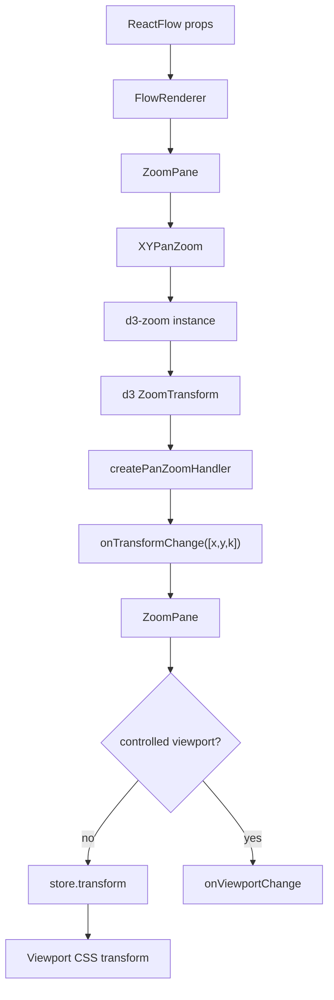

# 第 10 篇：XYPanZoom：缩放和平移系统

上一篇我们把 React Flow 的坐标系统讲清楚了：

```txt
flow / renderer 坐标
  ↓ viewport transform
container 坐标
  ↓ DOM bounds
screen / client 坐标
```

但那篇还留了一个问题：

> `transform = [x, y, zoom]` 到底是谁产生的？

很多人会直觉地认为，pan/zoom 就是监听几个事件：

```txt
wheel
  改 zoom

mousedown + mousemove
  改 x/y
```

如果只是写一个 demo，这样当然可以。

但 React Flow 面对的是一个图编辑器运行时。它的 pan/zoom 不只是“让画布动起来”，而是要同时处理：

- wheel 缩放。
- trackpad pinch 缩放。
- 鼠标拖拽平移。
- 中键或右键平移。
- 滚轮平移。
- 双击缩放。
- 受控 viewport。
- minZoom / maxZoom。
- translateExtent。
- 动画过渡。
- pan/zoom start、move、end 回调。
- 框选时暂停 panzoom。
- 连线时限制某些交互。
- `nowheel` / `nopan` class 过滤。
- 点击距离与拖拽距离的冲突。

所以 `XYPanZoom` 不是一个“wheel handler”。

它更像一个可配置的 viewport 控制器：

```txt
用户输入事件
  ↓
d3-zoom 统一处理 gesture
  ↓
ZoomTransform
  ↓
Viewport / Transform
  ↓
React store.transform
  ↓
Viewport DOM 渲染
```

这一篇我们就读这条链路。

---

## 1. 这一篇要解决的问题

第 9 篇解决的是“坐标怎么换算”。

这一篇解决的是“viewport 怎么变化”。

二者关系很紧：

```txt
坐标系统
  解释 transform 的含义

XYPanZoom
  负责稳定地产生和同步 transform
```

如果没有 `XYPanZoom`，你当然也能写：

```ts
setViewport((viewport) => ({
  ...viewport,
  zoom: viewport.zoom * 1.2,
}));
```

但很快你会遇到一堆细节：

- 缩放时要围绕鼠标位置缩放，不然画布会跳。
- trackpad 的 wheel delta 在不同浏览器里单位不同。
- macOS pinch 会以 `ctrlKey + wheel` 的形式出现。
- 平移画布和框选画布都发生在 pane 上，事件需要互斥。
- 用户滚轮可能是想滚页面，也可能是想 zoom 或 pan。
- 双击缩放在触摸设备上不完全走同一套 filter。
- 受控 viewport 下，内部不能直接把 transform 当最终事实。

`XYPanZoom` 的价值就是把这些分散的输入统一到一个 viewport 状态机里。

这篇的源码主线是：

```txt
FlowRenderer
  ↓ 计算 panOnDrag / panOnScroll / selection 状态
ZoomPane
  ↓ 创建 XYPanZoom
  ↓ update 时传入 pan/zoom 配置
XYPanZoom
  ↓ 包装 d3-zoom
  ↓ 注册 filter、wheel handler、start/zoom/end handler
eventhandler
  ↓ 把 d3 ZoomTransform 转成 Viewport / Transform
ZoomPane.onTransformChange
  ↓ 写入 store.transform 或触发 controlled callback
Viewport
  ↓ CSS translate + scale
```

这条链路会解释为什么 pan/zoom 被放在 `@xyflow/system`，又为什么 React 层需要一个 `ZoomPane` 来接它。

本章只抓三件事：

```txt
第一，XYPanZoom 不是 React 组件，而是 system 层的 imperative controller。
第二，ZoomPane 负责把这个 controller 接进 React 生命周期、store 和 controlled viewport。
第三，pan/zoom 改的是 viewport transform，不应该改 nodes / edges 数据。
```

边界可以这样记：

| 模块 | 性质 | 负责什么 |
| --- | --- | --- |
| `XYPanZoom` | imperative controller，位于 system | 绑定 DOM + d3-zoom，处理 gesture 和 viewport 约束 |
| `ZoomPane` | React component，位于 react | 管生命周期、store 同步、controlled viewport callback |
| `Viewport` | React transform layer | 读取 store.transform，应用 CSS `translate(...) scale(...)` |

后面看到 `update()`、`setViewport()`、`scaleBy()` 时，也先分清它们改的不是同一类东西：

| 方法 | 改什么 | 例子 |
| --- | --- | --- |
| `update(options)` | 改交互规则 | `zoomOnScroll`、`panOnDrag`、`userSelectionActive` |
| `setViewport(viewport)` | 改视口状态 | `setCenter`、`fitView`、controlled sync |
| `scaleBy` / `scaleTo` | 改 zoom | `zoomIn`、`zoomOut`、`zoomTo` |

---

## 2. 先看用户 API 或运行效果

React Flow 用户通常通过 props 控制 pan/zoom 行为：

```tsx
<ReactFlow
  minZoom={0.2}
  maxZoom={2}
  defaultViewport={{ x: 0, y: 0, zoom: 1 }}
  translateExtent={[
    [-1000, -1000],
    [1000, 1000],
  ]}
  zoomOnScroll
  zoomOnPinch
  zoomOnDoubleClick
  panOnDrag
  panOnScroll={false}
  preventScrolling
/>
```

这些 props 看起来只是配置开关。

但在运行时，它们共同决定：

- 事件是否允许进入 d3-zoom。
- wheel 事件应该 zoom 还是 pan。
- pointer drag 应该 pan 还是让 selection 处理。
- 当前 transform 是否需要 clamp。
- viewport change 是否进入内部 store。
- 用户回调什么时候触发。

还有一组命令式 API：

```tsx
const {
  zoomIn,
  zoomOut,
  zoomTo,
  setViewport,
  getViewport,
  setCenter,
  fitBounds,
} = useReactFlow();
```

这些 API 最后也会落到 `panZoom` 实例：

```txt
zoomIn / zoomOut
  → panZoom.scaleBy(...)

zoomTo
  → panZoom.scaleTo(...)

setViewport / fitBounds / setCenter
  → panZoom.setViewport(...)
```

源码坐标：

- `packages/react/src/hooks/useViewportHelper.ts:39`
- `packages/react/src/hooks/useViewportHelper.ts:68`

这说明 React Flow 的 viewport API 有两种入口：

```txt
用户手势
  wheel / drag / pinch / double click

命令式调用
  zoomTo / setViewport / fitBounds / setCenter
```

但它们最终都要进入同一个 panZoom 控制器，否则 viewport 事实会分裂。

---

## 3. 核心概念解释

读 `XYPanZoom` 前，先把几个概念摆正。

### 3.1 Viewport 与 ZoomTransform

React Flow 自己的视口类型是：

```ts
type Viewport = {
  x: number;
  y: number;
  zoom: number;
};
```

d3-zoom 使用的是 `ZoomTransform`：

```txt
ZoomTransform {
  x: number
  y: number
  k: number
}
```

二者基本等价：

```txt
Viewport.zoom = ZoomTransform.k
Viewport.x = ZoomTransform.x
Viewport.y = ZoomTransform.y
```

`packages/system/src/xypanzoom/utils.ts` 里有两个小函数专门做转换：

```txt
transformToViewport
viewportToTransform
```

源码坐标：

- `packages/system/src/xypanzoom/utils.ts:8`
- `packages/system/src/xypanzoom/utils.ts:14`

这个桥接很重要。

React Flow 不把 d3 的类型直接扩散到所有业务层，而是在 `XYPanZoom` 边界里转换。

### 3.2 d3-zoom 的角色

`XYPanZoom` 使用：

```ts
zoom()
select(domNode)
zoomTransform(...)
```

源码坐标：

- `packages/system/src/xypanzoom/XYPanZoom.ts:1`
- `packages/system/src/xypanzoom/XYPanZoom.ts:46`

d3-zoom 的价值不是“帮你写了几行事件监听”。

它真正承担的是 gesture 归一化：

- wheel 缩放。
- pointer drag 平移。
- touch / pinch。
- double click。
- scale extent。
- translate extent。
- transform 插值。
- zoom transform 的内部状态 `__zoom`。

React Flow 在这之上再加自己的业务规则：

- 哪些 class 禁止 pan/zoom。
- selection 过程中是否禁用。
- connection 过程中是否限制。
- 右键 pan 和 context menu 如何协调。
- panOnScroll 如何把 wheel 改造成平移。
- controlled viewport 如何同步。

所以更准确的分工是：

```txt
d3-zoom
  处理底层 gesture 与 transform 状态

XYPanZoom
  把 d3-zoom 包装成 React Flow 需要的 viewport 控制器
```

### 3.3 PanZoomInstance

`XYPanZoom` 最后返回一个实例：

```ts
type PanZoomInstance = {
  update(...)
  destroy()
  getViewport()
  setViewport(...)
  setViewportConstrained(...)
  setScaleExtent(...)
  setTranslateExtent(...)
  scaleTo(...)
  scaleBy(...)
  syncViewport(...)
  setClickDistance(...)
};
```

源码坐标：

- `packages/system/src/types/panzoom.ts:49`
- `packages/system/src/xypanzoom/XYPanZoom.ts:278`

这说明 `XYPanZoom` 不是一个 React component。

它是一个 imperative controller。

React 层通过 `ZoomPane` 持有这个 controller，然后把它塞进 store：

```txt
store.panZoom = panZoom.current
```

这样 `useReactFlow`、store actions、auto pan、fitBounds 都可以命令式地操作 viewport。

### 3.4 update 与 setViewport 的区别

`PanZoomInstance` 里有两类方法。

第一类是配置更新：

```txt
update(options)
```

它处理：

- `zoomOnScroll`
- `zoomOnPinch`
- `panOnScroll`
- `panOnDrag`
- `zoomOnDoubleClick`
- `userSelectionActive`
- `noWheelClassName`
- `noPanClassName`
- `connectionInProgress`

第二类是 viewport 更新：

```txt
setViewport(...)
scaleTo(...)
scaleBy(...)
syncViewport(...)
```

它处理：

- 直接设置 viewport。
- 缩放到某个 zoom。
- 按比例缩放。
- controlled viewport 同步。

这个区分很关键。

`update` 改的是控制器行为；`setViewport` 改的是视口状态。

---

## 4. 源码入口在哪里

这一篇主要读五个文件。

第一，React 侧入口：

```txt
packages/react/src/container/FlowRenderer/index.tsx
packages/react/src/container/ZoomPane/index.tsx
```

`FlowRenderer` 负责根据键盘状态和 selection 状态整理 props。

`ZoomPane` 负责创建 `XYPanZoom`，并把 React props 转成 panZoom update options。

第二，system 侧控制器：

```txt
packages/system/src/xypanzoom/XYPanZoom.ts
```

这是主文件。

它创建 d3 zoom instance，暴露 public functions，并协调 handler / filter。

第三，事件处理：

```txt
packages/system/src/xypanzoom/eventhandler.ts
```

这里拆出了：

- `createPanOnScrollHandler`
- `createZoomOnScrollHandler`
- `createPanZoomStartHandler`
- `createPanZoomHandler`
- `createPanZoomEndHandler`

第四，事件过滤：

```txt
packages/system/src/xypanzoom/filter.ts
```

这里决定某个事件能不能进入 d3-zoom。

第五，工具函数：

```txt
packages/system/src/xypanzoom/utils.ts
```

这里处理 viewport/transform 转换、wheelDelta、transition、class 过滤等基础逻辑。

---

## 5. 源码调用链

### 5.1 FlowRenderer：pan 和 selection 先在 React 层分流

pan/zoom 不是直接从 `ReactFlow` props 进入 `XYPanZoom`。

中间先经过 `FlowRenderer`。

`FlowRenderer` 会读取：

- selection key 是否按下。
- pan activation key 是否按下。
- 当前是否处于 user selection。
- 是否启用 `selectionOnDrag`。

然后算出：

```txt
panOnDrag = panActivationKeyPressed || props.panOnDrag
panOnScroll = panActivationKeyPressed || props.panOnScroll
selectionOnDrag = selectionOnDrag && panOnDrag !== true
isSelecting = selectionKeyPressed || userSelectionActive || selectionOnDrag
```

源码坐标：

- `packages/react/src/container/FlowRenderer/index.tsx:66`
- `packages/react/src/container/FlowRenderer/index.tsx:72`

这一步很重要。

React Flow 的 pane 上既可以发生：

- pan。
- selection。
- pane click。
- context menu。

这些行为都抢同一批 pointer 事件。

所以 `FlowRenderer` 先做一次高层分流，再把结果传给 `ZoomPane` 和 `Pane`：

```txt
ZoomPane
  接 pan/zoom 配置

Pane
  接 selection / pane event 配置
```

这解释了第 6 篇讲 GraphView 分层时留下的一个问题：

> FlowRenderer 为什么要包住 Viewport？

因为它是 pane 级交互的调度层。

### 5.2 ZoomPane：React 层与 system 控制器之间的桥

`ZoomPane` 的职责可以分成三段。

第一段，创建 controller。

它在 effect 里调用：

```txt
XYPanZoom({
  domNode,
  minZoom,
  maxZoom,
  translateExtent,
  viewport: defaultViewport,
  onDraggingChange,
  onPanZoomStart,
  onPanZoom,
  onPanZoomEnd
})
```

源码坐标：

- `packages/react/src/container/ZoomPane/index.tsx:68`

第二段，把 controller 和初始 transform 写入 store。

```txt
const { x, y, zoom } = panZoom.current.getViewport()

store.setState({
  panZoom,
  transform: [x, y, zoom],
  domNode
})
```

源码坐标：

- `packages/react/src/container/ZoomPane/index.tsx:95`

第三段，每次 props / 状态变化时调用：

```txt
panZoom.current?.update(...)
```

源码坐标：

- `packages/react/src/container/ZoomPane/index.tsx:109`

也就是说：

```txt
创建
  XYPanZoom(...)

同步事实
  store.panZoom / store.transform / store.domNode

更新配置
  panZoom.update(...)
```

这就是 React 层和 system 层之间的桥。

### 5.3 onTransformChange：非受控时写 store，受控时只通知

`ZoomPane` 里有一个非常关键的回调：

```txt
onTransformChange(transform)
```

它做两件事：

1. 调用用户传入的 `onViewportChange`。
2. 如果不是 controlled viewport，就把 transform 写进 store。

源码坐标：

- `packages/react/src/container/ZoomPane/index.tsx:57`

这个逻辑对应 React Flow 的 controlled / uncontrolled 模式：

```txt
uncontrolled viewport
  XYPanZoom 产生 transform
  ZoomPane 写入 store.transform

controlled viewport
  XYPanZoom 产生变化
  ZoomPane 通知用户
  用户通过 props 再把 viewport 同步回来
```

这和 nodes / edges 的受控模式很像。

交互本身不会绕过 React Flow 的状态边界，而是通过 change / callback 机制回流。

### 5.4 XYPanZoom 初始化：把 d3-zoom 绑定到 DOM

进入 `XYPanZoom.ts`。

初始化时它创建：

```txt
zoomPanValues
d3ZoomInstance
d3Selection
```

其中 `zoomPanValues` 是运行时辅助状态：

```txt
isZoomingOrPanning
usedRightMouseButton
prevViewport
mouseButton
timerId
panScrollTimeout
isPanScrolling
```

源码坐标：

- `packages/system/src/xypanzoom/XYPanZoom.ts:27`

这些不是 graph data，而是 gesture 状态。

比如：

- 当前是否正在 pan/zoom。
- 本次 pan 是否使用右键。
- panOnScroll 的 end 回调是否需要 debounce。
- start 事件里记录鼠标按钮，zoom 事件里再判断是否是右键 pan。

接着创建 d3 zoom：

```txt
zoom()
  .scaleExtent([minZoom, maxZoom])
  .translateExtent(translateExtent)
```

并绑定到 DOM：

```txt
select(domNode).call(d3ZoomInstance)
```

源码坐标：

- `packages/system/src/xypanzoom/XYPanZoom.ts:46`
- `packages/system/src/xypanzoom/XYPanZoom.ts:47`

这里 d3 会在 DOM 节点上维护内部 `__zoom` 状态。

这也是后面 `getViewport` 能用 `zoomTransform(node)` 读出当前 viewport 的原因。

### 5.5 setViewportConstrained：初始化时就应用边界

初始化后，`XYPanZoom` 会调用 `setViewportConstrained`：

```txt
setViewportConstrained(
  { x, y, zoom: clamp(viewport.zoom, minZoom, maxZoom) },
  [[0, 0], [bbox.width, bbox.height]],
  translateExtent
)
```

源码坐标：

- `packages/system/src/xypanzoom/XYPanZoom.ts:49`

这里做了两层约束：

1. zoom 先被 clamp 到 `minZoom / maxZoom`。
2. transform 再经过 d3 的 `constrain()`，确保 translateExtent 生效。

这说明 `translateExtent` 不是渲染层判断，而是 panzoom 控制器约束。

如果你把视口想成“镜头”，那 `translateExtent` 就是镜头不能离开的地图范围。

### 5.6 update：每次配置变化都重新组织 handler

`update` 是 `XYPanZoom` 里最核心的 public function。

它不是简单保存 options，而是根据当前配置重新挂载事件处理器。

里面发生几件事。

第一，selection active 时暂停 zoom handler：

```txt
if userSelectionActive && !isZoomingOrPanning
  destroy()
```

源码坐标：

- `packages/system/src/xypanzoom/XYPanZoom.ts:91`

这对应用户体验：

> 正在框选时，不应该同时触发 panzoom。

第二，判断 wheel 当前是 pan 还是 zoom：

```txt
isPanOnScroll = panOnScroll && !zoomActivationKeyPressed && !userSelectionActive
```

源码坐标：

- `packages/system/src/xypanzoom/XYPanZoom.ts:95`

如果 `panOnScroll` 生效，wheel handler 是 `createPanOnScrollHandler`。

否则是 `createZoomOnScrollHandler`。

源码坐标：

- `packages/system/src/xypanzoom/XYPanZoom.ts:102`
- `packages/system/src/xypanzoom/XYPanZoom.ts:115`

第三，注册 start / zoom / end handler：

```txt
d3ZoomInstance.on('start', startHandler)
d3ZoomInstance.on('zoom', panZoomHandler)
d3ZoomInstance.on('end', panZoomEndHandler)
```

源码坐标：

- `packages/system/src/xypanzoom/XYPanZoom.ts:124`
- `packages/system/src/xypanzoom/XYPanZoom.ts:133`
- `packages/system/src/xypanzoom/XYPanZoom.ts:143`

第四，创建 filter：

```txt
d3ZoomInstance.filter(filter)
```

源码坐标：

- `packages/system/src/xypanzoom/XYPanZoom.ts:165`

第五，单独处理 double click zoom：

源码注释说明：不能只把 `zoomOnDoubleClick` 放进 filter，因为触摸设备的 double tap 会绕过 filter，直接触发 selection 上的 `dblclick.zoom`。

源码坐标：

- `packages/system/src/xypanzoom/XYPanZoom.ts:168`

这说明 `update` 不是“更新配置对象”，而是在重建 d3-zoom 与 React Flow 交互规则之间的连接。

### 5.7 pan/zoom start：记录 gesture 状态并触发回调

`createPanZoomStartHandler` 做几件事：

- 忽略内部事件。
- 把 d3 transform 转成 viewport。
- 记录当前 mouse button。
- 标记正在 zoom/pan。
- 如果 source event 是 mousedown，通知 pane dragging。
- 调用用户的 start 回调。

源码坐标：

- `packages/system/src/xypanzoom/eventhandler.ts:139`

为什么要在 start 里记 mouse button？

因为 d3 的 zoom 事件里拿到的 button 信息不稳定，源码注释写了：它在 zoom event 里总是 0，所以要提前记住。

这服务于右键 pan 与 context menu 的协调。

如果用户用右键拖动画布，React Flow 需要知道：

- 这次右键有没有真的被用来 pan。
- pan 结束时是否还应该触发 context menu。

这类细节是手写 pan/zoom 很容易漏掉的。

### 5.8 pan/zoom move：把 d3 transform 写回 React Flow

`createPanZoomHandler` 是 transform 回流的关键。

它拿到 d3 的 `event.transform`，然后调用：

```txt
onTransformChange([event.transform.x, event.transform.y, event.transform.k])
```

源码坐标：

- `packages/system/src/xypanzoom/eventhandler.ts:169`

这一步会回到 `ZoomPane.onTransformChange`，最终：

```txt
uncontrolled
  store.setState({ transform })

controlled
  onViewportChange(...)
```

如果不是内部事件，它还会调用用户的 `onPanZoom`：

```txt
onPanZoom(event.sourceEvent, transformToViewport(event.transform))
```

这里有两个不同输出：

```txt
Transform [x, y, zoom]
  给内部 store / Viewport 使用

Viewport { x, y, zoom }
  给用户 callback 使用
```

这正是第 9 篇提到的内部数组与外部对象的分工。

### 5.9 pan/zoom end：处理右键、dragging 和 debounce

`createPanZoomEndHandler` 做的是收尾：

- 忽略内部事件。
- 标记 `isZoomingOrPanning = false`。
- 处理右键 pan 与 context menu。
- 通知 dragging false。
- 触发 `onPanZoomEnd`。

源码坐标：

- `packages/system/src/xypanzoom/eventhandler.ts:183`

这里也有一个细节：如果是 `panOnScroll`，end 回调会延迟 150ms。

原因是 wheel scroll 会触发很多离散事件，而用户体验上它们属于同一段滚动手势。

源码用 `setTimeout` 把多个 end 事件压成更接近“一次结束”。

这就是所谓 viewport 控制器的价值：它不只是改数字，还要把底层输入整理成上层能理解的生命周期。

### 5.10 panOnScroll：wheel 不一定是 zoom

默认情况下，wheel 常常用来缩放。

但 React Flow 也支持 `panOnScroll`，也就是滚轮平移画布。

`createPanOnScrollHandler` 是这部分的核心。

它先处理 `noWheelClassName`，然后阻止默认行为，再读取当前 zoom：

```txt
currentZoom = d3Selection.property('__zoom').k || 1
```

如果是 macOS trackpad pinch，浏览器会把它表现为 `ctrlKey + wheel`。当 `zoomOnPinch` 启用时，它会改走 `scaleTo`：

```txt
zoom = currentZoom * Math.pow(2, pinchDelta)
d3Zoom.scaleTo(d3Selection, zoom, point, event)
```

源码坐标：

- `packages/system/src/xypanzoom/eventhandler.ts:59`

否则，它会把 wheel delta 转成平移量：

```txt
d3Zoom.translateBy(
  d3Selection,
  -(deltaX / currentZoom) * panOnScrollSpeed,
  -(deltaY / currentZoom) * panOnScrollSpeed
)
```

源码坐标：

- `packages/system/src/xypanzoom/eventhandler.ts:83`

这里又出现第 9 篇的规则：

```txt
屏幕 delta / zoom = flow delta
```

滚轮产生的是屏幕层输入，d3 的 translateBy 需要在当前 zoom 下得到合理的 viewport 移动。

同时，panOnScroll 还要自己触发 start / move / end callback，因为 d3-zoom 的 start/move/end 在滚轮连续事件上不符合 React Flow 想要的语义。

源码坐标：

- `packages/system/src/xypanzoom/eventhandler.ts:98`

这解释了为什么 eventhandler 文件里要单独拆 `createPanOnScrollHandler`。

wheel pan 不是普通 zoom event 的一个参数差异，而是生命周期语义也不同。

### 5.11 zoomOnScroll：保留 d3 handler，但加 React Flow 过滤

如果不是 panOnScroll，wheel handler 使用 `createZoomOnScrollHandler`。

它做的事情相对简单：

- 如果 `preventScrolling` 为 false，普通 wheel 不阻止页面滚动。
- 如果目标在 `nowheel` class 内，不触发 zoom。
- pinch 在 nowheel 元素上要 preventDefault，避免浏览器原生缩放。
- 通过后调用原始 d3 wheel handler。

源码坐标：

- `packages/system/src/xypanzoom/eventhandler.ts:118`

这里体现的是 React Flow 对宿主页面的克制：

> 图编辑器在页面里运行，不应该无条件吞掉所有滚轮。

`preventScrolling`、`nowheel`、`zoomOnScroll` 共同决定 wheel 事件到底属于页面还是画布。

### 5.12 filter：哪些事件根本不能进入 d3-zoom

`createFilter` 是 pan/zoom 能不能启动的守门员。

它处理的规则很多：

- 所有交互都禁用时，返回 false。
- selection active 时，阻止 panzoom。
- connection in progress 时，限制非 wheel 事件。
- `nowheel` 禁止 wheel zoom。
- `nopan` 禁止 pane pan。
- 关闭 pinch 时阻止 ctrl wheel / 多指 touch。
- 没有任何 scroll handling 时阻止 wheel。
- `panOnDrag` 关闭时阻止 mousedown/touchstart 平移。
- `panOnDrag` 是数组时，只允许指定鼠标按钮。
- 默认规则里限制 ctrlKey 与 button。

源码坐标：

- `packages/system/src/xypanzoom/filter.ts:23`

这就是为什么用户在节点内部放一个滚动区域时，可以加 `nowheel`；在一个可拖动控件里可以加 `nopan`。

React Flow 没有要求所有 DOM 子树都服从画布手势，而是允许局部退出 pan/zoom 系统。

这对节点编辑器非常重要。

因为节点内部可能有：

- input。
- select。
- code editor。
- scroll container。
- 自定义拖拽控件。

如果 panzoom 不能局部关闭，节点内部 UI 会非常难用。

---

## 6. 关键数据结构

### 6.1 PanZoomParams

`XYPanZoom` 初始化参数：

```ts
type PanZoomParams = {
  domNode: Element;
  minZoom: number;
  maxZoom: number;
  viewport: Viewport;
  translateExtent: CoordinateExtent;
  onDraggingChange: OnDraggingChange;
  onPanZoomStart?: OnPanZoom;
  onPanZoom?: OnPanZoom;
  onPanZoomEnd?: OnPanZoom;
};
```

源码坐标：

- `packages/system/src/types/panzoom.ts:8`

这些是创建控制器必须知道的东西：

- 绑定哪个 DOM。
- zoom 范围。
- 平移范围。
- 初始 viewport。
- 生命周期回调。

### 6.2 PanZoomUpdateOptions

`update` 参数：

```ts
type PanZoomUpdateOptions = {
  noWheelClassName: string;
  noPanClassName: string;
  onPaneContextMenu?: (event: MouseEvent) => void;
  preventScrolling: boolean;
  panOnScroll: boolean;
  panOnDrag: boolean | number[];
  panOnScrollMode: PanOnScrollMode;
  panOnScrollSpeed: number;
  userSelectionActive: boolean;
  zoomOnPinch: boolean;
  zoomOnScroll: boolean;
  zoomOnDoubleClick: boolean;
  zoomActivationKeyPressed: boolean;
  lib: string;
  onTransformChange: OnTransformChange;
  connectionInProgress: boolean;
  paneClickDistance: number;
  selectionOnDrag?: boolean;
};
```

源码坐标：

- `packages/system/src/types/panzoom.ts:28`

这些不是初始化事实，而是运行时配置。

它们会随着 props、键盘状态、selection 状态变化。

所以 `ZoomPane` 在 effect 里反复调用 `panZoom.update(...)`。

### 6.3 ZoomPanValues

`ZoomPanValues` 是 `XYPanZoom` 内部手势状态：

```ts
type ZoomPanValues = {
  isZoomingOrPanning: boolean;
  usedRightMouseButton: boolean;
  prevViewport: Viewport;
  mouseButton: number;
  timerId: ReturnType<typeof setTimeout> | undefined;
  panScrollTimeout: ReturnType<typeof setTimeout> | undefined;
  isPanScrolling: boolean;
};
```

源码坐标：

- `packages/system/src/xypanzoom/XYPanZoom.ts:21`

它的意义是把跨事件的信息保存下来。

比如：

- start 事件记录 mouse button。
- zoom 事件判断是否右键 pan。
- end 事件决定是否弹 context menu。
- panOnScroll 用 timeout 合并滚动生命周期。

### 6.4 PanOnScrollMode

`PanOnScrollMode` 有三个值：

```ts
enum PanOnScrollMode {
  Free = 'free',
  Vertical = 'vertical',
  Horizontal = 'horizontal',
}
```

源码坐标：

- `packages/system/src/types/general.ts:227`

它决定滚轮平移方向：

- `Free`：横向和纵向都可平移。
- `Vertical`：只保留纵向。
- `Horizontal`：只保留横向。

`eventhandler.ts` 里会根据它把 `deltaX` 或 `deltaY` 清零。

---

## 7. 关键实现思路

可以用一张图概括 XYPanZoom 的运行时。



这个图里有三个边界特别重要。

### 7.1 React props 到 system options

`ReactFlow` 传入的是 React props。

但 `XYPanZoom` 不接收完整 React props，而接收 panzoom 所需的精简 options。

中间的 `FlowRenderer` / `ZoomPane` 负责把：

```txt
用户配置
键盘状态
selection 状态
connection 状态
```

整理成：

```txt
PanZoomUpdateOptions
```

这避免 system 层认识 ReactFlow 的所有 props。

### 7.2 d3 transform 到 React Flow transform

d3 输出的是：

```txt
ZoomTransform { x, y, k }
```

React Flow store 需要的是：

```txt
[x, y, zoom]
```

用户 callback 需要的是：

```txt
{ x, y, zoom }
```

所以 handler 里会同时做两种转换：

```txt
onTransformChange([x, y, k])
onPanZoom(event, transformToViewport(transform))
```

这让内部高频渲染和外部 API 都拿到最适合自己的形状。

### 7.3 事件过滤早于 transform 更新

filter 在 d3-zoom 入口处决定事件是否进入。

这比在 transform 更新后再回滚要好得多。

因为如果一个事件本来应该被节点内部 input 消费，就不应该让 d3-zoom 先改变 `__zoom`，再由 React Flow 尝试修正。

正确顺序是：

```txt
event
  ↓ filter
允许进入 d3-zoom？
  ↓ yes
d3 更新 transform
  ↓
React Flow 同步 transform
```

这就是 `noWheelClassName`、`noPanClassName` 的意义。

---

## 8. 这部分源码的设计取舍

### 8.1 为什么用 d3-zoom，而不是手写

从工程角度看，React Flow 使用 d3-zoom 很合理。

pan/zoom 的难点不是两行 transform 公式，而是浏览器输入的复杂性：

- 鼠标 wheel delta 归一化。
- trackpad pinch。
- touch 手势。
- double click zoom。
- transform 插值。
- extent constrain。
- gesture start / move / end 生命周期。

这些能力自己写很容易变成一堆边界条件。

React Flow 的选择是：

```txt
底层 gesture 交给 d3-zoom
图编辑器语义由 XYPanZoom 补上
```

这是一种典型的架构取舍：不用通用库接管业务，但也不在基础设施上重复造轮子。

### 8.2 为什么 XYPanZoom 在 system 层

`XYPanZoom` 位于：

```txt
packages/system/src/xypanzoom
```

而不是：

```txt
packages/react/src/...
```

原因是 panzoom 本身不是 React 专属能力。

它依赖 DOM 和 d3，但不依赖 React component 生命周期。

React 层只需要：

- 在 `ZoomPane` 的 effect 里创建和销毁。
- 把 transform 写入 Zustand store。
- 把 props 转成 update options。

这让 Svelte Flow 也可以复用 system 的 panzoom 能力。

这和前面几篇关于 `@xyflow/system` 的结论保持一致：

> 框架无关的图编辑器运行时能力下沉到 system，框架包只负责绑定层。

### 8.3 为什么要把 panOnScroll 单独实现

直觉上，wheel 事件只是 zoom 或 pan 的差异。

但源码把 `panOnScroll` 单独拆成 handler。

原因在于生命周期语义不同。

d3-zoom 原生 wheel zoom 的 start / zoom / end 行为，不能直接表达 React Flow 想要的 panOnScroll start / move / end。

所以 React Flow 自己维护：

```txt
isPanScrolling
panScrollTimeout
```

并用 150ms timeout 合并滚动结束。

这是一个很务实的设计：底层仍然借 d3 的 translateBy，但生命周期回调自己控制。

### 8.4 为什么 selection active 时要 destroy zoom handler

`XYPanZoom.update` 里看到：

```txt
if userSelectionActive && !isZoomingOrPanning
  destroy()
```

这不是销毁整个实例，只是移除 zoom handler。

它解决的是 pane 级手势冲突：

```txt
框选
  需要 pointer move 拉矩形

panzoom
  也可能消费 pointer move
```

当用户已经进入 selection，panzoom 就应该退后。

这说明 React Flow 的交互系统不是互相不知道的插件，而是通过 store 状态协调优先级。

### 8.5 controlled viewport 的复杂性

controlled viewport 下，内部 panzoom 仍然会产生 transform。

但 `ZoomPane.onTransformChange` 不会直接写 store：

```txt
if (!isControlledViewport) {
  store.setState({ transform })
}
```

这意味着：

- 用户手势产生新的 viewport。
- React Flow 调用 `onViewportChange`。
- 用户更新自己的 state。
- React Flow 再把 viewport 作为 props 传回来。
- panZoom 通过 sync 机制保持 d3 内部状态一致。

这个模式比 uncontrolled 复杂，但它给了用户完全掌控 viewport 的能力。

这和 nodes / edges 的 controlled 模式是同一种思想：

> 交互产生变化，但变化最终由谁应用，要看用户选择的控制权模式。

### 8.6 filter 让节点内部 UI 可以活下来

节点编辑器和普通画布不一样。

普通画布可以霸占所有事件。

节点编辑器不行，因为节点内部可能是完整小应用：

- 表单。
- 下拉选择。
- 代码编辑器。
- 表格。
- 滚动容器。
- 自定义 resize / drag 控件。

如果 panzoom 无条件消费 wheel 和 pointer，节点内部 UI 会非常难用。

所以 React Flow 提供了 class 过滤：

```txt
nowheel
nopan
```

源码中的 `isWrappedWithClass` 会向上找父元素，判断事件目标是否在这些 class 内。

源码坐标：

- `packages/system/src/xypanzoom/utils.ts:17`

这个设计体现了一个很现实的判断：

> 图编辑器的画布交互必须给节点内部交互让路。

---

## 9. 如果我们自己实现，最小版本应该怎么写

mini-flow 的 panzoom 不必一上来接 d3-zoom。

但我们应该保留 React Flow 的设计边界：

```txt
PanZoom controller
  管 viewport

Renderer
  使用 viewport 渲染

Store
  保存 viewport

Interaction
  通过 controller 更新 viewport
```

### 9.1 viewport store

```ts
type Viewport = {
  x: number;
  y: number;
  zoom: number;
};

type PanZoomOptions = {
  minZoom: number;
  maxZoom: number;
  translateExtent: [[number, number], [number, number]];
};

function clamp(value: number, min: number, max: number) {
  return Math.min(Math.max(value, min), max);
}
```

### 9.2 wheel zoom

先复用第 9 篇的函数：

```ts
type Point = {
  x: number;
  y: number;
};

function containerToFlow(point: Point, viewport: Viewport): Point {
  return {
    x: (point.x - viewport.x) / viewport.zoom,
    y: (point.y - viewport.y) / viewport.zoom,
  };
}
```

实现围绕鼠标点缩放：

```ts
function zoomAtPoint(
  viewport: Viewport,
  point: Point,
  nextZoom: number,
  options: PanZoomOptions
): Viewport {
  const zoom = clamp(nextZoom, options.minZoom, options.maxZoom);
  const flowPoint = containerToFlow(point, viewport);

  return {
    zoom,
    x: point.x - flowPoint.x * zoom,
    y: point.y - flowPoint.y * zoom,
  };
}
```

wheel handler：

```ts
function handleWheel(
  event: WheelEvent,
  viewport: Viewport,
  options: PanZoomOptions
): Viewport {
  event.preventDefault();

  const bounds = (event.currentTarget as HTMLElement).getBoundingClientRect();
  const point = {
    x: event.clientX - bounds.left,
    y: event.clientY - bounds.top,
  };

  const factor = event.deltaY > 0 ? 0.9 : 1.1;

  return zoomAtPoint(viewport, point, viewport.zoom * factor, options);
}
```

这个版本还没有处理浏览器差异、pinch、smooth transition，但核心模型已经对了。

### 9.3 drag pan

```ts
type PanState = {
  start: Point;
  viewport: Viewport;
};

function startPan(event: PointerEvent, viewport: Viewport): PanState {
  return {
    start: { x: event.clientX, y: event.clientY },
    viewport,
  };
}

function updatePan(event: PointerEvent, state: PanState): Viewport {
  const dx = event.clientX - state.start.x;
  const dy = event.clientY - state.start.y;

  return {
    ...state.viewport,
    x: state.viewport.x + dx,
    y: state.viewport.y + dy,
  };
}
```

注意 drag pan 改的是 viewport 的 translate，不是 node position。

### 9.4 panOnScroll

```ts
function panOnScroll(
  event: WheelEvent,
  viewport: Viewport,
  speed = 0.5
): Viewport {
  event.preventDefault();

  return {
    ...viewport,
    x: viewport.x - event.deltaX * speed,
    y: viewport.y - event.deltaY * speed,
  };
}
```

真实 React Flow 里会更细：

- 按 zoom 修正 delta。
- 区分 horizontal / vertical / free。
- macOS pinch 时转 zoom。
- Firefox deltaMode 修正。
- 合并 start / end callback。

但 mini-flow 可以先把行为拆出来，保持结构清楚。

### 9.5 controller 接口

最后给 mini-flow 一个类似 `PanZoomInstance` 的接口：

```ts
type MiniPanZoom = {
  getViewport(): Viewport;
  setViewport(viewport: Viewport): void;
  zoomTo(zoom: number, point?: Point): void;
  zoomBy(factor: number, point?: Point): void;
  panBy(delta: Point): void;
  update(options: Partial<PanZoomOptions>): void;
};
```

这样后面的模块就不会直接修改 DOM transform，而是通过 controller 表达意图。

这是 React Flow 给我们的设计启发：

> pan/zoom 应该是一个运行时控制器，不应该散落在组件事件回调里。

---

## 10. 本篇总结

这一篇我们把 `transform` 的生产者读出来了。

`XYPanZoom` 的核心不是“监听 wheel”，而是：

```txt
用 d3-zoom 承接底层手势
用 React Flow 的 filter / handler / options 组织图编辑器语义
把 d3 ZoomTransform 转成 React Flow 的 viewport / transform
再通过 ZoomPane 同步给 store 或 controlled callback
```

关键链路是：

```txt
FlowRenderer
  ↓ 整理 pan / selection / key 状态
ZoomPane
  ↓ 创建并更新 XYPanZoom
XYPanZoom
  ↓ 创建 d3 zoom instance
  ↓ 注册 wheel / start / zoom / end / filter
eventhandler
  ↓ 输出 transform / viewport
ZoomPane.onTransformChange
  ↓ uncontrolled 写 store.transform
  ↓ controlled 调 onViewportChange
Viewport
  ↓ CSS translate + scale
```

读懂这篇后，你应该能解释：

- 为什么 pan/zoom 要放在 system 层。
- 为什么 React 层还需要 `ZoomPane`。
- 为什么 panOnScroll 不是普通 zoom handler 的一个分支那么简单。
- 为什么 selection active 和 connection in progress 会影响 panzoom。
- 为什么 `nowheel` / `nopan` 是节点编辑器必需的逃逸口。
- 为什么 controlled viewport 下 transform 不能直接写 store。

更大的结论是：

> React Flow 的 viewport 不是组件局部状态，而是一个跨渲染、交互、命令式 API、受控模式共享的运行时事实。

---

## 11. 下一篇读什么

下一篇进入：

```txt
第 11 篇：XYDrag：节点拖拽系统
```

`XYDrag` 会继续消费本篇和上一篇建立的基础：

- pointer 事件先转成 flow 坐标。
- dragItems 记录拖拽时的节点快照。
- 多选拖拽需要整体 bounds。
- snapGrid 和 nodeExtent 会改变最终 position。
- auto pan 会同时推动 viewport 和拖拽位置。
- `updateNodePositions` 最终把拖拽结果转成 node changes。

如果说 `XYPanZoom` 负责移动镜头，`XYDrag` 负责移动图里的实体。

这两者都改“位置”，但它们改的不是同一个东西。
