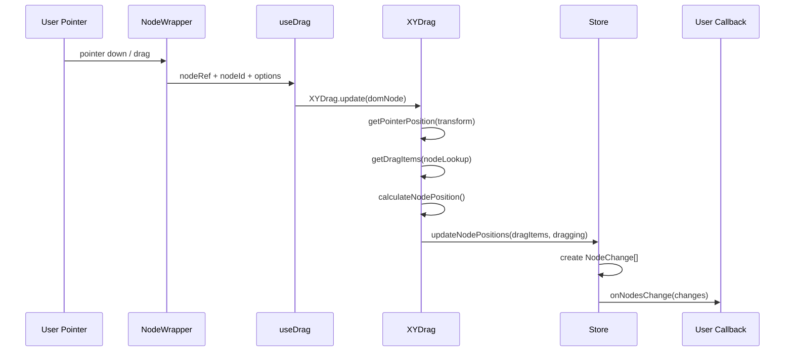
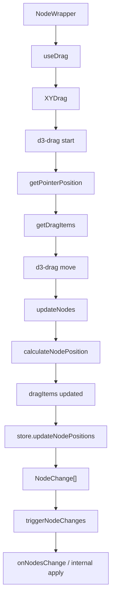

# 第 11 篇：XYDrag：节点拖拽系统

节点拖拽看起来是 React Flow 里最直观的能力。

用户按住一个节点，移动鼠标，节点跟着走。

如果只看效果，很容易把它想成：

```txt
pointer move
  ↓
node.position.x += deltaX
node.position.y += deltaY
```

但读到源码你会发现，React Flow 的拖拽系统远比这条公式厚：

- 鼠标事件要先从 screen/container 坐标转成 flow 坐标。
- 拖拽开始时要收集 `dragItems`，而不是只记当前节点。
- 多选拖拽要保持节点之间的相对距离。
- snapGrid 不能让多选节点各自独立吸附，必须共享 offset。
- nodeExtent 要限制节点不能被拖出边界。
- parent node 会让 `position` 和 `positionAbsolute` 不一样。
- auto pan 会同时移动 viewport 和拖拽中的节点。
- 拖拽中要触发 `onNodeDrag`，结束时要触发 `onNodeDragStop`。
- 最终不能直接改用户 nodes，而要走 `NodeChange`。

所以这一篇先建立一个结论：

> XYDrag 不是“节点 DOM 拖动工具”，而是把 pointer gesture 转成 graph data changes 的交互系统。

它站在第 9 篇和第 10 篇的基础上：

```txt
坐标系统
  让 pointer 从 screen/container 回到 flow

XYPanZoom
  让 auto pan 可以移动 viewport

XYDrag
  让节点在 flow 世界里移动，并把结果回流成 node changes
```

这篇要读懂的不是某一个拖拽事件，而是完整生命周期：

```txt
NodeWrapper
  ↓ useDrag
XYDrag
  ↓ d3-drag start / drag / end
dragItems
  ↓ calculateNodePosition
updateNodePositions
  ↓ NodeChange[]
triggerNodeChanges
  ↓ controlled / uncontrolled 回流
```

本章只抓三件事：

```txt
第一，拖拽更新的是 node position，不是 DOM left/top。
第二，dragItems 是一次拖拽会话的工作集，不是用户 nodes，也不是长期 store state。
第三，拖拽结果必须变成 NodeChange[]，再交给 controlled / uncontrolled 回流。
```

完整时序可以这样看：



写 mini-flow 时最容易犯四个错：

```txt
错误 1：用 client delta 更新 node.position。
错误 2：拖动画布时改所有 node.position。
错误 3：多选拖拽时每个 node 独立 snap。
错误 4：auto pan 时不按 zoom 修正。
```

---

## 1. 这一篇要解决的问题

上一篇讲 `XYPanZoom` 时，我们说它负责移动“镜头”。

这一篇讲 `XYDrag`，它负责移动“图里的实体”。

两者都跟位置有关，但位置语义完全不同：

```txt
pan / zoom
  改 viewport transform
  节点在 flow 世界里的 position 不变

node drag
  改 node position
  viewport transform 本身不一定变
```

如果混淆这两件事，就会写出很难修的交互 bug：

- 拖节点时把 screen delta 直接加到 node position，缩放后位置错误。
- 拖画布时批量修改所有 node position，图数据被污染。
- 多选节点时逐个 snap，节点之间相对位置被破坏。
- parent node 下只改 `positionAbsolute`，用户收到的 `onNodesChange` 不符合预期。
- auto pan 时 viewport 动了，但拖拽位置没补偿，节点会跟鼠标脱节。

所以 `XYDrag` 的问题不是“怎么监听 mousemove”。

它真正要解决的是：

> 在复杂视口、选择、父子节点、吸附、边界和受控状态下，如何把一次拖拽稳定地转成节点位置变化？

---

## 2. 先看用户 API 或运行效果

用户通常通过这些 props 感知拖拽系统：

```tsx
<ReactFlow
  nodes={nodes}
  edges={edges}
  nodesDraggable
  selectNodesOnDrag
  snapToGrid
  snapGrid={[20, 20]}
  nodeExtent={[
    [0, 0],
    [1000, 1000],
  ]}
  autoPanOnNodeDrag
  onNodeDragStart={(_, node) => {}}
  onNodeDrag={(_, node) => {}}
  onNodeDragStop={(_, node) => {}}
  onNodesChange={onNodesChange}
/>
```

从用户视角看，这是几个独立配置：

- 节点能不能拖。
- 拖拽时是否选中。
- 是否吸附网格。
- 是否限制范围。
- 靠近边缘时是否自动平移。
- 拖拽生命周期回调。
- 位置变化如何回到用户状态。

源码里它们汇入同一个运行时：

```txt
NodeWrapper
  计算 isDraggable / isSelectable
  ↓
useDrag
  创建 XYDrag
  ↓
XYDrag.update
  绑定 d3-drag 到 node DOM
  ↓
XYDrag start/drag/end
  读取 store 配置和状态
  ↓
store.updateNodePositions
  生成 NodeChange
```

这说明 `nodesDraggable` 不是一个单纯 class 开关。

它参与的是整套拖拽数据流。

---

## 3. 核心概念解释

### 3.1 NodeWrapper 是拖拽入口

每个节点最终由 `NodeWrapper` 包住。

它会根据节点级配置和全局配置算出：

```txt
isDraggable
isSelectable
isConnectable
isFocusable
```

源码坐标：

- `packages/react/src/components/NodeWrapper/index.tsx:64`

然后调用：

```txt
useDrag({
  nodeRef,
  disabled,
  noDragClassName,
  handleSelector: node.dragHandle,
  nodeId,
  isSelectable,
  nodeClickDistance
})
```

源码坐标：

- `packages/react/src/components/NodeWrapper/index.tsx:72`

也就是说，节点拖拽不是全局统一绑定到 pane 上，而是每个节点 wrapper 自己接入拖拽 controller。

这让 React Flow 可以支持：

- 某个节点不可拖。
- 某个节点指定 dragHandle。
- 节点内部某些区域不触发拖拽。
- 节点 dragging 状态影响 class 和用户组件 props。

### 3.2 useDrag 是 React 绑定层

`useDrag` 做的事很薄：

```txt
创建 XYDrag
  ↓
传入 getStoreItems: () => store.getState()
  ↓
传入 onNodeMouseDown / onDragStart / onDragStop
  ↓
在 effect 里调用 xyDrag.update(...)
  ↓
卸载时 destroy
```

源码坐标：

- `packages/react/src/hooks/useDrag.ts:22`
- `packages/react/src/hooks/useDrag.ts:36`
- `packages/react/src/hooks/useDrag.ts:54`

这里体现了 React 包和 system 包的分工：

```txt
useDrag
  负责 React 生命周期、node ref、local dragging state

XYDrag
  负责真正的拖拽算法和数据更新
```

### 3.3 dragItems 不是 nodes

`XYDrag` 拖拽时不直接操作用户的 nodes array。

它先构造一个：

```ts
Map<string, NodeDragItem>
```

`NodeDragItem` 里包括：

- `id`
- `position`
- `distance`
- `measured`
- `internals.positionAbsolute`
- `extent`
- `parentId`
- `origin`
- `expandParent`

源码坐标：

- `packages/system/src/types/nodes.ts:143`

这个结构是拖拽过程的工作副本。

它不是用户最终看到的 node，也不是完整的 InternalNode，而是“拖拽需要的最小内部快照”。

为什么要这样做？

因为拖拽过程中要频繁更新位置，如果每次都完整复制 nodes array，代价太高，也不适合处理多选、snap、extent。

`dragItems` 的意义是：

```txt
用 Map 保存本次拖拽涉及的节点
每次 pointer move 只更新这些节点的拖拽快照
再把快照转成 NodeChange
```

### 3.4 distance 是防跳动的关键

`NodeDragItem.distance` 是：

```txt
拖拽开始时
pointer flow position
  -
node.positionAbsolute
```

源码坐标：

- `packages/system/src/xydrag/utils.ts:52`

它解决的是一个很具体的问题。

用户可能按住节点中间开始拖，而不是按住节点左上角。如果没有 distance，第一次更新时节点左上角会跳到鼠标位置。

正确模型是：

```txt
nextNodePosition = currentPointerFlowPosition - initialPointerOffsetInsideNode
```

也就是源码里的：

```txt
nextPosition = { x: x - dragItem.distance.x, y: y - dragItem.distance.y }
```

源码坐标：

- `packages/system/src/xydrag/XYDrag.ts:150`

### 3.5 dragging 不只是 CSS 状态

`NodeWrapper` 会把 `dragging` 放进 class，也会传给用户的 node component。

源码坐标：

- `packages/react/src/components/NodeWrapper/index.tsx:198`
- `packages/react/src/components/NodeWrapper/index.tsx:242`

但 store 里的 `updateNodePositions` 也会在 `NodeChange` 里带上：

```txt
dragging: true / false
```

源码坐标：

- `packages/react/src/store/index.ts:220`

所以 dragging 同时影响：

- 节点视觉状态。
- 用户回调拿到的 node。
- `onNodesChange` 的 change object。
- 拖拽生命周期结束时的最终状态。

---

## 4. 源码入口在哪里

这一篇建议按这组文件读：

```txt
packages/react/src/components/NodeWrapper/index.tsx
packages/react/src/hooks/useDrag.ts
packages/system/src/xydrag/XYDrag.ts
packages/system/src/xydrag/utils.ts
packages/system/src/utils/dom.ts
packages/system/src/utils/graph.ts
packages/react/src/store/index.ts
```

它们分别负责：

| 文件 | 责任 |
| --- | --- |
| `NodeWrapper` | 节点 DOM、拖拽入口、dragging class、用户组件 props |
| `useDrag` | React 生命周期绑定，创建和更新 `XYDrag` |
| `XYDrag.ts` | d3-drag 生命周期、拖拽算法、auto pan |
| `xydrag/utils.ts` | 构造 dragItems、事件回调参数、multi drag snap offset |
| `utils/dom.ts` | pointer 坐标转换 |
| `utils/graph.ts` | 计算节点最终 position / positionAbsolute |
| `store/index.ts` | 把 dragItems 转成 NodeChange 并回流 |

不要从 `XYDrag.ts` 第一行一路硬读。

更好的顺序是：

```txt
NodeWrapper
  ↓
useDrag
  ↓
XYDrag start
  ↓
getDragItems
  ↓
XYDrag drag/updateNodes
  ↓
calculateNodePosition
  ↓
updateNodePositions
  ↓
triggerNodeChanges
```

---

## 5. 源码调用链

### 5.1 NodeWrapper：节点级配置汇入 useDrag

`NodeWrapper` 先从节点和全局配置算出可拖拽性：

```txt
node.draggable
nodesDraggable
```

源码坐标：

- `packages/react/src/components/NodeWrapper/index.tsx:64`

然后调用 `useDrag`。

这里传入的几个参数很关键：

- `disabled: node.hidden || !isDraggable`
- `noDragClassName`
- `handleSelector: node.dragHandle`
- `nodeId`
- `isSelectable`
- `nodeClickDistance`

这些参数决定了：

- 是否绑定拖拽。
- 节点内部哪些区域不能拖。
- 是否必须从指定 drag handle 开始拖。
- 拖拽时是否触发选中。
- 点击和拖拽的距离阈值。

### 5.2 useDrag：创建 XYDrag，并把 store 暴露给 system

`useDrag` 里创建 `XYDrag`：

```txt
XYDrag({
  getStoreItems: () => store.getState(),
  onNodeMouseDown,
  onDragStart,
  onDragStop
})
```

源码坐标：

- `packages/react/src/hooks/useDrag.ts:36`

这里最重要的是 `getStoreItems`。

`XYDrag` 不直接依赖 Zustand，也不 import React store。

它只需要一个函数：

```txt
每次拖拽事件发生时，拿到最新 store state
```

这是一种很好的边界设计：

```txt
system 层
  不认识 React store 的实现

React 层
  把当前 store 状态以 getStoreItems 形式注入
```

这也保证拖拽过程中读到的是最新配置，比如：

- `transform`
- `snapGrid`
- `nodeLookup`
- `nodeExtent`
- `autoPanOnNodeDrag`
- `updateNodePositions`

### 5.3 XYDrag.update：把 d3-drag 绑定到节点 DOM

`XYDrag` 返回的 public API 很简单：

```txt
update(...)
destroy()
```

源码坐标：

- `packages/system/src/xydrag/XYDrag.ts:69`

`update` 里调用：

```txt
d3Selection = select(domNode)
d3Selection.call(d3DragInstance)
```

源码坐标：

- `packages/system/src/xydrag/XYDrag.ts:113`
- `packages/system/src/xydrag/XYDrag.ts:412`

也就是说，每个可拖拽节点的 DOM 上会挂一套 d3-drag 行为。

`filter` 决定事件是否能进入拖拽：

```txt
!event.button
!noDragClassName
handleSelector 命中
```

源码坐标：

- `packages/system/src/xydrag/XYDrag.ts:403`

这解释了 `dragHandle` 和 `noDragClassName` 为什么能控制节点内部拖拽区域。

它们不是在 React onMouseDown 里手写判断，而是在 d3-drag 的入口 filter 里截断。

### 5.4 start：先记录 pointer，再按阈值决定是否真正拖

d3 的 `start` handler 里，`XYDrag` 先做准备：

```txt
containerBounds = domNode.getBoundingClientRect()
abortDrag = false
nodePositionsChanged = false
dragEvent = sourceEvent
pointerPos = getPointerPosition(...)
lastPos = pointerPos
mousePosition = getEventPosition(...)
```

源码坐标：

- `packages/system/src/xydrag/XYDrag.ts:306`

如果 `nodeDragThreshold === 0`，会立即 `startDrag(event)`。

否则只是记录起点，等 `drag` 事件里移动距离超过阈值再真正启动。

这里有个细节：阈值距离用 client/container 坐标算，而不是 flow 坐标。

源码注释也说明了原因：这样可以在不同 zoom 下保持一致的拖拽阈值。

源码坐标：

- `packages/system/src/xydrag/XYDrag.ts:346`

换句话说：

```txt
拖拽阈值
  属于用户手势体验
  用屏幕距离判断

节点位置更新
  属于图数据
  用 flow 坐标计算
```

这是坐标系统在交互设计里的具体落点。

### 5.5 startDrag：收集 dragItems

`startDrag` 里真正启动拖拽。

它先处理选择逻辑：

- `selectNodesOnDrag=false` 时，可能需要取消其他选中。
- `selectNodesOnDrag=true` 时，触发 node mouse down 选中当前节点。

源码坐标：

- `packages/system/src/xydrag/XYDrag.ts:261`

然后把 pointer 转成 flow 坐标：

```txt
getPointerPosition(event.sourceEvent, {
  transform,
  snapGrid,
  snapToGrid,
  containerBounds
})
```

源码坐标：

- `packages/system/src/xydrag/XYDrag.ts:280`

接着构造：

```txt
dragItems = getDragItems(nodeLookup, nodesDraggable, pointerPos, nodeId)
```

源码坐标：

- `packages/system/src/xydrag/XYDrag.ts:282`

`getDragItems` 会遍历 `nodeLookup`，把这些节点加入拖拽集合：

- 当前节点。
- 或已选中的节点。
- 父节点被选中时，子节点不重复加入。
- 节点本身 draggable，或全局 nodesDraggable 且节点没有显式禁用。

源码坐标：

- `packages/system/src/xydrag/utils.ts:34`

这就是多选拖拽的基础。

拖拽的单位不是“当前 DOM 元素”，而是一个 `dragItems` map。

### 5.6 drag：每次 pointer move 都进入 flow 坐标

`drag` handler 每次都重新取最新 store：

```txt
autoPanOnNodeDrag
transform
snapGrid
snapToGrid
nodeDragThreshold
nodeLookup
```

然后调用 `getPointerPosition`：

```txt
pointerPos = getPointerPosition(sourceEvent, {
  transform,
  snapGrid,
  snapToGrid,
  containerBounds
})
```

源码坐标：

- `packages/system/src/xydrag/XYDrag.ts:324`

这说明拖拽更新不使用 d3 的 `event.x/event.y` 作为节点位置。

React Flow 要的是 flow 坐标下的 pointer。

如果用户在拖拽过程中 zoom 变化，下一次 pointer 计算也会用最新 transform。

接着处理几个边界：

- 多指 touch 时 abort。
- 当前节点被删除时 abort。
- 如果 auto pan 还没启动，就启动。
- 如果还没超过 threshold，就继续等待。
- 如果 snapped 位置没有变化，就跳过。

源码坐标：

- `packages/system/src/xydrag/XYDrag.ts:329`
- `packages/system/src/xydrag/XYDrag.ts:341`
- `packages/system/src/xydrag/XYDrag.ts:359`

最后才调用：

```txt
updateNodes(pointerPos)
```

### 5.7 updateNodes：拖拽算法的核心

`updateNodes` 是 `XYDrag` 的心脏。

它先读取：

```txt
nodeLookup
nodeExtent
snapGrid
snapToGrid
nodeOrigin
onNodeDrag
onSelectionDrag
onError
updateNodePositions
```

源码坐标：

- `packages/system/src/xydrag/XYDrag.ts:115`

然后判断是否是多选拖拽：

```txt
isMultiDrag = dragItems.size > 1
nodesBox = getInternalNodesBounds(dragItems)
```

源码坐标：

- `packages/system/src/xydrag/XYDrag.ts:136`

如果多选并且开启 snapGrid，它不会让每个节点各自 snap。

而是先计算一个共享的 `multiDragSnapOffset`：

```txt
calculateSnapOffset(...)
```

源码坐标：

- `packages/system/src/xydrag/XYDrag.ts:138`
- `packages/system/src/xydrag/utils.ts:110`

这很关键。

如果多选拖拽时每个节点单独吸附网格，那么节点之间的相对位置可能会被改变。

React Flow 的做法是：

```txt
用一个参考节点计算吸附偏移
所有拖拽节点使用同一个 offset
```

这样整个 selection 像一个整体吸附。

### 5.8 calculateNodePosition：把 nextPosition 转成 position 与 positionAbsolute

对每个 dragItem，源码先算：

```txt
nextPosition = pointer - dragItem.distance
```

然后考虑 snap，再考虑多选下的 adjustedNodeExtent。

最后调用：

```txt
calculateNodePosition({
  nodeId,
  nextPosition,
  nodeLookup,
  nodeExtent,
  nodeOrigin,
  onError
})
```

源码坐标：

- `packages/system/src/xydrag/XYDrag.ts:177`
- `packages/system/src/utils/graph.ts:393`

`calculateNodePosition` 做了几件重要的事：

- 找 parent node。
- 如果 extent 是 `'parent'`，把范围转成 parent bounds。
- 如果 extent 是相对 parent 的坐标范围，转成绝对范围。
- 用 `clampPosition` 限制 `positionAbsolute`。
- 再根据 parent 和 origin 反推出用户侧 `position`。

源码坐标：

- `packages/system/src/utils/graph.ts:412`
- `packages/system/src/utils/graph.ts:430`
- `packages/system/src/utils/graph.ts:443`

这就是为什么拖拽不能只写：

```txt
node.position = nextPosition
```

因为最终需要同时维护：

```txt
dragItem.position
dragItem.internals.positionAbsolute
```

一个面向用户 API，一个面向内部渲染与计算。

### 5.9 updateNodePositions：把拖拽快照转成 NodeChange

`XYDrag` 不直接调用 `setNodes`。

它调用 store action：

```txt
updateNodePositions(dragItems, true)
```

源码坐标：

- `packages/system/src/xydrag/XYDrag.ts:199`

store 里 `updateNodePositions` 会把每个 dragItem 转成：

```ts
{
  id,
  type: 'position',
  position,
  dragging,
}
```

源码坐标：

- `packages/react/src/store/index.ts:210`
- `packages/react/src/store/index.ts:220`

如果节点启用了 `expandParent`，它还会收集 `parentExpandChildren`，最后通过 `handleExpandParent` 追加 parent expand changes。

源码坐标：

- `packages/react/src/store/index.ts:235`

如果拖拽的是正在连线的 source node，store 还会更新 connection 的 `from` 位置：

源码坐标：

- `packages/react/src/store/index.ts:227`

这说明拖拽不是孤立模块。

拖动节点会影响：

- node changes。
- parent expand。
- 正在进行中的 connection line。
- 用户 onNodeDrag 回调。
- 受控 / 非受控 nodes 回流。

### 5.10 triggerNodeChanges：拖拽结果如何回到用户

`updateNodePositions` 最后调用：

```txt
triggerNodeChanges(changes)
```

源码坐标：

- `packages/react/src/store/index.ts:258`

`triggerNodeChanges` 里有受控 / 非受控分流：

```txt
hasDefaultNodes
  内部 applyNodeChanges 并 setNodes

无论如何
  调用 onNodesChange(changes)
```

源码坐标：

- `packages/react/src/store/index.ts:264`

这就是拖拽和用户 state 的边界：

```txt
XYDrag
  产生拖拽过程

store.updateNodePositions
  产生 NodeChange

triggerNodeChanges
  controlled / uncontrolled 回流
```

React Flow 不会偷偷改受控用户的 nodes array。

它发出 change，由用户的 `onNodesChange` 决定如何应用。

### 5.11 autoPan：拖拽能推动镜头

拖拽到画布边缘时，React Flow 可以自动平移 viewport。

`XYDrag` 里的 auto pan 逻辑是：

```txt
calcAutoPan(mousePosition, containerBounds, autoPanSpeed)
  ↓
panBy({ x: xMovement, y: yMovement })
  ↓
lastPos -= movement / zoom
  ↓
updateNodes(lastPos)
```

源码坐标：

- `packages/system/src/xydrag/XYDrag.ts:227`
- `packages/system/src/xydrag/XYDrag.ts:237`

这里很容易混乱。

auto pan 改的是 viewport。

但用户还在拖节点，鼠标相对 flow 世界的位置也会因为 viewport 移动而变化。

所以源码用：

```txt
xMovement / zoom
yMovement / zoom
```

修正 `lastPos`。

这就是第 9 篇坐标系统和第 10 篇 panzoom 在 `XYDrag` 里的交汇点：

```txt
拖拽节点
  改 node position

靠边 auto pan
  改 viewport transform

为了让节点继续跟住鼠标
  需要把 viewport 移动量折算回 flow 坐标
```

### 5.12 end：把 dragging=false 发出去

拖拽结束时，`XYDrag` 做收尾：

- 停止 auto pan。
- 重置 dragStarted。
- 如果位置变过，调用 `updateNodePositions(dragItems, false)`。
- 调用 `onDragStop` / `onNodeDragStop` / `onSelectionDragStop`。

源码坐标：

- `packages/system/src/xydrag/XYDrag.ts:365`

这里的第二次 `updateNodePositions(..., false)` 很重要。

拖拽中变化发出去时：

```txt
dragging: true
```

结束时如果位置发生过变化，要再发一次：

```txt
dragging: false
```

这样用户和内部状态都知道拖拽生命周期结束了。

---

## 6. 关键数据结构

### 6.1 StoreItems

`XYDrag` 通过 `getStoreItems` 获取一组运行时数据：

```ts
type StoreItems = {
  nodes: NodeType[];
  nodeLookup: Map<string, InternalNodeBase<NodeType>>;
  edges: EdgeType[];
  nodeExtent: CoordinateExtent;
  snapGrid: SnapGrid;
  snapToGrid: boolean;
  nodeOrigin: NodeOrigin;
  multiSelectionActive: boolean;
  domNode?: Element | null;
  transform: Transform;
  autoPanOnNodeDrag: boolean;
  nodesDraggable: boolean;
  selectNodesOnDrag: boolean;
  nodeDragThreshold: number;
  panBy: PanBy;
  updateNodePositions: UpdateNodePositions;
  ...
};
```

源码坐标：

- `packages/system/src/xydrag/XYDrag.ts:31`

它不是一个独立 store，而是 `XYDrag` 对 store 的依赖清单。

这份清单说明拖拽依赖哪些运行时事实。

### 6.2 NodeDragItem

`NodeDragItem` 是拖拽过程中的节点工作副本。

```ts
type NodeDragItem = {
  id: string;
  position: XYPosition;
  distance: XYPosition;
  measured: {
    width: number;
    height: number;
  };
  internals: {
    positionAbsolute: XYPosition;
  };
} & Pick<InternalNodeBase, 'extent' | 'parentId' | 'origin' | 'expandParent' | 'dragging'>;
```

源码坐标：

- `packages/system/src/types/nodes.ts:143`

它保留的是拖拽计算必需的信息。

### 6.3 DragUpdateParams

`XYDrag.update` 接收：

```ts
type DragUpdateParams = {
  noDragClassName?: string;
  handleSelector?: string;
  isSelectable?: boolean;
  nodeId?: string;
  domNode: Element;
  nodeClickDistance?: number;
};
```

源码坐标：

- `packages/system/src/xydrag/XYDrag.ts:75`

这是 React 节点 wrapper 每次把当前 DOM 和节点级配置同步给框架无关 controller 的接口。它位于 system 层，但会绑定 DOM 和 d3-drag，所以不要把它理解成纯函数工具。

### 6.4 NodeChange position

拖拽最终输出的是 position change：

```ts
type NodeChange = {
  id: string;
  type: 'position';
  position: XYPosition;
  dragging: boolean;
};
```

源码里构造这个 change 的地方在 store：

- `packages/react/src/store/index.ts:218`

这就是 React Flow 对外的交互结果。

不是 DOM style，不是 pointer delta，而是“节点位置发生变化”的结构化事件。

---

## 7. 关键实现思路

可以用这张图记住整个拖拽链路：



### 7.1 拖拽入口处理坐标

`getPointerPosition` 把事件坐标转成 flow 坐标。

这让后面的拖拽算法不需要再关心 viewport transform。

```txt
event.clientX/Y
  ↓ subtract container bounds
container position
  ↓ pointToRendererPoint(transform)
flow position
```

### 7.2 拖拽算法处理 graph data

`updateNodes` 只关心：

- pointer flow position。
- dragItem distance。
- snapGrid。
- nodeExtent。
- parent/origin。
- position/positionAbsolute。

它不直接操作 DOM。

节点 DOM 之所以移动，是因为 store 变化后 `NodeWrapper` 使用新的 `internals.positionAbsolute` 渲染：

```txt
transform: translate(positionAbsolute.x, positionAbsolute.y)
```

源码坐标：

- `packages/react/src/components/NodeWrapper/index.tsx:203`

### 7.3 Store 负责回流语义

`XYDrag` 不知道 controlled / uncontrolled。

它只调用：

```txt
updateNodePositions(dragItems, dragging)
```

store 才知道：

- 是否 defaultNodes。
- 是否需要内部 apply changes。
- 是否调用用户 onNodesChange。
- 是否有 middleware。
- 是否要处理 expandParent。
- 是否要更新 connection from。

这让 `XYDrag` 专注于交互本身。

### 7.4 多选拖拽是整体问题，不是循环单节点

React Flow 没有把多选拖拽实现成：

```txt
for selected node:
  node.position += delta
  snap(node)
```

而是：

```txt
dragItems Map
  ↓
selection bounds
  ↓
shared snap offset
  ↓
per-node extent adjustment
```

原因是多选拖拽要维护整体关系。

如果你自己实现 mini-flow，这里是最容易写薄的地方。

---

## 8. 这部分源码的设计取舍

### 8.1 使用 d3-drag，而不是 React pointer events

和 `XYPanZoom` 使用 d3-zoom 一样，`XYDrag` 使用 d3-drag。

这不是因为 React 做不到 pointer events。

而是 d3-drag 已经处理了一些底层 gesture 细节，并且和 d3-selection 的命令式绑定模型适合这种 DOM controller。

React Flow 的做法是：

```txt
d3-drag
  处理底层拖拽事件生命周期

XYDrag
  处理图编辑器拖拽语义
```

这和 panzoom 的架构风格一致。

### 8.2 system 层不直接依赖 React store

`XYDrag` 通过 `getStoreItems` 拿状态。

这让它可以放在 `@xyflow/system`，被 React / Svelte 复用。

代价是 `StoreItems` 这个依赖清单比较长。

但这个长清单也有价值：它清楚暴露了拖拽系统到底依赖哪些运行时能力。

### 8.3 拖拽中使用可变 dragItems

`dragItems` 在拖拽过程中会被原地更新。

这在纯 React 思维里看起来有点“不函数式”。

但它是高频交互里的务实选择：

- pointer move 频率很高。
- 多选拖拽可能涉及很多节点。
- 每次都构造完整 nodes array 会很重。
- 最终仍然通过 NodeChange 回到声明式边界。

也就是说，内部可以为了性能使用可变工作集，但对外仍然保持结构化 change。

### 8.4 坐标和数据职责分离

`getPointerPosition` 负责坐标转换。

`calculateNodePosition` 负责 parent、origin、extent。

`updateNodePositions` 负责 change 回流。

这三个点分开后，拖拽系统虽然代码不少，但职责相对清楚：

```txt
坐标入口
  screen/container -> flow

节点约束
  flow nextPosition -> position / positionAbsolute

状态回流
  dragItems -> NodeChange
```

### 8.5 auto pan 是 drag 与 panzoom 的交叉点

auto pan 是最容易写乱的地方。

它同时涉及：

- pointer 在 container 里的位置。
- viewport 的 panBy。
- transform zoom。
- 当前 dragItems 的 flow position。
- requestAnimationFrame 循环。

React Flow 把 auto pan 放在 `XYDrag` 内部，因为它是“拖节点时触发的画布移动”。

但实际移动 viewport 的动作仍然交给 store 的 `panBy`，也就是 panzoom 系统。

这保持了边界：

```txt
XYDrag
  判断什么时候需要 auto pan

panZoom / store.panBy
  实际改变 viewport
```

---

## 9. 如果我们自己实现，最小版本应该怎么写

mini-flow 的节点拖拽可以先实现一个小版本，但不要跳过两个关键点：

1. pointer 必须转成 flow 坐标。
2. 拖拽结果必须以 change 形式回流。

### 9.1 基础类型

```ts
type Point = {
  x: number;
  y: number;
};

type Node = {
  id: string;
  position: Point;
  selected?: boolean;
  draggable?: boolean;
};

type NodePositionChange = {
  id: string;
  type: 'position';
  position: Point;
  dragging: boolean;
};
```

### 9.2 拖拽工作集

```ts
type DragItem = {
  id: string;
  position: Point;
  distance: Point;
};

function createDragItems(nodes: Node[], pointer: Point, nodeId: string): Map<string, DragItem> {
  const items = new Map<string, DragItem>();

  for (const node of nodes) {
    if (node.id !== nodeId && !node.selected) {
      continue;
    }

    if (node.draggable === false) {
      continue;
    }

    items.set(node.id, {
      id: node.id,
      position: node.position,
      distance: {
        x: pointer.x - node.position.x,
        y: pointer.y - node.position.y,
      },
    });
  }

  return items;
}
```

### 9.3 更新拖拽工作集

```ts
function updateDragItems(items: Map<string, DragItem>, pointer: Point): NodePositionChange[] {
  const changes: NodePositionChange[] = [];

  for (const item of items.values()) {
    item.position = {
      x: pointer.x - item.distance.x,
      y: pointer.y - item.distance.y,
    };

    changes.push({
      id: item.id,
      type: 'position',
      position: item.position,
      dragging: true,
    });
  }

  return changes;
}
```

### 9.4 应用 changes

```ts
function applyNodeChanges(nodes: Node[], changes: NodePositionChange[]): Node[] {
  const changeMap = new Map(changes.map((change) => [change.id, change]));

  return nodes.map((node) => {
    const change = changeMap.get(node.id);

    if (!change) {
      return node;
    }

    return {
      ...node,
      position: change.position,
    };
  });
}
```

### 9.5 接入 viewport 坐标

拖拽事件里不要直接用 `event.clientX`。

```ts
function handlePointerMove(event: PointerEvent) {
  const pointerFlow = screenToFlowPosition({
    x: event.clientX,
    y: event.clientY,
  });

  const changes = updateDragItems(dragItems, pointerFlow);
  onNodesChange(changes);
}
```

这个版本还没有：

- snapGrid。
- nodeExtent。
- parent node。
- auto pan。
- drag threshold。
- drag handle。
- multi drag snap offset。

但它已经保留了 React Flow 的核心设计：

```txt
pointer event
  ↓ flow 坐标
drag item 工作集
  ↓
NodeChange
  ↓
controlled / uncontrolled 回流
```

后续再加复杂能力时，结构不会推倒重来。

---

## 10. 本篇总结

这一篇我们读完了节点拖拽的主链路。

React Flow 的 `XYDrag` 不是直接移动 DOM，也不是简单修改 node position。

它做的是：

```txt
NodeWrapper
  接入节点 DOM 和节点级配置

useDrag
  用 React 生命周期创建 XYDrag

XYDrag
  用 d3-drag 接收 gesture
  用 getPointerPosition 转 flow 坐标
  用 getDragItems 收集拖拽工作集
  用 updateNodes 处理 snap、extent、multi drag
  用 calculateNodePosition 维护 position / positionAbsolute
  用 autoPan 协调 viewport

store.updateNodePositions
  把 dragItems 转成 NodeChange

triggerNodeChanges
  controlled / uncontrolled 回流给用户
```

几个核心结论：

- 拖拽阈值属于屏幕体验，用 client/container 距离判断。
- 节点位置属于 graph data，用 flow 坐标更新。
- 多选拖拽要维护整体关系，不能逐节点独立 snap。
- parent / origin / extent 会让最终 position 计算变复杂。
- auto pan 是 drag 与 panzoom 的交汇点，需要按 zoom 修正。
- 对外结果必须是 `NodeChange`，不能绕过 React Flow 的受控边界。

读懂 `XYDrag` 后，再看 React Flow 的交互系统，会更容易看到它的基本模式：

```txt
底层 gesture controller
  ↓
运行时工作集
  ↓
内部数据结构
  ↓
结构化 change
  ↓
用户 API 回流
```

---

## 11. 下一篇读什么

下一篇进入：

```txt
第 12 篇：XYHandle：Handle 和连线系统
```

节点拖拽解决的是“移动已有实体”。

连线系统解决的是另一个问题：

```txt
从一个 handle 出发
  ↓
追踪 pointer
  ↓
寻找最近 handle
  ↓
校验 connection
  ↓
渲染 connection line
  ↓
pointer up 时产生 onConnect
```

它会继续复用坐标系统、nodeLookup、handleBounds、autoPan、store connection state。

如果说 `XYDrag` 把 pointer gesture 转成 node changes，`XYHandle` 就是把 pointer gesture 转成 graph relationship changes。
