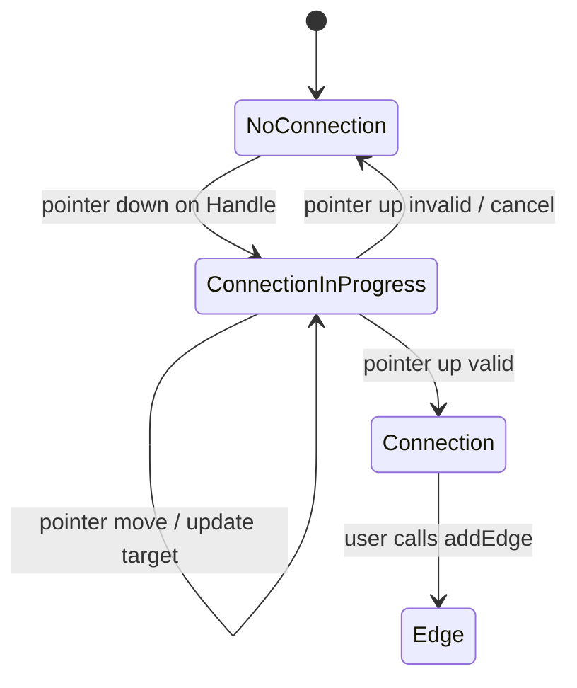
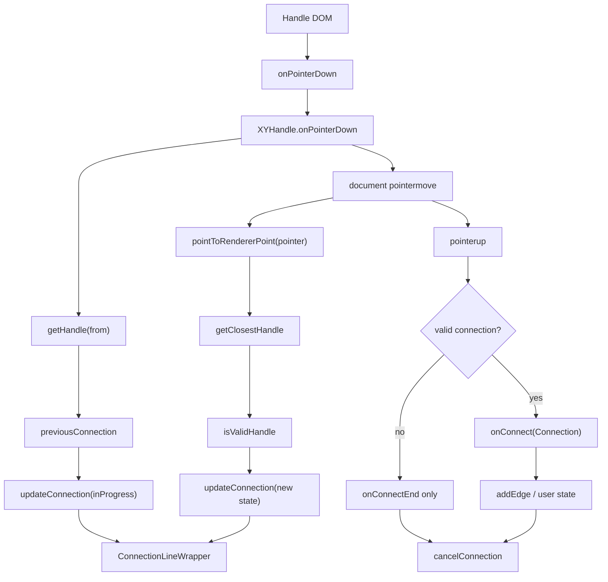

# 第 12 篇：XYHandle：Handle 和连线系统

很多人第一次看 React Flow 的连线能力，会自然地把它归到 `EdgeRenderer`：

> 线是 edge，那用户拖线创建连接，应该也是 EdgeRenderer 管吧？

这个直觉很合理，但它是错的。

`EdgeRenderer` 负责渲染“已经存在的边”。

连线过程负责的是另一件事：

```txt
用户从一个 handle 按下
  ↓
移动 pointer
  ↓
寻找可能的目标 handle
  ↓
判断连接是否合法
  ↓
更新 connection runtime state
  ↓
渲染临时 connection line
  ↓
pointer up 时触发 onConnect
```

这条链路在源码里主要由 `Handle` 组件、`XYHandle` 这个框架无关 controller、store 的 `connection` 状态和 `ConnectionLineWrapper` 共同完成。

所以这篇先建立一个结论：

> React Flow 的连线系统不是边渲染系统，而是一个把 pointer gesture 转成 graph relationship 的交互运行时。

它和前面几篇的关系是：

```txt
InternalNode
  提供 handleBounds 和 positionAbsolute

坐标系统
  在 container / flow 坐标之间转换 pointer 与 handle

XYPanZoom
  提供 panBy，支持连线时 auto pan

XYHandle
  管理连接手势、目标查找、合法性校验和 connection state

ConnectionLine
  只消费 connection state 渲染临时线

onConnect / addEdge
  把合法 Connection 转成用户的 edge 数据
```

这一篇的重点不是“怎么画一条 SVG path”，而是：

> React Flow 如何知道这次拖拽从哪个 handle 来、要连到哪个 handle、是否合法、何时应该变成 edge？

本章只抓三件事：

```txt
第一，Handle 是连接端点，不只是 UI 小圆点。
第二，ConnectionState 是拖线过程中的临时状态，不是 Edge。
第三，EdgeRenderer 只渲染已有边，不负责寻找目标 handle 或判断连接合法性。
```

Connection 和 Edge 的生命周期可以这样看：



三种数据要分开：

| 数据 | 生命周期 | 用途 |
| --- | --- | --- |
| `Handle` | 节点渲染后存在 | 连接端点 |
| `ConnectionState` | pointer down 到 pointer up | 临时线、校验、hook |
| `Edge` | 用户确认后存在 | 图数据和渲染 |

---

## 1. 这一篇要解决的问题

第 11 篇讲 `XYDrag`，我们看到节点拖拽会把 pointer gesture 转成 `NodeChange`。

这一篇讲 `XYHandle`，它把 pointer gesture 转成 `Connection`。

两者形态类似：

```txt
XYDrag
  pointer gesture
  ↓
  dragItems
  ↓
  NodeChange[]

XYHandle
  pointer gesture
  ↓
  connection state
  ↓
  Connection
```

但连线比拖节点多一个问题：

> 目标不是一个连续坐标，而是另一个 handle。

拖节点时，pointer 到哪儿，节点就跟着算位置。

连线时，pointer 到哪儿只是临时线的末端；真正要产生 edge，必须落到一个合法的 target handle 上。

这就带来几类源码问题：

- handle 的 DOM 如何和 node / handle id 对应？
- handle 的几何位置从哪里来？
- pointer move 时如何找最近 handle？
- `ConnectionMode.Strict` 和 `ConnectionMode.Loose` 有什么区别？
- `isValidConnection` 在什么时候调用？
- 为什么 connection line 不是直接存 SVG path？
- click connect 和 drag connect 为什么共用 `XYHandle.isValid`？
- 连线完成后为什么只产生 `Connection`，不是直接产生 `Edge`？

这些问题合起来，就是 React Flow 的连接系统。

---

## 2. 先看用户 API 或运行效果

最小连线 API 通常长这样：

```tsx
const [nodes, setNodes, onNodesChange] = useNodesState(initialNodes);
const [edges, setEdges, onEdgesChange] = useEdgesState(initialEdges);

const onConnect = useCallback((connection: Connection) => {
  setEdges((edges) => addEdge(connection, edges));
}, []);

return (
  <ReactFlow
    nodes={nodes}
    edges={edges}
    onNodesChange={onNodesChange}
    onEdgesChange={onEdgesChange}
    onConnect={onConnect}
  />
);
```

用户只看到一个 `onConnect(connection)`。

但一次拖拽连线背后发生了很多事：

```txt
<Handle type="source" />
  ↓ onMouseDown / onTouchStart
XYHandle.onPointerDown
  ↓
store.connection = ConnectionInProgress
  ↓
ConnectionLineWrapper 渲染临时线
  ↓
pointer move 持续更新 connection.to / isValid / toHandle
  ↓
pointer up
  ↓
onConnect(connection)
  ↓
addEdge(connection, edges)
```

`Connection` 的形状非常小：

```ts
type Connection = {
  source: string;
  target: string;
  sourceHandle: string | null;
  targetHandle: string | null;
};
```

源码坐标：

- `packages/system/src/types/general.ts:75`

这说明连接系统产出的不是视觉线段，而是一段图关系：

```txt
source node / source handle
  →
target node / target handle
```

真正把它升级成 edge 的，是用户回调里常用的 `addEdge`，或者非受控 edges 模式下 React Flow 内部帮你调用 `addEdge`。

---

## 3. 核心概念解释

### 3.1 Handle：节点上的连接点

`Handle` 是节点上的连接点。

system 类型里它包含：

```ts
type Handle = {
  id?: string | null;
  nodeId: string;
  x: number;
  y: number;
  position: Position;
  type: 'source' | 'target';
  width: number;
  height: number;
};
```

源码坐标：

- `packages/system/src/types/handles.ts:8`

注意这里的 handle 不只是一个 DOM 元素。

它同时有：

- 语义：source / target。
- 身份：nodeId + handle id。
- 几何：x / y / width / height。
- 朝向：Position.Top / Right / Bottom / Left。

这就是边路径算法和连接系统都依赖 handle 的原因。

### 3.2 Connection：还不是 Edge

`Connection` 是一段最小关系：

```txt
source
sourceHandle
target
targetHandle
```

它不是完整 edge。

完整 edge 还会有：

- `id`
- `type`
- `data`
- `markerStart`
- `markerEnd`
- `selected`
- `animated`
- `interactionWidth`

所以 React Flow 让 `onConnect` 只收到 connection，用户再决定如何创建 edge。

这是一种非常重要的边界：

```txt
连接交互系统
  负责判断用户建立了哪两个 handle 的关系

业务数据系统
  决定这段关系如何变成 edge
```

### 3.3 ConnectionState：连线中的运行时状态

连线过程中，store 保存的是 `ConnectionState`。

没有连线时：

```txt
inProgress: false
from: null
to: null
fromHandle: null
toHandle: null
...
```

源码坐标：

- `packages/system/src/types/general.ts:307`

连线进行中时：

```ts
type ConnectionInProgress = {
  inProgress: true;
  isValid: boolean | null;
  from: XYPosition;
  fromHandle: Handle;
  fromPosition: Position;
  fromNode: InternalNode;
  to: XYPosition;
  toHandle: Handle | null;
  toPosition: Position;
  toNode: InternalNode | null;
  pointer: XYPosition;
};
```

源码坐标：

- `packages/system/src/types/general.ts:334`

这个状态同时服务：

- 临时 connection line 渲染。
- handle class 状态。
- `useConnection` hook。
- `onConnectEnd` 回调。
- 连线过程中节点拖拽时更新起点。

### 3.4 ConnectionMode.Strict / Loose

`ConnectionMode` 有两个值：

```ts
enum ConnectionMode {
  Strict = 'strict',
  Loose = 'loose',
}
```

源码坐标：

- `packages/system/src/types/general.ts:125`

语义是：

```txt
Strict
  只允许 source -> target 或 target -> source

Loose
  允许 source -> source、target -> target
  只要不是同一个 handle 自己连自己
```

这会影响：

- 起点 handle 怎么找。
- 哪些 handle 是 possible end handle。
- `isValidHandle` 里连接是否合法。

### 3.5 isValidConnection：业务校验钩子

连接系统有内置校验：

- handle 是否 connectable。
- 目标是否 connectableEnd。
- strict mode 下类型是否相反。
- loose mode 下是否不是同一个 handle。

但业务通常还需要自定义规则：

- 某类节点不能连接。
- 不能形成环。
- 一个输入 handle 只能连一条线。
- source / target 类型必须匹配。

这些规则通过 `isValidConnection` 注入。

源码里 `Handle` 会优先使用 handle 自己的 `isValidConnection`，否则使用 store 上的全局 `isValidConnection`。

源码坐标：

- `packages/react/src/components/Handle/index.tsx:133`

---

## 4. 源码入口在哪里

这一篇建议按五个文件读：

```txt
packages/react/src/components/Handle/index.tsx
packages/system/src/xyhandle/XYHandle.ts
packages/system/src/xyhandle/utils.ts
packages/react/src/components/ConnectionLine/index.tsx
packages/react/src/hooks/useConnection.ts
```

还要带着看：

```txt
packages/system/src/types/handles.ts
packages/system/src/types/general.ts
packages/react/src/store/index.ts
packages/react/src/store/initialState.ts
```

它们的职责分别是：

| 文件 | 责任 |
| --- | --- |
| `Handle/index.tsx` | React handle DOM、事件入口、class 状态、click connect |
| `XYHandle.ts` | 连线手势生命周期、目标查找、合法性校验、onConnect |
| `xyhandle/utils.ts` | 最近 handle 查找、handle 获取、strict/loose 辅助 |
| `ConnectionLine/index.tsx` | 根据 connection state 渲染临时线 |
| `useConnection.ts` | 对外暴露当前 connection state |
| `store/index.ts` | `updateConnection` / `cancelConnection` |
| `types/general.ts` | `Connection` / `ConnectionState` / `ConnectionMode` 类型 |

推荐阅读顺序：

```txt
Handle
  ↓ 用户从哪里开始连线
XYHandle.onPointerDown
  ↓ 连线手势如何启动
XYHandle.onPointerMove
  ↓ 如何找目标 handle 和更新 connection
ConnectionLineWrapper
  ↓ connection state 如何被渲染
XYHandle.onPointerUp
  ↓ 如何触发 onConnect 并清理
```

---

## 5. 源码调用链

### 5.1 Handle：DOM 上挂着连接身份

`Handle` 渲染的是一个 `div`，但它在 DOM 上放了几类关键数据：

```tsx
data-handleid={handleId}
data-nodeid={nodeId}
data-handlepos={position}
data-id={`${rfId}-${nodeId}-${handleId}-${type}`}
```

源码坐标：

- `packages/react/src/components/Handle/index.tsx:197`

这些属性服务两件事。

第一，DOM 事件反查身份。

当 pointer 移动到某个 handle 上时，`XYHandle` 可以通过 DOM 属性知道：

```txt
这个 handle 属于哪个 node
handle id 是什么
source 还是 target
```

第二，querySelector 定位候选 handle。

`XYHandle.isValidHandle` 里会用 `data-id` 查对应的 DOM handle。

源码坐标：

- `packages/system/src/xyhandle/XYHandle.ts:263`

这说明 handle 的 DOM 不是纯展示，它是交互运行时的一部分。

### 5.2 Handle class 同时表达交互状态

`Handle` 的 class 会根据 store.connection 变化：

- `connectingfrom`
- `connectingto`
- `valid`
- `connectionindicator`
- `connectable`
- `connectablestart`
- `connectableend`

源码坐标：

- `packages/react/src/components/Handle/index.tsx:204`

这些 class 不只是样式。

`XYHandle.isValidHandle` 里会检查：

```txt
handleDomNode.classList.contains('connectable')
handleDomNode.classList.contains('connectableend')
```

源码坐标：

- `packages/system/src/xyhandle/XYHandle.ts:288`

也就是说，React 层计算出来的可连接状态，会通过 DOM class 参与 system 层的合法性判断。

这是一个很有意思的边界：

```txt
React component
  负责把状态编码到 DOM class

framework-agnostic controller
  通过 DOM class 判断当前 handle 是否可作为终点
```

### 5.3 Handle.onPointerDown：把 store 能力注入 XYHandle

拖拽连线从 `Handle` 的 `onMouseDown` / `onTouchStart` 开始。

`Handle` 会调用：

```txt
XYHandle.onPointerDown(event.nativeEvent, {
  handleDomNode,
  autoPanOnConnect,
  connectionMode,
  connectionRadius,
  domNode,
  nodeLookup,
  lib,
  isTarget,
  handleId,
  nodeId,
  flowId,
  panBy,
  cancelConnection,
  onConnectStart,
  onConnectEnd,
  updateConnection,
  onConnect,
  isValidConnection,
  getTransform,
  getFromHandle,
  autoPanSpeed,
  dragThreshold
})
```

源码坐标：

- `packages/react/src/components/Handle/index.tsx:112`

和 `useDrag` 给 `XYDrag` 注入 `getStoreItems` 类似，这里 `Handle` 把 `XYHandle` 需要的能力一次性注入进去。

`XYHandle` 不直接依赖 React store。

它只拿到：

- 当前 `nodeLookup`。
- 当前 `transform` 获取函数。
- 更新 connection 的 action。
- panBy / cancelConnection。
- 连接回调。
- 校验函数。
- DOM 和 class namespace。

这让 `XYHandle` 可以放在 `@xyflow/system`。

### 5.4 onConnectExtended：Connection 如何变成 Edge

`Handle` 内部定义了 `onConnectExtended`。

当 `XYHandle` 触发 `onConnect(connection)` 时，React 层会做：

```txt
edgeParams = { ...defaultEdgeOptions, ...connection }

if hasDefaultEdges:
  setEdges(addEdge(edgeParams, edges))

onConnectAction(edgeParams)
onConnect(edgeParams)
```

源码坐标：

- `packages/react/src/components/Handle/index.tsx:87`

这对应受控 / 非受控 edges 的分工。

非受控 edges：

```txt
React Flow 内部 addEdge
```

受控 edges：

```txt
React Flow 调 onConnect
用户自己 setEdges(addEdge(...))
```

也再次说明：

> XYHandle 只产出 Connection，是否加入 edges，是 React 层和用户状态管理的事。

### 5.5 XYHandle.onPointerDown：连接起点如何建立

进入 `XYHandle.ts`。

`onPointerDown` 一开始会拿：

```txt
doc = getHostForElement(event.target)
event client position
handleType
containerBounds
```

源码坐标：

- `packages/system/src/xyhandle/XYHandle.ts:48`
- `packages/system/src/xyhandle/XYHandle.ts:60`

`getHostForElement` 的作用是支持 shadow root。

这说明 pointer move / up 监听不是简单绑在 `window.document` 上，而是绑到事件目标所属的 host document / shadow root。

接着通过：

```txt
getHandle(nodeId, handleType, handleId, nodeLookup, connectionMode)
```

找到起点 handle。

源码坐标：

- `packages/system/src/xyhandle/XYHandle.ts:69`
- `packages/system/src/xyhandle/utils.ts:76`

`getHandle` 里有一个关键分支：

```txt
strict mode
  只在指定 type 的 handleBounds 里找

loose mode
  source 和 target handleBounds 都可以找
```

源码坐标：

- `packages/system/src/xyhandle/utils.ts:84`

这就是 `ConnectionMode` 从类型配置落到 handle 查找的地方。

### 5.6 previousConnection：连线中的运行时快照

找到起点后，`XYHandle` 会计算起点位置：

```txt
from = getHandlePosition(fromInternalNode, fromHandle, Position.Left, true)
```

源码坐标：

- `packages/system/src/xyhandle/XYHandle.ts:100`

然后构造 `previousConnection`：

```txt
inProgress: true
isValid: null
from
fromHandle
fromPosition
fromNode
to: position
toHandle: null
toPosition: oppositePosition[fromHandle.position]
toNode: null
pointer: position
```

源码坐标：

- `packages/system/src/xyhandle/XYHandle.ts:102`

这个状态不是最终 connection。

它是“正在连接中”的完整上下文。

其中 `to` 一开始只是 pointer 在 container 坐标中的位置，`toHandle` 还没有。

### 5.7 dragThreshold：不是一按下就开始连接

和节点拖拽一样，连线也有 threshold。

如果 `dragThreshold === 0`，按下就立刻开始。

否则要等 pointer move 距离超过阈值：

```txt
dx * dx + dy * dy > dragThreshold * dragThreshold
```

源码坐标：

- `packages/system/src/xyhandle/XYHandle.ts:126`

这避免轻微点击被误判成拖拽连线。

一旦开始，调用：

```txt
updateConnection(previousConnection)
onConnectStart(...)
```

源码坐标：

- `packages/system/src/xyhandle/XYHandle.ts:117`

这时 store.connection 进入 `inProgress: true`，`ConnectionLineWrapper` 才会开始渲染临时线。

### 5.8 pointer move：找最近 handle

移动过程中，源码先更新 container 坐标：

```txt
position = getEventPosition(event, containerBounds)
```

然后把它转成 renderer / flow 坐标：

```txt
pointToRendererPoint(position, transform)
```

再调用：

```txt
getClosestHandle(...)
```

源码坐标：

- `packages/system/src/xyhandle/XYHandle.ts:147`

`getClosestHandle` 的逻辑是：

1. 找 pointer 附近一定范围内的节点。
2. 遍历这些节点的 source / target handleBounds。
3. 跳过起点 handle 自己。
4. 用 `getHandlePosition` 算 handle 的绝对位置。
5. 计算 pointer 到 handle 的距离。
6. 只保留 connectionRadius 内最近的 handle。
7. 如果多个 handle 距离相同，优先选择相反类型。

源码坐标：

- `packages/system/src/xyhandle/utils.ts:28`

这条链路说明：

```txt
找目标 handle
  不是靠 DOM hit test 一种方式
  而是 nodeLookup + handleBounds + connectionRadius 的几何查找
```

但后面还有 DOM 优先级。

### 5.9 isValidHandle：鼠标下方 handle 优先于最近 handle

`isValidHandle` 里有一个很关键的注释：

> 优先使用鼠标下方的 handle，而不是距离最近的 handle。

源码逻辑是：

```txt
handleDomNode = querySelector(candidate handle)
handleBelow = elementFromPoint(clientX, clientY)
handleToCheck = handleBelow 是 handle ? handleBelow : handleDomNode
```

源码坐标：

- `packages/system/src/xyhandle/XYHandle.ts:266`

为什么要这样？

因为一个 handle 的中心点可能离 pointer 更近，但用户视觉上鼠标正压在另一个 handle 上。

交互系统不能只相信几何距离，它还要尊重 DOM hit test 的用户意图。

这就是源码里的优先级：

```txt
鼠标正下方的 handle
  优先

connectionRadius 内最近 handle
  兜底
```

### 5.10 isValidHandle：从 handle DOM 构造 Connection

找到 `handleToCheck` 后，源码读取：

```txt
handleType
handleNodeId
handleId
connectable
connectableEnd
```

源码坐标：

- `packages/system/src/xyhandle/XYHandle.ts:285`

然后根据起点是不是 target，构造 connection：

```txt
source: isTarget ? handleNodeId : fromNodeId
sourceHandle: isTarget ? handleId : fromHandleId
target: isTarget ? fromNodeId : handleNodeId
targetHandle: isTarget ? fromHandleId : handleId
```

源码坐标：

- `packages/system/src/xyhandle/XYHandle.ts:296`

这段很重要。

它说明从 target handle 也可以开始拖。

如果你从 target 开始，最终 connection 的 source / target 需要反过来填。

React Flow 不把“拖拽起点”简单等同于 `Connection.source`。

它会根据 handle 类型归一化出正确的 graph direction。

### 5.11 strict / loose 与 isValidConnection

构造 connection 后，源码先做内置判断：

```txt
isConnectable = connectable && connectableEnd

strict:
  source 只能连 target
  target 只能连 source

loose:
  不能连同一个 node 的同一个 handle
```

然后再调用用户的：

```txt
isValidConnection(connection)
```

源码坐标：

- `packages/system/src/xyhandle/XYHandle.ts:307`

结果返回：

```txt
{
  handleDomNode,
  isValid,
  connection,
  toHandle
}
```

其中 `toHandle` 会通过 `getHandle(..., withAbsolutePosition=true)` 带上绝对位置。

源码坐标：

- `packages/system/src/xyhandle/XYHandle.ts:317`

### 5.12 pointer move：更新 connection state

回到 `onPointerMove`。

拿到校验结果后，源码会构造新的 connection runtime state：

```txt
newConnection = {
  ...previousConnection,
  from,
  isValid,
  to,
  toHandle,
  toPosition,
  toNode,
  pointer
}
```

源码坐标：

- `packages/system/src/xyhandle/XYHandle.ts:178`

其中 `to` 有两种情况：

```txt
如果有合法 toHandle:
  rendererPointToPoint(toHandle position, transform)

否则:
  当前 pointer container position
```

源码坐标：

- `packages/system/src/xyhandle/XYHandle.ts:183`

这里再次出现第 9 篇的坐标模型。

目标 handle 的位置来自 flow / renderer 坐标，但 connection line 在 SVG container 里渲染，所以要转回 container 坐标。

然后调用：

```txt
updateConnection(newConnection)
```

store action 非常直接：

```txt
set({ connection })
```

源码坐标：

- `packages/react/src/store/index.ts:446`

### 5.13 ConnectionLineWrapper：只消费 connection state

`ConnectionLineWrapper` 不负责找 handle，也不负责校验。

它只做：

```txt
读取 store.connection
  ↓
如果 inProgress 且 nodesConnectable 且有 width/height
  ↓
渲染 svg
  ↓
根据 connectionLineType 选择 path 算法
```

源码坐标：

- `packages/react/src/components/ConnectionLine/index.tsx:20`
- `packages/react/src/components/ConnectionLine/index.tsx:31`

内部 `ConnectionLine` 通过 `useConnection()` 读取：

```txt
from
fromNode
fromHandle
fromPosition
to
toNode
toHandle
toPosition
pointer
```

源码坐标：

- `packages/react/src/components/ConnectionLine/index.tsx:64`

如果用户传了自定义 connection line component，它把这些信息都传进去。

否则根据 `ConnectionLineType` 调：

- `getBezierPath`
- `getSimpleBezierPath`
- `getSmoothStepPath`
- `getStraightPath`

源码坐标：

- `packages/react/src/components/ConnectionLine/index.tsx:91`

这进一步证明：

> 临时连线的渲染只是 connection state 的一个消费者，不是连接系统本身。

### 5.14 useConnection：为什么还要转一次 to 坐标

`useConnection` 里有一个小细节。

如果 connection 正在进行，它会返回：

```txt
{ ...s.connection, to: pointToRendererPoint(s.connection.to, s.transform) }
```

源码坐标：

- `packages/react/src/hooks/useConnection.ts:7`

这看起来有点反直觉，因为 `XYHandle` 更新 connection 时，`to` 在一些场景下已经是 container 坐标。

关键在于：`ConnectionLine` 位于 `Viewport` 里面。

`Viewport` 自身已经应用了 `translate + scale`。

所以给 `ConnectionLine` 的 path 坐标要回到 renderer / flow 坐标，最后由 `Viewport` 的 CSS transform 统一投影。

这就是为什么 connection state 在 system 里会出现 container 与 renderer 坐标的转换。

源码在视觉上复杂，但背后的原则依旧是：

```txt
在 viewport 内渲染的东西
  使用 renderer / flow 坐标

在 viewport 外感知的 pointer
  使用 screen/container 坐标
```

### 5.15 pointer up：触发 onConnect 并清理状态

pointer up 时：

```txt
如果 connectionStarted
  如果有 closestHandle 或 resultHandleDomNode，并且 connection && isValid
    onConnect(connection)

  onConnectEnd(finalConnectionState)
  onReconnectEnd(...)

cancelConnection()
cancelAnimationFrame(autoPanId)
remove event listeners
```

源码坐标：

- `packages/system/src/xyhandle/XYHandle.ts:199`

`cancelConnection` 会把 store.connection 重置为 `initialConnection`。

源码坐标：

- `packages/react/src/store/index.ts:441`

这就是连接生命周期结束的地方。

如果连接合法，用户收到 `Connection`。

如果不合法，仍然会触发 `onConnectEnd`，但不会触发 `onConnect`。

---

## 6. 关键数据结构

### 6.1 HandleProps

`Handle` 对外 props 里最关键的是：

```ts
type HandleProps = {
  type: 'source' | 'target';
  position: Position;
  isConnectable?: boolean;
  isConnectableStart?: boolean;
  isConnectableEnd?: boolean;
  isValidConnection?: IsValidConnection;
  id?: string | null;
};
```

源码坐标：

- `packages/system/src/types/handles.ts:19`

这解释了为什么一个 handle 可以：

- 只作为起点。
- 只作为终点。
- 完全不可连接。
- 有自己的校验规则。

### 6.2 Connection

`Connection` 是连接系统的最终产物：

```ts
type Connection = {
  source: string;
  target: string;
  sourceHandle: string | null;
  targetHandle: string | null;
};
```

源码坐标：

- `packages/system/src/types/general.ts:75`

它是 edge 的最小输入，不是完整 edge。

### 6.3 ConnectionState

`ConnectionState` 是运行时状态：

```txt
NoConnection | ConnectionInProgress
```

`initialConnection` 是全部为空：

```txt
inProgress: false
isValid: null
from: null
to: null
...
```

源码坐标：

- `packages/system/src/types/general.ts:307`

进行中时则包含 from / to / handle / node / pointer。

### 6.4 OnPointerDownParams

`XYHandle.onPointerDown` 的参数非常长。

这不是坏味道，而是它明确列出了连接系统的依赖：

- autoPan 配置。
- connectionMode / connectionRadius。
- domNode / nodeLookup / lib / flowId。
- panBy / cancelConnection / updateConnection。
- onConnectStart / onConnect / onConnectEnd。
- isValidConnection。
- getTransform / getFromHandle。
- dragThreshold。
- handleDomNode。

源码坐标：

- `packages/system/src/xyhandle/types.ts:18`

这说明 `XYHandle` 是一个框架无关 controller，而不是 React component。它会绑定 DOM、读取 data 属性并驱动连接状态，因此也不是“完全无副作用的纯函数”。

---

## 7. 关键实现思路

可以用这张图理解完整链路：



这张图要强调两个分离。

### 7.1 连接交互和边渲染分离

连接过程中画的是 connection line，不是 edge。

已有 edge 的渲染由 `EdgeRenderer` 负责。

正在连接的临时线由 `ConnectionLineWrapper` 负责。

两者的共同点是都可能使用 path 算法；但数据来源不同：

```txt
EdgeRenderer
  来源：edges array

ConnectionLineWrapper
  来源：store.connection
```

### 7.2 连接判断和 edge 创建分离

`XYHandle` 判断的是：

```txt
这次用户是否建立了一个合法 Connection
```

它不决定：

```txt
edge id 是什么
edge type 是什么
edge data 是什么
是否要允许重复边
```

这些交给 `addEdge` 和用户状态处理。

---

## 8. 这部分源码的设计取舍

### 8.1 为什么 handle 既有 DOM 状态又有内部 measured 状态

React Flow 同时用两种方式理解 handle。

内部几何：

```txt
node.internals.handleBounds
```

用于：

- 计算 handle 位置。
- 找最近 handle。
- 计算 edge endpoint。

DOM 状态：

```txt
data-nodeid / data-handleid / className
```

用于：

- pointer 下方 handle 的 hit test。
- connectable / connectableend 判断。
- 点击连接。
- class 反馈。

这不是重复，而是两个问题域：

```txt
几何查找
  需要 measured bounds

用户意图与可交互状态
  需要 DOM hit test 和 class
```

### 8.2 为什么 connection state 存在 store

connection state 被很多地方读取：

- `ConnectionLineWrapper` 渲染临时线。
- `Handle` 计算 connectingfrom / connectingto / valid class。
- `useConnection` 暴露给用户。
- `XYDrag` 拖动 source node 时更新 connection.from。
- panzoom filter 根据 connectionInProgress 限制交互。

如果它只存在于 `XYHandle` 局部闭包里，其他模块都无法响应连接过程。

所以 store.connection 是 React Flow 交互 runtime 的共享状态。

### 8.3 为什么 pointer move 监听挂到 document / shadow root

连线时 pointer 可能离开 handle DOM、节点 DOM，甚至离开 React Flow 内部元素。

如果监听只绑在 handle 上，用户稍微拖出元素就收不到 move / up。

所以 `XYHandle` 用 `getHostForElement` 找到正确 host，然后把 move / up 监听挂上去。

源码坐标：

- `packages/system/src/xyhandle/XYHandle.ts:48`

这和拖拽、panzoom 一样，底层 gesture controller 要直接管理 DOM 事件生命周期。

### 8.4 为什么优先 handleBelow

`getClosestHandle` 是几何算法，但用户体验不是纯几何。

当多个 handle 靠得很近时，用户最相信的是“鼠标压在哪个元素上”，不是“哪个中心点数学距离更近”。

所以源码先用 connectionRadius 找候选，再用 `elementFromPoint` 优先鼠标下方 handle。

这是一个很小但很成熟的交互取舍。

### 8.5 为什么 ConnectionLine 只消费状态

如果把找 handle、校验连接、渲染临时线都写在一个组件里，代码会很快变得难以维护。

React Flow 拆成：

```txt
XYHandle
  产生 connection state

ConnectionLineWrapper
  消费 connection state
```

这让用户可以自定义 connection line，而不影响连接判断。

也让后续 edge path 算法可以复用在临时线和正式 edge 上。

---

## 9. 如果我们自己实现，最小版本应该怎么写

mini-flow 的连线系统可以先实现一个小版本。

重点不是画得多漂亮，而是保留这条边界：

```txt
Handle DOM
  ↓
connection state
  ↓
temporary line
  ↓
onConnect(Connection)
  ↓
addEdge
```

### 9.1 类型

```ts
type HandleType = 'source' | 'target';

type HandleRef = {
  nodeId: string;
  handleId: string | null;
  type: HandleType;
  x: number;
  y: number;
};

type Connection = {
  source: string;
  sourceHandle: string | null;
  target: string;
  targetHandle: string | null;
};

type ConnectionState =
  | { inProgress: false }
  | {
      inProgress: true;
      from: { x: number; y: number };
      to: { x: number; y: number };
      fromHandle: HandleRef;
      toHandle: HandleRef | null;
      isValid: boolean | null;
    };
```

### 9.2 启动连接

```ts
function startConnection(fromHandle: HandleRef): ConnectionState {
  return {
    inProgress: true,
    from: { x: fromHandle.x, y: fromHandle.y },
    to: { x: fromHandle.x, y: fromHandle.y },
    fromHandle,
    toHandle: null,
    isValid: null,
  };
}
```

### 9.3 寻找目标 handle

```ts
function getClosestHandle(
  pointer: { x: number; y: number },
  handles: HandleRef[],
  fromHandle: HandleRef,
  radius: number
): HandleRef | null {
  let closest: HandleRef | null = null;
  let minDistance = Infinity;

  for (const handle of handles) {
    if (
      handle.nodeId === fromHandle.nodeId &&
      handle.handleId === fromHandle.handleId &&
      handle.type === fromHandle.type
    ) {
      continue;
    }

    const distance = Math.hypot(handle.x - pointer.x, handle.y - pointer.y);

    if (distance <= radius && distance < minDistance) {
      closest = handle;
      minDistance = distance;
    }
  }

  return closest;
}
```

### 9.4 校验并生成 Connection

```ts
function makeConnection(from: HandleRef, to: HandleRef): Connection | null {
  if (from.type === to.type) {
    return null;
  }

  return from.type === 'source'
    ? {
        source: from.nodeId,
        sourceHandle: from.handleId,
        target: to.nodeId,
        targetHandle: to.handleId,
      }
    : {
        source: to.nodeId,
        sourceHandle: to.handleId,
        target: from.nodeId,
        targetHandle: from.handleId,
      };
}
```

### 9.5 pointer move 更新 connection state

```ts
function updateConnectionPointer(
  state: ConnectionState,
  pointer: { x: number; y: number },
  handles: HandleRef[]
): ConnectionState {
  if (!state.inProgress) {
    return state;
  }

  const toHandle = getClosestHandle(pointer, handles, state.fromHandle, 20);
  const connection = toHandle ? makeConnection(state.fromHandle, toHandle) : null;

  return {
    ...state,
    to: toHandle ? { x: toHandle.x, y: toHandle.y } : pointer,
    toHandle,
    isValid: !!connection,
  };
}
```

这个最小版本没有：

- DOM hit test 优先级。
- click connect。
- auto pan。
- connection mode loose。
- handle bounds 测量。
- `isValidConnection` 自定义校验。
- connection line path 类型。

但它保留了 React Flow 的核心分层：

```txt
连线手势
  更新 connection state

临时线
  消费 connection state

pointer up
  产出 Connection
```

---

## 10. 本篇总结

这一篇我们把 React Flow 的连接系统拆开看了。

核心链路是：

```txt
Handle
  渲染连接点 DOM
  提供 data 属性和状态 class
  把 store 能力注入 XYHandle

XYHandle
  启动连接手势
  找起点 handle
  监听 pointer move / up
  找最近 handle
  校验 connection
  更新 store.connection
  pointer up 时触发 onConnect

store.connection
  保存连接运行时状态

ConnectionLineWrapper
  只消费 connection state 渲染临时线

onConnect / addEdge
  把 Connection 转成 edge 数据
```

几个关键结论：

- 连线系统不是 EdgeRenderer 的一部分。
- Handle 既是 DOM 交互入口，也是 graph relationship 的端点。
- `Connection` 是最小关系，不是完整 edge。
- `ConnectionState` 是运行时状态，服务临时线、handle class、hook 和交互协调。
- `ConnectionMode.Strict / Loose` 影响 handle 查找和合法性判断。
- `isValidConnection` 是业务校验边界。
- 临时 connection line 只是 connection state 的一个渲染消费者。

读懂 `XYHandle` 后，React Flow 的交互系统主线就更完整了：

```txt
XYPanZoom
  改 viewport

XYDrag
  改 node position

XYHandle
  建立 node / handle 之间的关系
```

这三者一起构成了图编辑器最核心的交互 runtime。

---

## 11. 下一篇读什么

下一篇进入：

```txt
第 13 篇：Edge path：边路径与图工具函数
```

这一篇会从“已建立的 Connection / Edge 如何被渲染成 SVG path”切入：

- `EdgeWrapper` 如何从 source / target node 找端点。
- `getEdgePosition` 如何使用 handleBounds。
- `StraightEdge`、`BezierEdge`、`SmoothStepEdge` 的 path 算法有什么区别。
- `addEdge` 如何把 Connection 变成 Edge。
- `getIncomers`、`getOutgoers`、`getConnectedEdges` 这些 graph utils 解决什么问题。

如果说第 12 篇解释“关系如何产生”，第 13 篇就解释：

> 关系如何被几何化，并最终变成 SVG path。
