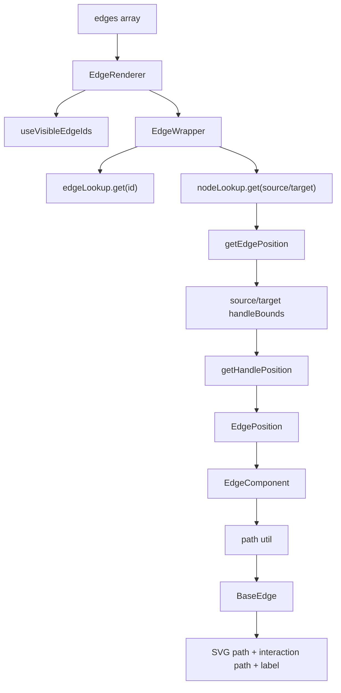

# 第 13 篇：Edge path：边路径与图工具函数

第 12 篇讲完 `XYHandle` 后，我们知道一次合法连线最终产出的是：

```ts
type Connection = {
  source: string;
  target: string;
  sourceHandle: string | null;
  targetHandle: string | null;
};
```

但 `Connection` 还不是用户看到的那条线。

它只描述了一段关系：

```txt
source node / source handle
  →
target node / target handle
```

要把这段关系画出来，React Flow 还要继续回答几个问题：

- source node 和 target node 当前在哪里？
- sourceHandle 和 targetHandle 在节点上的哪个位置？
- handle 的几何端点应该取左、右、上、下还是中心？
- 这条边应该画成直线、贝塞尔曲线、折线还是 smooth step？
- label 应该放在哪？
- 边的点击区域为什么比视觉线更宽？
- 已有 edge、临时 connection line、自定义 edge，为什么能共用一批 path 工具？

所以这一篇先建立一个结论：

> Edge 渲染不是把 `source` 和 `target` 两个 id 连起来，而是把 graph relationship 几何化成 SVG path。

这条链路是：

```txt
Edge data
  ↓ source / target / handle ids
EdgeWrapper
  ↓ nodeLookup 找 InternalNode
getEdgePosition
  ↓ handleBounds + positionAbsolute 算端点
EdgeComponent
  ↓ getBezierPath / getSmoothStepPath / getStraightPath
BaseEdge
  ↓ SVG path + interaction path + label
```

本章只抓三件事：

```txt
第一，Edge 是 relation，不保存 path。
第二，EdgeWrapper 把 relation 解析成 geometry props。
第三，path utils 只负责 geometry -> SVG path，不负责连接交互。
```

这里顺手划清一个边界：`reconnect` 不属于 path util。它复用连接流程，属于 edge interaction / handle connection 一侧；Edge path 只负责“当前这条 edge 在当前 internals 下应该怎么画”。所以不要把“边可重连”误读成 `getBezierPath` 或 `BaseEdge` 的职责。

这篇我们读的不是“某个边组件怎么写”，而是 React Flow 如何把一条图关系变成可交互的几何对象。

---

## 1. 这一篇要解决的问题

很多人会把 edge 理解成：

```txt
从 source node 中心点
  画一条线
到 target node 中心点
```

但 React Flow 不是这样做的。

原因很简单：

- 节点可以有多个 handle。
- handle 可以在节点的 top / right / bottom / left。
- parent node 会影响节点的绝对位置。
- 节点尺寸来自 DOM measured。
- edge path 类型可以不同。
- label 和交互区域需要和 path 同步。
- 节点拖拽时 edge 要跟着更新。
- visible edge 优化不能只看 edge 自己，因为 edge 没有独立 bounds。

所以 edge 渲染实际要解决的是：

> 已知一条 edge 只保存关系字段，如何从运行时节点结构里恢复出几何端点，并选择 path 算法渲染成 SVG？

这也解释了为什么前面几篇一直强调 `InternalNode`、`handleBounds`、`positionAbsolute`。

没有这些内部数据，edge 只能猜。

---

## 2. 先看用户 API 或运行效果

用户写 edge 时，通常只需要：

```tsx
const edges = [
  {
    id: 'a-b',
    source: 'a',
    target: 'b',
    sourceHandle: 'out',
    targetHandle: 'in',
    type: 'smoothstep',
    label: 'data',
  },
];

<ReactFlow nodes={nodes} edges={edges} />;
```

这份数据没有 `sourceX`、`sourceY`、`targetX`、`targetY`。

用户不会手动告诉 React Flow：

```txt
source handle 的绝对坐标是 (120, 80)
target handle 的绝对坐标是 (360, 200)
```

这些坐标全部由 runtime 算出来。

如果用户自定义 edge，会拿到这样的 props：

```tsx
function CustomEdge({
  sourceX,
  sourceY,
  targetX,
  targetY,
  sourcePosition,
  targetPosition,
}) {
  const [path] = getBezierPath({
    sourceX,
    sourceY,
    sourcePosition,
    targetX,
    targetY,
    targetPosition,
  });

  return <BaseEdge path={path} />;
}
```

这说明 React Flow 给 custom edge 的不是原始 graph relation，而是已经解析过的几何端点。

这一篇要读懂的就是这些几何 props 从哪里来。

---

## 3. 核心概念解释

### 3.1 Edge 是关系数据

system 类型里 `EdgeBase` 的核心字段是：

```ts
type EdgeBase = {
  id: string;
  source: string;
  target: string;
  sourceHandle?: string | null;
  targetHandle?: string | null;
  type?: string;
  data?: Record<string, unknown>;
  selected?: boolean;
  markerStart?: EdgeMarkerType;
  markerEnd?: EdgeMarkerType;
  interactionWidth?: number;
};
```

源码坐标：

- `packages/system/src/types/edges.ts:3`

这说明 edge 本身不保存 path。

它保存的是：

```txt
谁连谁
通过哪个 handle 连
用什么 edge type 渲染
有哪些业务数据和展示配置
```

### 3.2 EdgePosition 是几何端点

`getEdgePosition` 返回：

```ts
type EdgePosition = {
  sourceX: number;
  sourceY: number;
  targetX: number;
  targetY: number;
  sourcePosition: Position;
  targetPosition: Position;
};
```

源码坐标：

- `packages/system/src/types/edges.ts:105`

这一步把 relation 转成 geometry。

边组件真正需要的是这组 geometry props，而不是直接拿 `source` / `target` id 自己查。

### 3.3 Path util 是纯几何函数

React Flow 导出了几类 path util：

- `getStraightPath`
- `getBezierPath`
- `getSmoothStepPath`

它们接收的都是几何点和 handle 朝向。

比如：

```ts
getBezierPath({
  sourceX,
  sourceY,
  sourcePosition,
  targetX,
  targetY,
  targetPosition,
});
```

返回的是一个 tuple：

```txt
[path, labelX, labelY, offsetX, offsetY]
```

这说明 path util 不关心 node、edge、store、React。

它只做：

```txt
几何参数
  →
SVG path string + label position
```

### 3.4 BaseEdge 是渲染原语

`BaseEdge` 接收 path，然后渲染：

- 真实视觉 path。
- 透明 interaction path。
- 可选 EdgeText label。

源码坐标：

- `packages/react/src/components/Edges/BaseEdge.tsx:34`

这让不同 edge type 只需要专注于 path 算法。

最终都可以交给 `BaseEdge` 处理通用渲染细节。

---

## 4. 源码入口在哪里

这一篇建议按六组文件读。

第一，edge 渲染入口：

```txt
packages/react/src/container/EdgeRenderer/index.tsx
packages/react/src/components/EdgeWrapper/index.tsx
```

第二，端点计算：

```txt
packages/system/src/utils/edges/positions.ts
```

第三，path 算法：

```txt
packages/system/src/utils/edges/straight-edge.ts
packages/system/src/utils/edges/bezier-edge.ts
packages/system/src/utils/edges/smoothstep-edge.ts
packages/system/src/utils/edges/general.ts
```

第四，React 内置边组件：

```txt
packages/react/src/components/Edges/BaseEdge.tsx
packages/react/src/components/Edges/BezierEdge.tsx
packages/react/src/components/Edges/StraightEdge.tsx
packages/react/src/components/Edges/SmoothStepEdge.tsx
packages/react/src/components/Edges/StepEdge.tsx
packages/react/src/components/Edges/SimpleBezierEdge.tsx
```

第五，edge 工具函数：

```txt
packages/system/src/utils/edges/general.ts
packages/system/src/utils/graph.ts
```

第六，可见性优化：

```txt
packages/react/src/hooks/useVisibleEdgeIds.ts
```

推荐阅读顺序：

```txt
EdgeRenderer
  ↓ 哪些 edge 需要渲染
EdgeWrapper
  ↓ edge relation 如何变成 geometry props
getEdgePosition
  ↓ handleBounds 如何算出端点
BezierEdge / SmoothStepEdge / StraightEdge
  ↓ geometry 如何变成 path
BaseEdge
  ↓ path 如何变成可交互 SVG
addEdge / graph utils
  ↓ relation 数据如何被增删查
```

---

## 5. 源码调用链

### 5.1 EdgeRenderer：先决定渲染哪些 edge

`EdgeRenderer` 做的第一件事不是计算 path。

它先取：

```txt
edgeIds = useVisibleEdgeIds(onlyRenderVisibleElements)
```

然后 map 每个 id：

```tsx
<EdgeWrapper key={id} id={id} ... />
```

源码坐标：

- `packages/react/src/container/EdgeRenderer/index.tsx:59`
- `packages/react/src/container/EdgeRenderer/index.tsx:66`

这里和 `NodeRenderer` 的设计类似：

```txt
Renderer 层订阅 id 列表
Wrapper 层处理单个元素的细节
```

这样拖拽某个节点导致相关边更新时，不需要整个 edge 渲染层背负太多工作。

### 5.2 useVisibleEdgeIds：edge 可见性依赖 source/target node

edge 没有自己的 bounds。

可见性判断只能从 source node 和 target node 推断。

`useVisibleEdgeIds` 在 `onlyRenderVisibleElements` 开启时，会遍历 edges，取：

```txt
sourceNode = nodeLookup.get(edge.source)
targetNode = nodeLookup.get(edge.target)
```

然后调用：

```txt
isEdgeVisible({ sourceNode, targetNode, width, height, transform })
```

源码坐标：

- `packages/react/src/hooks/useVisibleEdgeIds.ts:15`

`isEdgeVisible` 里会把 sourceNode 和 targetNode 的 box 合成 edgeBox，再和当前 viewport rect 做相交判断。

源码坐标：

- `packages/system/src/utils/edges/general.ts:66`

这是一种性能上的近似：

```txt
如果连接两个节点的整体 bounding box 和 viewport 不相交
  edge 不可见
```

它不精确计算 SVG path 本身的 bounds，但足够快。

### 5.3 EdgeWrapper：从 edgeLookup 取 edge，再选组件

`EdgeWrapper` 里先根据 id 从 store 读：

```txt
edge = edgeLookup.get(id)
```

如果有 `defaultEdgeOptions`，会合并默认配置。

源码坐标：

- `packages/react/src/components/EdgeWrapper/index.tsx:38`

然后根据：

```txt
edge.type || 'default'
```

选择：

```txt
edgeTypes?.[edgeType] || builtinEdgeTypes[edgeType]
```

源码坐标：

- `packages/react/src/components/EdgeWrapper/index.tsx:42`

如果找不到对应 edge type，会报错并退回 default。

这说明 edge type 只是渲染组件选择，不改变 edge 的基本关系结构。

### 5.4 EdgeWrapper：从 nodeLookup 取 source/target InternalNode

真正的几何计算发生在 selector 里。

`EdgeWrapper` 从 store 里拿：

```txt
sourceNode = nodeLookup.get(edge.source)
targetNode = nodeLookup.get(edge.target)
```

如果任意节点不存在，就返回 null position。

源码坐标：

- `packages/react/src/components/EdgeWrapper/index.tsx:63`

这说明 edge 渲染依赖内部节点结构。

用户 edges array 里只有 node id，不足以算位置。

### 5.5 getEdgePosition：关系变几何的核心

`EdgeWrapper` 调用：

```txt
getEdgePosition({
  id,
  sourceNode,
  targetNode,
  sourceHandle: edge.sourceHandle || null,
  targetHandle: edge.targetHandle || null,
  connectionMode,
  onError,
})
```

源码坐标：

- `packages/react/src/components/EdgeWrapper/index.tsx:76`

进入 `getEdgePosition`，第一步是确认节点初始化：

```txt
node 有 handleBounds 或 handles
并且有 measured width / width / initialWidth
```

源码坐标：

- `packages/system/src/utils/edges/positions.ts:15`

如果节点还没测量完成，就返回 null。

这解释了为什么第 8 篇强调 measured 和 handleBounds。

edge endpoint 不能在节点 DOM 尺寸未知时可靠计算。

### 5.6 sourceHandle / targetHandle 如何找

`getEdgePosition` 会取：

```txt
sourceHandleBounds = sourceNode.internals.handleBounds || toHandleBounds(sourceNode.handles)
targetHandleBounds = targetNode.internals.handleBounds || toHandleBounds(targetNode.handles)
```

源码坐标：

- `packages/system/src/utils/edges/positions.ts:31`

这里支持两种来源：

- DOM 测量得到的 `internals.handleBounds`。
- 用户静态传入的 `node.handles`。

接着：

```txt
sourceHandle = getHandle(sourceHandleBounds.source, sourceHandleId)
```

target handle 在 strict / loose 下不同：

```txt
Strict:
  只在 target handles 里找

Loose:
  target + source handles 都可以作为目标
```

源码坐标：

- `packages/system/src/utils/edges/positions.ts:34`

这和第 12 篇 `XYHandle` 的连接判断保持一致。

### 5.7 getHandlePosition：handle bounds 加 node absolute position

找到 handle 后，`getEdgePosition` 调：

```txt
getHandlePosition(sourceNode, sourceHandle, sourcePosition)
getHandlePosition(targetNode, targetHandle, targetPosition)
```

源码坐标：

- `packages/system/src/utils/edges/positions.ts:58`

`getHandlePosition` 的核心是：

```txt
x = handle.x + node.internals.positionAbsolute.x
y = handle.y + node.internals.positionAbsolute.y
```

然后根据 handle position 返回边界上的点：

```txt
Top:
  x + width / 2, y

Right:
  x + width, y + height / 2

Bottom:
  x + width / 2, y + height

Left:
  x, y + height / 2
```

源码坐标：

- `packages/system/src/utils/edges/positions.ts:99`

这一步把：

```txt
handle 相对节点的位置
  +
node 在 flow 世界里的绝对位置
```

变成 edge path 可以使用的 flow 坐标端点。

### 5.8 EdgeWrapper：把 geometry props 传给 EdgeComponent

拿到：

```txt
sourceX
sourceY
targetX
targetY
sourcePosition
targetPosition
```

后，`EdgeWrapper` 把它们传给具体边组件：

```tsx
<EdgeComponent
  sourceX={sourceX}
  sourceY={sourceY}
  targetX={targetX}
  targetY={targetY}
  sourcePosition={sourcePosition}
  targetPosition={targetPosition}
  markerStart={markerStartUrl}
  markerEnd={markerEndUrl}
  pathOptions={...}
  interactionWidth={edge.interactionWidth}
/>
```

源码坐标：

- `packages/react/src/components/EdgeWrapper/index.tsx:191`

到这里，edge relation 已经被几何化。

具体边组件不需要知道 nodeLookup，也不需要知道 handleBounds。

### 5.9 BezierEdge：path 算法和 BaseEdge 分离

以 `BezierEdge` 为例。

它调用：

```txt
getBezierPath({
  sourceX,
  sourceY,
  sourcePosition,
  targetX,
  targetY,
  targetPosition,
  curvature,
})
```

拿到：

```txt
path
labelX
labelY
```

然后交给：

```tsx
<BaseEdge path={path} labelX={labelX} labelY={labelY} ... />
```

源码坐标：

- `packages/react/src/components/Edges/BezierEdge.tsx:23`

这体现了内置边组件的共同模式：

```txt
EdgeComponent
  选择 path util
  计算 path 和 label 坐标

BaseEdge
  负责真正 SVG 渲染
```

### 5.10 BaseEdge：为什么有透明 interaction path

`BaseEdge` 渲染两条 path：

第一条是真实可见路径：

```tsx
<path d={path} className="react-flow__edge-path" />
```

第二条是透明交互路径：

```tsx
<path
  d={path}
  strokeOpacity={0}
  strokeWidth={interactionWidth}
  className="react-flow__edge-interaction"
/>
```

源码坐标：

- `packages/react/src/components/Edges/BaseEdge.tsx:34`

为什么要这样？

因为视觉上的边可能很细，只有 1px 或 2px。如果用户必须精准点中这条线，体验会很差。

透明 interaction path 让点击区域更宽，而视觉线仍然保持细。

这就是 edge 的“可交互几何”和“可见几何”分离。

### 5.11 getStraightPath：最简单的路径算法

`getStraightPath` 只做：

```txt
M sourceX,sourceY L targetX,targetY
```

同时用 `getEdgeCenter` 算 label 位置和 offset。

源码坐标：

- `packages/system/src/utils/edges/straight-edge.ts:43`

它说明 path util 的基本契约：

```txt
输入端点
输出 path + label position
```

### 5.12 getBezierPath：根据 handle 朝向算控制点

`getBezierPath` 会根据 sourcePosition / targetPosition 算控制点。

核心是：

```txt
getControlWithCurvature(sourcePosition, source, target)
getControlWithCurvature(targetPosition, target, source)
```

源码坐标：

- `packages/system/src/utils/edges/bezier-edge.ts:121`

控制点方向来自 handle 朝向：

- source 在 Right，控制点往右。
- source 在 Left，控制点往左。
- source 在 Top，控制点往上。
- source 在 Bottom，控制点往下。

这就是为什么 `getEdgePosition` 返回的不只是 `sourceX/Y`，还包括 `sourcePosition`。

edge path 算法需要知道边从 handle 的哪个方向“长出来”。

### 5.13 getSmoothStepPath：快速模拟正交路由

`getSmoothStepPath` 更复杂。

源码注释说得很清楚：它试图模拟 orthogonal edge routing，但不是完整路由算法；它更快，作为默认 step / smooth step 足够好。

源码坐标：

- `packages/system/src/utils/edges/smoothstep-edge.ts:61`

它会：

- 根据 source/target handle 方向生成 sourceDir / targetDir。
- 给 source 和 target 加 offset gap。
- 根据 handle 方向组合中间折点。
- 如果 sourcePosition 和 targetPosition 相同且距离太近，增加 gapOffset 避免路径重叠。
- 根据最长线段选择 label 中心。
- 用 `getBend` 把折角变成圆角。

最终输出：

```txt
M...
L...
Q...
L...
```

源码坐标：

- `packages/system/src/utils/edges/smoothstep-edge.ts:266`

这部分最重要的不是逐行记住算法，而是理解它的定位：

> smooth step 是轻量路径生成，不是避障路由。

它不会绕开其他节点，也不会做全局最短路径。

### 5.14 addEdge：Connection 如何进入 edges array

第 12 篇说过，`XYHandle` 产出的是 `Connection`。

常用工具 `addEdge` 会把它加入 edges array。

`addEdge` 先校验 source / target：

```txt
没有 source 或 target
  warn 并返回原 edges
```

然后：

```txt
如果传入已经是 EdgeBase
  复制 edge

如果传入是 Connection
  生成 id
```

源码坐标：

- `packages/system/src/utils/edges/general.ts:121`

它还会避免重复连接：

```txt
source / target / sourceHandle / targetHandle 相同
  不添加
```

源码坐标：

- `packages/system/src/utils/edges/general.ts:91`

最后如果 handle 是 `null`，会删除对应字段。

这说明 `addEdge` 是一个 relation 数据工具，不是渲染工具。

### 5.15 graph utils：围绕 nodes / edges 的纯函数

`utils/graph.ts` 里有一些常用图关系工具：

- `getOutgoers`
- `getIncomers`
- `getConnectedEdges`
- `getNodesBounds`

比如 `getOutgoers` 遍历 edges，找 source 为当前 node 的 target nodes。

源码坐标：

- `packages/system/src/utils/graph.ts:52`

`getIncomers` 则反过来找 target 为当前 node 的 source nodes。

源码坐标：

- `packages/system/src/utils/graph.ts:97`

`getConnectedEdges` 用 node id 集合过滤相关边。

源码坐标：

- `packages/system/src/utils/graph.ts:296`

这些函数和 path util 一样，都是围绕 graph data 的纯函数。

它们不依赖 React，也不依赖 DOM。

---

## 6. 关键数据结构

### 6.1 EdgeBase

`EdgeBase` 是关系数据：

```txt
id
source
target
sourceHandle
targetHandle
type
data
selected
markerStart / markerEnd
interactionWidth
```

它不保存 path，也不保存端点坐标。

### 6.2 EdgePosition

`EdgePosition` 是几何端点：

```txt
sourceX / sourceY
targetX / targetY
sourcePosition / targetPosition
```

它由 `getEdgePosition` 从 edge relation + InternalNode 推导出来。

### 6.3 Path tuple

path util 返回：

```txt
[path, labelX, labelY, offsetX, offsetY]
```

这个 tuple 同时服务：

- SVG `<path d={path}>`。
- label 位置。
- 自定义 edge 里的辅助计算。

### 6.4 EdgeComponent props

内置 edge component 和 custom edge component 接收到的是 geometry props：

```txt
sourceX
sourceY
targetX
targetY
sourcePosition
targetPosition
markerStart
markerEnd
interactionWidth
pathOptions
```

这让 custom edge 不需要接触 store。

---

## 7. 关键实现思路

可以用这张图串起来：



这张图里最关键的是两个转换。

### 7.1 relation -> geometry

```txt
Edge:
  source / target / handle ids

InternalNode:
  positionAbsolute / handleBounds / measured

getEdgePosition:
  sourceX / sourceY / targetX / targetY
```

这是 `EdgeWrapper` 和 system edge position utils 的职责。

### 7.2 geometry -> SVG path

```txt
EdgePosition:
  sourceX / sourceY / targetX / targetY / handle positions

path util:
  path / labelX / labelY

BaseEdge:
  SVG elements
```

这是具体 edge component 和 path utils 的职责。

分开后，React Flow 可以：

- 复用端点计算。
- 提供多种内置 path。
- 允许用户自定义 edge component。
- 让 path util 独立导出给用户使用。

---

## 8. 这部分源码的设计取舍

### 8.1 Edge 不保存计算结果

React Flow 没有把 `sourceX/sourceY/targetX/targetY/path` 写回 edge 数据。

这是合理的。

因为这些值会随着很多运行时因素变化：

- 节点拖拽。
- 节点尺寸变化。
- handle 位置变化。
- parent node 位置变化。
- connection mode。
- node internals 测量完成。

如果把 path 存在 edge 里，就要维护复杂的失效更新。

React Flow 的选择是：

```txt
edge 保存关系
runtime 根据当前 node internals 即时计算几何
```

### 8.2 端点计算和 path 算法分离

`getEdgePosition` 不知道这条边是 bezier 还是 smoothstep。

它只负责端点。

`getBezierPath` / `getSmoothStepPath` 不知道 nodeLookup，也不知道 handleBounds。

它们只负责路径。

这种分离让模块职责很清楚：

```txt
关系解析
  EdgeWrapper + getEdgePosition

路径生成
  path utils

SVG 渲染
  BaseEdge
```

### 8.3 smooth step 不是完整路由算法

React Flow 内置的 smooth step 看起来像正交路由，但源码注释明确说它只是模拟。

这是一个重要取舍。

完整路由算法需要考虑：

- 障碍物避让。
- 多边布局。
- 路径交叉最小化。
- 全局图结构。
- 动态更新成本。

React Flow 默认边路径选择的是：

```txt
足够好
足够快
可预测
可自定义替换
```

如果业务需要真正的路由，可以自定义 edge。

### 8.4 透明 interaction path 改善可用性

边的视觉线很细，但交互区域可以更宽。

这就是 `BaseEdge` 里的 `interactionWidth`。

这个设计让 React Flow 同时满足：

```txt
视觉上清爽
操作上容易点击
```

它是小细节，但很关键。

### 8.5 graph utils 保持纯函数

`addEdge`、`getOutgoers`、`getIncomers`、`getConnectedEdges` 都是纯函数。

它们不依赖 React，也不直接改 store。

这让这些工具可以：

- 在用户代码里使用。
- 在 React / Svelte 包之间复用。
- 更容易测试和推理。

这也是 `@xyflow/system` 的价值之一。

---

## 9. 如果我们自己实现，最小版本应该怎么写

mini-flow 的 edge 系统可以先拆成三步。

### 9.1 relation -> endpoint

```ts
type Point = {
  x: number;
  y: number;
};

type Node = {
  id: string;
  position: Point;
  width: number;
  height: number;
};

type Edge = {
  id: string;
  source: string;
  target: string;
};

function getNodeCenter(node: Node): Point {
  return {
    x: node.position.x + node.width / 2,
    y: node.position.y + node.height / 2,
  };
}

function getEdgeEndpoints(edge: Edge, nodes: Map<string, Node>) {
  const source = nodes.get(edge.source);
  const target = nodes.get(edge.target);

  if (!source || !target) {
    return null;
  }

  return {
    source: getNodeCenter(source),
    target: getNodeCenter(target),
  };
}
```

这个版本先不支持 handle，只连中心点。

### 9.2 endpoint -> path

```ts
function getStraightPath(source: Point, target: Point): string {
  return `M ${source.x},${source.y} L ${target.x},${target.y}`;
}
```

### 9.3 path -> SVG

```tsx
function MiniEdge({ path }: { path: string }) {
  return (
    <>
      <path d={path} fill="none" stroke="currentColor" />
      <path d={path} fill="none" stroke="transparent" strokeWidth={20} />
    </>
  );
}
```

### 9.4 加入 handle

等基础跑通，再加入 handle：

```ts
type Handle = {
  id: string | null;
  nodeId: string;
  x: number;
  y: number;
  position: 'top' | 'right' | 'bottom' | 'left';
};

function getHandlePoint(node: Node, handle: Handle): Point {
  return {
    x: node.position.x + handle.x,
    y: node.position.y + handle.y,
  };
}
```

### 9.5 保留 React Flow 的分层

mini-flow 不要一开始就把所有东西写进一个组件。

更好的结构是：

```txt
getEdgePosition(edge, nodes)
  relation -> geometry

getPath(position)
  geometry -> SVG path

EdgeView
  path -> SVG

addEdge(connection, edges)
  connection -> edge data
```

这样后续加 bezier、smoothstep、自定义 edge、label、marker、interactionWidth 时，结构不会塌。

---

## 10. 本篇总结

这一篇我们从第 12 篇的 `Connection` 往下走，读懂了关系如何变成 SVG path。

核心链路是：

```txt
EdgeRenderer
  决定哪些 edge 需要渲染

EdgeWrapper
  根据 edge.source / edge.target 找 InternalNode
  调 getEdgePosition 算端点
  选择内置或自定义 EdgeComponent

getEdgePosition
  使用 handleBounds + positionAbsolute
  得到 sourceX/sourceY/targetX/targetY/sourcePosition/targetPosition

Path utils
  根据端点生成 SVG path 和 label 坐标

BaseEdge
  渲染真实 path、透明 interaction path 和 label

addEdge / graph utils
  处理 relation 数据
```

几个关键结论：

- Edge 数据保存关系，不保存 path。
- `InternalNode` 的 `positionAbsolute` 和 `handleBounds` 是 edge 几何计算的基础。
- `getEdgePosition` 负责 relation -> geometry。
- path util 负责 geometry -> path。
- `BaseEdge` 负责 path -> SVG。
- smooth step 是轻量正交路径模拟，不是完整路由算法。
- 透明 interaction path 是边可交互性的关键细节。

到这里，React Flow 的核心图形链路已经比较完整：

```txt
Connection
  → Edge
  → EdgePosition
  → SVG path
```

---

## 11. 下一篇读什么

下一篇进入：

```txt
第 14 篇：controlled / uncontrolled：交互变化如何回流给用户？
```

前面几篇分别讲了：

- 拖拽如何产生 `NodeChange`。
- 连线如何产生 `Connection`。
- panzoom 如何产生 viewport。
- edge 如何由 relation 渲染成 path。

接下来要把这些变化统一起来：

```txt
用户交互发生了
  ↓
React Flow 内部状态更新吗？
  ↓
用户回调什么时候被调用？
  ↓
defaultNodes/defaultEdges 和 nodes/edges 有什么区别？
  ↓
为什么 onNodesChange / onEdgesChange 传的是 change objects？
```

也就是 React Flow 的受控 / 非受控设计。
