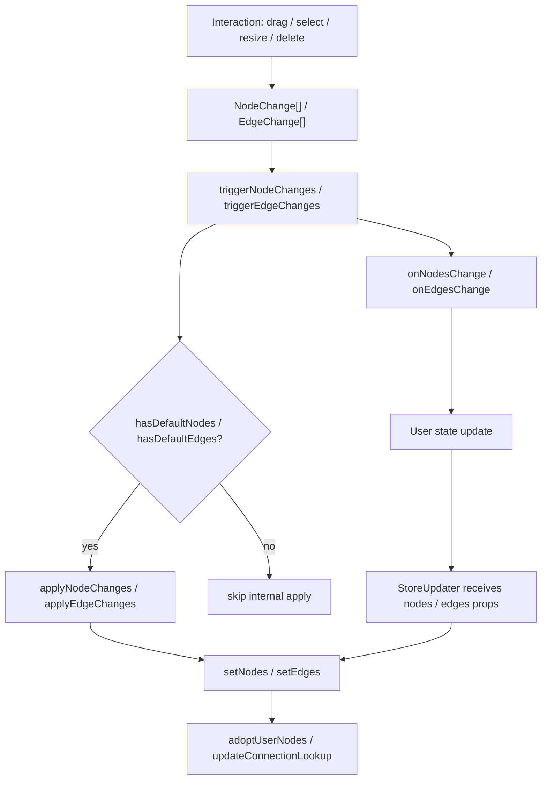

# 第 14 篇：controlled / uncontrolled：交互变化如何回流给用户？

前面几篇我们已经把 React Flow 的核心交互读了一圈：

- `XYPanZoom` 产生 viewport transform。
- `XYDrag` 产生 node position changes。
- `XYHandle` 产生 connection。
- Edge path 系统把 relation 几何化成 SVG path。

但这里还藏着一个更底层的问题：

> 这些交互产生的变化，最终到底谁来应用？

很多人刚开始用 React Flow 时，会把它想成一个普通受控组件：

```tsx
<ReactFlow nodes={nodes} edges={edges} />
```

于是直觉是：

```txt
用户拖动节点
  ↓
React Flow 直接修改 nodes
```

这个理解危险在于，它混淆了两件事：

```txt
交互产生变化
  React Flow 可以做

变化应用到用户数据
  要看 controlled / uncontrolled 模式
```

React Flow 的设计不是“交互直接改用户数组”，而是：

```txt
interaction-to-change pipeline
  ↓
产生 change objects
  ↓
triggerNodeChanges / triggerEdgeChanges
  ↓
controlled:
    调用 onNodesChange / onEdgesChange，由用户应用

uncontrolled:
    内部 apply changes 后，也调用用户 callback
```

这一篇要讲清楚的就是这条回流链。

---

## 1. 这一篇要解决的问题

React Flow 支持两种使用方式。

受控模式：

```tsx
const [nodes, setNodes] = useState(initialNodes);
const [edges, setEdges] = useState(initialEdges);

return (
  <ReactFlow
    nodes={nodes}
    edges={edges}
    onNodesChange={(changes) => setNodes((nds) => applyNodeChanges(changes, nds))}
    onEdgesChange={(changes) => setEdges((eds) => applyEdgeChanges(changes, eds))}
    onConnect={(connection) => setEdges((eds) => addEdge(connection, eds))}
  />
);
```

非受控模式：

```tsx
return (
  <ReactFlow
    defaultNodes={initialNodes}
    defaultEdges={initialEdges}
  />
);
```

表面区别是：

```txt
controlled:
  传 nodes / edges

uncontrolled:
  传 defaultNodes / defaultEdges
```

但源码层真正的区别是：

```txt
controlled:
  React Flow 产生 changes
  用户在 onNodesChange / onEdgesChange 里应用 changes

uncontrolled:
  React Flow 产生 changes
  内部 apply changes 更新 store
  仍然通知用户 onNodesChange / onEdgesChange
```

所以这篇的核心不是 API 语法，而是：

> React Flow 如何让同一套交互系统同时服务受控和非受控？

答案就是 change objects。

先把两个容易混的出口分开：

```txt
拖拽 / 选择 / 删除已有元素：
  产生 NodeChange[] / EdgeChange[]
  走 onNodesChange / onEdgesChange

创建新连接：
  产生 Connection
  走 onConnect
  用户通常用 addEdge(connection, edges) 转成 Edge
```

也就是说，`onConnect` 不是 `onEdgesChange` 的另一种写法。前者描述“用户建立了一个连接意图”，后者描述“已有 edges 发生了选择、删除等变化”。这也是为什么第 12 篇先讲 Connection，第 13 篇再讲 Edge path。

---

## 2. 先看用户 API 或运行效果

先看受控模式。

```tsx
const [nodes, setNodes] = useState<Node[]>(initialNodes);

const onNodesChange = useCallback((changes: NodeChange[]) => {
  setNodes((nodes) => applyNodeChanges(changes, nodes));
}, []);

<ReactFlow
  nodes={nodes}
  onNodesChange={onNodesChange}
/>;
```

用户拖动节点时，React Flow 不会直接改 `nodes`。

它会调用：

```txt
onNodesChange([
  {
    id: 'node-1',
    type: 'position',
    position: { x: 120, y: 80 },
    dragging: true
  }
])
```

用户可以选择：

- 直接 `applyNodeChanges`。
- 过滤某些 change。
- 记录历史，用于撤销重做。
- 同步到服务端。
- 在应用前做权限校验。
- 和外部状态管理库整合。

再看非受控模式。

```tsx
<ReactFlow
  defaultNodes={initialNodes}
  defaultEdges={initialEdges}
/>
```

用户拖动节点时，节点也会移动。

但这不是因为用户应用了 changes，而是 React Flow 内部检测到：

```txt
hasDefaultNodes = true
```

于是它自己调用：

```txt
applyNodeChanges(changes, nodes)
setNodes(updatedNodes)
```

源码坐标：

- `packages/react/src/store/index.ts:264`

这就是非受控的本质：

> React Flow 内部持有并更新 nodes / edges，但仍然把变化通过 callback 暴露出来。

---

## 3. 核心概念解释

### 3.1 controlled 不是“不进 store”

一个容易误解的点是：

> 受控模式下，nodes / edges 是不是不进 React Flow store？

不是。

受控模式下，用户传入的 `nodes` / `edges` 仍然会同步进 React Flow store。

原因是内部渲染、拖拽、连线、选择都需要：

- nodeLookup。
- edgeLookup。
- connectionLookup。
- InternalNode。
- measured。
- handleBounds。

`StoreUpdater` 会监听 `nodes` / `edges` props，一旦变化就调用：

```txt
setNodes(...)
setEdges(...)
```

源码坐标：

- `packages/react/src/components/StoreUpdater/index.tsx:140`

所以受控的意思不是“React Flow 不保存内部状态”。

真正意思是：

```txt
用户数组是事实源
React Flow store 是运行时投影
交互变化必须通过 callback 回到用户事实源
```

### 3.2 uncontrolled 不是“没有回调”

非受控模式下，React Flow 内部会应用 changes。

但它仍然会调用用户传入的 callback：

```txt
onNodesChange?.(changes)
onEdgesChange?.(changes)
```

源码坐标：

- `packages/react/src/store/index.ts:277`
- `packages/react/src/store/index.ts:290`

所以非受控不是黑盒。

它只是把“应用 changes”的责任交给 React Flow 内部。

用户仍然可以监听变化，用于：

- analytics。
- 自动保存。
- debug。
- 外部同步。

### 3.3 change object 是交互和数据之间的协议

拖拽节点不是直接输出新 nodes array。

它输出：

```txt
NodeChange[]
```

选择边不是直接输出新 edges array。

它输出：

```txt
EdgeChange[]
```

常见 change 类型包括：

- `position`
- `select`
- `dimensions`
- `add`
- `remove`
- `replace`

`applyChanges` 再把这些 change 应用到原数组。

源码坐标：

- `packages/react/src/utils/changes.ts:18`

这相当于 React Flow 内部交互系统和用户状态系统之间的协议：

```txt
interaction-to-change pipeline:
  我不直接改你的数组
  我告诉你发生了什么

user state:
  我决定如何应用这些变化
```

### 3.4 nodes array 和 nodeLookup 的角色不同

第 8 篇讲过：

```txt
nodes array
  面向用户 API

nodeLookup
  面向内部高频查询
```

controlled / uncontrolled 也建立在这个分层上。

用户传入或内部保存的是 nodes array。

store 同时维护 nodeLookup：

```txt
setNodes(nodes)
  ↓
adoptUserNodes(nodes, nodeLookup, parentLookup, ...)
```

源码坐标：

- `packages/react/src/store/index.ts:99`

这让 React Flow 可以既保留声明式 API，又拥有交互 runtime 需要的高效内部结构。

### 3.5 viewport 也有类似模式

nodes / edges 通过 `nodes/defaultNodes`、`edges/defaultEdges` 区分受控与非受控。

viewport 也类似：

```tsx
<ReactFlow
  viewport={viewport}
  onViewportChange={setViewport}
/>
```

如果传入 `viewport`，`GraphView` 会认为 viewport 是受控的：

```txt
isControlledViewport = !!viewport
```

源码坐标：

- `packages/react/src/container/GraphView/index.tsx:154`

`ZoomPane.onTransformChange` 会始终调用 `onViewportChange`，但只有非受控 viewport 才直接写 store.transform。

源码坐标：

- `packages/react/src/container/ZoomPane/index.tsx:57`

受控 viewport 则通过 `useViewportSync(viewport)` 同步回来。

源码坐标：

- `packages/react/src/hooks/useViewportSync.ts:15`

这说明 React Flow 的受控思想不是只用于 nodes / edges，而是一种贯穿运行时状态的设计模式。

---

## 4. 源码入口在哪里

这一篇主要读这些文件：

```txt
packages/react/src/store/initialState.ts
packages/react/src/store/index.ts
packages/react/src/utils/changes.ts
packages/react/src/hooks/useNodesEdgesState.ts
packages/react/src/components/StoreUpdater/index.tsx
packages/react/src/container/GraphView/index.tsx
packages/react/src/container/ZoomPane/index.tsx
packages/react/src/hooks/useViewportSync.ts
```

它们分别负责：

| 文件 | 责任 |
| --- | --- |
| `initialState.ts` | 初始时选择 defaultNodes/defaultEdges 或 nodes/edges |
| `store/index.ts` | setNodes/setEdges、trigger changes、controlled/uncontrolled 分流 |
| `changes.ts` | applyNodeChanges / applyEdgeChanges / diff / selection changes |
| `useNodesEdgesState.ts` | 受控模式辅助 hook |
| `StoreUpdater` | 用户 props 同步进 store |
| `GraphView` / `ZoomPane` / `useViewportSync` | viewport 受控模式 |

推荐阅读顺序：

```txt
initialState
  ↓ 初始数据怎么进 store
StoreUpdater
  ↓ props 更新怎么进 store
setNodes / setEdges
  ↓ 用户数据怎么变成内部 runtime 结构
triggerNodeChanges / triggerEdgeChanges
  ↓ 交互 changes 如何回流
applyChanges
  ↓ changes 如何应用到数组
useNodesState / useEdgesState
  ↓ 用户侧辅助 hook
viewport controlled
  ↓ 同一模式在 viewport 上怎么体现
```

---

## 5. 源码调用链

### 5.1 initialState：初始数据来源优先级

store 初始化时会决定初始 nodes / edges：

```txt
storeEdges = defaultEdges ?? edges ?? []
storeNodes = defaultNodes ?? nodes ?? []
```

源码坐标：

- `packages/react/src/store/initialState.ts:54`

这个优先级很重要。

如果用户传了 `defaultNodes`，React Flow 会把它当作内部初始状态。

如果用户传了 `nodes`，React Flow 会把它当作受控输入，也同步进 store。

无论哪种方式，初始化时都会：

```txt
adoptUserNodes(storeNodes, nodeLookup, parentLookup, ...)
updateConnectionLookup(connectionLookup, edgeLookup, storeEdges)
```

源码坐标：

- `packages/react/src/store/initialState.ts:58`

所以初始阶段两种模式都会建立内部 lookup。

区别不在“有没有内部结构”，而在后续 changes 谁来应用。

### 5.2 StoreUpdater：props 更新同步进 store

`StoreUpdater` 的文件注释说得很清楚：它负责把用户传入值更新进 store，并区分能直接更新的值和需要 dedicated setter 的值。

源码坐标：

- `packages/react/src/components/StoreUpdater/index.tsx:1`

它追踪很多字段：

```txt
nodes
edges
defaultNodes
defaultEdges
onNodesChange
onEdgesChange
onConnect
...
```

源码坐标：

- `packages/react/src/components/StoreUpdater/index.tsx:11`

首次 mount 时：

```txt
setDefaultNodesAndEdges(props.defaultNodes, props.defaultEdges)
```

源码坐标：

- `packages/react/src/components/StoreUpdater/index.tsx:120`

后续 props 变化时：

```txt
if fieldName === 'nodes' setNodes(...)
else if fieldName === 'edges' setEdges(...)
else store.setState(...)
```

源码坐标：

- `packages/react/src/components/StoreUpdater/index.tsx:140`

这解释了受控模式下为什么用户更新 `nodes` prop 后，React Flow 内部视图会跟着更新。

### 5.3 setDefaultNodesAndEdges：打开非受控标记

`setDefaultNodesAndEdges` 做的事很直接：

```txt
if nodes:
  setNodes(nodes)
  hasDefaultNodes = true

if edges:
  setEdges(edges)
  hasDefaultEdges = true
```

源码坐标：

- `packages/react/src/store/index.ts:149`

这两个 flag 是后面分流的关键：

```txt
hasDefaultNodes
hasDefaultEdges
```

它们不是“是否曾经有默认值”的普通记录，而是在告诉 store：

> 后续内部交互产生 changes 时，React Flow 可以自己应用这些 changes。

### 5.4 setNodes：用户节点进入内部运行时

`setNodes` 既用于受控 props 更新，也用于非受控内部更新。

源码注释写得很清楚，它会在两类场景被调用：

- 受控模式下 `<ReactFlow nodes>` prop 更新。
- 非受控模式下用户调用 `reactFlowInstance.setNodes()`。

源码坐标：

- `packages/react/src/store/index.ts:99`

`setNodes` 会调用：

```txt
adoptUserNodes(nodes, nodeLookup, parentLookup, ...)
```

这一步把用户节点增强成 InternalNode。

然后更新：

```txt
nodes
nodesInitialized
nodesSelectionActive
```

源码坐标：

- `packages/react/src/store/index.ts:119`

所以无论受控还是非受控，只要 nodes array 进入 store，都要通过同一套内部增强逻辑。

### 5.5 setEdges：边进入 lookup

`setEdges` 类似。

它会调用：

```txt
updateConnectionLookup(connectionLookup, edgeLookup, edges)
```

然后：

```txt
set({ edges })
```

源码坐标：

- `packages/react/src/store/index.ts:142`

这说明 edges array 也不是孤立保存。

React Flow 会维护：

- edgeLookup。
- connectionLookup。

这些 lookup 后面服务：

- edge 渲染。
- selection。
- node connections hooks。
- 删除相关边。

### 5.6 triggerNodeChanges：受控 / 非受控分流点

`triggerNodeChanges` 是这一篇最关键的函数。

源码结构是：

```txt
if changes.length:
  if hasDefaultNodes:
    updatedNodes = applyNodeChanges(changes, nodes)
    setNodes(updatedNodes)

  onNodesChange?.(changes)
```

源码坐标：

- `packages/react/src/store/index.ts:264`

这就是分水岭。

非受控：

```txt
hasDefaultNodes = true
  内部 apply + setNodes
  再调用 onNodesChange
```

受控：

```txt
hasDefaultNodes = false
  不内部 apply
  只调用 onNodesChange
```

所以如果你传了 `nodes` 却没有处理 `onNodesChange`，拖拽时节点不会真正移动。

React Flow 不是不能拖，而是它已经把变化告诉你了，你没有把变化应用回 `nodes`。

### 5.7 triggerEdgeChanges：edge 同理

`triggerEdgeChanges` 和 node 几乎一样：

```txt
if hasDefaultEdges:
  updatedEdges = applyEdgeChanges(changes, edges)
  setEdges(updatedEdges)

onEdgesChange?.(changes)
```

源码坐标：

- `packages/react/src/store/index.ts:279`

这让 edge selection、remove、replace 等交互也能走同一套机制。

不过连接新增 edge 有一点不同。

`onConnect` 产出的是 `Connection`，不是 `EdgeChange`。

非受控 edges 下，`Handle.onConnectExtended` 会内部调用 `addEdge`。

源码坐标：

- `packages/react/src/components/Handle/index.tsx:87`

受控 edges 下，用户要在 `onConnect` 中自己 `setEdges(addEdge(...))`。

### 5.8 applyChanges：change object 如何应用

`applyNodeChanges` 和 `applyEdgeChanges` 都调用内部的 `applyChanges`。

源码坐标：

- `packages/react/src/utils/changes.ts:18`

`applyChanges` 的策略是：

1. 先把 changes 按 element id 分组。
2. `add` changes 暂存到最后处理。
3. `remove` / `replace` 会覆盖同 id 的其他 changes。
4. 遍历原 elements。
5. 没有 changes 的 element 原样保留。
6. 有 changes 的 element 浅拷贝后逐个 apply。
7. 最后按 index 插入 add items。

这是一种兼顾性能和 React 更新语义的实现：

```txt
无变化元素保持引用
有变化元素浅拷贝
连续 changes 在同一个 shallow copy 上 mutate
```

源码坐标：

- `packages/react/src/utils/changes.ts:28`
- `packages/react/src/utils/changes.ts:72`

### 5.9 applyChange：不同 change 类型怎么落到元素上

`applyChange` 处理几类基础 change。

`select`：

```txt
element.selected = change.selected
```

`position`：

```txt
element.position = change.position
element.dragging = change.dragging
```

`dimensions`：

```txt
element.measured = change.dimensions
必要时写 width / height
element.resizing = change.resizing
```

源码坐标：

- `packages/react/src/utils/changes.ts:106`

这解释了为什么 `XYDrag`、selection、resize、delete 都可以统一成 change objects。

它们最终都能通过 `applyChanges` 落到用户数组结构。

### 5.10 useNodesState / useEdgesState：受控模式辅助 hook

React Flow 提供了：

```txt
useNodesState
useEdgesState
```

它们本质上是：

```txt
useState + applyNodeChanges/applyEdgeChanges callback
```

源码坐标：

- `packages/react/src/hooks/useNodesEdgesState.ts:50`
- `packages/react/src/hooks/useNodesEdgesState.ts:120`

以 `useNodesState` 为例：

```txt
const [nodes, setNodes] = useState(initialNodes)
const onNodesChange = useCallback(
  changes => setNodes(nds => applyNodeChanges(changes, nds)),
  []
)

return [nodes, setNodes, onNodesChange]
```

这不是 React Flow 内部必须用的 hook。

它是给用户快速搭建受控 flow 的辅助工具。

更复杂的项目完全可以用 Zustand、Redux、Jotai 或自己的状态系统。

关键是：你要处理 changes。

### 5.11 selection 也走同一套 change 回流

选择系统在第 15 篇会详细讲。

这里先看一个入口。

`addSelectedNodes` 会构造 selection changes：

```txt
createSelectionChange(nodeId, true)
triggerNodeChanges(...)
triggerEdgeChanges(...)
```

源码坐标：

- `packages/react/src/store/index.ts:296`

这说明选中不是某个孤立 UI state。

它最终也是：

```txt
NodeChange { type: 'select' }
EdgeChange { type: 'select' }
```

也就是说，第 15 篇讲 selection 时，依然会回到本篇这套 controlled / uncontrolled 机制。

### 5.12 viewport controlled：同样的模式，不同的载体

viewport 没有使用 `NodeChange[]` 这种 change object。

它直接通过：

```txt
onViewportChange({ x, y, zoom })
```

回流。

`GraphView` 判断：

```txt
isControlledViewport={!!viewport}
```

源码坐标：

- `packages/react/src/container/GraphView/index.tsx:154`

`ZoomPane.onTransformChange` 中：

```txt
onViewportChange?.(...)

if (!isControlledViewport) {
  store.setState({ transform })
}
```

源码坐标：

- `packages/react/src/container/ZoomPane/index.tsx:57`

如果是受控 viewport，用户更新 `viewport` prop 后，`useViewportSync` 会：

```txt
panZoom.syncViewport(viewport)
store.setState({ transform: [viewport.x, viewport.y, viewport.zoom] })
```

源码坐标：

- `packages/react/src/hooks/useViewportSync.ts:15`

这和 nodes / edges 的模式很像：

```txt
交互产生变化
  ↓
调用用户 callback
  ↓
受控 prop 更新回来
  ↓
StoreUpdater / useViewportSync 同步内部 runtime
```

---

## 6. 关键数据结构

### 6.1 hasDefaultNodes / hasDefaultEdges

这两个 flag 决定内部是否应用 changes。

```txt
hasDefaultNodes = true
  triggerNodeChanges 内部 apply

hasDefaultEdges = true
  triggerEdgeChanges 内部 apply
```

它们由 `setDefaultNodesAndEdges` 设置。

### 6.2 NodeChange / EdgeChange

change object 是交互结果的结构化描述。

常见类型：

```txt
position
select
dimensions
add
remove
replace
```

它们不是最终数组，而是“如何更新数组”的指令。

### 6.3 nodes / edges

用户 API 和 store 都保存 nodes / edges array。

但这些 array 的角色取决于模式：

```txt
controlled:
  用户 state 是事实源
  store.nodes 是同步进来的运行时副本

uncontrolled:
  store.nodes 是事实源
  用户只提供初始值
```

### 6.4 lookup maps

内部还维护：

- nodeLookup。
- parentLookup。
- edgeLookup。
- connectionLookup。

它们不是用户状态，而是运行时索引。

每次 `setNodes` / `setEdges` 都会维护这些 lookup。

### 6.5 viewport

viewport 的受控状态不是 change array，而是：

```txt
Viewport { x, y, zoom }
```

非受控时内部写 `store.transform`。

受控时通过 `onViewportChange` 和 `viewport` prop 回流。

---

## 7. 关键实现思路

可以用一张图概括 nodes / edges 的回流：



这张图解释了 controlled 和 uncontrolled 为什么能共用同一套交互代码。

### 7.1 交互系统只负责产生 changes

`XYDrag` 不需要知道是否 controlled。

它只调用：

```txt
updateNodePositions(dragItems, dragging)
```

store 再生成 changes。

选择系统也类似，只调用：

```txt
triggerNodeChanges(selectionChanges)
```

这种设计让交互系统保持简单。

### 7.2 store 是回流分发器

store 知道：

- 当前是否 hasDefaultNodes。
- 当前是否 hasDefaultEdges。
- 当前用户 callback 是什么。
- 如何 setNodes / setEdges。
- 如何把用户数组转换成内部 lookup。

所以 controlled / uncontrolled 的判断集中在 store，而不是散落在每个交互模块。

### 7.3 用户状态是最终事实源时，必须把 changes 应用回来

受控模式下，如果用户不处理 `onNodesChange`：

```txt
React Flow 会发出 changes
但用户 nodes prop 不变
StoreUpdater 下次仍然同步旧 nodes
视觉上节点会回到旧位置或无法持续移动
```

这不是 bug，而是受控组件的契约。

---

## 8. 这部分源码的设计取舍

### 8.1 为什么不用直接返回完整 nodes array

React Flow 可以在拖拽时直接调用：

```txt
onNodesChange(nextNodes)
```

但它没有这么做。

原因是 change object 更有表达力：

- 可以描述“发生了什么”，而不只是“结果是什么”。
- 便于用户过滤、记录、同步、撤销。
- 多个变化可以批量传递。
- selection、position、dimensions、remove 能用同一协议。
- 非受控内部也能复用同一套 apply 函数。

这让 React Flow 更像运行时，而不是简单表单组件。

### 8.2 为什么非受控仍然调用 callback

非受控内部已经应用 changes，为什么还要调用 `onNodesChange`？

因为 callback 不只用于更新状态。

它还用于观察变化：

- 自动保存。
- 埋点。
- 协同同步。
- 业务校验。
- 外部 UI 联动。

React Flow 把“是否内部应用”和“是否通知用户”分开。

### 8.3 为什么 StoreUpdater 追踪这么多 props

React Flow 的公共 API 很大。

如果每个内部组件都自己从 props 读配置，会导致：

- props drilling 过深。
- 框架无关 controller 读不到最新配置。
- hooks / additional components 无法共享配置。

所以 `StoreUpdater` 把用户 props 同步进 store。

这让内部所有交互系统都能从同一个 runtime state 读取最新配置。

代价是 StoreUpdater 字段很多，但它换来的是运行时一致性。

### 8.4 为什么 setNodes 仍要 adoptUserNodes

无论受控还是非受控，用户给的 nodes 都不能直接用于内部交互。

每次 setNodes 都要重新维护：

- nodeLookup。
- parentLookup。
- InternalNode。
- selection active。
- fitView queued。

这就是声明式数据与交互 runtime 之间的桥。

### 8.5 viewport 为什么不用 change objects

viewport 变化只有一个整体状态：

```txt
x / y / zoom
```

它不像 nodes / edges 那样是一组元素上的结构化增删改。

所以 viewport 直接使用：

```txt
onViewportChange(viewport)
```

但受控原则相同：

```txt
受控时通知用户，由用户把新 viewport 传回
非受控时内部写 store.transform
```

---

## 9. 如果我们自己实现，最小版本应该怎么写

mini-flow 也应该从一开始设计 controlled / uncontrolled 边界。

### 9.1 定义 change

```ts
type NodeChange =
  | {
      id: string;
      type: 'position';
      position: { x: number; y: number };
      dragging?: boolean;
    }
  | {
      id: string;
      type: 'select';
      selected: boolean;
    }
  | {
      id: string;
      type: 'remove';
    };
```

### 9.2 apply changes

```ts
function applyNodeChanges(changes: NodeChange[], nodes: Node[]) {
  const byId = new Map(changes.map((change) => [change.id, change]));

  return nodes.flatMap((node) => {
    const change = byId.get(node.id);

    if (!change) {
      return [node];
    }

    if (change.type === 'remove') {
      return [];
    }

    if (change.type === 'position') {
      return [
        {
          ...node,
          position: change.position,
          dragging: change.dragging,
        },
      ];
    }

    return [
      {
        ...node,
        selected: change.selected,
      },
    ];
  });
}
```

### 9.3 统一触发函数

```ts
type MiniFlowStore = {
  nodes: Node[];
  hasDefaultNodes: boolean;
  setNodes(nodes: Node[]): void;
  onNodesChange?: (changes: NodeChange[]) => void;
};

function triggerNodeChanges(store: MiniFlowStore, changes: NodeChange[]) {
  if (!changes.length) {
    return;
  }

  if (store.hasDefaultNodes) {
    store.setNodes(applyNodeChanges(changes, store.nodes));
  }

  store.onNodesChange?.(changes);
}
```

### 9.4 受控使用

```tsx
function ControlledMiniFlow() {
  const [nodes, setNodes] = useState(initialNodes);

  return (
    <MiniFlow
      nodes={nodes}
      onNodesChange={(changes) => {
        setNodes((nodes) => applyNodeChanges(changes, nodes));
      }}
    />
  );
}
```

### 9.5 非受控使用

```tsx
function UncontrolledMiniFlow() {
  return <MiniFlow defaultNodes={initialNodes} />;
}
```

这个最小版本已经保留了 React Flow 的核心设计：

```txt
interaction 不直接改用户数据
change objects 是回流协议
controlled / uncontrolled 只影响谁 apply changes
```

---

## 10. 本篇总结

这一篇我们把 React Flow 的状态回流机制讲清楚了。

核心链路是：

```txt
用户交互
  ↓
NodeChange[] / EdgeChange[]
  ↓
triggerNodeChanges / triggerEdgeChanges
  ↓
hasDefaultNodes / hasDefaultEdges 判断
  ↓
非受控：内部 apply + setNodes/setEdges
  ↓
受控：跳过内部 apply
  ↓
始终调用 onNodesChange / onEdgesChange
  ↓
用户状态更新后通过 StoreUpdater 同步回内部 runtime
```

几个关键结论：

- controlled 不等于不进 store，store 仍然需要内部 runtime 投影。
- uncontrolled 不等于无回调，React Flow 仍然通知用户 changes。
- change object 是交互系统和用户状态之间的协议。
- `applyNodeChanges` / `applyEdgeChanges` 是这套协议的默认执行器。
- `useNodesState` / `useEdgesState` 只是受控模式的辅助 hook。
- viewport 受控模式使用同样思想，只是用 `Viewport` 对象而不是 change array。

理解这一篇后，第 15 篇 selection 会很好读。

因为选择、取消选择、框选、多选、删除，最终都会落回同一个问题：

> 它们产生了哪些 NodeChange / EdgeChange，又由谁来应用这些 changes？

---

## 11. 下一篇读什么

下一篇进入：

```txt
第 15 篇：Selection：点击、框选、多选和删除
```

我们会把这篇建立的回流机制用在选择系统上：

- 点击 node 如何选中。
- 点击 pane 如何取消选择。
- Shift / Meta / Ctrl 如何多选。
- 框选如何产生 selection changes。
- Backspace 如何删除 selected nodes / edges。
- `onBeforeDelete`、`onDelete`、`onNodesDelete`、`onEdgesDelete` 的顺序是什么。

也就是说，第 15 篇会把“change 回流协议”放进更复杂的用户交互场景里验证。
