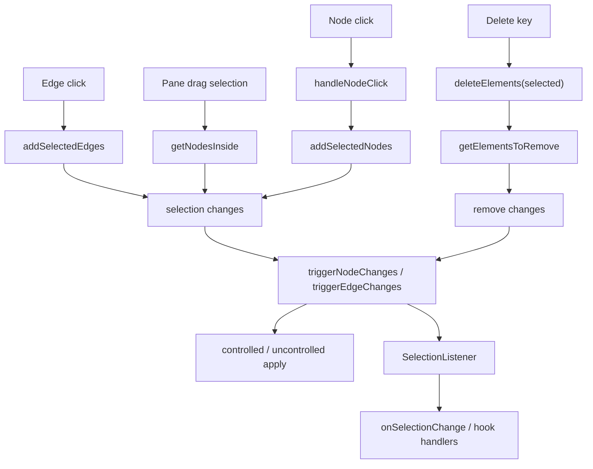

# 第 15 篇：Selection：点击、框选、多选和删除

如果只从 UI 效果看，selection 好像是 React Flow 里很小的一块：

```txt
点一下节点
  节点变成 selected

框选一片区域
  区域里的节点变成 selected

按 Backspace
  selected 元素被删除
```

但源码里 selection 不是一个简单的 CSS class。

它会影响：

- 节点和边的 selected 状态。
- 多选拖拽的 dragItems。
- 删除操作的目标集合。
- edge / node z-index。
- selection change 回调。
- 框选矩形渲染。
- pane click 是否取消选择。
- 键盘交互。
- 受控 / 非受控 changes 回流。

所以这一篇先建立一个结论：

> React Flow 的 selection 不是局部 UI 状态，而是连接点击、框选、多选、拖拽、删除和 change 回流的交互层状态。

它的主链路是：

```txt
点击 node / edge
  ↓
addSelectedNodes / addSelectedEdges
  ↓
createSelectionChange / getSelectionChanges
  ↓
triggerNodeChanges / triggerEdgeChanges
  ↓
controlled / uncontrolled 回流

框选 pane
  ↓
Pane 维护 userSelectionRect
  ↓
getNodesInside 命中节点
  ↓
connectionLookup 找关联边
  ↓
selection changes

按 Delete / Backspace
  ↓
deleteElements
  ↓
getElementsToRemove
  ↓
remove changes
```

第 14 篇讲的是“变化如何回流”。

这一篇就是把这套回流机制放进更复杂的用户交互里验证。

为了避免这一章太满，先把它拆成两层：

```txt
Selection 本体：
  click / box / multi / reset
  -> select changes

Selection 下游：
  delete selected
  -> getElementsToRemove
  -> remove changes
```

前者回答“谁被选中”，后者回答“基于当前选择，哪些元素最终允许被删除”。删除经常由 selection 触发，但它不是 selection action 的一部分，而是消费 selection 结果的独立流程。

---

## 1. 这一篇要解决的问题

selection 最容易被低估。

因为它看起来只是：

```txt
selected: true / false
```

但一旦放进图编辑器，selection 就会变成一个运行时协调器。

几个例子：

- 点击一个 node 时，要取消之前选中的 edge 吗？
- 按住多选键点击 selected node，是取消它，还是保持它？
- 拖拽已选节点时，是拖一个节点，还是拖整个 selection？
- 框选选中节点时，边要不要跟着选中？
- pane click 时，什么时候清空 selection？
- 框选过程中如果 auto pan，selection rectangle 起点如何保持？
- 删除 selected node 时，连到它的 edge 是否一起删除？
- `onBeforeDelete` 能否阻止删除？
- 受控模式下，selection 为什么必须通过 changes 回到用户？

这些问题说明，selection 不是一个局部组件能解决的。

它需要 store、Pane、NodeWrapper、EdgeWrapper、keyboard handler、deleteElements、change utils 共同协作。

---

## 2. 先看用户 API 或运行效果

用户一般会这样使用 selection：

```tsx
<ReactFlow
  nodes={nodes}
  edges={edges}
  elementsSelectable
  multiSelectionKeyCode="Meta"
  selectionKeyCode="Shift"
  selectionOnDrag
  onSelectionChange={({ nodes, edges }) => {
    console.log(nodes, edges);
  }}
  onNodesChange={onNodesChange}
  onEdgesChange={onEdgesChange}
  onBeforeDelete={async ({ nodes, edges }) => {
    return window.confirm(`Delete ${nodes.length + edges.length} items?`);
  }}
/>
```

这些 API 对应几类行为：

- 点击 node / edge 选中。
- 点击 pane 取消选择。
- 按多选键保留已有选择。
- 按 selection key 开始框选。
- 框选矩形命中节点。
- selection 变化时调用 `onSelectionChange`。
- 删除前经过 `onBeforeDelete`。

但最核心的仍然是：

```txt
selection 改变
  ↓
NodeChange / EdgeChange { type: 'select' }
```

也就是说，selection 不是绕过第 14 篇的状态回流机制，而是它的典型使用者。

---

## 3. 核心概念解释

### 3.1 selected 是元素数据的一部分

node 和 edge 都可以有：

```txt
selected: boolean
```

这不是纯 DOM 状态。

因为 selected 会影响：

- 用户拿到的 nodes / edges。
- `onSelectionChange` 回调。
- 多选拖拽。
- deleteElements。
- z-index 提升。
- 样式 class。

所以 React Flow 会用 `NodeChange` / `EdgeChange` 改 selected。

### 3.2 selection change 是 select change

`createSelectionChange` 很小：

```ts
{
  id,
  type: 'select',
  selected,
}
```

源码坐标：

- `packages/react/src/utils/changes.ts:223`

`getSelectionChanges` 会对一组 items 和 selectedIds 做 diff，只为真的发生变化的元素生成 changes。

源码坐标：

- `packages/react/src/utils/changes.ts:231`

这让点击、框选、多选、取消选择都能复用同一套 change 机制。

### 3.3 multiSelectionActive 是运行时模式

多选不是单独 API。

它是 store 里的运行时状态：

```txt
multiSelectionActive
```

`useGlobalKeyHandler` 监听多选键，然后写入 store。

源码坐标：

- `packages/react/src/hooks/useGlobalKeyHandler.ts:38`

后面 `addSelectedNodes` / `addSelectedEdges` 会根据它决定：

- 保留已有 selection。
- 还是只选当前元素并取消其他元素。

### 3.4 userSelectionRect 是框选运行时状态

框选过程中，store 里会保存：

```txt
userSelectionRect
userSelectionActive
nodesSelectionActive
```

其中 `userSelectionRect` 既包含 flow 起点，也包含 screen/container 矩形。

第 9 篇已经讲过这部分坐标。

这一篇关注它的 selection 语义：

```txt
selection rectangle
  ↓
getNodesInside
  ↓
selection changes
```

### 3.5 删除也是 selection 的消费者

删除不是 selection 本身，但它通常消费 selected nodes / edges。

`useGlobalKeyHandler` 在 delete key 按下时：

```txt
deleteElements({
  nodes: nodes.filter(selected),
  edges: edges.filter(selected)
})
```

源码坐标：

- `packages/react/src/hooks/useGlobalKeyHandler.ts:30`

所以 selection 的结果会直接决定 deleteElements 的输入。

---

## 4. 源码入口在哪里

这一篇建议按这些文件读：

```txt
packages/react/src/components/Nodes/utils.ts
packages/react/src/components/NodeWrapper/index.tsx
packages/react/src/components/EdgeWrapper/index.tsx
packages/react/src/store/index.ts
packages/react/src/container/Pane/index.tsx
packages/react/src/components/SelectionListener/index.tsx
packages/react/src/hooks/useOnSelectionChange.ts
packages/react/src/hooks/useGlobalKeyHandler.ts
packages/react/src/hooks/useReactFlow.ts
packages/system/src/utils/graph.ts
packages/react/src/utils/changes.ts
```

它们分别负责：

| 文件 | 责任 |
| --- | --- |
| `NodeWrapper` / `Nodes/utils` | 点击节点选择 / 取消选择 |
| `EdgeWrapper` | 点击边选择 / 多选取消 |
| `store/index.ts` | addSelectedNodes、addSelectedEdges、reset、unselect |
| `Pane` | pane click、框选矩形、框选命中、auto pan |
| `SelectionListener` | onSelectionChange / useOnSelectionChange 回调 |
| `useGlobalKeyHandler` | delete key、多选键 |
| `useReactFlow.deleteElements` | 删除 selected 元素 |
| `getElementsToRemove` | 删除前过滤、连带边、onBeforeDelete |
| `changes.ts` | selection changes / remove changes |

推荐阅读顺序：

```txt
Node click / Edge click
  ↓
store selection actions
  ↓
Pane box selection
  ↓
SelectionListener
  ↓
Delete key / deleteElements
```

---

## 5. 源码调用链

### 5.1 点击节点：NodeWrapper 调 handleNodeClick

`NodeWrapper` 的点击 handler 里，如果节点可选，会调用：

```txt
handleNodeClick({ id, store, nodeRef })
```

源码坐标：

- `packages/react/src/components/NodeWrapper/index.tsx:110`

`handleNodeClick` 做几件事：

1. 从 `nodeLookup` 找 internal node。
2. 清掉 `nodesSelectionActive`。
3. 如果节点未选中，调用 `addSelectedNodes([id])`。
4. 如果节点已选中且允许取消或处于多选模式，调用 `unselectNodesAndEdges`。

源码坐标：

- `packages/react/src/components/Nodes/utils.ts:15`

这说明 node click 不直接改 `node.selected`。

它走 store action。

### 5.2 addSelectedNodes：单选和多选的分叉

`addSelectedNodes` 是 selection 的核心 action 之一。

源码逻辑是：

```txt
if multiSelectionActive:
  selectedNodeIds.map(createSelectionChange(id, true))
  triggerNodeChanges(nodeChanges)
  return

triggerNodeChanges(getSelectionChanges(nodeLookup, selectedIds, true))
triggerEdgeChanges(getSelectionChanges(edgeLookup))
```

源码坐标：

- `packages/react/src/store/index.ts:296`

多选模式下，它只把新节点设为 selected，不会取消其他元素。

非多选模式下，它会：

- 对 nodeLookup 生成新的 selection changes。
- 对 edgeLookup 生成取消选择 changes。

这就是“点击节点时取消已选边”的来源。

### 5.3 为什么 getSelectionChanges 有 mutateItem

`getSelectionChanges(nodeLookup, selectedIds, true)` 第三个参数是 `mutateItem`。

源码注释说，这个 hack 是为了节点拖拽：当用户拖动一个节点时，它会被选中；再拖另一个节点时，需要在 `onNodesChange` 回调来得及之前，先把前一个节点在内部取消选中。

源码坐标：

- `packages/react/src/utils/changes.ts:231`

这是一个很现实的运行时取舍。

受控模式下，用户应用 selection changes 可能有一拍延迟。

但拖拽系统马上要依赖内部 `node.selected` 来构造 dragItems。

所以 React Flow 在必要时先 mutate internal item，保证交互连续正确，同时仍然发出 selection change 给用户。

### 5.4 点击边：EdgeWrapper 调 addSelectedEdges

`EdgeWrapper` 的 `onEdgeClick` 里：

```txt
if edge selected 且 multiSelectionActive:
  unselectNodesAndEdges({ nodes: [], edges: [edge] })
else:
  addSelectedEdges([id])
```

源码坐标：

- `packages/react/src/components/EdgeWrapper/index.tsx:118`

`addSelectedEdges` 的逻辑和 nodes 对称：

```txt
multiSelectionActive:
  只选中新 edge

非 multi:
  选中这些 edges
  清空 node selection
```

源码坐标：

- `packages/react/src/store/index.ts:308`

这就是 node selection 和 edge selection 的互斥关系。

### 5.5 点击 pane：resetSelectedElements

`Pane` 的 `onClick` 会：

```txt
onPaneClick?.(event)
resetSelectedElements()
nodesSelectionActive = false
```

源码坐标：

- `packages/react/src/container/Pane/index.tsx:99`

`resetSelectedElements` 会遍历 nodes / edges，把 selected 元素变成 select false changes：

```txt
node.selected -> createSelectionChange(node.id, false)
edge.selected -> createSelectionChange(edge.id, false)
```

然后：

```txt
triggerNodeChanges(nodeChanges)
triggerEdgeChanges(edgeChanges)
```

源码坐标：

- `packages/react/src/store/index.ts:375`

pane click 不是直接清某个 local state。

它仍然走 changes。

### 5.6 框选开始：Pane 记录起点

框选由 `Pane` 管理。

`onPointerDownCapture` 里先判断是否允许 selection：

- 当前是否 `isSelecting`。
- selection key 是否按下，或 `selectionOnDrag` 是否开启。
- 是否主按钮。
- 是否 primary pointer。
- 目标是否在 `.nokey` 下。

源码坐标：

- `packages/react/src/container/Pane/index.tsx:143`

通过后，它会拿 container 坐标，再转成 flow 起点：

```txt
getEventPosition(...)
pointToRendererPoint(...)
```

然后写入：

```txt
userSelectionRect
```

源码坐标：

- `packages/react/src/container/Pane/index.tsx:163`

这里延续第 9 篇的坐标模型。

### 5.7 框选移动：commitUserSelectionRect

pointer move 时，`Pane` 会调用：

```txt
commitUserSelectionRect(mouseX, mouseY)
```

它做几件事。

第一，把 flow 起点转回 screen/container 坐标，用于计算屏幕上的选择矩形。

源码坐标：

- `packages/react/src/container/Pane/index.tsx:200`

第二，调用：

```txt
getNodesInside(nodeLookup, nextUserSelectRect, transform, selectionMode === Partial, true)
```

找出矩形命中的节点。

源码坐标：

- `packages/react/src/container/Pane/index.tsx:217`

第三，根据选中的 node，通过 `connectionLookup` 找关联 edge。

源码坐标：

- `packages/react/src/container/Pane/index.tsx:226`

第四，对比前后 selected ids，如果变化了，生成 selection changes 并 trigger。

源码坐标：

- `packages/react/src/container/Pane/index.tsx:239`

所以框选不只是“选中矩形里的节点”。

它还会把连接这些节点的可选 edge 也纳入 selection。

### 5.8 框选 auto pan

框选时如果 pointer 靠近边缘，也可以 auto pan。

`Pane.autoPan` 调：

```txt
calcAutoPan(position, containerBounds, autoPanSpeed)
panBy({ x, y })
commitUserSelectionRect(mx, my)
```

源码坐标：

- `packages/react/src/container/Pane/index.tsx:255`

这和 `XYDrag` 的 auto pan 类似，但这里移动的是 selection rectangle 的查询范围。

这再次说明 selection 依赖 viewport / panzoom 系统。

### 5.9 框选结束：nodesSelectionActive

pointer up 时，`Pane` 会：

```txt
userSelectionActive = false
userSelectionRect = null
```

如果 selection 确实进行过，会调用 `onSelectionEnd`，并设置：

```txt
nodesSelectionActive = selectedNodeIds.current.size > 0
```

源码坐标：

- `packages/react/src/container/Pane/index.tsx:305`

`nodesSelectionActive` 会影响后续节点选择框、拖拽等行为。

### 5.10 SelectionListener：把 selected 集合通知用户

`SelectionListener` 是一个 helper component。

它从 `nodeLookup` / `edgeLookup` 里收集 selected nodes / edges：

```txt
selectedNodes
selectedEdges
```

源码坐标：

- `packages/react/src/components/SelectionListener/index.tsx:19`

然后在 effect 中调用：

```txt
onSelectionChange?.({ nodes, edges })
onSelectionChangeHandlers.forEach(...)
```

源码坐标：

- `packages/react/src/components/SelectionListener/index.tsx:48`

`useOnSelectionChange` 则是把 handler 注册到 store 的 `onSelectionChangeHandlers`。

源码坐标：

- `packages/react/src/hooks/useOnSelectionChange.ts:47`

这说明有两种方式监听 selection：

- ReactFlow prop：`onSelectionChange`
- hook：`useOnSelectionChange`

### 5.11 delete key：选择结果变成删除目标

`useGlobalKeyHandler` 监听 delete key。

当按下时：

```txt
const { edges, nodes } = store.getState()
deleteElements({
  nodes: nodes.filter(selected),
  edges: edges.filter(selected)
})
nodesSelectionActive = false
```

源码坐标：

- `packages/react/src/hooks/useGlobalKeyHandler.ts:26`

这里 selection 被消费成 deleteElements 的输入。

### 5.12 deleteElements：onBeforeDelete 和 remove changes

`deleteElements` 在 `useReactFlow` 里。

它先调用：

```txt
getElementsToRemove({
  nodesToRemove,
  edgesToRemove,
  nodes,
  edges,
  onBeforeDelete
})
```

源码坐标：

- `packages/react/src/hooks/useReactFlow.ts:163`

`getElementsToRemove` 会：

- 过滤 `deletable === false` 的节点和边。
- 如果父节点被删除，子节点也会被匹配。
- 删除 node 时找出 connected edges。
- 如果传入 edge id，也加入匹配边。
- 调用 `onBeforeDelete`，允许返回 boolean 或自定义 `{ nodes, edges }`。

源码坐标：

- `packages/system/src/utils/graph.ts:463`

然后 `deleteElements` 对匹配元素生成 remove changes：

```txt
matchingEdges.map(elementToRemoveChange)
matchingNodes.map(elementToRemoveChange)
```

并按顺序调用：

```txt
onEdgesDelete
triggerEdgeChanges
onNodesDelete
triggerNodeChanges
onDelete
```

源码坐标：

- `packages/react/src/hooks/useReactFlow.ts:188`

所以删除也不是直接 splice 数组。

它仍然通过 remove changes 回流。

---

## 6. 关键数据结构

### 6.1 Selection change

```ts
{
  id: string;
  type: 'select';
  selected: boolean;
}
```

它既可以是 `NodeSelectionChange`，也可以是 `EdgeSelectionChange`。

### 6.2 userSelectionRect

框选矩形运行时状态：

```txt
startX / startY
  flow 起点

x / y / width / height
  screen/container 矩形
```

它服务 UI 渲染和命中查询。

### 6.3 selectedNodeIds / selectedEdgeIds

`Pane` 内部用 ref 保存当前框选命中的 id 集合。

它们不是 store 的最终状态，而是框选过程中的临时工作集。

最终仍然要转成 selection changes。

### 6.4 multiSelectionActive

由多选键控制。

它决定点击新元素时：

- 是否保留已有 selection。
- 是否允许点击已选元素取消选择。

### 6.5 DeleteElementsOptions

删除接口接受：

```txt
nodesToRemove
edgesToRemove
```

但最终删除哪些元素由 `getElementsToRemove` 决定。

这中间会考虑 deletable、connected edges、parent children、onBeforeDelete。

---

## 7. 关键实现思路

可以用一张图串起来：



这张图说明 selection 的核心模式：

```txt
不同入口
  click / box / keyboard

同一协议
  NodeChange / EdgeChange

同一回流
  triggerNodeChanges / triggerEdgeChanges
```

### 7.1 selection 不直接操作用户数组

这点和第 14 篇一致。

selection 变化最终都变成：

```txt
select changes
remove changes
```

是否应用到数组，仍由 controlled / uncontrolled 决定。

### 7.2 框选是坐标系统和状态回流的交汇点

框选同时需要：

- 坐标转换。
- viewport transform。
- auto pan。
- nodeLookup。
- connectionLookup。
- selection changes。
- onSelectionStart / onSelectionEnd。

它不是一个简单 overlay。

### 7.3 删除是 selection 的下游能力

删除系统不是只看 selected。

它还要做：

- deletable 过滤。
- connected edge 扩展。
- onBeforeDelete。
- onNodesDelete / onEdgesDelete / onDelete 回调。
- remove changes 回流。

所以 selection 只是删除输入的一部分，真正删除仍然有自己的链路。

---

## 8. 这部分源码的设计取舍

### 8.1 为什么 selection 是元素字段

如果 selected 只是 UI local state，用户就无法：

- 保存当前选择。
- 根据 selected 做业务面板。
- 同步选中状态。
- 在受控模式下控制 selection。

所以 React Flow 把 `selected` 放在 node / edge 数据上，并通过 changes 回流。

### 8.2 为什么需要 SelectionListener

既然有 `onNodesChange` / `onEdgesChange`，为什么还要 `onSelectionChange`？

因为 `onSelectionChange` 给的是聚合结果：

```txt
selected nodes
selected edges
```

用户不需要自己从 changes 里还原当前 selection。

源码注释里甚至有 TODO：有了 nodes/edges change listeners 后还是否需要这个组件。

源码坐标：

- `packages/react/src/components/SelectionListener/index.tsx:1`

这也说明它是 convenience API，不是底层回流机制。

### 8.3 为什么框选会选中相关边

框选命中的是节点，但源码会通过 `connectionLookup` 找与选中节点相连的 edge。

这符合用户直觉：

```txt
框住一组节点
  通常也希望这组节点之间的边被纳入选择
```

但它仍然会检查 edge selectable。

### 8.4 为什么删除前要 getElementsToRemove

删除 selected 元素看似可以直接 remove。

但真实图编辑器需要：

- 禁止删除某些元素。
- 删除 parent 时处理 child。
- 删除 node 时连带删除 edge。
- 删除前让用户拦截。

所以 React Flow 把删除目标计算抽到 system graph util 里。

这让 deleteElements 不只是一个 UI 快捷键，而是一个可编程删除流程。

### 8.5 为什么内部有少量 mutate hack

`getSelectionChanges(..., mutateItem=true)` 看起来不够“纯”。

但它解决的是高频交互中的时序问题：

```txt
用户拖动新节点
  需要立即取消旧节点内部 selected

onNodesChange
  回调到用户再传回 props 可能太晚
```

这里 React Flow 做了一个实用取舍：

```txt
内部运行时先保证交互正确
外部仍通过 changes 得到正式状态更新
```

---

## 9. 如果我们自己实现，最小版本应该怎么写

mini-flow 可以先做三件事：

1. 点击选择。
2. 框选选择。
3. 删除 selected。

### 9.1 selection change

```ts
type SelectionChange = {
  id: string;
  type: 'select';
  selected: boolean;
};

function createSelectionChange(id: string, selected: boolean): SelectionChange {
  return { id, type: 'select', selected };
}
```

### 9.2 点击节点

```ts
function selectOneNode(nodes: Node[], nodeId: string): SelectionChange[] {
  return nodes
    .filter((node) => node.selected !== (node.id === nodeId))
    .map((node) => createSelectionChange(node.id, node.id === nodeId));
}
```

### 9.3 多选

```ts
function addNodeToSelection(nodeId: string): SelectionChange[] {
  return [createSelectionChange(nodeId, true)];
}
```

### 9.4 框选

```ts
function getNodesInsideRect(nodes: Node[], rect: Rect): string[] {
  return nodes
    .filter((node) => {
      return (
        node.position.x >= rect.x &&
        node.position.y >= rect.y &&
        node.position.x <= rect.x + rect.width &&
        node.position.y <= rect.y + rect.height
      );
    })
    .map((node) => node.id);
}

function selectNodesInRect(nodes: Node[], rect: Rect): SelectionChange[] {
  const selectedIds = new Set(getNodesInsideRect(nodes, rect));

  return nodes
    .filter((node) => node.selected !== selectedIds.has(node.id))
    .map((node) => createSelectionChange(node.id, selectedIds.has(node.id)));
}
```

真实实现里要用 flow 坐标、节点尺寸、partial/full mode，这里先保留主结构。

### 9.5 删除 selected

```ts
type RemoveChange = {
  id: string;
  type: 'remove';
};

function deleteSelected(nodes: Node[], edges: Edge[]) {
  const selectedNodeIds = new Set(nodes.filter((node) => node.selected).map((node) => node.id));
  const selectedEdgeIds = new Set(edges.filter((edge) => edge.selected).map((edge) => edge.id));

  return {
    nodeChanges: [...selectedNodeIds].map((id) => ({ id, type: 'remove' as const })),
    edgeChanges: edges
      .filter((edge) => selectedEdgeIds.has(edge.id) || selectedNodeIds.has(edge.source) || selectedNodeIds.has(edge.target))
      .map((edge) => ({ id: edge.id, type: 'remove' as const })),
  };
}
```

这个版本已经保留 React Flow 的核心：

```txt
选择和删除都不直接改数组
而是产生 changes
再交给 controlled / uncontrolled 回流机制
```

---

## 10. 本篇总结

这一篇我们把 React Flow 的 selection 系统串起来了。

核心链路是：

```txt
NodeWrapper / EdgeWrapper
  点击选择元素

store selection actions
  addSelectedNodes / addSelectedEdges / unselect / reset

Pane
  框选矩形、命中节点、关联边、auto pan

SelectionListener
  聚合 selected nodes / edges 通知用户

useGlobalKeyHandler
  多选键和删除键

deleteElements / getElementsToRemove
  删除 selected 元素并生成 remove changes

triggerNodeChanges / triggerEdgeChanges
  controlled / uncontrolled 回流
```

几个关键结论：

- selected 是 node / edge 数据的一部分，不是纯 UI class。
- selection 改变最终是 `type: 'select'` 的 change。
- 点击、框选、多选、取消选择都复用同一套 selection changes。
- 框选依赖坐标系统、nodeLookup、connectionLookup 和 auto pan。
- 删除是 selection 的下游能力，但会经过 deletable、connected edges 和 onBeforeDelete。
- `onSelectionChange` 是聚合通知，底层仍然是 change 回流。

到这里，React Flow 的核心交互系统已经有了完整轮廓：

```txt
panzoom 改 viewport
drag 改 node position
handle 改 graph connection
selection 改 selected / remove changes
```

---

## 11. 下一篇读什么

下一篇进入：

```txt
第 16 篇：Hooks API：useReactFlow、useNodes、useEdges、useViewport
```

前面我们一直在读内部 store 和交互系统。

下一篇要看 React Flow 如何把这些内部能力包装给用户。也就是说，Hooks API 不是新系统，而是 panzoom、drag、handle、selection、changes 和 store 的 public adapter：

- `useReactFlow` 为什么像一个命令式 façade。
- `useNodes` / `useEdges` 为什么是订阅式 hooks。
- `useViewport` 和 `useConnection` 分别暴露哪些运行时状态。
- `useStore` / `useStoreApi` 为什么是更底层的逃逸口。
- hooks 如何在“不暴露内部复杂性”和“允许高级定制”之间取平衡。
