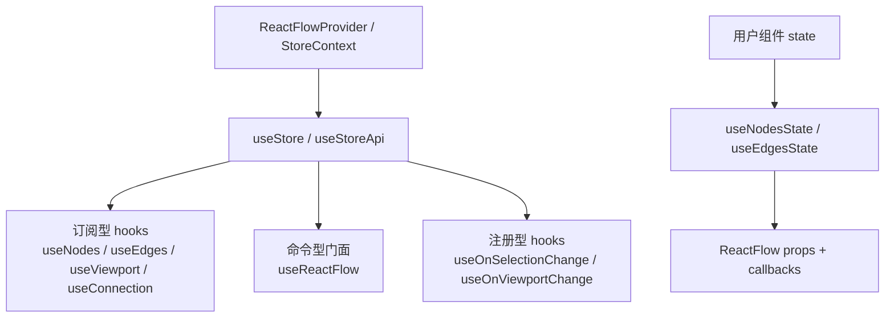

# 第 16 篇：Hooks API：useReactFlow、useNodes、useEdges、useViewport

如果前面 15 篇一直在读 React Flow 的内部运行时，那么这一篇要走到用户能摸到的那一层。

也就是 hooks。

更具体地说：08-15 讲内部如何运行，16 讲用户如何通过 hooks 访问这些运行时能力。Hooks 不是一套新系统，而是对 InternalNode、坐标、panzoom、drag、handle、selection、changes 这些能力的 public API adapter。

很多人第一次看 React Flow 的 hooks，会把它们理解成：

```txt
useNodes      读 nodes
useEdges      读 edges
useViewport   读 viewport
useReactFlow  拿一堆方法
useStore      直接访问 store
```

这个理解没有错，但太薄。

因为 React Flow 的 hooks 不是普通组件库里那种“把状态拿出来用一下”的辅助函数。它们背后接的是一个图编辑器运行时：

- nodes / edges 是 graph data。
- viewport 是 panzoom 系统的结果。
- connection 是 XYHandle 交互过程的中间态。
- selection 是点击、框选、多选、删除共同维护的运行时状态。
- store 里既有对外数据，也有内部 lookup、callbacks、panZoom 实例和 action。
- 命令式方法要和 controlled / uncontrolled、批处理队列、DOM 测量、坐标转换协作。

所以这一篇先建立一个结论：

> React Flow 的 Hooks API 不是把 Zustand store 原样暴露出来，而是把内部运行时分层包装成用户可理解、可订阅、可命令、可扩展的 React API。

这层 API 的主结构可以这样看：

```txt
ReactFlowProvider / ReactFlow
  ↓
StoreContext
  ↓
低层逃逸口
  useStore / useStoreApi
  ↓
订阅型 hooks
  useNodes / useEdges / useViewport / useConnection
  ↓
命令型门面
  useReactFlow
  ↓
事件注册型 hooks
  useOnSelectionChange / useOnViewportChange
  ↓
受控辅助 hooks
  useNodesState / useEdgesState
```

画成图更直观：



换句话说，Hooks API 是 React Flow 给用户开的“运行时控制台”。

它既不要求用户理解所有内部字段，也不完全隐藏内部能力。

这正是它值得读的地方。

---

## 1. 这一篇要解决的问题

前面我们已经读过这些模块：

```txt
ReactFlow
  负责门面组件和 props 汇聚

GraphView
  负责渲染层总装

store
  保存图数据、视口、选择、连接和运行时实例

XYPanZoom
  管理缩放和平移

XYDrag
  管理节点拖拽

XYHandle
  管理 Handle 连线

Selection
  管理点击、框选、多选和删除
```

但用户写业务代码时，通常不会直接碰这些内部文件。

用户更常写的是：

```tsx
function Toolbar() {
  const { fitView, zoomIn, zoomOut } = useReactFlow();

  return (
    <div>
      <button onClick={() => zoomIn()}>+</button>
      <button onClick={() => zoomOut()}>-</button>
      <button onClick={() => fitView()}>fit</button>
    </div>
  );
}
```

或者：

```tsx
function NodeCounter() {
  const nodes = useNodes();

  return <span>{nodes.length}</span>;
}
```

或者：

```tsx
function Inspector() {
  const viewport = useViewport();

  return (
    <pre>
      {viewport.x}, {viewport.y}, {viewport.zoom}
    </pre>
  );
}
```

这些 hooks 看起来很轻。

但它们要解决的问题其实很重：

- 用户如何读取当前 graph data？
- 用户如何触发 viewport 命令？
- 用户如何把 screen 坐标转换成 flow 坐标？
- 用户如何删除元素，并复用内部的删除规则？
- 用户如何监听 selection / viewport 变化？
- 用户如何写自定义插件组件？
- 高级用户如何访问内部 store，同时不污染普通 API？
- 订阅状态时如何避免无意义重渲染？
- 受控模式示例为什么需要 `useNodesState` / `useEdgesState`？

这些问题背后，其实是一个 API 分层问题。

先记住一个最常见的语义差异：

```txt
useNodes()
  订阅 nodes，nodes 变化会让当前组件重新渲染。

useReactFlow().getNodes()
  命令式读取快照，不会因为 nodes 变化自动重渲染当前组件。
```

所以要展示节点数量，用 `useNodes()`；只是在按钮点击时读取当前节点，用 `useReactFlow().getNodes()` 更合适。这个区别比“两个 API 都能拿 nodes”重要得多。

如果 React Flow 只暴露 `useStore`，用户会获得最大的自由，也会获得最大的复杂度。

如果 React Flow 只暴露几个高层组件，用户又很难写 Controls、MiniMap、Inspector、自定义面板这些扩展。

所以 React Flow 选择了中间路线：

```txt
普通用户
  用 useReactFlow / useNodes / useEdges / useViewport

自定义 UI 和插件组件
  用订阅型 hooks + command hooks

高级用户
  用 useStore / useStoreApi 访问内部 store

示例和轻量受控场景
  用 useNodesState / useEdgesState
```

这就是本篇要拆开的东西。

---

## 2. 先看用户 API 或运行效果

先看最常见的几类用法。

### 2.1 读取 nodes / edges

```tsx
import { useNodes, useEdges } from '@xyflow/react';

function GraphStats() {
  const nodes = useNodes();
  const edges = useEdges();

  return (
    <div>
      {nodes.length} nodes, {edges.length} edges
    </div>
  );
}
```

这个组件会随着 nodes / edges 变化重新渲染。

这里的“变化”不只是新增删除：

- 节点被拖拽，position 变了。
- 节点被选中，selected 变了。
- 节点尺寸测量完成，相关字段变了。
- 边被选中，selected 变了。
- 边被重连，source / target 变了。

所以 `useNodes` / `useEdges` 是读数据，也是订阅变化。

### 2.2 读取 viewport

```tsx
import { useViewport } from '@xyflow/react';

function ViewportDebug() {
  const { x, y, zoom } = useViewport();

  return (
    <div>
      x: {x}, y: {y}, zoom: {zoom}
    </div>
  );
}
```

这个组件会在 pan / zoom 时重新渲染。

如果用户只是点一个按钮时读取当前 zoom，不一定要用 `useViewport`。

可以用 `useReactFlow().getZoom()`。

这两者的差别非常重要：

```txt
useViewport()
  订阅 viewport，viewport 变化会触发组件重新渲染

useReactFlow().getZoom()
  命令式读取当前值，不因为 zoom 变化自动重新渲染
```

这就是“订阅型 hook”和“命令型门面”的区别。

### 2.3 操作画布

```tsx
import { useReactFlow } from '@xyflow/react';

function CanvasToolbar() {
  const reactFlow = useReactFlow();

  return (
    <div>
      <button onClick={() => reactFlow.zoomIn()}>zoom in</button>
      <button onClick={() => reactFlow.zoomOut()}>zoom out</button>
      <button onClick={() => reactFlow.fitView()}>fit</button>
    </div>
  );
}
```

这里的 `reactFlow` 更像一个实例对象。

它暴露的不是某个 state slice，而是一组“对运行时发命令”的方法。

包括：

- `getNodes`
- `getNode`
- `getEdges`
- `setNodes`
- `setEdges`
- `addNodes`
- `addEdges`
- `deleteElements`
- `getNodesBounds`
- `getHandleConnections`
- `getNodeConnections`
- `fitView`
- `zoomIn`
- `zoomOut`
- `zoomTo`
- `setViewport`
- `getViewport`
- `screenToFlowPosition`
- `flowToScreenPosition`

注意这个列表里混着几类能力：

```txt
graph data 查询
graph data 更新
删除规则复用
边界计算
连接查询
viewport 命令
坐标转换
```

所以 `useReactFlow` 不是“一个更大的 useStore”。

它是 React Flow 给用户提供的运行时 façade。

### 2.4 监听 selection / viewport

```tsx
import { useOnSelectionChange, useOnViewportChange } from '@xyflow/react';

function RuntimeLogger() {
  useOnSelectionChange({
    onChange: ({ nodes, edges }) => {
      console.log('selection', nodes, edges);
    },
  });

  useOnViewportChange({
    onStart: (viewport) => console.log('start', viewport),
    onChange: (viewport) => console.log('change', viewport),
    onEnd: (viewport) => console.log('end', viewport),
  });

  return null;
}
```

这类 hook 不返回数据，也不返回命令。

它们做的是“把用户回调注册进运行时”。

这和 `useNodes` 的订阅模型不同。

`useNodes` 是：

```txt
store state changed
  ↓
component re-render
```

`useOnSelectionChange` 是：

```txt
selection changed
  ↓
SelectionListener 收集 selected nodes / edges
  ↓
调用注册的回调
```

它更像事件注册。

### 2.5 受控模式辅助

React Flow 文档里经常出现这样的写法：

```tsx
const [nodes, setNodes, onNodesChange] = useNodesState(initialNodes);
const [edges, setEdges, onEdgesChange] = useEdgesState(initialEdges);

return (
  <ReactFlow
    nodes={nodes}
    edges={edges}
    onNodesChange={onNodesChange}
    onEdgesChange={onEdgesChange}
  />
);
```

这不是 React Flow 的核心状态管理方案。

它只是一个把这个模式包装起来的辅助函数：

```txt
useState
  +
applyNodeChanges / applyEdgeChanges
```

为什么要有它？

因为受控模式的核心协议是：

```txt
内部交互产生 changes
  ↓
onNodesChange / onEdgesChange
  ↓
用户应用 changes
  ↓
把新的 nodes / edges props 传回 ReactFlow
```

这个协议对源码读者很重要。

`useNodesState` / `useEdgesState` 用最小代码把它显性化了。

---

## 3. 核心概念解释

这一篇的核心不是“有哪些 hooks”，而是“hooks 被分成了哪几类”。

可以先画成一张图：

```txt
                        ReactFlow Hooks API
                                  │
        ┌─────────────────────────┼─────────────────────────┐
        │                         │                         │
   订阅型 hooks              命令型 hooks              注册型 hooks
        │                         │                         │
 useNodes                 useReactFlow              useOnSelectionChange
 useEdges                      │                    useOnViewportChange
 useViewport                   │
 useConnection                 │
        │                      │
        └──────────────┬───────┘
                       │
                 StoreContext
                       │
        ┌──────────────┴──────────────┐
        │                             │
   useStore(selector)             useStoreApi()
   订阅内部状态                   命令式访问 store
```

再加上受控辅助：

```txt
useNodesState / useEdgesState
  不读取 React Flow 内部 store
  而是在用户组件里维护外部 nodes / edges
```

这几类 hook 的职责不同。

### 3.1 低层逃逸口：useStore / useStoreApi

`useStore` 是订阅内部 store 的低层 API。

它接收 selector 和 equalityFn：

```tsx
const selectedNodeIds = useStore(
  (state) =>
    Array.from(state.nodeLookup.values())
      .filter((node) => node.selected)
      .map((node) => node.id),
  shallow
);
```

它适合高级场景。

但普通场景不应该优先用它。

因为一旦你选择内部字段，就要承担内部结构变化和订阅范围的成本。

`useStoreApi` 则返回：

```txt
getState
setState
subscribe
```

它是命令式逃逸口。

典型用法是内部 hooks：

- `useReactFlow` 用它读取 store 和调用 action。
- `useViewportHelper` 用它拿 panZoom、transform、domNode。
- `useOnSelectionChange` 用它注册 handler。
- `useOnViewportChange` 用它写 viewport callbacks。

### 3.2 订阅型 hooks：useNodes / useEdges / useViewport / useConnection

这类 hooks 的共同点：

```txt
内部都是 useStore(selector, equalityFn)
```

它们的作用是把常用 state slice 包装成稳定的公共 API。

例如：

```txt
useNodes
  state.nodes

useEdges
  state.edges

useViewport
  state.transform -> { x, y, zoom }

useConnection
  state.connection，并在 inProgress 时转换 connection.to 坐标
```

它们是“会触发重新渲染”的 hooks。

这带来一个很实际的设计提醒：

```txt
需要实时显示数据
  用订阅型 hook

只在点击按钮时读取一次
  用 useReactFlow 的 get 方法

需要非常细粒度订阅
  用 useStore(selector)
```

### 3.3 命令型门面：useReactFlow

`useReactFlow` 返回一个 `ReactFlowInstance`。

它更像运行时对象：

```txt
const reactFlow = useReactFlow();

reactFlow.getNodes()
reactFlow.setNodes(...)
reactFlow.deleteElements(...)
reactFlow.fitView(...)
reactFlow.screenToFlowPosition(...)
```

它不是订阅所有 state。

源码里它只用一个很小的 selector 订阅 `viewportInitialized`，其余方法通过 `store.getState()` 在调用时读取当前状态。

这意味着：

- 它适合事件处理器。
- 它适合插件按钮。
- 它适合命令式操作画布。
- 它不适合直接拿来渲染实时变化的数据。

如果你写：

```tsx
function BadCounter() {
  const reactFlow = useReactFlow();

  return <div>{reactFlow.getNodes().length}</div>;
}
```

这个组件不会因为 nodes 变化自动重渲染。

应该写：

```tsx
function GoodCounter() {
  const nodes = useNodes();

  return <div>{nodes.length}</div>;
}
```

这不是语法问题，而是 API 语义问题。

### 3.4 注册型 hooks：useOnSelectionChange / useOnViewportChange

这类 hook 的作用不是读取 state，而是把用户回调接入运行时事件链。

例如 selection：

```txt
useOnSelectionChange
  ↓
把 onChange push 到 store.onSelectionChangeHandlers
  ↓
SelectionListener 在 selected nodes / edges 变化后调用这些 handlers
```

viewport：

```txt
useOnViewportChange
  ↓
把 onStart / onChange / onEnd 写入 store
  ↓
ZoomPane / panzoom 流程在视口变化阶段调用
```

这类 hook 有一个很关键的特点：

```txt
用户传入的 callback 身份要稳定
```

尤其是 `useOnSelectionChange`，源码注释明确提醒 handler 要 memoize。

原因也很直接：

```txt
handler 身份变化
  ↓
effect 重新注册
  ↓
旧 handler 清理，新 handler 加入
```

如果每次 render 都创建一个新函数，就会让注册逻辑变得混乱，也可能造成行为不稳定。

### 3.5 受控辅助 hooks：useNodesState / useEdgesState

这两个 hook 特别容易被误解。

它们不是从 React Flow 内部 store 读 nodes / edges。

它们只是：

```txt
const [nodes, setNodes] = useState(initialNodes);
const onNodesChange = useCallback(
  (changes) => setNodes((nds) => applyNodeChanges(changes, nds)),
  []
);
```

也就是“帮用户写受控模式样板代码”。

所以它们的位置不是：

```txt
ReactFlow internal store
  ↓
useNodesState
```

而是：

```txt
User component state
  ↓
nodes / edges props
  ↓
ReactFlow
  ↓
onNodesChange / onEdgesChange
  ↓
apply changes back to user component state
```

这正好呼应第 14 篇：

> React Flow 的交互最终不会直接修改用户的 nodes，而是产生 change objects，由受控或非受控模式决定谁来应用这些变化。

---

## 4. 源码入口在哪里

这一篇主要读这些文件：

```txt
packages/react/src/index.ts
packages/react/src/hooks/useStore.ts
packages/react/src/hooks/useReactFlow.ts
packages/react/src/hooks/useViewportHelper.ts
packages/react/src/hooks/useNodes.ts
packages/react/src/hooks/useEdges.ts
packages/react/src/hooks/useViewport.ts
packages/react/src/hooks/useConnection.ts
packages/react/src/hooks/useNodesEdgesState.ts
packages/react/src/hooks/useOnSelectionChange.ts
packages/react/src/hooks/useOnViewportChange.ts
```

先按职责分组：

| 文件 | 主要职责 |
| --- | --- |
| `packages/react/src/hooks/useStore.ts` | 暴露 selector 订阅和 store api 逃逸口 |
| `packages/react/src/hooks/useReactFlow.ts` | 组合 graph、viewport、delete、update 等命令型门面 |
| `packages/react/src/hooks/useViewportHelper.ts` | 封装 panZoom 命令、bounds fit、screen/flow 坐标转换 |
| `packages/react/src/hooks/useNodes.ts` / `useEdges.ts` / `useViewport.ts` | 订阅型状态 hooks |
| `packages/react/src/hooks/useNodesEdgesState.ts` | 用户侧受控状态辅助，不读取内部 store |
| `packages/react/src/hooks/useOnSelectionChange.ts` / `useOnViewportChange.ts` | 注册 selection / viewport 变化监听 |

公共入口在：

```txt
packages/react/src/index.ts
```

入口文件直接导出了这些 hooks：

```ts
export { useReactFlow } from './hooks/useReactFlow';
export { useNodes } from './hooks/useNodes';
export { useEdges } from './hooks/useEdges';
export { useViewport } from './hooks/useViewport';
export { useNodesState, useEdgesState } from './hooks/useNodesEdgesState';
export { useStore, useStoreApi } from './hooks/useStore';
export { useOnViewportChange } from './hooks/useOnViewportChange';
export { useOnSelectionChange } from './hooks/useOnSelectionChange';
export { useConnection } from './hooks/useConnection';
```

这个导出列表本身就说明了 API 分层。

React Flow 同时公开：

- 高层实例 hook：`useReactFlow`
- 常用状态 hook：`useNodes`、`useEdges`、`useViewport`
- 内部 store hook：`useStore`、`useStoreApi`
- 事件 hook：`useOnViewportChange`、`useOnSelectionChange`
- 连接状态 hook：`useConnection`
- 受控辅助 hook：`useNodesState`、`useEdgesState`

它没有把所有能力都塞进一个大 hook。

这是 API 设计上的一个重要信号。

---

## 5. 源码调用链

先看整体调用链：

```txt
ReactFlow / ReactFlowProvider
  ↓
StoreContext.Provider
  ↓
hooks
  ├─ useStore(selector, equalityFn)
  │    ↓
  │  useZustandStore(store, selector, equalityFn)
  │
  ├─ useStoreApi()
  │    ↓
  │  { getState, setState, subscribe }
  │
  ├─ useNodes / useEdges / useViewport / useConnection
  │    ↓
  │  useStore(...)
  │
  ├─ useReactFlow
  │    ↓
  │  useStoreApi + useViewportHelper + useBatchContext + useStore(selector)
  │
  ├─ useOnSelectionChange / useOnViewportChange
  │    ↓
  │  useStoreApi().setState(...)
  │
  └─ useNodesState / useEdgesState
       ↓
     React useState + apply changes
```

这个图里有两个中心：

```txt
StoreContext
BatchProvider
```

`StoreContext` 提供运行时状态。

`BatchProvider` 处理节点和边更新队列。

这解释了为什么 `useReactFlow` 不只是 `store.setState` 的薄封装。

它的 `setNodes` / `setEdges` 会通过 batch queue 进入更新流程。

---

## 6. 关键数据结构

### 6.1 StoreContext

`useStore.ts` 里第一件重要的事是读取 `StoreContext`。

源码结构是：

```ts
const store = useContext(StoreContext);

if (store === null) {
  throw new Error(zustandErrorMessage);
}
```

这说明所有这些内部 hooks 都有一个共同前提：

```txt
组件必须位于 ReactFlow 或 ReactFlowProvider 子树下
```

否则没有 store。

这就是为什么插件组件必须作为 children 放在 React Flow 内部，或者放在 `ReactFlowProvider` 下。

从架构角度看：

```txt
ReactFlowProvider
  不是装饰性 provider
  而是整个运行时状态的边界
```

### 6.2 ReactFlowInstance

`useReactFlow` 返回的是 `ReactFlowInstance`。

这个对象可以分成几组能力：

```txt
查询 graph
  getNodes
  getNode
  getInternalNode
  getEdges
  getEdge

更新 graph
  setNodes
  setEdges
  addNodes
  addEdges
  updateNode
  updateNodeData
  updateEdge
  updateEdgeData

删除元素
  deleteElements

几何和连接查询
  getNodesBounds
  getIntersectingNodes
  isNodeIntersecting
  getHandleConnections
  getNodeConnections

视口命令
  zoomIn
  zoomOut
  zoomTo
  getZoom
  setViewport
  getViewport
  setCenter
  fitBounds
  fitView

坐标转换
  screenToFlowPosition
  flowToScreenPosition

导出状态
  toObject

运行时状态
  viewportInitialized
```

注意这里有一个内部和外部的边界：

```txt
getNode(id)
  返回 internals.userNode

getInternalNode(id)
  返回 InternalNode
```

React Flow 默认给用户的是 user node，而不是 InternalNode。

但它也给高级用户留了 `getInternalNode`。

这仍然是“默认隐藏复杂性，同时提供逃逸口”的设计。

### 6.3 ViewportHelperFunctions

`useViewportHelper` 返回的是 viewport 相关命令：

```txt
zoomIn
zoomOut
zoomTo
getZoom
setViewport
getViewport
setCenter
fitBounds
screenToFlowPosition
flowToScreenPosition
```

这些方法不是直接改 transform 数组。

它们会：

- 读取 `panZoom` 实例。
- 调用 `panZoom.scaleBy` / `scaleTo` / `setViewport`。
- 用 `getViewportForBounds` 计算 fit bounds。
- 用 `pointToRendererPoint` 做 screen -> flow 坐标转换。
- 用 `rendererPointToPoint` 做 flow -> screen 坐标转换。
- 读取 `domNode.getBoundingClientRect()` 把浏览器 client 坐标转到 React Flow 容器内。

这说明 viewport helper 是对第 9 篇和第 10 篇的封装。

用户调用的是：

```tsx
screenToFlowPosition({ x: event.clientX, y: event.clientY })
```

内部实际做的是：

```txt
client position
  ↓ 减去 domNode bounds
container position
  ↓ pointToRendererPoint(transform)
flow position
  ↓ 可选 snapToGrid
snapped flow position
```

### 6.4 Nodes / Edges / Viewport selectors

`useNodes` 非常薄：

```ts
const nodesSelector = (state) => state.nodes;
const nodes = useStore(nodesSelector, shallow);
```

`useEdges` 也类似：

```ts
const edgesSelector = (state) => state.edges;
const edges = useStore(edgesSelector, shallow);
```

`useViewport` 是从 `transform` 转换出对象：

```ts
const viewportSelector = (state) => ({
  x: state.transform[0],
  y: state.transform[1],
  zoom: state.transform[2],
});
```

这几个 hook 之所以要单独存在，不是因为实现复杂，而是因为 API 语义重要。

它们把内部字段翻译成用户熟悉的概念：

```txt
state.transform
  ↓
Viewport { x, y, zoom }

state.nodes
  ↓
Node[]

state.edges
  ↓
Edge[]
```

### 6.5 ConnectionState

`useConnection` 暴露的是当前连接交互状态。

它的 selector 做了一个细节处理：

```txt
connection.inProgress
  true  -> 把 connection.to 用 pointToRendererPoint 按 transform 转换
  false -> 原样返回 connection
```

这呼应第 12 篇：

连接过程里 pointer 坐标、renderer 坐标、flow 坐标之间一直在转换。

`useConnection` 把这层复杂性包装掉，让用户可以用它做：

- 自定义 handle 高亮。
- 自定义连接提示。
- 根据当前连接源点决定目标节点样式。

### 6.6 onSelectionChangeHandlers

`useOnSelectionChange` 不是把一个字段设为某个回调。

它会把回调追加到数组里：

```txt
onSelectionChangeHandlers = [...handlers, onChange]
```

卸载时再 filter 掉当前 handler。

这说明 React Flow 支持多个组件同时监听 selection change。

例如：

- 一个 Inspector 显示选中元素详情。
- 一个 Toolbar 根据选中状态启用按钮。
- 一个 StatusBar 显示 selected count。

它们都可以注册 handler，而不是互相覆盖。

### 6.7 useNodesState / useEdgesState 的 tuple

这两个 hook 返回的是三元组：

```txt
[nodes, setNodes, onNodesChange]
[edges, setEdges, onEdgesChange]
```

它对齐的是 React 的 `useState` 心智模型。

但第三项是 React Flow 专用的 change reducer：

```txt
onNodesChange(changes)
  ↓
setNodes((nodes) => applyNodeChanges(changes, nodes))
```

这让用户可以用很低成本进入受控模式。

---

## 7. 关键实现思路

下面按几类 hook 分开读源码。

### 7.1 useStore：低层订阅口

源码位置：

```txt
packages/react/src/hooks/useStore.ts
```

核心实现很短：

```ts
function useStore(selector, equalityFn) {
  const store = useContext(StoreContext);

  if (store === null) {
    throw new Error(zustandErrorMessage);
  }

  return useZustandStore(store, selector, equalityFn);
}
```

这一段解决三个问题。

第一，store 从 Context 来。

所以 hook 不依赖全局单例。

一个页面里可以有多个 React Flow 实例，每个实例有自己的 store。

```txt
ReactFlow A
  StoreContext A
  useNodes -> nodes A

ReactFlow B
  StoreContext B
  useNodes -> nodes B
```

第二，必须在 provider 下使用。

如果用户在 ReactFlow 外部调用 `useNodes`，它最终会走到 `useStore`，然后抛出错误。

第三，selector / equalityFn 是性能边界。

这意味着 React Flow 并不鼓励“订阅整个 store 然后组件里自己挑字段”。

更好的方式是：

```tsx
const selectedIds = useStore(
  (state) => state.nodes.filter((node) => node.selected).map((node) => node.id),
  shallow
);
```

但这个例子也有问题：

它每次都会扫描 nodes。

更高级的做法可能是基于 lookup 或专门的 selector。

这就是为什么后面第 18 篇会讲 selector 和性能设计。

### 7.2 useStoreApi：命令式 store 口

`useStoreApi` 同样读 `StoreContext`。

但它不调用 `useZustandStore`。

它返回：

```ts
{
  getState: store.getState,
  setState: store.setState,
  subscribe: store.subscribe,
}
```

这三个方法的语义很强：

```txt
getState
  在事件处理器或命令函数里读取最新状态

setState
  写入 store，注册 callback 或调度内部标记

subscribe
  在 React 渲染周期之外监听 store
```

为什么 `useReactFlow` 用 `useStoreApi` 而不是 `useStore`？

因为 `useReactFlow` 的大多数方法都不需要在状态变化时重新创建。

例如：

```ts
getNodes: () => store.getState().nodes.map((n) => ({ ...n }))
```

这个函数只需要在用户调用时读最新 nodes。

如果它订阅 nodes，每次拖拽节点都会让拿到 `useReactFlow` 的组件重渲染。

这不是用户想要的。

所以这里的设计是：

```txt
读实时数据用于渲染
  用 useNodes / useEdges / useViewport

在事件里读取和操作运行时
  用 useReactFlow / useStoreApi
```

这条边界很重要。

### 7.3 useNodes / useEdges：常用数据订阅

`useNodes` 和 `useEdges` 很像。

源码位置：

```txt
packages/react/src/hooks/useNodes.ts
packages/react/src/hooks/useEdges.ts
```

`useNodes`：

```ts
const nodesSelector = (state) => state.nodes;

export function useNodes() {
  const nodes = useStore(nodesSelector, shallow);
  return nodes;
}
```

`useEdges`：

```ts
const edgesSelector = (state) => state.edges;

export function useEdges() {
  const edges = useStore(edgesSelector, shallow);
  return edges;
}
```

它们的文档注释里有一个非常重要的提醒：

```txt
useNodes 会在任何 node 变化时重渲染，包括 selected 或 moved
useEdges 会在任何 edge 变化时重渲染
```

这说明它们适合：

- 统计节点数量。
- 渲染一个全局列表。
- 根据全图状态显示 UI。
- 在插件组件里读取 graph data。

但它们不适合：

- 每个节点内部都用 `useNodes` 找自己。
- 高频拖拽时做重计算。
- 只关心一个字段却订阅整个数组。

如果你只想订阅某个节点的数据，应该看更细粒度的 hook，例如 `useNodesData`，或者使用 `useStore` 写 selector。

这就是 React Flow API 的层级：

```txt
useNodes
  简单，但订阅范围大

useStore(selector)
  复杂一点，但可以缩小订阅范围

useReactFlow().getNodes()
  不订阅，适合命令式读取
```

### 7.4 useViewport：把 transform 翻译成用户概念

`useViewport` 的源码也很短：

```ts
const viewportSelector = (state) => ({
  x: state.transform[0],
  y: state.transform[1],
  zoom: state.transform[2],
});
```

内部 store 里保存的是：

```txt
transform: [x, y, zoom]
```

用户 API 暴露的是：

```txt
Viewport: { x, y, zoom }
```

这是一层很小但很关键的翻译。

因为第 9 篇已经讲过：

```txt
transform 是渲染层真正使用的数据结构
Viewport 是对用户更友好的概念
```

React Flow 没有要求用户理解 transform 数组。

而是用 `useViewport` 把它映射成对象。

但 `useViewport` 是订阅型 hook。

所以它适合这样用：

```tsx
function ZoomLabel() {
  const { zoom } = useViewport();
  return <span>{Math.round(zoom * 100)}%</span>;
}
```

不适合这样用：

```tsx
function HugePanel() {
  const viewport = useViewport();

  return <ExpensiveTree viewport={viewport} />;
}
```

如果 `ExpensiveTree` 很重，pan / zoom 时就会不断重渲染。

更好的写法是把订阅范围放到最小组件里，或者只在需要时用 `useReactFlow().getViewport()`。

### 7.5 useConnection：把连接过程暴露给自定义 UI

`useConnection` 的价值在于，它暴露的是“正在连接”这个运行时中间态。

普通 graph data 里只有 edges。

但连线过程中，edge 还没创建。

这时运行时里存在的是：

```txt
connection.inProgress
connection.fromNode
connection.fromHandle
connection.to
connection.toNode
connection.toHandle
connection.isValid
```

`useConnection` 允许用户基于这个状态写自定义 UI。

例如：

```tsx
function CustomHandleHint() {
  const connection = useConnection();

  if (!connection.inProgress) {
    return null;
  }

  return connection.isValid ? <ValidHint /> : <InvalidHint />;
}
```

源码里还有一个值得注意的细节：

```ts
return s.connection.inProgress
  ? { ...s.connection, to: pointToRendererPoint(s.connection.to, s.transform) }
  : { ...s.connection };
```

为什么要转坐标？

因为连接交互里，pointer position 和 renderer position 经常不是同一个坐标系。

hook 在对外暴露前做了一次适配。

这符合整个 Hooks API 的设计：

```txt
不要把内部坐标细节原样丢给用户
而是在 public hook 层做概念翻译
```

### 7.6 useViewportHelper：viewport 命令和坐标转换

`useViewportHelper` 是内部 hook，但它是理解 `useReactFlow` 的关键。

源码位置：

```txt
packages/react/src/hooks/useViewportHelper.ts
```

它先拿 store：

```ts
const store = useStoreApi();
```

然后返回一组 helper：

```ts
zoomIn
zoomOut
zoomTo
getZoom
setViewport
getViewport
setCenter
fitBounds
screenToFlowPosition
flowToScreenPosition
```

这些方法可以分三组。

第一组是 panZoom 命令：

```txt
zoomIn / zoomOut / zoomTo
  ↓
panZoom.scaleBy / scaleTo

setViewport
  ↓
panZoom.setViewport
```

这意味着用户调用 `zoomIn` 时，不是直接写 store.transform。

它会走 XYPanZoom 的约束和回调机制。

第二组是视口计算：

```txt
fitBounds
  ↓
getViewportForBounds(bounds, width, height, minZoom, maxZoom, padding)
  ↓
panZoom.setViewport(viewport)
```

这把第 13 篇讲过的 bounds 工具和第 10 篇讲过的 panzoom 串起来了。

第三组是坐标转换：

```txt
screenToFlowPosition
  ↓
domNode.getBoundingClientRect()
  ↓
clientPosition - domNode offset
  ↓
pointToRendererPoint(correctedPosition, transform, snapToGrid, snapGrid)

flowToScreenPosition
  ↓
rendererPointToPoint(flowPosition, transform)
  ↓
加回 domNode offset
```

所以 `useReactFlow().screenToFlowPosition` 是第 9 篇坐标系统的用户 API。

如果没有这个 helper，用户写自定义拖拽、右键菜单、新建节点时，就必须自己处理：

- 容器位置。
- transform。
- zoom。
- snap grid。

React Flow 把这个复杂度集中到了 helper 层。

### 7.7 useReactFlow：运行时门面

现在看主角：

```txt
packages/react/src/hooks/useReactFlow.ts
```

开头先组合几个来源：

```ts
const viewportHelper = useViewportHelper();
const store = useStoreApi();
const batchContext = useBatchContext();
const viewportInitialized = useStore(selector);
```

这四行已经说明 `useReactFlow` 的职责：

```txt
viewportHelper
  提供视口命令和坐标转换

store
  提供运行时状态与 action

batchContext
  提供 nodes / edges 更新队列

viewportInitialized
  订阅 panZoom 是否初始化
```

接着它创建 `generalHelper`。

这个 helper 里有 graph 相关的方法。

#### getNodes / getEdges：返回浅拷贝

源码里：

```ts
getNodes: () => store.getState().nodes.map((n) => ({ ...n }))
getEdges: () => store.getState().edges.map((e) => ({ ...e }))
```

这里没有直接返回内部数组里的对象引用。

这是一层很轻的保护：

```txt
用户拿到的是当前数据快照
不是鼓励用户直接 mutate 内部对象
```

当然，它只是浅拷贝，不是深冻结。

所以 API 设计上仍然依赖用户遵守不可变更新习惯。

#### getNode：返回 userNode

源码里：

```ts
getNode: (id) => getInternalNode(id)?.internals.userNode
```

这和第 8 篇呼应。

React Flow 内部维护 `InternalNode`，但对外仍然优先返回用户熟悉的 Node。

#### setNodes / setEdges：进入批处理队列

源码里：

```ts
const setNodes = (payload) => {
  batchContext.nodeQueue.push(payload);
};
```

不是：

```ts
store.setState({ nodes: payload })
```

为什么？

因为 nodes / edges 更新需要走统一流程：

- 合并函数式更新。
- 处理 controlled / uncontrolled。
- 触发 lookup 重建。
- 触发内部状态同步。
- 避免同一 tick 多次更新造成不一致。

所以 `useReactFlow().setNodes` 看似是命令式方法，背后仍然尊重 React Flow 的更新协议。

#### updateNode / updateEdge：在 setNodes / setEdges 上组合

`updateNode` 的实现逻辑是：

```txt
setNodes((prevNodes) =>
  prevNodes.map((node) => {
    if (node.id === id) {
      const nextNode = function ? nodeUpdate(node) : nodeUpdate
      return replace ? nextNode : { ...node, ...nextNode }
    }

    return node
  })
)
```

这说明 `updateNode` 不绕过 nodes 数组。

它只是帮用户写常见的不可变更新。

`updateNodeData` 也是在 `updateNode` 上继续包装：

```txt
replace = true
  直接替换 data

replace = false
  合并 data
```

这让用户不必每次都手写：

```tsx
setNodes((nodes) =>
  nodes.map((node) =>
    node.id === id
      ? { ...node, data: { ...node.data, label: 'new' } }
      : node
  )
);
```

#### deleteElements：复用删除系统

第 15 篇讲过，删除不是简单 filter。

`deleteElements` 会：

```txt
读取 nodes / edges / callbacks
  ↓
getElementsToRemove
  ↓
考虑 onBeforeDelete
  ↓
生成 remove changes
  ↓
onEdgesDelete / onNodesDelete
  ↓
triggerEdgeChanges / triggerNodeChanges
  ↓
onDelete
  ↓
返回 deletedNodes / deletedEdges
```

这说明 `useReactFlow().deleteElements` 是对内部删除规则的公共封装。

用户不应该自己写：

```tsx
setNodes((nodes) => nodes.filter(...));
setEdges((edges) => edges.filter(...));
```

因为那样会漏掉：

- connected edges。
- deletable。
- onBeforeDelete。
- onNodesDelete / onEdgesDelete。
- remove changes。
- controlled / uncontrolled 回流。

#### getIntersectingNodes / isNodeIntersecting：几何能力

这些方法依赖内部 nodeRect。

源码里会：

- 判断传入的是 rect 还是 node。
- 如果是 node id，则从 `nodeLookup` 找 InternalNode。
- 用 measured width / height 和 absolute position 得到 rect。
- 用 `getOverlappingArea` 判断相交。

这说明 `useReactFlow` 不只是状态读写。

它还暴露了一部分图编辑器运行时的几何查询能力。

这对拖拽碰撞、框选、自动布局辅助都很有用。

#### getHandleConnections / getNodeConnections：连接关系查询

这两个方法直接读取 `connectionLookup`。

这和第 12 篇的 handle 系统、以及第 13 篇的 graph utils 有关。

用户可以问：

```txt
这个 handle 上有哪些连接？
这个 node 上有哪些连接？
```

这比每次扫描 edges 更高效，也更贴近内部数据结构。

但 React Flow 并没有要求用户自己理解 `connectionLookup` 的 key 规则。

它把 key 拼接封装在方法里。

#### fitView：延迟到节点测量之后

`fitView` 是 `useReactFlow` 里一个特别值得看的方法。

它不是直接算 viewport。

源码逻辑是：

```txt
拿 fitViewResolver
  ↓
store.setState({
  fitViewQueued: true,
  fitViewOptions,
  fitViewResolver
})
  ↓
batchContext.nodeQueue.push((nodes) => [...nodes])
  ↓
返回 promise
```

为什么这么绕？

因为 fitView 依赖节点尺寸和 bounds。

节点尺寸可能需要 DOM 测量之后才知道。

所以 `fitView` 不是一个纯数学函数。

它需要和 React 渲染、节点测量、store 更新协调。

这就是 hooks 层的意义：

```txt
用户调用 fitView()
  简单

内部要协调 measurement / node queue / viewport
  复杂
```

好的 API 应该让复杂度留在内部。

### 7.8 useOnSelectionChange：多订阅者事件注册

源码位置：

```txt
packages/react/src/hooks/useOnSelectionChange.ts
```

核心逻辑：

```ts
useEffect(() => {
  const nextHandlers = [...store.getState().onSelectionChangeHandlers, onChange];
  store.setState({ onSelectionChangeHandlers: nextHandlers });

  return () => {
    const nextHandlers = store
      .getState()
      .onSelectionChangeHandlers
      .filter((fn) => fn !== onChange);
    store.setState({ onSelectionChangeHandlers: nextHandlers });
  };
}, [onChange]);
```

这个 hook 的设计点有三个。

第一，它支持多个监听者。

因为 handler 是数组，不是单个函数。

第二，它在卸载时清理。

否则插件组件卸载后，旧 handler 还会被调用。

第三，它依赖 callback identity。

如果 `onChange` 每次 render 都变，effect 就会不断清理和注册。

所以文档提醒用户要 memoize。

这就是为什么实际使用时应该写：

```tsx
const onChange = useCallback(({ nodes, edges }) => {
  setSelectedIds(nodes.map((node) => node.id));
}, []);

useOnSelectionChange({ onChange });
```

而不是：

```tsx
useOnSelectionChange({
  onChange: ({ nodes }) => {
    setSelectedIds(nodes.map((node) => node.id));
  },
});
```

### 7.9 useOnViewportChange：注册三阶段 viewport 回调

源码位置：

```txt
packages/react/src/hooks/useOnViewportChange.ts
```

它接受：

```txt
onStart
onChange
onEnd
```

然后分别写到 store：

```ts
store.setState({ onViewportChangeStart: onStart });
store.setState({ onViewportChange: onChange });
store.setState({ onViewportChangeEnd: onEnd });
```

为什么 viewport 要拆三段？

因为 pan / zoom 是连续交互：

```txt
start
  用户开始拖拽画布、滚轮缩放或 pinch

change
  transform 持续变化

end
  交互结束
```

这对业务非常有用。

例如：

- start 时暂停某些昂贵计算。
- change 时更新坐标显示。
- end 时保存 viewport 到后端或 URL。

这也说明 React Flow 的 viewport 不是一个普通 state。

它有交互生命周期。

### 7.10 useNodesState / useEdgesState：示例友好的受控协议

源码位置：

```txt
packages/react/src/hooks/useNodesEdgesState.ts
```

`useNodesState` 的核心：

```ts
const [nodes, setNodes] = useState(initialNodes);
const onNodesChange = useCallback(
  (changes) => setNodes((nds) => applyNodeChanges(changes, nds)),
  []
);

return [nodes, setNodes, onNodesChange];
```

`useEdgesState` 对应：

```ts
const [edges, setEdges] = useState(initialEdges);
const onEdgesChange = useCallback(
  (changes) => setEdges((eds) => applyEdgeChanges(changes, eds)),
  []
);

return [edges, setEdges, onEdgesChange];
```

这两个 hook 是源码导读里很好的教学入口。

它们把受控模式最小化成：

```txt
state
  ↓
props
  ↓
interaction changes
  ↓
apply changes
  ↓
state
```

如果读者理解了这两个 hook，就更容易理解第 14 篇的 controlled / uncontrolled。

---

## 8. 这部分源码的设计取舍

Hooks API 这一层最值得看的不是实现多复杂，而是边界怎么划。

### 8.1 为什么不只暴露 useStore？

如果 React Flow 只暴露 `useStore`，用户理论上可以做任何事。

但问题是：

- 用户必须知道内部字段。
- 用户必须知道 transform 的数组结构。
- 用户必须知道 nodeLookup / edgeLookup / connectionLookup。
- 用户必须知道哪些 action 会触发 changes。
- 用户可能绕过 controlled / uncontrolled 协议。
- 用户可能直接 mutate 内部对象。
- 内部重构会变成破坏性变更。

所以 React Flow 提供了更高层的 hooks：

```txt
useNodes
useEdges
useViewport
useReactFlow
useConnection
```

这些 hook 把常见需求稳定下来。

`useStore` 仍然保留，但它是逃逸口，不是默认路径。

### 8.2 为什么 useReactFlow 不订阅 nodes / edges？

假设 `useReactFlow` 订阅了所有 nodes / edges。

那么一个 toolbar：

```tsx
function Toolbar() {
  const { zoomIn, zoomOut, fitView } = useReactFlow();
  return ...
}
```

会在每次拖拽节点时重渲染。

这明显不合理。

所以 `useReactFlow` 采用命令式读取：

```txt
方法被调用时
  才 store.getState()
```

它只订阅 `viewportInitialized` 这种影响方法可用性的状态。

这是一个很实际的 API 性能取舍。

### 8.3 为什么 useNodes / useEdges 明知粗粒度还要存在？

因为简单场景需要简单 API。

很多业务只想写：

```tsx
const nodes = useNodes();
```

如果一上来就要求用户写 selector，API 门槛会变高。

React Flow 的选择是：

```txt
提供粗粒度默认 hook
  让简单场景足够简单

提供 useStore(selector)
  让复杂场景可以优化
```

这是一种渐进式 API。

### 8.4 为什么 useNodesState / useEdgesState 不使用内部 store？

因为它们服务的是受控模式。

受控模式的状态源在用户组件里，不在 React Flow 内部。

如果 `useNodesState` 读取内部 store，就会混淆状态所有权。

现在的设计很清楚：

```txt
useNodesState
  用户外部状态

useNodes
  React Flow 内部运行时状态
```

这两个名字很像，但语义不同。

### 8.5 为什么事件 hook 不是直接 subscribe？

`useOnSelectionChange` 可以用 `useStore` 订阅 selected nodes / edges 吗？

可以，但那样每个监听者都要自己做聚合。

React Flow 已经有 `SelectionListener` 统一聚合 selected nodes / edges。

所以更合理的方式是：

```txt
SelectionListener
  统一计算 selected nodes / edges
  ↓
调用 onSelectionChange prop
  ↓
调用 useOnSelectionChange 注册的 handlers
```

这避免了重复计算，也让 selection change 的语义集中。

### 8.6 为什么 viewport helper 要通过 panZoom 实例？

因为 viewport 不是普通状态。

它受这些规则约束：

- minZoom / maxZoom
- translateExtent
- pan / zoom 动画
- controlled viewport sync
- onViewportChangeStart / Change / End
- d3-zoom 的内部状态

如果直接写 transform，很多约束都会被绕过。

所以 `zoomIn`、`zoomOut`、`setViewport` 都通过 `panZoom` 实例。

这和第 10 篇的结论一致：

> PanZoom 不是简单监听 wheel，而是一个可配置的 viewport 控制器。

---

## 9. 如果我们自己实现，最小版本应该怎么写

现在把 React Flow 的 Hooks API 思路缩小成 mini-flow。

我们不需要实现所有细节。

目标是验证这个分层：

```txt
Provider
  ↓
store
  ↓
useMiniStore / useMiniStoreApi
  ↓
useMiniNodes / useMiniEdges / useMiniViewport
  ↓
useMiniFlow
  ↓
useMiniNodesState / useMiniEdgesState
```

### 9.1 定义 store

```tsx
type Node = {
  id: string;
  position: { x: number; y: number };
  selected?: boolean;
  data?: unknown;
};

type Edge = {
  id: string;
  source: string;
  target: string;
  selected?: boolean;
  data?: unknown;
};

type Viewport = {
  x: number;
  y: number;
  zoom: number;
};

type MiniFlowState = {
  nodes: Node[];
  edges: Edge[];
  viewport: Viewport;
  domNode: HTMLDivElement | null;
  setNodes: (updater: Node[] | ((nodes: Node[]) => Node[])) => void;
  setEdges: (updater: Edge[] | ((edges: Edge[]) => Edge[])) => void;
  setViewport: (viewport: Partial<Viewport>) => void;
};
```

这里先不实现 lookup。

因为 mini-flow 的目标是验证 Hooks API 分层，不是一次性复刻所有性能结构。

### 9.2 Provider 和低层 hooks

```tsx
import {
  createContext,
  useContext,
  useMemo,
  useSyncExternalStore,
} from 'react';

type Listener = () => void;

function createMiniStore(initial: Pick<MiniFlowState, 'nodes' | 'edges'>) {
  let state: MiniFlowState = {
    nodes: initial.nodes,
    edges: initial.edges,
    viewport: { x: 0, y: 0, zoom: 1 },
    domNode: null,
    setNodes(updater) {
      const nextNodes =
        typeof updater === 'function' ? updater(state.nodes) : updater;
      setState({ nodes: nextNodes });
    },
    setEdges(updater) {
      const nextEdges =
        typeof updater === 'function' ? updater(state.edges) : updater;
      setState({ edges: nextEdges });
    },
    setViewport(viewport) {
      setState({
        viewport: {
          ...state.viewport,
          ...viewport,
        },
      });
    },
  };

  const listeners = new Set<Listener>();

  function setState(partial: Partial<MiniFlowState>) {
    state = { ...state, ...partial };
    listeners.forEach((listener) => listener());
  }

  return {
    getState: () => state,
    setState,
    subscribe(listener: Listener) {
      listeners.add(listener);
      return () => listeners.delete(listener);
    },
  };
}

type MiniStore = ReturnType<typeof createMiniStore>;

const MiniStoreContext = createContext<MiniStore | null>(null);

export function MiniFlowProvider({
  children,
  nodes,
  edges,
}: {
  children: React.ReactNode;
  nodes: Node[];
  edges: Edge[];
}) {
  const store = useMemo(() => createMiniStore({ nodes, edges }), []);

  return (
    <MiniStoreContext.Provider value={store}>
      {children}
    </MiniStoreContext.Provider>
  );
}

function useMiniStoreApi() {
  const store = useContext(MiniStoreContext);

  if (!store) {
    throw new Error('useMiniStoreApi must be used inside MiniFlowProvider');
  }

  return store;
}

function useMiniStore<T>(selector: (state: MiniFlowState) => T): T {
  const store = useMiniStoreApi();

  return useSyncExternalStore(
    store.subscribe,
    () => selector(store.getState()),
    () => selector(store.getState())
  );
}
```

这里先不用 Zustand，只写一个最小外部 store。

重点是看清结构：

```txt
Context
  ↓
useMiniStoreApi
  命令式访问

useMiniStore(selector)
  订阅式访问
```

### 9.3 订阅型 hooks

```tsx
export function useMiniNodes() {
  return useMiniStore((state) => state.nodes);
}

export function useMiniEdges() {
  return useMiniStore((state) => state.edges);
}

export function useMiniViewport() {
  return useMiniStore((state) => state.viewport);
}
```

这三个就是 mini 版：

```txt
useNodes
useEdges
useViewport
```

它们适合渲染：

```tsx
function MiniStats() {
  const nodes = useMiniNodes();
  const edges = useMiniEdges();

  return (
    <div>
      {nodes.length} nodes, {edges.length} edges
    </div>
  );
}
```

### 9.4 命令型 useMiniFlow

```tsx
function screenToFlowPosition(
  point: { x: number; y: number },
  viewport: Viewport,
  domNode: HTMLDivElement | null
) {
  if (!domNode) {
    return point;
  }

  const rect = domNode.getBoundingClientRect();
  const containerX = point.x - rect.left;
  const containerY = point.y - rect.top;

  return {
    x: (containerX - viewport.x) / viewport.zoom,
    y: (containerY - viewport.y) / viewport.zoom,
  };
}

export function useMiniFlow() {
  const store = useMiniStoreApi();

  return useMemo(() => {
    return {
      getNodes() {
        return store.getState().nodes.map((node) => ({ ...node }));
      },
      getEdges() {
        return store.getState().edges.map((edge) => ({ ...edge }));
      },
      setNodes(updater: Node[] | ((nodes: Node[]) => Node[])) {
        store.getState().setNodes(updater);
      },
      setEdges(updater: Edge[] | ((edges: Edge[]) => Edge[])) {
        store.getState().setEdges(updater);
      },
      getViewport() {
        return store.getState().viewport;
      },
      setViewport(viewport: Partial<Viewport>) {
        store.getState().setViewport(viewport);
      },
      screenToFlowPosition(point: { x: number; y: number }) {
        const { viewport, domNode } = store.getState();
        return screenToFlowPosition(point, viewport, domNode);
      },
      deleteElements(ids: { nodes?: string[]; edges?: string[] }) {
        const nodeIds = new Set(ids.nodes ?? []);
        const edgeIds = new Set(ids.edges ?? []);

        store.getState().setNodes((nodes) =>
          nodes.filter((node) => !nodeIds.has(node.id))
        );
        store.getState().setEdges((edges) =>
          edges.filter((edge) => {
            return (
              !edgeIds.has(edge.id) &&
              !nodeIds.has(edge.source) &&
              !nodeIds.has(edge.target)
            );
          })
        );
      },
    };
  }, [store]);
}
```

这个版本已经能说明：

```txt
useMiniNodes
  订阅 state，适合渲染

useMiniFlow
  命令式读取和操作，适合事件处理器
```

### 9.5 受控辅助 hooks

```tsx
type NodeChange =
  | { type: 'select'; id: string; selected: boolean }
  | { type: 'position'; id: string; position: { x: number; y: number } }
  | { type: 'remove'; id: string };

function applyMiniNodeChanges(changes: NodeChange[], nodes: Node[]) {
  const changeMap = new Map(changes.map((change) => [change.id, change]));

  return nodes.flatMap((node) => {
    const change = changeMap.get(node.id);

    if (!change) {
      return [node];
    }

    if (change.type === 'remove') {
      return [];
    }

    if (change.type === 'select') {
      return [{ ...node, selected: change.selected }];
    }

    return [{ ...node, position: change.position }];
  });
}

export function useMiniNodesState(initialNodes: Node[]) {
  const [nodes, setNodes] = useState(initialNodes);
  const onNodesChange = useCallback((changes: NodeChange[]) => {
    setNodes((current) => applyMiniNodeChanges(changes, current));
  }, []);

  return [nodes, setNodes, onNodesChange] as const;
}
```

这就是 mini 版 `useNodesState`。

它的意义不是“更强的状态管理”。

它的意义是把受控模式协议具象化：

```txt
changes
  ↓
apply
  ↓
external state
  ↓
props
```

### 9.6 事件注册 hook

mini-flow 也可以做一个简化版 selection change 监听。

```tsx
type MiniFlowState = {
  // ...
  onSelectionChangeHandlers: Array<(selected: Node[]) => void>;
};

export function useMiniOnSelectionChange(
  onChange: (selected: Node[]) => void
) {
  const store = useMiniStoreApi();

  useEffect(() => {
    const handlers = store.getState().onSelectionChangeHandlers;
    store.setState({
      onSelectionChangeHandlers: [...handlers, onChange],
    });

    return () => {
      store.setState({
        onSelectionChangeHandlers: store
          .getState()
          .onSelectionChangeHandlers.filter((handler) => handler !== onChange),
      });
    };
  }, [store, onChange]);
}
```

这段代码说明：

```txt
事件型 hook
  不是 subscribe state re-render
  而是注册 callback 到运行时
```

到这里，mini-flow 就复刻了 React Flow Hooks API 的核心思想。

不是复刻所有方法，而是复刻这层 API 边界：

```txt
内部 store 很复杂
  ↓
公共 hooks 分层暴露
  ↓
用户按场景选择订阅、命令、事件或受控辅助
```

---

## 10. 本篇总结

这一篇我们读的是 React Flow 如何把内部运行时暴露给用户。

核心结论是：

> Hooks API 是 React Flow 的运行时适配层。它既不是简单的 Zustand re-export，也不是一组随手写的工具函数，而是把 graph data、viewport、connection、selection、change protocol 和 panzoom helper 分层包装成 React 用户能使用的 API。

可以把 hooks 分成五类：

```txt
低层逃逸口
  useStore
  useStoreApi

订阅型 hooks
  useNodes
  useEdges
  useViewport
  useConnection

命令型门面
  useReactFlow

事件注册型 hooks
  useOnSelectionChange
  useOnViewportChange

受控辅助 hooks
  useNodesState
  useEdgesState
```

几个关键理解：

- `useStore` 从 `StoreContext` 读取 Zustand store，并用 selector 订阅内部状态。
- `useStoreApi` 返回 `getState` / `setState` / `subscribe`，适合命令式读取和内部 hook 组合。
- `useNodes` / `useEdges` 订阅整个 nodes / edges 数组，简单但订阅范围较大。
- `useViewport` 把内部 `transform: [x, y, zoom]` 翻译成用户概念 `Viewport`。
- `useConnection` 暴露连接中的运行时状态，并处理连接坐标适配。
- `useReactFlow` 组合 store、batch queue 和 viewport helper，形成 `ReactFlowInstance`。
- `useReactFlow` 的方法大多在调用时 `store.getState()`，不是订阅所有变化。
- `setNodes` / `setEdges` 进入 batch queue，而不是直接写 store。
- `deleteElements` 复用删除系统，保留 connected edges、onBeforeDelete、callbacks 和 changes 回流。
- `screenToFlowPosition` / `flowToScreenPosition` 是坐标系统的公共 API。
- `useOnSelectionChange` 支持多个 handler，并需要稳定 callback identity。
- `useOnViewportChange` 把 viewport 交互拆成 start / change / end 三个阶段。
- `useNodesState` / `useEdgesState` 是受控模式样板，不读取内部 store。

这层 API 的设计取舍也很清楚：

```txt
简单场景
  给专用 hook

命令式操作
  给 ReactFlowInstance

高级定制
  给 useStore / useStoreApi

受控模式
  给 useNodesState / useEdgesState

性能敏感
  让用户选择更细 selector
```

到这里，React Flow 的内部运行时已经能从用户侧摸到了。

我们知道了：

- 内部 store 如何被 provider 提供。
- 常用状态如何被订阅。
- 命令方法如何穿过 helper 进入 panzoom / graph / deletion 系统。
- 自定义插件组件如何读取同一个运行时。

这为下一篇“插件组件”铺好了路。

---

## 11. 下一篇读什么

下一篇进入：

```txt
第 17 篇：插件组件：Controls、Background、MiniMap、Panel
```

有了这一篇的 hooks 视角，插件组件就不再神秘。

它们本质上是：

```txt
React component
  ↓
通过 Provider 进入同一个 store
  ↓
使用 hooks 读取状态或调用命令
  ↓
渲染自己的 UI
```

下一篇会重点看：

- `Controls` 如何调用 zoom / fitView / interactive 开关。
- `Background` 为什么是 viewport 层里的视觉辅助。
- `MiniMap` 如何读取 nodes 和 viewport，并通过 system 层能力参与 pan / zoom。
- `Panel` 为什么只是定位容器，却是插件布局的基础。
- `ViewportPortal` / `EdgeLabelRenderer` 如何把内容挂到特殊渲染层。

也就是说，下一篇会回答：

> React Flow 的插件组件为什么能作为 children 接入运行时？
