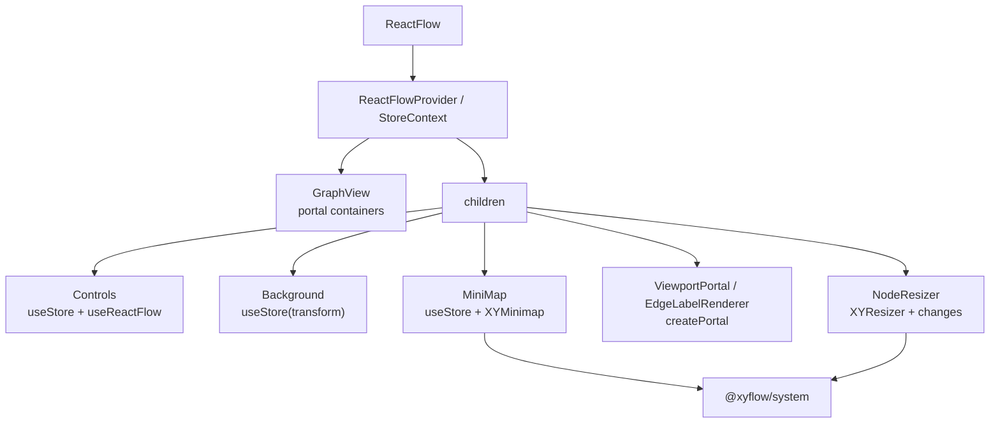

# 第 17 篇：插件组件：Controls、Background、MiniMap、Panel

前面我们读到第 16 篇时，React Flow 的公共 hooks 已经有了清晰分层：

```txt
useStore / useStoreApi
  低层运行时入口

useNodes / useEdges / useViewport / useConnection
  订阅型 hooks

useReactFlow
  命令型运行时门面

useOnSelectionChange / useOnViewportChange
  事件注册型 hooks

useNodesState / useEdgesState
  受控状态辅助
```

这一篇继续往用户可见层走。

因为用户通常不是只写 hooks。

用户还会这样写：

```tsx
<ReactFlow nodes={nodes} edges={edges}>
  <Background />
  <Controls />
  <MiniMap />
  <Panel position="top-right">Saved</Panel>
</ReactFlow>
```

这几个组件看起来像普通 UI 插件。

但如果你把它们当成“几个摆在画布上的小组件”，就会错过 React Flow 很重要的一层设计。

这些插件组件能工作，不是因为 React Flow 有一个特殊的 plugin manager，也不是因为 children 被 React Flow 逐个识别后手动注入 props。

真正的原因更朴素，也更有架构味道：

> React Flow 的插件组件本质上是运行在同一个 Provider 子树里的 React 组件。它们通过 hooks 读取同一个 store，通过命令型 API 操作同一个 panzoom / graph runtime，通过 portal 挂到预留的渲染层。

也就是说：

```txt
ReactFlow
  ↓
Provider / StoreContext
  ↓
GraphView 渲染节点、边、viewport、portal 容器
  ↓
children 插件组件
  ↓
useStore / useReactFlow / createPortal / system interaction
```

这套设计的妙处在于：

- 插件组件不用被核心组件特殊识别。
- 用户自定义插件也可以复用同一套 hooks。
- Controls、MiniMap、Toolbar、Resizer 可以选择不同接入方式。
- React Flow 核心渲染层只需要提供稳定的 store 和少量 portal 容器。
- 更复杂的交互能力仍然可以下沉到 `@xyflow/system`。

先把“插件”这个词限定清楚：React Flow 没有一个中心化 plugin manager，也没有插件注册协议。本文说的插件，是官方 additional components 和用户 children 组件共享同一个 Provider / store / hooks 的组合模式。更准确地说，它是 **children 插件模型**。

几类插件的接入方式可以先压成一张表：

| 插件类型 | 代表 | 接入 runtime 的方式 | mini-flow 验证点 |
| --- | --- | --- | --- |
| 布局型 | `Panel` | 不读 store，只提供定位约定 | 插件浮层布局 |
| 命令型 | `Controls` | `useStore` + `useReactFlow` + `useStoreApi` | 调用 viewport 命令 |
| 视觉型 | `Background` | 订阅 `transform`，渲染 SVG pattern | 背景跟随 viewport |
| 运行时型 | `MiniMap` | store selector + `XYMinimap` + `panZoom` | 二级视图和主画布联动 |
| Portal 型 | `ViewportPortal` / `EdgeLabelRenderer` | query portal target + `createPortal` | 挂到指定坐标层 |
| 交互增强型 | `NodeResizer` | React UI + system controller + changes | 交互结果回流 changes |

关系图大概是这样：



所以这一篇要讲的不是“Controls 有几个按钮”。

而是：

```txt
为什么插件能作为 children 接入？
每类插件到底接的是哪一层运行时？
React Flow 为什么要同时提供 Panel、Portal、Additional Components 和 system 交互能力？
```

---

## 1. 这一篇要解决的问题

先从一个很普通的例子开始：

```tsx
<ReactFlow defaultNodes={nodes} defaultEdges={edges}>
  <Background variant={BackgroundVariant.Dots} />
  <Controls />
  <MiniMap pannable zoomable />
  <Panel position="top-right">
    Editing workflow
  </Panel>
</ReactFlow>
```

这个例子背后有几个问题。

第一，`Controls` 怎么知道当前是不是已经到达 `minZoom` / `maxZoom`？

它没有收到 props。

第二，`Controls` 点击 zoom in 时，为什么能操作画布的 panzoom 实例？

它也没有拿到 `panZoom` 参数。

第三，`Background` 为什么会随着画布 pan / zoom 移动？

它不是节点，也不是边。

第四，`MiniMap` 怎么知道所有节点的位置、当前 viewport、flow 尺寸和 translate extent？

第五，`MiniMap` 里的拖拽和滚轮为什么能反过来驱动主画布？

第六，`EdgeLabelRenderer` / `ViewportPortal` 为什么能把内容挂到特殊层？

第七，`NodeToolbar` 为什么能出现在节点旁边，但又不跟着 zoom 缩放？

第八，`NodeResizer` 为什么能在节点内部渲染几个控制点，却能触发 `NodeChange` 回流？

这些问题的共同答案是：

```txt
插件组件不靠 props drill
插件组件靠 Provider 下的运行时能力
```

把它拆开就是：

```txt
公共导出层
  把 additional-components 作为公共 API 暴露

Provider / StoreContext
  让插件能读写同一个 runtime store

Hooks API
  给插件提供订阅、命令、事件和低层逃逸口

GraphView / ZoomPane / Viewport
  预留 renderer、viewport portal、edge label renderer 等 DOM 容器

Panel
  提供固定位置面板布局

Portal
  把自定义内容挂到正确渲染层

@xyflow/system
  提供 minimap、resizer 等跨框架交互能力
```

这一篇会顺着这些层看源码。

---

## 2. 先看用户 API 或运行效果

从用户角度看，插件组件的体验很自然。

### 2.1 背景和控制器

```tsx
<ReactFlow defaultNodes={nodes} defaultEdges={edges}>
  <Background gap={20} />
  <Controls position="bottom-left" />
</ReactFlow>
```

`Background` 是画布视觉辅助。

`Controls` 是操作画布的控制面板。

它们都作为 children 放进去。

用户不需要写：

```tsx
<ReactFlow
  background
  controls
  controlsPosition="bottom-left"
/>
```

React Flow 选择 children 组合，而不是配置项堆叠。

这意味着用户可以自由插入、排序、组合：

```tsx
<ReactFlow>
  <Background id="small" gap={10} />
  <Background id="large" gap={100} />
  <Controls>
    <ControlButton onClick={save}>Save</ControlButton>
  </Controls>
</ReactFlow>
```

插件成为 React 子树的一部分。

这就是扩展性的第一层。

### 2.2 小地图

```tsx
<ReactFlow nodes={nodes} edges={edges}>
  <MiniMap
    pannable
    zoomable
    nodeStrokeWidth={3}
  />
</ReactFlow>
```

`MiniMap` 不只是一个缩略图。

它要做三件事：

- 渲染所有节点的缩略表示。
- 显示当前 viewport 在整个图中的位置。
- 可选地通过拖拽 / 滚轮反向控制主画布。

所以它需要同时接入：

```txt
nodes / nodeLookup
transform
panZoom instance
flow width / height
translateExtent
```

这已经不是普通 UI 组件了。

它是一个读写运行时的插件。

### 2.3 面板

```tsx
<ReactFlow>
  <Panel position="top-right">
    <button>Publish</button>
  </Panel>
</ReactFlow>
```

`Panel` 是最简单的插件基础设施。

它只做一件事：

```txt
给内容加 react-flow__panel 和位置 class
```

但这个简单组件很关键。

因为 Controls 和 MiniMap 都复用了它。

React Flow 没有为 Controls / MiniMap 分别写一套定位系统，而是把“画布上方固定位置 UI”抽成了一个小的公共组件。

### 2.4 Portal

有些扩展不应该放在固定面板里。

例如：

```tsx
<ViewportPortal>
  <div style={{ position: 'absolute', transform: 'translate(100px, 100px)' }}>
    Annotation
  </div>
</ViewportPortal>
```

这个内容应该进入 viewport 层。

它要跟节点和边一样受到 pan / zoom 影响。

另一个例子是 edge label：

```tsx
<EdgeLabelRenderer>
  <div
    style={{
      position: 'absolute',
      transform: `translate(-50%, -50%) translate(${labelX}px, ${labelY}px)`,
    }}
    className="nodrag nopan"
  >
    Delete
  </div>
</EdgeLabelRenderer>
```

边本身是 SVG path。

但复杂 label 往往要 HTML。

所以 `EdgeLabelRenderer` 把 HTML 内容 portal 到 edge label 层。

这说明 React Flow 的插件不只有一种布局模型。

它至少有三类：

```txt
固定面板
  Panel / Controls / MiniMap

viewport 内容
  ViewportPortal / NodeToolbar

edge label 内容
  EdgeLabelRenderer / EdgeToolbar
```

---

## 3. 核心概念解释

要读懂插件组件，先把“插件”这个词拆掉。

React Flow 里的插件不是一个独立协议。

它更像几种 React 组合方式的合体：

```txt
Provider 子树
  让插件能访问 store

hooks
  让插件能读状态、发命令、注册事件

Panel
  给固定 UI 一个布局约定

Portal
  给特殊渲染层一个挂载入口

system package
  给高级交互提供框架无关实现
```

所以我们可以把插件组件分成几类。

### 3.1 命令型插件：Controls

`Controls` 的核心是：

```txt
读运行时状态
  minZoom / maxZoom / interactive

调用运行时命令
  zoomIn / zoomOut / fitView

直接写运行时配置
  nodesDraggable / nodesConnectable / elementsSelectable
```

它是典型的“控制台”插件。

### 3.2 视觉型插件：Background

`Background` 的核心是：

```txt
订阅 transform
  x / y / zoom

根据 transform 计算 SVG pattern
  pattern x/y
  scaled gap
  scaled size
```

它不修改运行时。

它只跟随 viewport 渲染。

### 3.3 运行时型插件：MiniMap

`MiniMap` 的核心是：

```txt
读取 nodeLookup / transform / width / height
  渲染缩略图和 viewport mask

读取 panZoom
  初始化 XYMinimap

调用 panZoom.setViewportConstrained / scaleTo
  反向控制主画布
```

它既渲染，又交互。

### 3.4 布局型插件：Panel

`Panel` 的核心是：

```txt
position -> className
children -> div
```

它不读 store。

但它定义了 React Flow 浮层 UI 的基本布局约定。

### 3.5 Portal 型插件：ViewportPortal / EdgeLabelRenderer / Toolbar

`ViewportPortal` 读取：

```txt
domNode.querySelector('.react-flow__viewport-portal')
```

然后：

```txt
createPortal(children, viewportPortalDiv)
```

`EdgeLabelRenderer` 读取：

```txt
domNode.querySelector('.react-flow__edgelabel-renderer')
```

然后：

```txt
createPortal(children, edgeLabelRendererDiv)
```

`NodeToolbar` 和 `EdgeToolbar` 则是在 portal 上再加了一层位置计算。

### 3.6 交互增强型插件：NodeResizer

`NodeResizer` 的核心是：

```txt
渲染 resize handles / lines
  ↓
每个控制点创建 XYResizer
  ↓
XYResizer 处理 pointer drag
  ↓
生成 position / dimensions changes
  ↓
triggerNodeChanges
  ↓
controlled / uncontrolled 回流
```

它是“React UI 壳 + system 交互内核”的典型例子。

---

## 4. 源码入口在哪里

这一篇主要读这些文件：

```txt
packages/react/src/index.ts
packages/react/src/additional-components/index.ts
packages/react/src/additional-components/Controls/Controls.tsx
packages/react/src/additional-components/Background/Background.tsx
packages/react/src/additional-components/MiniMap/MiniMap.tsx
packages/react/src/additional-components/MiniMap/MiniMapNodes.tsx
packages/react/src/components/Panel/index.tsx
packages/react/src/components/ViewportPortal/index.tsx
packages/react/src/components/EdgeLabelRenderer/index.tsx
packages/react/src/additional-components/NodeToolbar/NodeToolbar.tsx
packages/react/src/additional-components/EdgeToolbar/EdgeToolbar.tsx
packages/react/src/additional-components/NodeResizer/NodeResizer.tsx
packages/react/src/additional-components/NodeResizer/NodeResizeControl.tsx
packages/system/src/xyminimap/index.ts
packages/system/src/xyresizer/XYResizer.ts
```

公共入口在：

```txt
packages/react/src/index.ts
```

这里除了导出核心组件、hooks、types，还导出了：

```ts
export * from './additional-components';
```

再看：

```txt
packages/react/src/additional-components/index.ts
```

它统一导出：

```ts
export * from './Background';
export * from './Controls';
export * from './MiniMap';
export * from './NodeResizer';
export * from './NodeToolbar';
export * from './EdgeToolbar';
```

这说明：

```txt
Background / Controls / MiniMap / NodeResizer / NodeToolbar / EdgeToolbar
  是 React Flow 公共 API 的一部分
```

它们不是 examples 里的示例组件。

它们是官方扩展层。

---

## 5. 源码调用链

先看插件组件的整体运行图：

```txt
ReactFlow
  ↓
Wrapper / ReactFlowProvider
  ↓
StoreContext.Provider
  ↓
GraphView
  ↓
FlowRenderer
  ↓
ZoomPane
  .react-flow__renderer
  ↓
Viewport
  .react-flow__viewport
  ↓
EdgeRenderer
ConnectionLineWrapper
.react-flow__edgelabel-renderer
NodeRenderer
.react-flow__viewport-portal

children
  ↓
Background / Controls / MiniMap / Panel / Toolbar / Resizer
  ↓
useStore / useStoreApi / useReactFlow / createPortal / XYMinimap / XYResizer
```

第 6 篇讲过 `GraphView` 的渲染分层。

这里要重新强调两个 DOM 容器：

```tsx
<div className="react-flow__edgelabel-renderer" />
...
<div className="react-flow__viewport-portal" />
```

它们在 `Viewport` 里面。

所以进入这些容器的内容会处在画布 transform 影响之下。

再看 `ZoomPane`：

```tsx
<div className="react-flow__renderer" ref={zoomPane} style={containerStyle}>
  {children}
</div>
```

`.react-flow__renderer` 是更外层的 renderer 容器。

`NodeToolbarPortal` 会把 toolbar 挂到这里。

这说明 React Flow 并不是“哪里需要 portal 就临时 query 一个 DOM”。

它在渲染分层时就预留了几个语义明确的容器：

```txt
renderer
  整个 renderer 层

viewport
  受 transform 影响的画布层

edgelabel-renderer
  edge HTML label 层

viewport-portal
  自定义 viewport 内容层
```

插件组件根据自己的语义选择挂载层。

---

## 6. 关键数据结构

### 6.1 PanelPosition

`Panel` 接收：

```ts
position?: PanelPosition;
```

常见值是：

```txt
top-left
top-center
top-right
bottom-left
bottom-center
bottom-right
```

源码里它把 position 拆成 class：

```ts
const positionClasses = `${position}`.split('-');
```

然后渲染：

```tsx
<div className={cc(['react-flow__panel', className, ...positionClasses])}>
  {children}
</div>
```

所以 Panel 是布局协议，不是运行时组件。

### 6.2 transform

`Background`、`MiniMap`、`NodeToolbar`、`EdgeToolbar` 都依赖 transform。

但用法不同：

```txt
Background
  用 transform[0]/[1]/[2] 计算 pattern 偏移和缩放

MiniMap
  用 transform 计算当前视口在 flow 坐标里的 viewBB

NodeToolbar
  用 { x, y, zoom } 计算不随 zoom 缩放的 toolbar transform

EdgeToolbar
  用 zoom 计算 edge toolbar transform
```

这说明同一个 viewport 状态会服务多种插件语义。

### 6.3 nodeLookup

`MiniMap` 和 `NodeToolbar` 都依赖 `nodeLookup`。

但读取粒度不同。

`MiniMap` 需要全图 bounds：

```txt
getInternalNodesBounds(s.nodeLookup)
```

`NodeToolbar` 需要指定 node：

```txt
state.nodeLookup.get(id)
```

`NodeResizer` 需要更多：

```txt
nodeLookup
parentLookup
nodeOrigin
```

这说明内部 lookup map 对插件组件也非常重要。

如果只有 `nodes` 数组，这些插件会频繁扫描数组，或者很难处理 parent node / measured dimensions。

### 6.4 panZoom

`Controls` 通过 `useReactFlow().zoomIn()` 间接使用 panZoom。

`MiniMap` 则直接把 `panZoom` 交给 `XYMinimap`。

```txt
Controls
  React component -> useReactFlow -> viewportHelper -> panZoom

MiniMap
  React component -> XYMinimap -> panZoom
```

这说明不同插件可以选择不同抽象层：

- 简单按钮用高层命令 API。
- 复杂交互用 system 层实例。

### 6.5 portal target

Portal 类组件依赖 store 里的 `domNode`。

例如 `ViewportPortal`：

```txt
state.domNode?.querySelector('.react-flow__viewport-portal')
```

`EdgeLabelRenderer`：

```txt
state.domNode?.querySelector('.react-flow__edgelabel-renderer')
```

`NodeToolbarPortal`：

```txt
state.domNode?.querySelector('.react-flow__renderer')
```

这些 selector 说明 portal 不是随便插到 body。

它们要插进 React Flow 自己的 DOM 层级。

这样才能获得正确的：

- z-index。
- pointer-events。
- transform。
- className 规则。
- pan / drag 过滤。

---

## 7. 关键实现思路

### 7.1 公共导出：插件是一等 API

React 包入口有两层导出。

第一层是直接导出：

```ts
export { Panel } from './components/Panel';
export { EdgeLabelRenderer } from './components/EdgeLabelRenderer';
export { ViewportPortal } from './components/ViewportPortal';
```

第二层是：

```ts
export * from './additional-components';
```

这说明 React Flow 把扩展层分成两类：

```txt
基础容器
  Panel
  EdgeLabelRenderer
  ViewportPortal

成品插件
  Background
  Controls
  MiniMap
  NodeResizer
  NodeToolbar
  EdgeToolbar
```

基础容器给用户做自定义扩展。

成品插件覆盖最常见的图编辑器 UI。

### 7.2 Panel：最小但关键的布局抽象

`Panel` 的源码几乎没有运行时逻辑：

```tsx
export const Panel = forwardRef(({ position = 'top-left', children, className, style, ...rest }, ref) => {
  const positionClasses = `${position}`.split('-');

  return (
    <div className={cc(['react-flow__panel', className, ...positionClasses])} style={style} ref={ref} {...rest}>
      {children}
    </div>
  );
});
```

它的价值在于约定。

`Controls` 和 `MiniMap` 都不用关心定位 class 怎么写。

用户自定义面板也可以和官方组件使用同一套定位规则。

所以 Panel 是一个很好的小抽象：

```txt
简单
  只有 position -> className

稳定
  可以被官方组件和用户组件复用

不侵入
  不读 store，不发命令，不影响 graph runtime
```

这类抽象在复杂库里很容易被忽视。

但它能显著降低公共 API 的概念数量。

### 7.3 Controls：高层命令型插件

`Controls` 读三类东西：

```ts
const store = useStoreApi();
const { isInteractive, minZoomReached, maxZoomReached, ariaLabelConfig } = useStore(selector, shallow);
const { zoomIn, zoomOut, fitView } = useReactFlow();
```

这里正好用了第 16 篇讲过的三种 API：

```txt
useStore
  订阅按钮状态

useReactFlow
  调用 viewport 命令

useStoreApi
  命令式写 interactive 配置
```

selector 里读取：

```ts
isInteractive: s.nodesDraggable || s.nodesConnectable || s.elementsSelectable
minZoomReached: s.transform[2] <= s.minZoom
maxZoomReached: s.transform[2] >= s.maxZoom
ariaLabelConfig: s.ariaLabelConfig
```

所以按钮 disabled 状态不是由用户传入。

它来自运行时。

点击 zoom in：

```txt
ControlButton
  ↓
onZoomInHandler
  ↓
zoomIn()
  ↓
useReactFlow
  ↓
useViewportHelper
  ↓
panZoom.scaleBy(1.2)
```

点击 fit view：

```txt
ControlButton
  ↓
fitView(fitViewOptions)
  ↓
useReactFlow.fitView
  ↓
fitViewQueued / nodeQueue / measurement flow
```

点击 lock / unlock：

```ts
store.setState({
  nodesDraggable: !isInteractive,
  nodesConnectable: !isInteractive,
  elementsSelectable: !isInteractive,
});
```

这个按钮不是 viewport 命令。

它直接写交互配置。

所以 `Controls` 是插件组件里最好的“hooks 分层示例”：

```txt
读状态
  useStore

发命令
  useReactFlow

写内部配置
  useStoreApi

布局
  Panel
```

### 7.4 Background：订阅 transform 的视觉插件

`Background` 的 selector 很小：

```ts
const selector = (s) => ({
  transform: s.transform,
  patternId: `pattern-${s.rfId}`,
});
```

它只关心：

- 当前 transform。
- 当前 React Flow 实例 id。

为什么要 `rfId`？

因为页面上可能有多个 React Flow 实例。

SVG pattern id 如果重复，会冲突。

所以 `Background` 用：

```ts
const _patternId = `${patternId}${id ? id : ''}`;
```

来生成唯一 pattern id。

这也是插件组件必须在 runtime 里读取实例信息的例子。

背景随 pan / zoom 对齐的核心是：

```ts
x={transform[0] % scaledGap[0]}
y={transform[1] % scaledGap[1]}
width={scaledGap[0]}
height={scaledGap[1]}
patternTransform={`translate(-${scaledOffset[0]},-${scaledOffset[1]})`}
```

其中：

```txt
scaledGap = gap * zoom
scaledSize = size * zoom
```

也就是说：

```txt
画布 pan
  改 pattern x / y

画布 zoom
  改 pattern gap / size
```

`Background` 没有参与节点和边的渲染。

但它必须理解 viewport transform。

它是典型的视觉型插件。

### 7.5 MiniMap：最像“运行时插件”的组件

`MiniMap` 比 `Controls` 和 `Background` 都复杂。

它的 selector 先计算当前 viewport 在 flow 坐标里的矩形：

```ts
const viewBB = {
  x: -s.transform[0] / s.transform[2],
  y: -s.transform[1] / s.transform[2],
  width: s.width / s.transform[2],
  height: s.height / s.transform[2],
};
```

这就是第 9 篇坐标系统的应用：

```txt
screen viewport
  ↓ transform 反算
flow viewport bounding box
```

然后它计算全图 bounds：

```txt
nodeLookup.size > 0
  getBoundsOfRects(getInternalNodesBounds(nodeLookup), viewBB)
  否则 viewBB
```

为什么要把 `viewBB` 和节点 bounds 合起来？

因为即使图里没有节点，或者 viewport 远离节点，MiniMap 也要能显示当前视口。

接着 MiniMap 读取：

```txt
rfId
panZoom
translateExtent
flowWidth
flowHeight
ariaLabelConfig
```

然后计算自己的 SVG viewBox：

```txt
boundingRect
  ↓
scaledWidth / scaledHeight
  ↓
viewScale
  ↓
x / y / width / height
```

这让 MiniMap 能把不同大小的图缩放到固定的 `200 x 150` 默认视图里。

### 7.6 MiniMap 如何反向控制主画布

MiniMap 初始化 system 层的 `XYMinimap`：

```ts
minimapInstance.current = XYMinimap({
  domNode: svg.current,
  panZoom,
  getTransform: () => store.getState().transform,
  getViewScale: () => viewScaleRef.current,
});
```

这段很关键。

React 组件只负责：

- 拿到 SVG DOM。
- 拿到 panZoom。
- 提供当前 transform getter。
- 提供当前 viewScale getter。

真正的 minimap pan / zoom 交互在 `@xyflow/system`。

`XYMinimap` 内部使用 d3-zoom：

```txt
wheel
  ↓
计算 nextZoom
  ↓
panZoom.scaleTo(nextZoom)

drag / touch move
  ↓
计算 panDelta
  ↓
panZoom.setViewportConstrained(...)
```

所以 MiniMap 是一种很典型的分层：

```txt
React component
  负责渲染和 store 接入

@xyflow/system XYMinimap
  负责 DOM 交互和 panZoom 协调

panZoom
  真正改变主 viewport
```

这也解释了为什么 `@xyflow/system` 里会有 `xyminimap`。

MiniMap 不是纯 React 组件。

它有跨框架的交互逻辑。

### 7.7 MiniMapNodes：插件内部也在做性能分层

`MiniMapNodes` 先订阅 node ids：

```ts
const selectorNodeIds = (s) => s.nodes.map((node) => node.id);
```

然后对每个 id 渲染 `NodeComponentWrapper`。

源码注释直接说：

```txt
拆分 MiniMapNodes 和 NodeComponentWrapper 是为了减少单个节点变化时的更新成本
```

`NodeComponentWrapper` 再按 id 订阅自己的节点：

```ts
const node = s.nodeLookup.get(id);
```

这和 `NodeRenderer` 的性能策略类似：

```txt
父组件订阅 ids
子组件订阅单个节点数据
```

这说明插件组件也遵守 React Flow 的性能哲学。

它不是“插件就可以随便扫全量 nodes”。

MiniMap 作为常驻组件，也要控制更新范围。

### 7.8 ViewportPortal：把内容放进 viewport 坐标系

`ViewportPortal` 的源码很短：

```ts
const selector = (s) =>
  s.domNode?.querySelector('.react-flow__viewport-portal');

export function ViewportPortal({ children }) {
  const viewPortalDiv = useStore(selector);

  if (!viewPortalDiv) {
    return null;
  }

  return createPortal(children, viewPortalDiv);
}
```

为什么要放到 `.react-flow__viewport-portal`？

因为这个 div 在 `Viewport` 里。

`Viewport` 的 transform 是：

```tsx
<div
  className="react-flow__viewport ..."
  style={{ transform: `translate(${x}px, ${y}px) scale(${zoom})` }}
>
```

所以 portal 进去的内容会和节点、边共享 viewport 坐标系。

这适合：

- 自定义 annotation。
- 自定义 ruler。
- 自定义 selection decoration。
- 需要跟着 pan / zoom 的 HTML overlay。

### 7.9 EdgeLabelRenderer：SVG edge 和 HTML label 的桥

边是 SVG path。

但很多 edge label 是 HTML：

- 按钮。
- 输入框。
- 菜单。
- 状态 badge。

`EdgeLabelRenderer` 的做法是：

```txt
从 store.domNode 找 .react-flow__edgelabel-renderer
  ↓
createPortal(children, edgeLabelRenderer)
```

这个容器同样在 `Viewport` 里。

所以 label 会跟着 viewport 变换。

但因为它是 HTML 层，用户要自己写：

```tsx
style={{
  position: 'absolute',
  transform: `translate(-50%, -50%) translate(${labelX}px, ${labelY}px)`,
}}
```

并且如果 label 要响应鼠标事件，需要：

```txt
pointerEvents: all
className: nodrag nopan
```

这反映了一个设计边界：

```txt
React Flow 提供正确的挂载层
用户负责自己的 label 定位和交互过滤
```

### 7.10 NodeToolbar：挂在 renderer 层，但按节点位置计算

`NodeToolbar` 不是简单地渲染在节点内部。

它做了几步：

第一，从 `useNodeId` 拿当前 node context：

```ts
const contextNodeId = useNodeId();
```

如果用户没有传 `nodeId`，它可以自动使用当前自定义节点的 id。

第二，从 `nodeLookup` 拿目标节点：

```ts
state.nodeLookup.get(id)
```

第三，订阅 transform 和 selected count：

```ts
{
  x: state.transform[0],
  y: state.transform[1],
  zoom: state.transform[2],
  selectedNodesCount: state.nodes.filter((node) => node.selected).length,
}
```

第四，默认只在“单个节点被选中”时显示：

```txt
nodes.size === 1
node.selected
selectedNodesCount === 1
```

第五，用 `getInternalNodesBounds` 计算节点矩形，用 `getNodeToolbarTransform` 算 toolbar 位置。

第六，通过 `NodeToolbarPortal` 挂到：

```txt
.react-flow__renderer
```

为什么不是挂进 viewport portal？

因为 NodeToolbar 的目标是：

```txt
位置跟随节点
但内容不随 zoom 缩放
```

所以它不能简单地作为节点子元素跟着 viewport scale。

它要在 renderer 层绝对定位，并用 transform 计算抵消 zoom 的效果。

这就是 Toolbar 类组件的关键：

```txt
读节点位置和 viewport
  计算屏幕上的 toolbar transform
  放到合适 DOM 层
```

### 7.11 EdgeToolbar：EdgeLabelRenderer 上的更高层封装

`EdgeToolbar` 类似，但它服务 edge。

它读取：

```ts
state.edgeLookup.get(edgeId)
state.transform[2]
```

默认显示条件是：

```txt
isVisible 是 boolean
  用 isVisible
否则
  edge.selected
```

然后计算：

```ts
const transform = getEdgeToolbarTransform(x, y, zoom, alignX, alignY);
```

最后渲染到：

```tsx
<EdgeLabelRenderer>
  <div style={{ pointerEvents: 'all', transform }} />
</EdgeLabelRenderer>
```

所以 `EdgeToolbar` 是：

```txt
EdgeLabelRenderer
  +
edge selected 状态
  +
toolbar transform
  +
pointerEvents: all
```

它把常见 edge HTML 操作面板封装成一个公共组件。

### 7.12 NodeResizer：React 壳 + XYResizer 内核

`NodeResizer` 先渲染多个 `NodeResizeControl`：

```txt
XY_RESIZER_LINE_POSITIONS
XY_RESIZER_HANDLE_POSITIONS
```

也就是：

```txt
边线控制点
角落/边缘 handle 控制点
```

真正的逻辑在 `NodeResizeControl`。

它会：

```ts
const contextNodeId = useNodeId();
const id = typeof nodeId === 'string' ? nodeId : contextNodeId;
const store = useStoreApi();
const resizeControlRef = useRef<HTMLDivElement>(null);
```

然后在 effect 里创建 `XYResizer`：

```ts
XYResizer({
  domNode: resizeControlRef.current,
  nodeId: id,
  getStoreItems: () => ({
    nodeLookup,
    transform,
    snapGrid,
    snapToGrid,
    nodeOrigin,
    paneDomNode,
  }),
  onChange,
  onEnd,
});
```

`XYResizer` 本身在 `@xyflow/system`。

它用 d3-drag 处理 pointer：

```txt
start
  读取 node、transform、snapGrid、container bounds
  记录起始 width / height / x / y

drag
  getPointerPosition
  getDimensionsAfterResize
  处理 keepAspectRatio / min / max / extent / child nodes
  onResize
  onChange(change, childChanges)

end
  onResizeEnd
  onEnd
```

React 层的 `onChange` 把 system 的 resize result 转成 React Flow changes：

```txt
change.x / change.y
  -> NodePositionChange

change.width / change.height
  -> NodeDimensionChange

childChanges
  -> child NodePositionChange

triggerNodeChanges(changes)
```

所以 `NodeResizer` 不是直接 mutate node。

它仍然遵守 change 回流协议。

这和第 14 篇、第 15 篇是同一条主线：

> 用户交互最终产生 changes，由 controlled / uncontrolled 模式决定谁应用变化。

---

## 8. 这部分源码的设计取舍

### 8.1 为什么插件是 children，而不是 ReactFlow props？

如果 React Flow 把所有插件都做成 props：

```tsx
<ReactFlow
  showBackground
  showControls
  showMiniMap
  controlsPosition="bottom-left"
  minimapPannable
/>
```

短期看很方便。

但长期会有几个问题：

- props 会膨胀。
- 插件排序和组合不灵活。
- 用户很难插入自定义 UI。
- 官方插件和用户插件会有两套模型。
- React Flow 主组件会越来越像配置面板。

children 模型更符合 React：

```tsx
<ReactFlow>
  <Background />
  <Controls />
  <MyInspector />
  <MiniMap />
</ReactFlow>
```

用户插件和官方插件使用同一个运行时入口。

### 8.2 为什么没有 plugin manager？

React Flow 不需要一个中心化 plugin registry。

因为 React 本身已经提供了组合模型：

```txt
children
Context
hooks
portal
```

如果插件只是 React 组件，那用户可以：

- 条件渲染。
- 传 props。
- 组合 children。
- 包一层自己的组件。
- 用 hooks 读取 runtime。

这比专门设计 plugin protocol 更轻。

当然，代价是：

```txt
插件之间没有官方生命周期协议
插件的约束更多依赖 hooks 和 DOM 层约定
高级插件需要理解内部 store 或 portal 层
```

React Flow 的选择是：

```txt
保持核心轻量
用 React 原生机制表达 children 插件模型
```

### 8.3 为什么 Panel 不读 store？

Panel 如果读 store，可以做很多事：

- 自动处理缩放。
- 自动处理 safe area。
- 自动处理隐藏状态。

但它没有。

它只做定位 class。

这是克制的设计。

因为 Panel 的价值是稳定基础设施。

越简单，越容易作为公共构件被复用。

### 8.4 为什么 MiniMap 要下沉到 system？

MiniMap 的渲染在 React。

但它的 pan / zoom 交互不是 React 专属。

Svelte Flow 也需要同样能力。

所以：

```txt
React MiniMap
  负责读取 React store、渲染 SVG、管理 effect

system XYMinimap
  负责 d3-zoom 交互、pointer、panZoom 协调
```

这和前面的 `XYPanZoom`、`XYDrag`、`XYHandle` 是同一个设计策略：

```txt
框架无关交互能力下沉到 @xyflow/system
框架绑定层负责组件和状态接入
```

### 8.5 为什么 Toolbar 要用 portal？

如果 `NodeToolbar` 直接渲染在节点内部，它会受到节点所在 viewport 的 scale 影响。

当 zoom 很小时，toolbar 也会变小。

这不符合工具栏的预期。

工具栏应该：

```txt
跟随节点位置
保持屏幕尺寸
```

所以它需要：

```txt
读取 node position + viewport transform
  ↓
计算屏幕 transform
  ↓
portal 到 renderer 层
```

这就是为什么 portal 不是装饰技巧，而是渲染模型的一部分。

### 8.6 为什么 NodeResizer 仍然走 triggerNodeChanges？

resize 看起来可以直接：

```txt
node.width = nextWidth
node.height = nextHeight
```

但 React Flow 没这么做。

它生成：

```txt
NodeDimensionChange
NodePositionChange
```

然后：

```txt
triggerNodeChanges
```

这样有几个好处：

- 受控模式可以接收到 changes。
- 非受控模式可以内部 apply changes。
- onNodesChange 能感知 resizing。
- parent expand / child position 修正可以进入统一回流。
- 数据变更路径和 drag / selection / delete 保持一致。

这再次说明插件组件不是绕过运行时的外挂。

它们仍然要尊重核心协议。

---

## 9. 如果我们自己实现，最小版本应该怎么写

现在用 mini-flow 复刻 children 插件模型的核心。

目标不是实现完整 Controls / MiniMap。

目标是验证这个分层：

```txt
Provider 提供 store
GraphView 预留 portal 容器
Panel 提供固定布局
Controls 使用命令型 hook
Background 订阅 viewport
ViewportPortal 挂到 viewport 层
MiniMap 读取 nodes + viewport
```

### 9.1 GraphView 预留容器

```tsx
function MiniGraphView({ children }: { children: React.ReactNode }) {
  const viewport = useMiniViewport();

  return (
    <div className="mini-flow__renderer">
      <div
        className="mini-flow__viewport"
        style={{
          transform: `translate(${viewport.x}px, ${viewport.y}px) scale(${viewport.zoom})`,
        }}
      >
        <MiniEdgeRenderer />
        <div className="mini-flow__edge-label-layer" />
        <MiniNodeRenderer />
        <div className="mini-flow__viewport-portal" />
      </div>

      {children}
    </div>
  );
}
```

这里最重要的是两个 div：

```txt
mini-flow__edge-label-layer
mini-flow__viewport-portal
```

它们是 portal 插件的挂载点。

### 9.2 Panel

```tsx
type PanelPosition =
  | 'top-left'
  | 'top-right'
  | 'bottom-left'
  | 'bottom-right';

function MiniPanel({
  position = 'top-left',
  children,
}: {
  position?: PanelPosition;
  children: React.ReactNode;
}) {
  return (
    <div className={`mini-flow__panel ${position}`}>
      {children}
    </div>
  );
}
```

这个组件不读 store。

它只是布局基础设施。

### 9.3 Controls

```tsx
function MiniControls() {
  const flow = useMiniFlow();
  const viewport = useMiniViewport();

  return (
    <MiniPanel position="bottom-left">
      <button onClick={() => flow.setViewport({ zoom: viewport.zoom * 1.2 })}>
        +
      </button>
      <button onClick={() => flow.setViewport({ zoom: viewport.zoom / 1.2 })}>
        -
      </button>
      <button onClick={() => flow.fitView()}>
        fit
      </button>
    </MiniPanel>
  );
}
```

它复刻的是 `Controls` 的基本模式：

```txt
Panel
  +
viewport state
  +
command hook
```

### 9.4 Background

```tsx
function MiniBackground({ gap = 20 }: { gap?: number }) {
  const viewport = useMiniViewport();
  const scaledGap = gap * viewport.zoom;

  return (
    <svg className="mini-flow__background">
      <pattern
        id="mini-grid"
        x={viewport.x % scaledGap}
        y={viewport.y % scaledGap}
        width={scaledGap}
        height={scaledGap}
        patternUnits="userSpaceOnUse"
      >
        <circle cx="1" cy="1" r="1" />
      </pattern>
      <rect width="100%" height="100%" fill="url(#mini-grid)" />
    </svg>
  );
}
```

这个版本已经说明：

```txt
Background 是 transform 的视觉函数
```

### 9.5 ViewportPortal

```tsx
function MiniViewportPortal({ children }: { children: React.ReactNode }) {
  const domNode = useMiniStore((state) => state.domNode);
  const target = domNode?.querySelector('.mini-flow__viewport-portal');

  if (!target) {
    return null;
  }

  return createPortal(children, target);
}
```

使用方式：

```tsx
<MiniViewportPortal>
  <div
    style={{
      position: 'absolute',
      transform: 'translate(100px, 100px)',
    }}
  >
    Annotation
  </div>
</MiniViewportPortal>
```

这就是 portal 型插件。

### 9.6 MiniMap

```tsx
function MiniMap() {
  const nodes = useMiniNodes();
  const viewport = useMiniViewport();
  const flow = useMiniFlow();

  const bounds = getMiniNodesBounds(nodes);
  const scale = Math.max(bounds.width / 200, bounds.height / 150, 1);

  return (
    <MiniPanel position="bottom-right">
      <svg width={200} height={150} viewBox={`${bounds.x} ${bounds.y} ${bounds.width} ${bounds.height}`}>
        {nodes.map((node) => (
          <rect
            key={node.id}
            x={node.position.x}
            y={node.position.y}
            width={node.width ?? 120}
            height={node.height ?? 40}
          />
        ))}
        <rect
          x={-viewport.x / viewport.zoom}
          y={-viewport.y / viewport.zoom}
          width={800 / viewport.zoom}
          height={600 / viewport.zoom}
          fill="transparent"
          stroke="black"
        />
      </svg>
    </MiniPanel>
  );
}
```

这个 mini 版只渲染，不实现 pannable / zoomable。

如果要继续复刻，就要引入：

```txt
pointer drag
  ↓
根据 minimap scale 反算主 viewport
  ↓
flow.setViewport(...)
```

这正是 React Flow 把 `XYMinimap` 下沉到 system 的原因。

### 9.7 NodeResizer 的最小协议

```tsx
function MiniNodeResizer({ nodeId }: { nodeId: string }) {
  const flow = useMiniFlow();

  function resize(delta: { width: number; height: number }) {
    flow.setNodes((nodes) =>
      nodes.map((node) =>
        node.id === nodeId
          ? {
              ...node,
              width: Math.max(10, (node.width ?? 100) + delta.width),
              height: Math.max(10, (node.height ?? 40) + delta.height),
            }
          : node
      )
    );
  }

  return (
    <div className="mini-flow__resize-handles">
      <button onPointerDown={() => resize({ width: 20, height: 10 })} />
    </div>
  );
}
```

这个版本还很粗糙。

真正应该走的是：

```txt
pointer drag
  ↓
calculate dimensions
  ↓
generate NodeDimensionChange
  ↓
onNodesChange
```

也就是 React Flow 的 `NodeResizer` 设计。

---

## 10. 本篇总结

这一篇我们把 React Flow 的插件组件系统串起来了。

核心结论是：

> 插件组件不是魔法，也不是 ReactFlow 主组件特殊识别 children 后注入能力。它们本质上是运行在同一个 Provider 子树里的 React 组件，通过 hooks、store、portal 容器和 system 层交互实例接入同一套 graph runtime。

可以按类型记：

```txt
布局型
  Panel

命令型
  Controls

视觉型
  Background

运行时型
  MiniMap

Portal 型
  ViewportPortal
  EdgeLabelRenderer
  NodeToolbar
  EdgeToolbar

交互增强型
  NodeResizer
```

关键源码链路是：

```txt
packages/react/src/index.ts
  export * from './additional-components'

additional-components/index.ts
  Background / Controls / MiniMap / NodeResizer / NodeToolbar / EdgeToolbar

GraphView
  .react-flow__edgelabel-renderer
  .react-flow__viewport-portal

ZoomPane
  .react-flow__renderer

Panel
  position -> className

Controls
  useStore + useReactFlow + useStoreApi + Panel

Background
  useStore(transform) -> SVG pattern

MiniMap
  useStore(selector) + useStoreApi + XYMinimap + Panel

ViewportPortal / EdgeLabelRenderer
  useStore(domNode query) + createPortal

NodeToolbar / EdgeToolbar
  lookup + transform + portal + toolbar transform

NodeResizer
  React controls + XYResizer + triggerNodeChanges
```

几个设计取舍也很重要：

- 用 children 而不是大量 ReactFlow props，避免主组件膨胀。
- 用 React Context + hooks 代替专门 plugin manager，保持扩展模型自然。
- 用 Panel 抽出固定浮层定位，而不是每个插件重复实现。
- 用 portal 容器表达不同渲染层，而不是把所有 HTML 都塞到同一个地方。
- 用 `@xyflow/system` 承担 MiniMap / Resizer 这类跨框架交互逻辑。
- 插件组件即使很强，也仍然遵守 change 回流协议。

到这里，React Flow 的“外部扩展层”已经基本清楚了。

它不是在核心之外另起炉灶。

它是在同一个运行时上叠加：

```txt
可读状态
可发命令
可挂载 UI
可接入交互
可复用 system 能力
```

这也是 React Flow 能同时保持核心组件简洁、公共 API 丰富、用户扩展自由的关键。

---

## 11. 下一篇读什么

下一篇进入：

```txt
第 18 篇：性能设计：lookup map、selector、memo、visible elements
```

前面我们已经多次碰到性能线索：

- store 里维护 `nodeLookup` / `edgeLookup` / `connectionLookup`。
- `useStore(selector, equalityFn)` 控制订阅范围。
- `NodeRenderer` 和 `MiniMapNodes` 都采用“父组件订阅 ids，子组件订阅单项数据”的拆分。
- `EdgeRenderer` / `NodeRenderer` 支持只渲染可见元素。
- `memo` 大量用于 renderer、plugin、wrapper 组件。

下一篇会把这些线索集中起来，回答一个问题：

> React Flow 为什么能在节点和边很多时仍然保持可交互？
