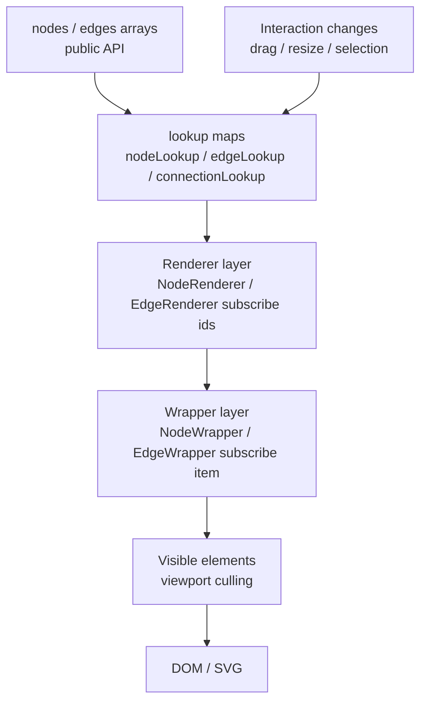

# 第 18 篇：性能设计：lookup map、selector、memo、visible elements

读 React Flow 源码时，性能设计不是一个单独藏在某个 `performance.ts` 里的模块。

它散在很多地方：

- store 里维护 `nodeLookup`、`edgeLookup`、`connectionLookup`。
- `NodeRenderer` 只订阅 node ids。
- `NodeWrapper` 按 node id 订阅单个节点。
- `EdgeRenderer` 只渲染 edge ids。
- `EdgeWrapper` 自己计算 source / target geometry。
- `useVisibleNodeIds` / `useVisibleEdgeIds` 支持只渲染可见元素。
- `useStore(selector, shallow)` 控制订阅范围。
- `memo` 包住 renderer、wrapper、plugin components。
- `ResizeObserver` 由 renderer 创建一次，再分发给每个 node。
- 拖拽、选择、resize 最终都生成 changes，而不是让上层组件反复全量计算。

如果把这些点拆开看，它们都很普通。

但放在图编辑器里，它们会组成一条很明确的主线：

> React Flow 的性能核心不是“少写 React”，而是把高频变化限制在最小订阅范围里。

换句话说，性能不是靠一个技巧解决的，而是靠一组边界：

```txt
数据结构边界
  array 对外，lookup map 对内

订阅边界
  父 renderer 订阅 ids，wrapper 订阅单项数据

渲染边界
  onlyRenderVisibleElements 裁掉视口外元素

计算边界
  共享计算放父层，单项计算放 wrapper

交互边界
  drag / resize / selection 产生 changes，不绕过回流协议
```

画成一张图：



这套设计也有维护成本：React Flow 必须同时维护对外数组和内部 lookup，`setNodes` / `setEdges` / `adoptUserNodes` / `updateConnectionLookup` 这些路径就不能随便绕过。性能边界成立的前提，是 array、lookup、measured、handleBounds、selection 这些派生状态始终保持一致。

这一篇先给自己一个性能审稿表：

| 检查项 | 为什么重要 |
| --- | --- |
| 是否同时保留 public array 和 internal lookup | API 友好与内部高频查询兼得 |
| renderer 是否只订阅 ids | 避免单项变化让父 renderer 全量重跑 |
| wrapper 是否按 id 订阅单项 | 把节点/边的高频变化限制在单个 wrapper |
| visible elements 是否有正确性例外 | 未测量节点必须渲染，否则无法得到 handleBounds |
| 插件是否复用 selector / lookup | MiniMap / Toolbar 不能把全图变化扩散到所有组件 |

这篇就是 Part 2 源码导读的收束篇。

前面我们已经读懂了：

- GraphView 如何分层渲染。
- Store 如何保存运行时状态。
- InternalNode 为什么存在。
- 坐标系统如何转化。
- PanZoom / Drag / Handle / Selection 如何协作。
- Hooks API 如何把运行时暴露给用户。
- 插件组件如何接入 runtime。

现在要回答最后一个问题：

```txt
当节点和边很多时，
React Flow 为什么还能保持可交互？
```

---

## 1. 这一篇要解决的问题

先想一个最坏但很常见的场景。

画布里有：

```txt
1000 个 nodes
1500 条 edges
一个 MiniMap
一个 Controls
若干 NodeToolbar / EdgeToolbar
用户正在拖拽其中一个 node
```

拖拽时，节点位置会高频变化。

如果实现得很粗糙，可能会变成：

```txt
一个 node position 改变
  ↓
nodes array 改变
  ↓
ReactFlow 整体重新渲染
  ↓
NodeRenderer 重新 map 1000 个 nodes
  ↓
每个 NodeWrapper 都重新计算
  ↓
每条 EdgeWrapper 都重新计算
  ↓
MiniMap 全量重新渲染
  ↓
Toolbar / Panel / Background 也跟着抖
```

这就是图编辑器最怕的事情：

```txt
一个局部高频变化
扩散成全图重算
```

React Flow 的源码里，很多设计都在阻止这件事。

它真正关心的问题不是：

```txt
怎么让 React 快一点？
```

而是：

```txt
怎么让一次变化只影响该影响的组件？
```

这一篇重点拆这些问题：

- 为什么 store 里有 lookup maps？
- 为什么对外仍然保留 nodes / edges arrays？
- 为什么 `NodeRenderer` 不直接订阅 `nodes`？
- 为什么 `NodeWrapper` 自己从 `nodeLookup` 读 node？
- 为什么 `EdgeWrapper` 要自己从 `nodeLookup` 读 source / target？
- `onlyRenderVisibleElements` 到底裁掉了什么？
- visible node / edge 的判断为什么依赖 transform？
- `memo` 和 `shallow` 分别解决什么问题？
- 拖拽时为什么仍然走 changes？
- React Flow 的性能边界对我们写 mini-flow 有什么启发？

---

## 2. 先看用户 API 或运行效果

用户能直接感知的性能开关，主要是：

```tsx
<ReactFlow
  nodes={nodes}
  edges={edges}
  onlyRenderVisibleElements
/>
```

这个 prop 的意思不是：

```txt
只显示可见区域里的 nodes / edges 数据
```

而是：

```txt
只渲染当前 viewport 能看到的 node / edge DOM
```

数据还在 store 里。

只是 renderer 不把视口外的元素挂到 DOM。

这对于大图很重要。

比如：

```txt
总 nodes: 5000
当前 viewport 内 nodes: 80
```

如果只渲染 80 个节点，浏览器 DOM、事件绑定、React 组件树都会轻很多。

但这只是一个显式开关。

React Flow 还有很多用户看不到的默认性能边界。

比如用户拖动一个节点时：

```txt
NodeRenderer 不应该因为这个节点的位置变化而重新 map 所有 nodes
```

源码注释里甚至直接解释了这个选择：

```txt
NodeRenderer 只订阅 node ids。
单个 node 高频更新时，不要让 NodeRenderer 每次都重新执行 nodes.map。
```

这不是微优化。

这是图编辑器的主性能路径。

再比如，用户写一个自定义节点：

```tsx
function TaskNode({ data, selected, dragging }) {
  return (
    <div>
      {data.label}
      {selected && <button>Edit</button>}
      {dragging && <span>Moving</span>}
    </div>
  );
}
```

这个组件只应该因为自己的 node 状态变化而更新。

不应该因为别的节点移动就更新。

React Flow 的 renderer 分层就是为了这个目标。

---

## 3. 核心概念解释

这篇的概念可以压缩成一张图：

```txt
User API
  nodes: Node[]
  edges: Edge[]
        ↓
Store
  nodes array
  edges array
  nodeLookup: Map<id, InternalNode>
  edgeLookup: Map<id, Edge>
  connectionLookup: Map<node/handle key, Connection>
        ↓
Renderer
  NodeRenderer subscribes node ids
    ↓
  NodeWrapper subscribes one InternalNode

  EdgeRenderer subscribes edge ids
    ↓
  EdgeWrapper subscribes one Edge + source/target geometry
        ↓
Viewport Culling
  useVisibleNodeIds
  useVisibleEdgeIds
        ↓
DOM
  only visible wrappers
```

这里最关键的是两组区别。

### 3.1 array 和 lookup 的区别

`nodes` array 适合：

- 对外 API。
- React props。
- 用户保存。
- 用户排序。
- `onNodesChange` 回流。

`nodeLookup` 适合：

- 按 id 快速查节点。
- 拖拽时拿当前 InternalNode。
- edge 计算 source / target position。
- selection 批量变更。
- parent / child 关系处理。
- MiniMap bounds 计算。
- visible nodes 计算。

所以 React Flow 不是用 map 替代 array。

它是同时维护两种结构：

```txt
array
  面向用户和声明式数据流

lookup map
  面向内部高频查询和运行时协作
```

### 3.2 renderer 和 wrapper 的区别

`NodeRenderer` 不是“节点渲染的全部逻辑”。

它更像列表层：

```txt
决定渲染哪些 node ids
创建共享资源
把稳定配置传给每个 NodeWrapper
```

`NodeWrapper` 才是单个节点的运行时壳：

```txt
按 id 读取 InternalNode
决定 node type
绑定 drag
绑定 selection
处理 keyboard
处理 ResizeObserver
计算 style transform
渲染用户 NodeComponent
```

这两个组件的边界决定了拖拽性能。

如果 `NodeRenderer` 订阅整个 nodes array，一个 node 动一下，整个列表层都会重新跑。

如果 `NodeRenderer` 只订阅 ids，拖拽时通常只会影响那个 `NodeWrapper`。

### 3.3 selector 和 equalityFn 的区别

`useStore(selector, equalityFn)` 解决的是：

```txt
组件到底订阅 store 的哪一小块？
```

`shallow` 解决的是：

```txt
selector 返回对象或数组时，
怎么判断这次结果是否真的变了？
```

例如：

```ts
const selector = (s) => ({
  nodesDraggable: s.nodesDraggable,
  nodesConnectable: s.nodesConnectable,
  nodesFocusable: s.nodesFocusable,
  elementsSelectable: s.elementsSelectable,
  onError: s.onError,
});
```

如果不用 `shallow`，每次 selector 返回一个新对象，都可能被认为变化。

所以 React Flow 大量使用：

```ts
useStore(selector, shallow)
```

它不是装饰。

它是订阅边界的一部分。

### 3.4 visible elements 的区别

`onlyRenderVisibleElements` 不是简单判断：

```txt
node.x 在屏幕范围内
```

它必须考虑：

- viewport transform。
- zoom。
- node measured width / height。
- hidden。
- handleBounds 是否已测量。
- dragging 中的节点。
- edge 的 source / target bounds。

所以 visible elements 是坐标系统、内部节点结构和渲染策略共同作用的结果。

---

## 4. 源码入口在哪里

这一篇主要读这些文件：

```txt
packages/react/src/container/NodeRenderer/index.tsx
packages/react/src/components/NodeWrapper/index.tsx
packages/react/src/hooks/useVisibleNodeIds.ts
packages/react/src/container/EdgeRenderer/index.tsx
packages/react/src/components/EdgeWrapper/index.tsx
packages/react/src/hooks/useVisibleEdgeIds.ts
packages/react/src/store/initialState.ts
packages/react/src/store/index.ts
packages/react/src/container/NodeRenderer/useResizeObserver.ts
packages/react/src/components/NodeWrapper/useNodeObserver.ts
packages/react/src/hooks/useMoveSelectedNodes.ts
packages/system/src/utils/store.ts
packages/system/src/utils/graph.ts
packages/system/src/utils/edges/general.ts
```

这一篇会把源码分成四层：

```txt
store 层
  lookup maps 如何建立和更新

renderer 层
  NodeRenderer / EdgeRenderer 如何缩小列表订阅

wrapper 层
  NodeWrapper / EdgeWrapper 如何订阅单项并完成局部计算

visibility 层
  useVisibleNodeIds / useVisibleEdgeIds 如何做视口裁剪
```

---

## 5. 源码调用链

先看 nodes 的主链路：

```txt
setNodes(nodes)
  ↓
adoptUserNodes(nodes, nodeLookup, parentLookup)
  ↓
nodes array 写入 store
nodeLookup / parentLookup 更新
        ↓
NodeRenderer
  ↓
useVisibleNodeIds(onlyRenderVisibleElements)
  ↓
node ids
  ↓
nodeIds.map(id => <NodeWrapper id={id} />)
        ↓
NodeWrapper
  ↓
useStore((s) => s.nodeLookup.get(id))
  ↓
InternalNode
  ↓
NodeComponent
```

再看 edges：

```txt
setEdges(edges)
  ↓
updateConnectionLookup(connectionLookup, edgeLookup, edges)
  ↓
edges array 写入 store
edgeLookup / connectionLookup 更新
        ↓
EdgeRenderer
  ↓
useVisibleEdgeIds(onlyRenderVisibleElements)
  ↓
edge ids
  ↓
edgeIds.map(id => <EdgeWrapper id={id} />)
        ↓
EdgeWrapper
  ↓
useStore((s) => s.edgeLookup.get(id))
  ↓
useStore((s) => {
    sourceNode = s.nodeLookup.get(edge.source)
    targetNode = s.nodeLookup.get(edge.target)
    getEdgePosition(...)
  })
  ↓
EdgeComponent
```

高频拖拽链路是：

```txt
XYDrag
  ↓
updateNodePositions(nodeDragItems)
  ↓
for each drag item:
    nodeLookup.get(id)
    create NodePositionChange
  ↓
triggerNodeChanges(changes)
  ↓
controlled / uncontrolled 回流
  ↓
setNodes(updatedNodes) 或用户 onNodesChange
  ↓
adoptUserNodes(checkEquality)
  ↓
相关 NodeWrapper 更新
```

可以看到，React Flow 并不是避免所有更新。

它做的是：

```txt
让更新沿着 id 和 selector 尽量局部化
```

---

## 6. 关键数据结构

### 6.1 nodeLookup

初始化时：

```ts
const nodeLookup = new Map<string, InternalNode>();
const parentLookup = new Map();
```

然后：

```ts
adoptUserNodes(storeNodes, nodeLookup, parentLookup, ...)
```

`adoptUserNodes` 做几件事：

- 清空并重建 `nodeLookup`。
- 复用旧的 internal node。
- 把用户 node 转成 InternalNode。
- 计算 `internals.positionAbsolute`。
- 保存 `internals.handleBounds`。
- 计算 z-index。
- 建立 parentLookup。
- 返回 nodesInitialized / hasSelectedNodes。

内部关键逻辑是：

```ts
if (checkEquality && userNode === internalNode?.internals.userNode) {
  nodeLookup.set(userNode.id, internalNode);
} else {
  internalNode = {
    ...userNode,
    measured,
    internals: {
      positionAbsolute,
      handleBounds,
      z,
      userNode,
    },
  };
  nodeLookup.set(userNode.id, internalNode);
}
```

这个 `checkEquality` 很关键。

它说明 React Flow 会尽量复用没有变化的 node internal object。

如果用户保持对象引用稳定，内部也有机会减少更新成本。

### 6.2 edgeLookup

初始化时：

```ts
const edgeLookup = new Map();
const connectionLookup = new Map();
```

`setEdges` 时：

```ts
updateConnectionLookup(connectionLookup, edgeLookup, edges);
set({ edges });
```

`updateConnectionLookup` 会：

- 清空 connectionLookup。
- 清空 edgeLookup。
- 遍历 edges。
- 为 source 和 target 两侧都建立 connection key。
- 把 edge 放进 edgeLookup。

这让后续查询可以按 id 快速拿 edge，也可以按 node / handle 快速找连接。

### 6.3 connectionLookup

connectionLookup 会在多个 key 下保存同一个连接：

```txt
nodeId
nodeId-type
nodeId-type-handleId
```

例如：

```txt
a
a-source
a-source-out
```

这让 React Flow 可以回答不同粒度的问题：

```txt
这个 node 上有哪些连接？
这个 node 的 source handles 有哪些连接？
这个 node 的某个 handle 上有哪些连接？
```

这就是第 12 篇 Handle 系统和第 16 篇 hooks API 里 `getHandleConnections` / `getNodeConnections` 的底层支撑。

### 6.4 transform

visible elements 离不开 transform。

React Flow 的 transform 是：

```txt
[x, y, zoom]
```

但可见性判断必须反算成 flow 坐标：

```txt
screen rect
  x: 0
  y: 0
  width: viewport width
  height: viewport height

transform
  [tx, ty, zoom]

flow rect
  x: -tx / zoom
  y: -ty / zoom
  width: width / zoom
  height: height / zoom
```

`getNodesInside` 和 `isEdgeVisible` 都在做这个转换。

### 6.5 measured / handleBounds

节点可见性和边位置都依赖节点尺寸。

所以 InternalNode 里有：

```txt
measured.width
measured.height
internals.handleBounds
```

`getNodesInside` 里有一个细节：

```txt
forceInitialRender = !node.internals.handleBounds
```

也就是说，即使一个节点当前不在 viewport 内，如果它还没有 handleBounds，也会被强制初始渲染。

为什么？

因为不渲染就没法测量 DOM。

没测量就不知道 handleBounds。

不知道 handleBounds，边和连接系统就不能正确工作。

这就是性能和正确性之间的取舍：

```txt
能裁剪的裁剪
必须测量的先渲染
```

---

## 7. 关键实现思路

### 7.1 NodeRenderer：只订阅 node ids

源码位置：

```txt
packages/react/src/container/NodeRenderer/index.tsx
```

它先订阅一些全局配置：

```ts
const selector = (s) => ({
  nodesDraggable: s.nodesDraggable,
  nodesConnectable: s.nodesConnectable,
  nodesFocusable: s.nodesFocusable,
  elementsSelectable: s.elementsSelectable,
  onError: s.onError,
});
```

然后：

```ts
const nodeIds = useVisibleNodeIds(props.onlyRenderVisibleElements);
const resizeObserver = useResizeObserver();
```

最后：

```tsx
{nodeIds.map((nodeId) => (
  <NodeWrapper key={nodeId} id={nodeId} ... />
))}
```

源码注释把这个设计讲得非常直接：

```txt
NodeRenderer subscribes only to node IDs
```

原因是：

```txt
拖拽单个节点时，
这个节点每秒更新很多次。
如果 NodeRenderer 每次都更新，
就要反复执行 nodes.map。
```

所以 NodeRenderer 的职责被刻意压窄：

```txt
订阅 node ids
创建共享 ResizeObserver
订阅共享配置
把配置传给 NodeWrapper
```

这是一种典型的“大列表性能设计”：

```txt
列表层只关心列表结构
单项层关心单项内容
```

### 7.2 NodeWrapper：单节点订阅和单节点运行时

源码位置：

```txt
packages/react/src/components/NodeWrapper/index.tsx
```

它按 id 读取：

```ts
const { node, internals, isParent } = useStore((s) => {
  const node = s.nodeLookup.get(id)!;
  const isParent = s.parentLookup.has(id);

  return {
    node,
    internals: node.internals,
    isParent,
  };
}, shallow);
```

这意味着：

```txt
NodeWrapper A
  订阅 nodeLookup.get('a')

NodeWrapper B
  订阅 nodeLookup.get('b')
```

当 node A 改变时，理想情况下只有 A 的 wrapper 更新。

NodeWrapper 还负责很多单节点逻辑：

- 选择 node type。
- 判断 draggable / selectable / connectable / focusable。
- 注册 node DOM observer。
- 调用 `useDrag`。
- 处理点击选择。
- 处理键盘移动。
- 处理 focus auto pan。
- 计算 node style transform。
- 渲染用户 NodeComponent。

这解释了为什么 `NodeRenderer` 要把“很多看起来可以写在 map 里的逻辑”下放到 wrapper。

因为这些逻辑都应该随单个 node 更新。

### 7.3 NodeWrapper 为什么要传 Provider value=id

NodeWrapper 渲染用户组件时包了一层：

```tsx
<Provider value={id}>
  <NodeComponent ... />
</Provider>
```

这是 `NodeIdContext`。

它支撑了第 17 篇讲过的：

- `NodeToolbar`
- `NodeResizer`
- 自定义 node 内部 hook

这些子组件如果没有显式传 `nodeId`，可以从 context 里拿当前 node id。

这也是性能边界的一部分：

```txt
节点内部扩展组件围绕当前 node id 工作
而不是扫描全图找自己
```

### 7.4 useVisibleNodeIds：把 viewport 转成 node ids

源码位置：

```txt
packages/react/src/hooks/useVisibleNodeIds.ts
```

核心逻辑：

```ts
const selector = (onlyRenderVisible) => (s) => {
  return onlyRenderVisible
    ? getNodesInside(s.nodeLookup, { x: 0, y: 0, width: s.width, height: s.height }, s.transform, true)
        .map((node) => node.id)
    : Array.from(s.nodeLookup.keys());
};
```

当 `onlyRenderVisibleElements=false`：

```txt
返回所有 node ids
```

当 `onlyRenderVisibleElements=true`：

```txt
getNodesInside(nodeLookup, viewportRect, transform, true)
  ↓
visible nodes
  ↓
node ids
```

这里返回 ids，而不是 node objects。

这和 NodeRenderer 的设计一致：

```txt
列表层只拿 ids
单项层再按 id 查详情
```

### 7.5 getNodesInside：可见性不是简单坐标判断

源码位置：

```txt
packages/system/src/utils/graph.ts
```

它先把屏幕 rect 转到 flow 坐标：

```ts
const paneRect = {
  ...pointToRendererPoint(rect, [tx, ty, tScale]),
  width: rect.width / tScale,
  height: rect.height / tScale,
};
```

然后遍历 nodeLookup：

```ts
for (const node of nodes.values()) {
  if (hidden) continue;

  const overlappingArea = getOverlappingArea(paneRect, nodeToRect(node));
  const area = width * height;

  const partiallyVisible = partially && overlappingArea > 0;
  const forceInitialRender = !node.internals.handleBounds;
  const isVisible = forceInitialRender || partiallyVisible || overlappingArea >= area;

  if (isVisible || node.dragging) {
    visibleNodes.push(node);
  }
}
```

几个细节值得注意。

第一，hidden node 跳过。

第二，partial visible 可以算可见。

第三，没有 handleBounds 的节点会强制初始渲染。

第四，dragging 中的节点总是可见。

这说明 visible culling 的目标不是“尽可能少渲染”，而是：

```txt
在不破坏测量、拖拽、连接正确性的前提下少渲染
```

### 7.6 EdgeRenderer：同样只拿 edge ids

源码位置：

```txt
packages/react/src/container/EdgeRenderer/index.tsx
```

它订阅全局 edge 配置：

```ts
const selector = (s) => ({
  edgesFocusable: s.edgesFocusable,
  edgesReconnectable: s.edgesReconnectable,
  elementsSelectable: s.elementsSelectable,
  connectionMode: s.connectionMode,
  onError: s.onError,
});
```

然后：

```ts
const edgeIds = useVisibleEdgeIds(onlyRenderVisibleElements);
```

最后：

```tsx
{edgeIds.map((id) => (
  <EdgeWrapper key={id} id={id} ... />
))}
```

这和 NodeRenderer 完全同构。

边列表层只关心：

```txt
哪些 edge ids 需要渲染
```

边的具体几何、path、selection、reconnect 都下放到 EdgeWrapper。

### 7.7 useVisibleEdgeIds：可见 edge 由 source / target bounds 决定

源码位置：

```txt
packages/react/src/hooks/useVisibleEdgeIds.ts
```

当不裁剪时：

```ts
return s.edges.map((edge) => edge.id);
```

当裁剪时：

```ts
for (const edge of s.edges) {
  const sourceNode = s.nodeLookup.get(edge.source);
  const targetNode = s.nodeLookup.get(edge.target);

  if (sourceNode && targetNode && isEdgeVisible(...)) {
    visibleEdgeIds.push(edge.id);
  }
}
```

边可见性不是看 path 的每个点。

它先用 source node 和 target node 的 bounds 形成一个 edgeBox。

`isEdgeVisible` 里：

```ts
const edgeBox = getBoundsOfBoxes(nodeToBox(sourceNode), nodeToBox(targetNode));
const viewRect = {
  x: -transform[0] / transform[2],
  y: -transform[1] / transform[2],
  width: width / transform[2],
  height: height / transform[2],
};
return getOverlappingArea(viewRect, boxToRect(edgeBox)) > 0;
```

这是一种近似。

它不会精确计算 SVG path 是否和 viewport 相交。

但它足够便宜，也足够保守。

这就是性能取舍：

```txt
精确 path 裁剪
  更准确，但更贵

source/target bounds 裁剪
  近似，但便宜，且不容易漏掉重要边
```

### 7.8 EdgeWrapper：边的几何计算留在单条边里

源码位置：

```txt
packages/react/src/components/EdgeWrapper/index.tsx
```

它先按 id 读取 edge：

```ts
let edge = useStore((s) => s.edgeLookup.get(id)!);
```

然后另一个 selector 读取 source / target node，并计算 edge geometry：

```ts
const { zIndex, sourceX, sourceY, targetX, targetY, sourcePosition, targetPosition } = useStore(
  useCallback((store) => {
    const sourceNode = store.nodeLookup.get(edge.source);
    const targetNode = store.nodeLookup.get(edge.target);

    const edgePosition = getEdgePosition(...);
    const zIndex = getElevatedEdgeZIndex(...);

    return {
      zIndex,
      ...(edgePosition || nullPosition),
    };
  }, [edge.source, edge.target, edge.sourceHandle, edge.targetHandle, edge.selected, edge.zIndex]),
  shallow
);
```

这个设计很重要。

边的几何依赖：

- edge 自己。
- source node。
- target node。
- source handle。
- target handle。
- connection mode。
- z-index mode。

如果把这些都放到 EdgeRenderer 里，任何一个节点移动都可能导致整个 edge list 重算。

放到 EdgeWrapper 里，计算范围就变成：

```txt
与这条 edge 相关的 source / target 节点
```

当然，一条边连接的节点移动时，这条边必须更新。

React Flow 避免的是无关边更新。

### 7.9 ResizeObserver：共享资源放在 NodeRenderer

`NodeRenderer` 创建：

```ts
const resizeObserver = useResizeObserver();
```

`useResizeObserver` 内部创建一个 `ResizeObserver`：

```ts
return new ResizeObserver((entries) => {
  const updates = new Map();
  entries.forEach((entry) => {
    const id = entry.target.getAttribute('data-id');
    updates.set(id, { id, nodeElement: entry.target, force: true });
  });

  updateNodeInternals(updates);
});
```

然后每个 `NodeWrapper` 通过 `useNodeObserver` 注册自己的 DOM：

```ts
resizeObserver?.observe(nodeRef.current);
```

为什么 `ResizeObserver` 不在每个 NodeWrapper 里创建？

因为这是共享资源。

源码注释里也说：

```txt
NodeRenderer performs all operations the result of which can be shared between nodes
```

这就是分层原则：

```txt
共享成本放父层
单项成本放 wrapper
```

### 7.10 updateNodeInternals：测量变化不一定产生用户 changes

节点尺寸变化时，会调用：

```txt
updateNodeInternals(updates)
```

它会：

- 调 system 层 `updateNodeInternalsSystem`。
- 更新 handleBounds / measured。
- 更新 absolute positions。
- 必要时 resolve fitView。
- 用 `set({})` 触发 useStore subscriptions。
- 如果产生 changes，再 `triggerNodeChanges`。

这里有个细节：

```ts
set({});
```

它看起来像空更新。

但源码注释说：

```txt
we always want to trigger useStore calls whenever updateNodeInternals is called
```

因为内部 map 里的对象可能变了，订阅者需要被唤醒。

这说明 React Flow 使用 lookup map 时，也要处理 Map 内部 mutation 与 React subscription 的关系。

### 7.11 updateNodePositions：拖拽高频路径

拖拽最终会进入：

```txt
updateNodePositions(nodeDragItems, dragging)
```

它遍历的是 drag items，不是所有 nodes：

```ts
for (const [id, dragItem] of nodeDragItems) {
  const node = nodeLookup.get(id);
  const change = {
    id,
    type: 'position',
    position: dragItem.position,
    dragging,
  };
  changes.push(change);
}
```

如果有 parent expand，再处理 parent changes。

最后：

```ts
triggerNodeChanges(changes);
```

这里仍然没有绕过 changes 协议。

为什么？

因为性能不能破坏状态一致性。

React Flow 要同时满足：

```txt
拖拽时足够快
受控 / 非受控回流一致
onNodesChange 能收到 position changes
parent expand 能一起处理
connection in progress 能更新 from handle position
```

所以性能路径仍然走统一协议，只是把变化集合限制在实际拖拽的节点上。

### 7.12 useMoveSelectedNodes：键盘移动也走 nodeLookup

键盘移动 selected nodes 时：

```ts
for (const [, node] of nodeLookup) {
  if (!isSelected(node)) continue;

  const nextPosition = ...
  const { position, positionAbsolute } = calculateNodePosition(...)

  node.position = position;
  node.internals.positionAbsolute = positionAbsolute;
  nodeUpdates.set(node.id, node);
}

updateNodePositions(nodeUpdates);
```

这里确实会遍历 nodeLookup。

因为它要找所有 selected nodes。

但它不会为每个 node 都生成 change。

只会把 selected & draggable 的节点放进 `nodeUpdates`。

这也是性能边界：

```txt
扫描可能不可避免
但变化集合要尽量小
```

---

## 8. 这部分源码的设计取舍

### 8.1 为什么不只用 nodes array？

如果只用 array：

```ts
nodes.find((node) => node.id === id)
```

每次查询都是 O(n)。

在图编辑器里，这种查询太多了：

- EdgeWrapper 找 source / target。
- Handle 连接找 node。
- Selection 找 selected node。
- Drag 找 drag item。
- MiniMap 算 bounds。
- NodeToolbar 找 node。
- Resizer 找 node / parent。
- Delete 找 connected edges。

所以 lookup map 是必要的。

但 React Flow 没有让用户直接维护 map。

因为 array 更适合用户心智和 React props。

这就是双结构设计：

```txt
用户维护 array
运行时维护 lookup
```

成本是：

```txt
setNodes / setEdges 时要同步 lookup
内部 Map mutation 要小心触发 store 订阅
```

收益是：

```txt
内部高频查询不再依赖全量扫描
```

### 8.2 为什么 NodeRenderer 不订阅 nodes？

因为 nodes 的任何变化都太频繁。

节点拖拽、选择、尺寸测量、z-index、dragging 状态都会让 nodes 相关数据变化。

如果 NodeRenderer 订阅 nodes：

```txt
单个 node position 改变
  ↓
NodeRenderer rerender
  ↓
重新 map 所有 nodes
```

这在大图上会很贵。

所以 NodeRenderer 订阅 node ids。

这牺牲了一点直观性：

```txt
NodeRenderer 不直接拿 node 对象
需要 NodeWrapper 再查一次 lookup
```

但换来的是：

```txt
单节点变化不触发列表层全量循环
```

### 8.3 为什么 visible edge 不是精确 path 裁剪？

精确判断一条 SVG path 是否进入 viewport，需要更复杂的几何计算。

React Flow 选择用 source/target node 的 bounding box 做近似。

这个判断可能比精确 path 更宽松。

也就是说，它可能渲染一些其实 path 不可见的 edge。

但它不容易漏掉应该显示的 edge。

这是合理取舍：

```txt
少漏显示
  比少渲染几个 edge 更重要

计算便宜
  比精确几何更适合高频 viewport 更新
```

### 8.4 为什么没有把所有节点都虚拟化？

React Flow 的 `onlyRenderVisibleElements` 可以理解成画布级虚拟化。

但它不是普通列表虚拟化。

普通列表：

```txt
item 高度通常已知或可估
滚动方向单一
```

图编辑器：

```txt
节点二维分布
节点尺寸可能来自 DOM 测量
边依赖 source / target handle
连接系统依赖 handleBounds
拖拽可能把节点移入/移出 viewport
parent node 会影响 child bounds
```

所以 React Flow 必须保留一些强制渲染规则。

例如没有 handleBounds 的节点要先渲染测量。

这就是图编辑器和普通列表性能设计的不同。

### 8.5 为什么 memo 不是唯一答案？

源码里很多组件都用了 `memo`：

```txt
NodeRenderer
NodeWrapper
EdgeRenderer
EdgeWrapper
MiniMap
Controls
Background
```

但 `memo` 只是最后一道门。

更关键的是：

```txt
props 是否稳定
selector 是否小
equalityFn 是否合理
组件是否订阅了不该订阅的状态
```

如果一个组件订阅了整个 `nodes`，`memo` 也救不了它。

所以 React Flow 的顺序是：

```txt
先缩小订阅范围
再用 memo 防止无意义 props rerender
```

### 8.6 为什么性能优化仍然走统一 changes 协议？

有一种诱惑是：

```txt
拖拽时为了快，直接 mutate DOM 或 internal node
拖完再同步数据
```

React Flow 不是完全不做内部 mutation。

比如某些 selection 或 keyboard move 路径会先更新 internal item。

但最终对外仍然要走 changes。

因为 React Flow 必须支持：

- controlled nodes。
- uncontrolled defaultNodes。
- onNodesChange。
- onEdgesChange。
- middleware。
- selection callback。
- delete callback。
- plugin components。

性能优化不能绕开公共协议。

否则库会变得很快，但不可预测。

---

## 9. 如果我们自己实现，最小版本应该怎么写

现在用 mini-flow 复刻这套性能边界。

目标不是写完整 React Flow。

目标是把三件事做对：

```txt
1. 对外 nodes array，对内 nodeLookup。
2. Renderer 只订阅 ids。
3. Wrapper 按 id 订阅单项数据。
```

### 9.1 Store 里同时维护 array 和 lookup

```ts
type MiniNode = {
  id: string;
  position: { x: number; y: number };
  width?: number;
  height?: number;
  selected?: boolean;
  hidden?: boolean;
  data?: unknown;
};

type MiniInternalNode = MiniNode & {
  internals: {
    positionAbsolute: { x: number; y: number };
    userNode: MiniNode;
  };
};

type MiniStoreState = {
  nodes: MiniNode[];
  nodeLookup: Map<string, MiniInternalNode>;
  viewport: { x: number; y: number; zoom: number };
  width: number;
  height: number;
};

function adoptMiniNodes(nodes: MiniNode[]) {
  const nodeLookup = new Map<string, MiniInternalNode>();

  for (const node of nodes) {
    nodeLookup.set(node.id, {
      ...node,
      internals: {
        positionAbsolute: node.position,
        userNode: node,
      },
    });
  }

  return nodeLookup;
}
```

这里先不处理 parent、z-index、handleBounds。

但双结构已经有了：

```txt
nodes array
nodeLookup map
```

### 9.2 Renderer 只订阅 ids

```tsx
function useMiniVisibleNodeIds(onlyVisible: boolean) {
  return useMiniStore((state) => {
    if (!onlyVisible) {
      return Array.from(state.nodeLookup.keys());
    }

    return getMiniVisibleNodes({
      nodeLookup: state.nodeLookup,
      viewport: state.viewport,
      width: state.width,
      height: state.height,
    }).map((node) => node.id);
  }, shallow);
}

function MiniNodeRenderer({ onlyVisible }: { onlyVisible: boolean }) {
  const nodeIds = useMiniVisibleNodeIds(onlyVisible);

  return (
    <div className="mini-flow__nodes">
      {nodeIds.map((id) => (
        <MiniNodeWrapper key={id} id={id} />
      ))}
    </div>
  );
}
```

注意：

```txt
MiniNodeRenderer 不拿 node 对象
只拿 ids
```

### 9.3 Wrapper 按 id 订阅单个 node

```tsx
function MiniNodeWrapper({ id }: { id: string }) {
  const node = useMiniStore((state) => state.nodeLookup.get(id));

  if (!node || node.hidden) {
    return null;
  }

  return (
    <div
      className="mini-flow__node"
      style={{
        position: 'absolute',
        transform: `translate(${node.internals.positionAbsolute.x}px, ${node.internals.positionAbsolute.y}px)`,
        width: node.width ?? 120,
        height: node.height ?? 40,
      }}
    >
      {String(node.data ?? node.id)}
    </div>
  );
}
```

这就复刻了：

```txt
NodeRenderer -> NodeWrapper
```

### 9.4 可见性判断

```ts
function getMiniVisibleNodes({
  nodeLookup,
  viewport,
  width,
  height,
}: {
  nodeLookup: Map<string, MiniInternalNode>;
  viewport: { x: number; y: number; zoom: number };
  width: number;
  height: number;
}) {
  const viewRect = {
    x: -viewport.x / viewport.zoom,
    y: -viewport.y / viewport.zoom,
    width: width / viewport.zoom,
    height: height / viewport.zoom,
  };

  const visible: MiniInternalNode[] = [];

  for (const node of nodeLookup.values()) {
    if (node.hidden) {
      continue;
    }

    const nodeRect = {
      x: node.internals.positionAbsolute.x,
      y: node.internals.positionAbsolute.y,
      width: node.width ?? 120,
      height: node.height ?? 40,
    };

    if (rectsOverlap(viewRect, nodeRect)) {
      visible.push(node);
    }
  }

  return visible;
}
```

核心是：

```txt
把 viewport screen rect 反算成 flow rect
再和 node rect 做 overlap
```

### 9.5 更新单个 node

```ts
function updateMiniNodePosition(
  state: MiniStoreState,
  id: string,
  position: { x: number; y: number }
) {
  const nodes = state.nodes.map((node) =>
    node.id === id ? { ...node, position } : node
  );

  return {
    ...state,
    nodes,
    nodeLookup: adoptMiniNodes(nodes),
  };
}
```

这个版本会重建整个 lookup。

简单，但还不够像 React Flow。

更接近 React Flow 的版本会保留旧 lookup，并只替换变化节点：

```ts
function updateMiniNodePositionFast(
  state: MiniStoreState,
  id: string,
  position: { x: number; y: number }
) {
  const nodes = state.nodes.map((node) =>
    node.id === id ? { ...node, position } : node
  );
  const nodeLookup = new Map(state.nodeLookup);
  const prev = nodeLookup.get(id);

  if (prev) {
    const userNode = nodes.find((node) => node.id === id)!;
    nodeLookup.set(id, {
      ...prev,
      ...userNode,
      internals: {
        ...prev.internals,
        positionAbsolute: position,
        userNode,
      },
    });
  }

  return {
    ...state,
    nodes,
    nodeLookup,
  };
}
```

这里的重点不是代码完美。

重点是性能模型：

```txt
更新一个 node
  ↓
保持 ids 不变
  ↓
NodeRenderer 不重跑全量 map
  ↓
对应 NodeWrapper 更新
```

### 9.6 mini-flow 的性能检查清单

如果我们自己写 mini-flow，可以用这个清单检查：

```txt
数据结构
  是否同时有 nodes array 和 nodeLookup？

订阅
  Renderer 是否只订阅 ids？
  Wrapper 是否按 id 订阅单项？

可见性
  是否支持 onlyRenderVisibleElements？
  是否用 viewport transform 反算 flow rect？

更新
  拖拽时是否只产生 dragged nodes changes？
  是否避免父 renderer 每帧重跑全量 map？

扩展
  MiniMap / Toolbar 是否复用 lookup 和 selector？
```

这就是从源码里提炼出来的可复用经验。

---

## 10. 本篇总结

这一篇我们把 React Flow 的性能设计串起来了。

核心结论是：

> 图编辑器的性能核心不是“少写 React”，而是把高频变化限制在最小订阅范围里。

React Flow 的做法可以概括为五层：

```txt
1. 数据结构层
   nodes / edges arrays 面向用户
   nodeLookup / edgeLookup / connectionLookup 面向内部高频查询

2. 订阅层
   useStore(selector, equalityFn) 缩小订阅范围
   shallow 避免对象/数组 selector 的无意义更新

3. 渲染层
   NodeRenderer / EdgeRenderer 只订阅 ids
   NodeWrapper / EdgeWrapper 订阅单项数据和局部几何

4. 可见性层
   useVisibleNodeIds / useVisibleEdgeIds 支持 viewport culling
   getNodesInside / isEdgeVisible 用 transform 反算 flow rect

5. 交互层
   drag / resize / selection / keyboard move 只生成必要 changes
   最终仍然走 triggerNodeChanges / triggerEdgeChanges
```

几个关键点要记住：

- `nodeLookup` 不是为了替代 `nodes`，而是为了内部按 id 查询。
- `connectionLookup` 用多种 key 支撑 node / type / handle 粒度查询。
- `NodeRenderer` 只订阅 node ids，避免单节点拖拽时全量 map。
- `NodeWrapper` 是单节点运行时壳，负责 drag、selection、keyboard、observer、style 和 NodeComponent。
- `EdgeRenderer` 只订阅 edge ids。
- `EdgeWrapper` 自己根据 edge、source node、target node 计算 edge geometry。
- `onlyRenderVisibleElements` 是 viewport culling，不是数据裁剪。
- 未测量 handleBounds 的节点会强制初始渲染，保证正确性。
- visible edge 用 source / target bounds 做近似判断，这是性能与准确性的取舍。
- `memo` 有用，但它必须建立在小 selector 和稳定 props 之上。

到这里，第二部分源码核心模块导读就收束了。

我们已经从：

```txt
ReactFlow 门面
GraphView 渲染层
Store 状态中心
InternalNode 内部结构
坐标系统
PanZoom / Drag / Handle / Edge / Selection
Hooks API
插件组件
性能设计
```

走完了 React Flow 的核心源码地图。

下一步，就可以进入第三部分：

```txt
从 0 手写 mini-flow
```

但这次手写不是从零造轮子。

而是拿前面读到的源码机制逐个验证：

- 最小 Graph Renderer 验证渲染分层。
- viewport / pan / zoom 验证坐标系统。
- drag 验证 position changes。
- handle / connection 验证连线运行时。
- store / hooks 验证状态中心和 API 适配层。
- controls / background / minimap 验证 children 插件模型。

---

## 11. 下一篇读什么

下一篇从项目落地视角继续看性能优化：

```txt
第 19 篇：React Flow 性能优化手段与原理
```

它会把这一篇读源码得到的性能边界，转成真实项目里更容易执行的优化 checklist：

```txt
稳定引用
细粒度订阅
高频交互治理
大图渲染策略
节点 / 边 / CSS 瘦身
性能诊断方法
```
