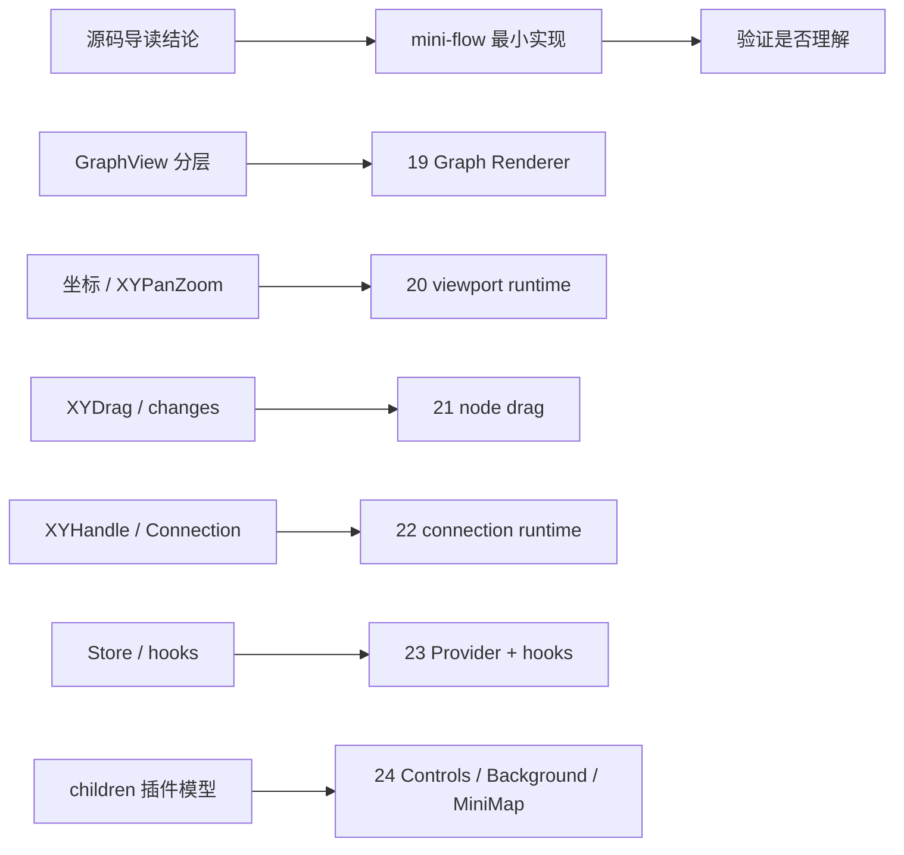

# 第 20 篇：实战：实现最小 Graph Renderer

从这一篇开始，我们终于进入 `mini-flow` 实战。

但这里要先把方向拧正。

这一部分不是突然改成“从 0 写一个 React Flow”。如果那样写，前面 18 篇源码导读就会变成铺垫，读者还是会回到熟悉的教程节奏：

```txt
先创建项目
再写组件
再补功能
最后说我也实现了一个类似 React Flow 的东西
```

这不是这个系列的目标。

这个系列的主线一直是：

```txt
先读懂 React Flow 的概念模型
再读懂 xyflow 的源码分层
最后用 mini-flow 复刻关键机制，验证我们真的理解了源码
```

所以第 20 篇的关键词不是“造库”，而是“验模”。

我们要验证的是一个很小但很关键的判断：

> React Flow 的最小渲染骨架，不是 `nodes.map()`，而是 graph data 在同一个 viewport transform 下被分层渲染为 edges 和 nodes。

这个判断看起来平平无奇。

但它其实压住了后面所有交互：

- 如果没有统一 viewport，pan / zoom 只是 DOM 位移，不是画布坐标系统。
- 如果没有 edges / nodes 分层，边、节点、临时连线、label、portal 会互相挤在一起。
- 如果没有 node lookup，edge 渲染每次都要在 nodes array 里找 source / target。
- 如果没有 renderer 边界，后面 drag、selection、visible elements、memo 都无处安放。

因此，最小 Graph Renderer 的任务不是把画面画出来就结束。

它要把前面读过的源码骨架压缩成一个可以运行的、可以继续演进的最小模型：

```txt
MiniFlow
  ↓
MiniViewport
  ↓
MiniEdgeRenderer
MiniNodeRenderer
```

这个结构对应 React Flow 源码里的：

```txt
ReactFlow
  ↓
GraphView
  ↓
Viewport
  ↓
EdgeRenderer
NodeRenderer
```

这篇只做一件事：

```txt
把 nodes / edges / viewport 渲染成一个静态图画布
```

暂时不做：

- pan
- zoom 交互
- fitView
- drag
- handle
- connection
- selection
- store
- hooks
- controlled / uncontrolled

这些不是不重要。

它们会在后面一篇篇回来。

但在这里，如果我们一上来就把所有能力揉在一起，读者很快会分不清：

```txt
哪些是渲染系统需要的？
哪些是交互系统需要的？
哪些是 store 为了性能引入的？
哪些只是 React 组件组织方式？
```

源码导读最怕的不是少写代码，而是太早把边界糊掉。

这一篇只保留最小渲染边界。

实战部分的验证关系先放在这里：



从这一篇开始，mini-flow 代码建议按同一棵文件树累积。第 20 篇先新增：

```txt
src/mini-flow/types.ts
src/mini-flow/utils.ts
src/mini-flow/MiniFlow.tsx
src/mini-flow/MiniViewport.tsx
src/mini-flow/MiniNodeRenderer.tsx
src/mini-flow/MiniEdgeRenderer.tsx
src/mini-flow/mini-flow.css
```

本章验收 checklist：

```txt
- 修改 viewport 后，nodes 和 edges 一起移动 / 缩放。
- edge 渲染在 node 下层。
- edge source / target 缺失时安全跳过。
- nodeLookup 由 nodes 构建，EdgeRenderer 不在每条边里全量 find。
```

本章不做的内容也要明确：

| 暂不实现 | 为什么 |
| --- | --- |
| store / Provider | 先验证 renderer 分层，状态中心第 24 篇再引入 |
| DOM 测量 / InternalNode | 先用固定 width / height，避免混入测量系统 |
| handle / connection | 先用节点中心连线，第 23 篇再补连接端点 |
| pan / zoom 事件 | 第 21 篇专门验证 viewport runtime |

---

## 1. 这一篇要解决的问题

先看一个很容易写出来的版本：

```tsx
function MiniFlow({ nodes, edges }: MiniFlowProps) {
  return (
    <div>
      {edges.map((edge) => (
        <Edge key={edge.id} edge={edge} />
      ))}

      {nodes.map((node) => (
        <Node key={node.id} node={node} />
      ))}
    </div>
  );
}
```

这个版本的问题不是“不能工作”。

如果只是两个节点一条线，它当然可以画点东西。

真正的问题是它没有回答节点编辑器最核心的几个问题：

```txt
节点坐标属于谁？
边路径基于什么坐标计算？
viewport transform 应该作用在哪一层？
edge 如何找到 source / target node？
节点为什么要盖在边上？
以后临时连线和 edge label 放在哪里？
以后 drag 只改节点，为什么不应该影响整棵 renderer？
```

React Flow 源码不会把这些问题留到“以后再说”。

它在渲染树一开始就把边界摆好了。

`ReactFlow` 主组件内部不是直接渲染 nodes 和 edges，而是把真正的画布工作交给 `GraphView`。在源码里，`GraphView` 和插件 children 都位于同一个 `Wrapper` 子树下，证据在：

```txt
packages/react/src/container/ReactFlow/index.tsx:300
packages/react/src/container/ReactFlow/index.tsx:320
```

`GraphView` 里面也不是简单平铺。

它的核心结构是：

```tsx
<FlowRenderer>
  <Viewport>
    <EdgeRenderer />
    <ConnectionLineWrapper />
    <div className="react-flow__edgelabel-renderer" />
    <NodeRenderer />
    <div className="react-flow__viewport-portal" />
  </Viewport>
</FlowRenderer>
```

证据在：

```txt
packages/react/src/container/GraphView/index.tsx:116
packages/react/src/container/GraphView/index.tsx:156
packages/react/src/container/GraphView/index.tsx:181
packages/react/src/container/GraphView/index.tsx:198
```

这一层分工很关键。

`FlowRenderer` 负责 pane 级交互。

`Viewport` 负责把画布坐标变成屏幕上的 transform。

`EdgeRenderer` 负责已有边。

`ConnectionLineWrapper` 负责正在连接中的临时线。

`NodeRenderer` 负责节点。

portal containers 负责把 edge label、toolbar、viewport portal 这类扩展内容放到正确层级。

这就是第 20 篇要验证的结构：

```txt
graph data
  ↓
node lookup
  ↓
viewport transform
  ↓
edge layer
  ↓
node layer
```

我们要写的不是完整 React Flow，而是这个结构的最小可运行版本。

---

## 2. 先看用户 API 或运行效果

用户侧 API 先保持非常小：

```tsx
const nodes: MiniNode[] = [
  {
    id: 'input',
    position: { x: 80, y: 120 },
    data: { label: 'Input' },
  },
  {
    id: 'transform',
    position: { x: 360, y: 220 },
    data: { label: 'Transform' },
  },
  {
    id: 'output',
    position: { x: 650, y: 120 },
    data: { label: 'Output' },
  },
];

const edges: MiniEdge[] = [
  { id: 'input-transform', source: 'input', target: 'transform' },
  { id: 'transform-output', source: 'transform', target: 'output' },
];

export function App() {
  return (
    <MiniFlow
      nodes={nodes}
      edges={edges}
      viewport={{ x: 0, y: 0, zoom: 1 }}
    />
  );
}
```

这里故意只暴露三个东西：

```txt
nodes
edges
viewport
```

它们分别对应 React Flow 概念模型里的三根柱子：

| 用户字段 | 含义 | 以后会演进成什么 |
| --- | --- | --- |
| `nodes` | 图里的实体 | user node / internal node / node lookup |
| `edges` | 实体之间的关系 | edge lookup / connection lookup / path geometry |
| `viewport` | 画布视口 | panZoom controller / transform / fitView |

这一篇的运行效果也很克制：

```txt
一个固定大小的画布
  ↓
画布内部有一个 viewport 容器
  ↓
viewport 容器应用 translate + scale
  ↓
SVG layer 渲染 edge path
  ↓
HTML layer 渲染 node
```

如果 `viewport={{ x: 100, y: 40, zoom: 1.2 }}`，所有节点和边应该一起移动和缩放。

这是第一个验收条件：

> edge 和 node 必须被同一个 viewport transform 控制。

如果节点动了，边不动，说明我们把坐标系统拆坏了。

如果边动了，节点不动，也一样。

---

## 3. 核心概念解释

最小 Graph Renderer 里只有四个概念：

```txt
Node
Edge
Viewport
Renderer
```

但这四个概念不是并列的。

它们的关系应该是：

```txt
Node / Edge 是图数据
Viewport 是图坐标到屏幕坐标的变换
Renderer 是把图数据放进 viewport 的分层渲染系统
```

换句话说，`Renderer` 不应该拥有图数据本身。

它只负责解释这些数据：

```txt
node.position
  -> 节点在 flow 坐标中的位置

edge.source / edge.target
  -> 通过 nodeLookup 找到两端节点

viewport.x / viewport.y / viewport.zoom
  -> 把 flow 坐标映射到 screen
```

这就是为什么我们不直接把 edge 渲染成两个 DOM 节点之间的连线。

在图编辑器里，边不是“两个 DOM 元素之间的线”。

边是：

```txt
source node 的 flow 坐标
target node 的 flow 坐标
经过 path 算法计算出的 SVG path
再被 viewport transform 显示到屏幕上
```

这里有一个非常重要的区分：

```txt
flow 坐标
screen 坐标
```

第 9 篇已经专门讲过坐标系统。

这一篇先只用最小模型复习它：

```txt
node.position 是 flow 坐标
edge path 使用 flow 坐标
viewport transform 决定 flow 坐标如何显示到 screen
```

所以最小实现里，我们会避免在 edge path 中使用浏览器事件坐标、DOM rect 或 `getBoundingClientRect()`。

这篇还不需要它们。

节点的尺寸也先使用固定值：

```ts
const defaultNodeSize = {
  width: 150,
  height: 44,
};
```

真实 React Flow 不会这么简单。

它会通过 DOM 测量把节点尺寸写进内部节点结构。第 8 篇讲过，用户传入的 `Node` 会被增强成 `InternalNode`，里面有 `measured`、`positionAbsolute`、`handleBounds` 等运行时字段。

但第 20 篇不做测量。

原因很简单：

```txt
这篇验证的是渲染分层，不是 DOM 测量系统。
```

我们先让尺寸固定，保持问题干净。

---

## 4. 源码入口在哪里

这一篇对应的源码入口不多，只有五组。

### 4.1 ReactFlow：把 GraphView 放进运行时壳层

`ReactFlow` 主组件很大，因为它接收大量用户 props。

但对第 20 篇最重要的是它的收尾部分：

```txt
packages/react/src/container/ReactFlow/index.tsx:300
```

这里可以看到 `GraphView` 位于 `Wrapper` 内部，后面跟着 `SelectionListener`、`children`、`Attribution` 和 `A11yDescriptions`。

这说明：

```txt
GraphView 是运行时画布主体
children 是插件入口
Wrapper 是 provider / store 边界
```

第 20 篇暂时不实现 `Wrapper` 和 `StoreUpdater`。

但 `MiniFlow` 这个入口组件要保留“运行时门面”的形状。

### 4.2 GraphView：把渲染层装配起来

看：

```txt
packages/react/src/container/GraphView/index.tsx:116
```

这里是最关键的承重链路。

`GraphView` 把 `FlowRenderer`、`Viewport`、`EdgeRenderer`、`ConnectionLineWrapper`、`NodeRenderer` 组合在一起。

第 20 篇的 `MiniFlow` 会直接借这个骨架：

```txt
MiniFlow
  ↓
MiniViewport
  ↓
MiniEdgeRenderer
MiniNodeRenderer
```

我们先把 `FlowRenderer` 删除。

因为它处理的是 pane interaction，而这一篇不做 pan、selection、pane click。

我们也先把 `ConnectionLineWrapper` 删除。

因为连接系统第 23 篇再写。

我们也先不放 portal containers。

因为 children 插件模型第 25 篇再写。

剩下的就是最小 Graph Renderer。

### 4.3 Viewport：把 transform 应用到统一容器

看：

```txt
packages/react/src/container/Viewport/index.tsx:6
```

源码里 selector 从 store 的 `transform` 数组拼出：

```txt
translate(x, y) scale(zoom)
```

然后在：

```txt
packages/react/src/container/Viewport/index.tsx:16
```

把它放到 `.react-flow__viewport` 的 `style.transform` 上。

第 20 篇的 `MiniViewport` 会做同一件事。

只是我们的 transform 暂时来自 prop，不来自 store。

### 4.4 NodeRenderer：先渲染 ids，再下放单节点工作

看：

```txt
packages/react/src/container/NodeRenderer/index.tsx:38
```

`NodeRenderer` 读取可见 node ids，创建共享 `ResizeObserver`，然后 map 出 `NodeWrapper`。

源码注释在：

```txt
packages/react/src/container/NodeRenderer/index.tsx:47
```

这段注释解释得很直白：

```txt
NodeRenderer 只订阅 node ids。
单个 node 高频更新时，不要让 NodeRenderer 每次重新跑 nodes.map。
```

第 20 篇不会实现这个优化。

但我们要把它写进设计预留里：

```txt
第一版 MiniNodeRenderer 可以 map nodes
以后 store 出现后，MiniNodeRenderer 应该改成订阅 node ids
每个 MiniNodeWrapper 再按 id 读 node
```

这样读者会知道：

```txt
当前实现为什么简单
以后为什么要拆
这个拆法在 React Flow 源码里对应哪里
```

### 4.5 EdgeRenderer：edge 渲染依赖 source / target node geometry

看：

```txt
packages/react/src/container/EdgeRenderer/index.tsx:58
```

`EdgeRenderer` 按 visible edge ids 渲染 `EdgeWrapper`。

真正计算 edge 几何的是 `EdgeWrapper`。

在：

```txt
packages/react/src/components/EdgeWrapper/index.tsx:63
```

它会从 store 的 `nodeLookup` 里找到 source node 和 target node，再调用 `getEdgePosition`。

这就是我们这篇一定要引入 `nodeLookup` 的原因。

即使节点只有三个，也不要在 edge renderer 里写：

```ts
const source = nodes.find((node) => node.id === edge.source);
const target = nodes.find((node) => node.id === edge.target);
```

这会误导后面的架构。

从第一版开始就建立 lookup，读者更容易理解第 7 篇和第 18 篇反复强调的原则：

```txt
array 适合对外 API
lookup map 适合内部高频查询
```

---

## 5. 源码调用链

把 React Flow 的真实链路压缩一下，可以得到这张图：

```txt
ReactFlow
  接收用户 props
  放入 Wrapper / Provider 边界
  渲染 GraphView

GraphView
  装配 FlowRenderer
  装配 Viewport
  在 Viewport 内分层放 EdgeRenderer / ConnectionLine / NodeRenderer / portals

Viewport
  从 store.transform 读 [x, y, zoom]
  转成 CSS transform
  让内部所有图层共享同一个坐标变换

EdgeRenderer
  读取 edge ids
  交给 EdgeWrapper

EdgeWrapper
  从 edgeLookup 读 edge
  从 nodeLookup 读 source / target
  算 edge position
  渲染 edge component

NodeRenderer
  读取 node ids
  交给 NodeWrapper

NodeWrapper
  从 nodeLookup 读 InternalNode
  用 positionAbsolute 设置 translate
  渲染用户节点组件
```

第 20 篇的 mini 版本压缩成：

```txt
MiniFlow
  接收 nodes / edges / viewport
  创建 nodeLookup
  渲染 MiniViewport

MiniViewport
  使用 viewport.x / viewport.y / viewport.zoom
  设置 CSS transform

MiniEdgeRenderer
  遍历 edges
  通过 nodeLookup 找 source / target
  根据 node center 生成 SVG path

MiniNodeRenderer
  遍历 nodes
  用 node.position 设置 translate
  渲染 node label
```

这两个链路不是一一复刻。

它们是同构的：

```txt
真实源码保留完整运行时能力
mini-flow 保留最小结构关系
```

这就是“用实战验证源码理解”的正确姿势。

我们不复制源码。

我们复制设计压力。

---

## 6. 关键数据结构

先定义五个最小类型：

```ts
export type XYPosition = {
  x: number;
  y: number;
};

export type Dimensions = {
  width: number;
  height: number;
};

export type MiniNode<Data = { label?: string }> = {
  id: string;
  position: XYPosition;
  data?: Data;
  width?: number;
  height?: number;
  hidden?: boolean;
};

export type MiniEdge = {
  id: string;
  source: string;
  target: string;
  hidden?: boolean;
};

export type MiniViewportState = {
  x: number;
  y: number;
  zoom: number;
};
```

这几个字段都不是随便选的。

### 6.1 `MiniNode.position`

节点位置必须存在。

但这里用的是用户节点上的 `position`，不是真实 React Flow 的 `internals.positionAbsolute`。

原因是这篇没有 parent node，也没有 drag，也没有 internal node。

后面实现拖拽和 parent node 时，才需要区分：

```txt
用户传入的相对 position
内部维护的绝对 positionAbsolute
```

真实 React Flow 的 `NodeWrapper` 用的是内部节点的 `positionAbsolute`：

```txt
packages/react/src/components/NodeWrapper/index.tsx:203
packages/react/src/components/NodeWrapper/index.tsx:205
```

第 20 篇先把两者合并。

这是有意简化，不是忘了内部节点。

### 6.2 `MiniNode.width` / `MiniNode.height`

边要连接节点。

哪怕我们只画从中心到中心的直线，也需要知道节点宽高。

真实 React Flow 会测量节点尺寸，并把结果保存到 internal node 的 `measured` 和 handle bounds 里。

这篇先允许用户传入宽高，没传就用默认尺寸：

```ts
const defaultNodeSize: Dimensions = {
  width: 150,
  height: 44,
};
```

这能让 edge path 有稳定坐标。

### 6.3 `MiniEdge.source` / `MiniEdge.target`

边只保存节点 id。

它不保存 source node 对象，也不保存 target node 对象。

这是图数据建模的基本选择：

```txt
Node 是实体
Edge 是关系
关系用 id 指向实体
```

如果 edge 直接嵌入 node 对象，就会带来几个问题：

- node 位置更新时 edge 引用容易过期。
- 同一个 node 被多条 edge 引用时会出现重复数据。
- 序列化和受控更新都变复杂。
- 后面做 lookup / connection lookup 会很别扭。

因此 edge renderer 必须有一步：

```txt
edge.source / edge.target
  ↓
nodeLookup.get(...)
  ↓
sourceNode / targetNode
```

### 6.4 `MiniViewportState`

viewport 只保留：

```txt
x
y
zoom
```

这和 React Flow 的 `Viewport` 类型一致。

在 React Flow 源码里，`Viewport` 由 `x/y/zoom` 描述，证据在：

```txt
packages/system/src/types/general.ts:209
```

React 层 store 里常用的 `transform` 则是数组形态：

```txt
[x, y, zoom]
```

第 20 篇直接使用对象形态，便于阅读。

第 21 篇写 pan / zoom / fitView 时，再把它和 transform 计算对应起来。

---

## 7. 关键实现思路

最小 Graph Renderer 的实现可以拆成五步：

```txt
1. 创建 nodeLookup
2. 创建 viewport 层
3. 创建 edge layer
4. 创建 node layer
5. 用 CSS 固定层级和坐标规则
```

### 7.1 为什么先创建 nodeLookup

因为 edge renderer 需要通过 edge 找到节点。

最小工具函数如下：

```ts
function createNodeLookup(nodes: MiniNode[]) {
  return new Map(nodes.map((node) => [node.id, node]));
}
```

这里暂时不用 `edgeLookup`。

原因是第 20 篇没有按 id 单独更新 edge，也没有 selection、reconnect、visible edge ids。

但是 `nodeLookup` 必须有。

因为没有它，edge path 就只能不断扫描 nodes array：

```txt
每条 edge
  ↓
find source node
  ↓
find target node
```

这在小 demo 里可以接受，但在源码导读里会误导读者。

我们要从第一版开始建立内部查询结构。

### 7.2 为什么 edges 在 nodes 前面渲染

React Flow 的 `GraphView` 里，`EdgeRenderer` 位于 `NodeRenderer` 之前：

```txt
packages/react/src/container/GraphView/index.tsx:156
packages/react/src/container/GraphView/index.tsx:182
```

这不是偶然。

通常节点应该覆盖边。

如果边在节点上方，线会压到节点内容、按钮、handle、toolbar 上。

最小实现也沿用这个顺序：

```tsx
<MiniViewport viewport={viewport}>
  <MiniEdgeRenderer edges={edges} nodeLookup={nodeLookup} />
  <MiniNodeRenderer nodes={nodes} />
</MiniViewport>
```

这一步看起来只是 JSX 顺序。

但它其实是渲染层语义：

```txt
edge layer
node layer
```

### 7.3 为什么 edge 用 SVG，node 用 HTML

边本质上是 path。

节点本质上是交互内容。

所以最常见的组合是：

```txt
SVG 渲染边
HTML 渲染节点
```

React Flow 的内置边组件也是围绕 SVG path 展开的。第 13 篇已经读过 `getStraightPath`、`getBezierPath`、`getSmoothStepPath`。

第 20 篇只实现最小直线：

```ts
function getStraightPath(source: XYPosition, target: XYPosition) {
  return `M ${source.x} ${source.y} L ${target.x} ${target.y}`;
}
```

这不等于 React Flow 的完整 `getStraightPath`。

真实实现还会返回 label position、offset 等信息。

但作为第一个渲染器，直线足够验证：

```txt
edge path 使用 flow 坐标
edge layer 跟 node layer 一起被 viewport transform 控制
```

### 7.4 为什么 viewport 包住 edges 和 nodes

如果把 transform 分别加到 node layer 和 edge layer，短期也能工作。

但它会让后续能力变复杂：

- edge label 要不要再加一遍 transform？
- connection line 要跟哪一层？
- viewport portal 应该在 transform 内还是 transform 外？
- 背景网格该按 zoom 缩放还是单独计算？
- selection rectangle 是 screen layer 还是 flow layer？

React Flow 选择让 `Viewport` 成为统一 transform 容器：

```txt
packages/react/src/container/Viewport/index.tsx:16
```

第 20 篇也这样做。

最小实现里：

```tsx
function MiniViewport({ viewport, children }: MiniViewportProps) {
  const transform = `translate(${viewport.x}px, ${viewport.y}px) scale(${viewport.zoom})`;

  return (
    <div className="mini-flow__viewport" style={{ transform }}>
      {children}
    </div>
  );
}
```

注意 CSS 里要写：

```css
transform-origin: 0 0;
```

否则缩放会围绕元素中心，而不是围绕 flow 坐标原点。

这会让第 21 篇的 zoomAtPoint 变得很难解释。

### 7.5 为什么 node 使用 absolute + translate

真实 React Flow 的 `NodeWrapper` 在 style 上使用：

```txt
transform: translate(positionAbsolute.x, positionAbsolute.y)
```

证据在：

```txt
packages/react/src/components/NodeWrapper/index.tsx:203
packages/react/src/components/NodeWrapper/index.tsx:205
```

第 20 篇也使用 `position: absolute` 加 `transform`。

而不是用 normal flow。

因为图编辑器里的节点不参与文档流。

它们存在于一张无限画布上。

所以节点定位应该由 flow 坐标决定，而不是由 DOM 排版决定。

---

## 8. 这部分源码的设计取舍

最小 Graph Renderer 其实已经出现了几个重要取舍。

### 8.1 对外保留数组，对内建立 lookup

用户 API 用数组：

```ts
nodes: MiniNode[];
edges: MiniEdge[];
```

内部用 lookup：

```ts
const nodeLookup = createNodeLookup(nodes);
```

这就是 React Flow 的基本模式。

数组适合用户维护：

- 容易序列化。
- 容易受控更新。
- 容易和 React state 配合。
- 顺序可以表达渲染或业务含义。

lookup 适合运行时：

- edge 找 source / target 快。
- drag 更新 node 快。
- selection 查 node 快。
- visible elements 判断快。

第 20 篇只用到 `nodeLookup`。

但这个边界一旦建立，后面的 store 就很自然。

### 8.2 先固定尺寸，不做测量

真实 React Flow 需要测量节点。

原因包括：

- edge 要连到 handle。
- selection rectangle 要知道节点 bounds。
- fitView 要知道所有节点范围。
- parent node 要计算 children bounds。
- MiniMap 要画节点缩略图。

但第 20 篇不做这些。

我们先用固定尺寸。

这样可以避免文章从“渲染分层”跑偏到 `ResizeObserver`。

源码导读里很重要的一点是控制变量。

读者要先看清：

```txt
没有测量系统时，renderer 最小形态是什么？
```

然后第 22 篇、第 24 篇再逐步把测量、store、hooks 加回来。

### 8.3 先中心连线，不做 handle

真实边不是简单从节点中心连到节点中心。

它通常需要：

- source handle
- target handle
- handle position
- node bounds
- connection mode
- path type
- marker
- label
- interaction width

这些都在第 12 篇和第 13 篇读过。

第 20 篇先使用中心点：

```txt
source center -> target center
```

因为这里要验证的是：

```txt
edge renderer 如何依赖 node geometry
```

而不是：

```txt
handle 系统如何决定连接点
```

handle 会在第 23 篇回来。

### 8.4 先不引入 store

这是一个容易纠结的地方。

前面第 7 篇已经讲过 store 是 React Flow 的心脏。

那为什么 mini-flow 实战第一篇不直接写 store？

因为 store 不是渲染器成立的前提。

渲染器最小需要的是：

```txt
nodes
edges
viewport
nodeLookup
```

store 解决的是：

```txt
状态如何集中保存
交互如何更新状态
用户回调如何触发
selector 如何缩小订阅范围
controlled / uncontrolled 如何统一
```

这些问题会在第 24 篇集中处理。

如果第 20 篇就引入 store，读者会误以为：

```txt
有 store 才能渲染节点和边
```

这不对。

正确理解应该是：

```txt
renderer 描述图如何显示
store 描述运行时状态如何流动
```

这两件事有关，但不是一件事。

### 8.5 先不过度优化 NodeRenderer

真实 `NodeRenderer` 不直接订阅 nodes array。

它只订阅 visible node ids，然后把单节点逻辑交给 `NodeWrapper`。

第 18 篇已经解释过，这样可以避免单个节点高频更新时让父 renderer 反复跑 `nodes.map()`。

第 20 篇为了保持最小，先写：

```tsx
nodes.map((node) => <MiniNodeView key={node.id} node={node} />)
```

但文章里必须明确标注：

```txt
这是静态渲染器版本
一旦进入 drag/store 阶段，就要改成 ids + wrapper 的结构
```

这样，简化不会变成误导。

---

## 9. 如果我们自己实现，最小版本应该怎么写

下面是一份完整的最小实现草图。

它不是要和真实 React Flow 对齐 API。

它只服务于一个目标：

```txt
用最少代码复刻 React Flow 的渲染骨架
```

### 9.1 类型定义

```ts
export type XYPosition = {
  x: number;
  y: number;
};

export type Dimensions = {
  width: number;
  height: number;
};

export type MiniNode<Data = { label?: string }> = {
  id: string;
  position: XYPosition;
  data?: Data;
  width?: number;
  height?: number;
  hidden?: boolean;
};

export type MiniEdge = {
  id: string;
  source: string;
  target: string;
  hidden?: boolean;
};

export type MiniViewportState = {
  x: number;
  y: number;
  zoom: number;
};
```

这个类型故意没有 `selected`、`dragging`、`sourceHandle`、`targetHandle`。

不是因为它们不重要。

而是因为这篇不验证这些能力。

源码导读的实战代码要克制。

每加一个字段，都应该能回答：

```txt
它验证了哪个源码概念？
```

### 9.2 查询与几何工具

```ts
const defaultNodeSize: Dimensions = {
  width: 150,
  height: 44,
};

function createNodeLookup(nodes: MiniNode[]) {
  return new Map(nodes.map((node) => [node.id, node]));
}

function getNodeSize(node: MiniNode): Dimensions {
  return {
    width: node.width ?? defaultNodeSize.width,
    height: node.height ?? defaultNodeSize.height,
  };
}

function getNodeCenter(node: MiniNode): XYPosition {
  const size = getNodeSize(node);

  return {
    x: node.position.x + size.width / 2,
    y: node.position.y + size.height / 2,
  };
}

function getStraightPath(source: XYPosition, target: XYPosition) {
  return `M ${source.x} ${source.y} L ${target.x} ${target.y}`;
}
```

这里有两个设计点。

第一，`getNodeCenter` 使用的是 flow 坐标。

它不会关心 viewport。

第二，`getStraightPath` 也使用 flow 坐标。

它同样不会关心 viewport。

viewport 是外层统一 transform 的责任，不应该散落到每个 path 算法里。

这就是分层的价值。

### 9.3 MiniFlow 入口

```tsx
import { useMemo, type ReactNode } from 'react';
import './mini-flow.css';

export type MiniFlowProps = {
  nodes: MiniNode[];
  edges: MiniEdge[];
  viewport?: MiniViewportState;
};

const defaultViewport: MiniViewportState = {
  x: 0,
  y: 0,
  zoom: 1,
};

export function MiniFlow({
  nodes,
  edges,
  viewport = defaultViewport,
}: MiniFlowProps) {
  const nodeLookup = useMemo(() => createNodeLookup(nodes), [nodes]);

  return (
    <div className="mini-flow">
      <MiniViewport viewport={viewport}>
        <MiniEdgeRenderer edges={edges} nodeLookup={nodeLookup} />
        <MiniNodeRenderer nodes={nodes} />
      </MiniViewport>
    </div>
  );
}
```

`MiniFlow` 做三件事：

```txt
接收用户声明式数据
建立内部查询结构
装配渲染层
```

这就对应了真实 `ReactFlow` 和 `GraphView` 的压缩版。

但这里有一个差异：

真实 `ReactFlow` 会通过 `Wrapper` 和 `StoreUpdater` 把 props 同步到 store。

第 20 篇没有 store，所以 `MiniFlow` 直接把 props 交给 renderer。

这个差异是刻意保留的。

### 9.4 MiniViewport

```tsx
type MiniViewportProps = {
  viewport: MiniViewportState;
  children: ReactNode;
};

function MiniViewport({ viewport, children }: MiniViewportProps) {
  const transform = `translate(${viewport.x}px, ${viewport.y}px) scale(${viewport.zoom})`;

  return (
    <div className="mini-flow__viewport" style={{ transform }}>
      {children}
    </div>
  );
}
```

这个组件很小。

但它是这篇的核心。

因为它决定了：

```txt
节点和边共享同一个 flow -> screen 映射
```

真实 React Flow 的 `Viewport` 也只有很少代码。

它不是因为简单所以不重要，而是因为它的位置太关键。

它是所有图层的共同父级。

### 9.5 MiniNodeRenderer

```tsx
type MiniNodeRendererProps = {
  nodes: MiniNode[];
};

function MiniNodeRenderer({ nodes }: MiniNodeRendererProps) {
  return (
    <div className="mini-flow__nodes">
      {nodes.map((node) => {
        if (node.hidden) {
          return null;
        }

        return <MiniNodeView key={node.id} node={node} />;
      })}
    </div>
  );
}

type MiniNodeViewProps = {
  node: MiniNode;
};

function MiniNodeView({ node }: MiniNodeViewProps) {
  const size = getNodeSize(node);
  const label = node.data?.label ?? node.id;

  return (
    <div
      className="mini-flow__node"
      style={{
        width: size.width,
        height: size.height,
        transform: `translate(${node.position.x}px, ${node.position.y}px)`,
      }}
      data-node-id={node.id}
    >
      {label}
    </div>
  );
}
```

这里有三个点要注意。

第一，节点容器是独立 layer：

```txt
mini-flow__nodes
```

第二，单个节点使用 `transform: translate(...)`，不是 `left/top`。

第三，`MiniNodeRenderer` 当前直接 map nodes。

这在第 20 篇是可以接受的。

但未来如果实现 drag，就要向真实源码靠拢：

```txt
MiniNodeRenderer 订阅 node ids
MiniNodeWrapper 按 id 读取 node
单个 node 变化只影响自己的 wrapper
```

这一点在真实源码中对应：

```txt
packages/react/src/container/NodeRenderer/index.tsx:47
```

### 9.6 MiniEdgeRenderer

```tsx
type MiniEdgeRendererProps = {
  edges: MiniEdge[];
  nodeLookup: Map<string, MiniNode>;
};

function MiniEdgeRenderer({ edges, nodeLookup }: MiniEdgeRendererProps) {
  return (
    <svg className="mini-flow__edges">
      {edges.map((edge) => {
        if (edge.hidden) {
          return null;
        }

        const sourceNode = nodeLookup.get(edge.source);
        const targetNode = nodeLookup.get(edge.target);

        if (!sourceNode || !targetNode) {
          return null;
        }

        const source = getNodeCenter(sourceNode);
        const target = getNodeCenter(targetNode);
        const path = getStraightPath(source, target);

        return (
          <path
            key={edge.id}
            className="mini-flow__edge"
            d={path}
            data-edge-id={edge.id}
          />
        );
      })}
    </svg>
  );
}
```

这个 renderer 已经有了真实 `EdgeWrapper` 的影子：

```txt
edge.source / edge.target
  ↓
nodeLookup
  ↓
source / target geometry
  ↓
path
```

真实源码中，`EdgeWrapper` 也是先从 `nodeLookup` 找两端节点，然后调用 `getEdgePosition`：

```txt
packages/react/src/components/EdgeWrapper/index.tsx:63
packages/react/src/components/EdgeWrapper/index.tsx:76
```

我们这里没有 `getEdgePosition`，因为还没有 handle。

但查询链路是一样的。

### 9.7 CSS

```css
.mini-flow {
  position: relative;
  width: 100%;
  height: 480px;
  overflow: hidden;
  background:
    linear-gradient(#f5f7fb 1px, transparent 1px),
    linear-gradient(90deg, #f5f7fb 1px, transparent 1px),
    #ffffff;
  background-size: 24px 24px;
  border: 1px solid #d8dee9;
}

.mini-flow__viewport {
  position: absolute;
  inset: 0;
  transform-origin: 0 0;
}

.mini-flow__edges {
  position: absolute;
  inset: 0;
  width: 100%;
  height: 100%;
  overflow: visible;
  pointer-events: none;
}

.mini-flow__edge {
  fill: none;
  stroke: #8a94a6;
  stroke-width: 2;
}

.mini-flow__nodes {
  position: absolute;
  inset: 0;
}

.mini-flow__node {
  position: absolute;
  display: grid;
  place-items: center;
  box-sizing: border-box;
  border: 1px solid #c6d0df;
  border-radius: 6px;
  background: #ffffff;
  color: #1f2937;
  font: 500 14px/1.2 system-ui, -apple-system, BlinkMacSystemFont, "Segoe UI", sans-serif;
  box-shadow: 0 8px 24px rgb(15 23 42 / 8%);
  user-select: none;
}
```

CSS 里最重要的不是颜色。

最重要的是这些规则：

```txt
.mini-flow
  position: relative
  overflow: hidden

.mini-flow__viewport
  position: absolute
  inset: 0
  transform-origin: 0 0

.mini-flow__edges / .mini-flow__nodes
  position: absolute
  inset: 0

.mini-flow__node
  position: absolute
```

这些规则共同说明：

```txt
画布不是文档流布局
图层在同一个 viewport 内绝对定位
viewport transform 控制所有图层
```

### 9.8 使用示例

```tsx
const nodes: MiniNode[] = [
  {
    id: 'input',
    position: { x: 80, y: 120 },
    data: { label: 'Input' },
  },
  {
    id: 'transform',
    position: { x: 360, y: 220 },
    data: { label: 'Transform' },
  },
  {
    id: 'output',
    position: { x: 650, y: 120 },
    data: { label: 'Output' },
  },
];

const edges: MiniEdge[] = [
  { id: 'input-transform', source: 'input', target: 'transform' },
  { id: 'transform-output', source: 'transform', target: 'output' },
];

export function App() {
  return (
    <MiniFlow
      nodes={nodes}
      edges={edges}
      viewport={{ x: 40, y: 20, zoom: 1 }}
    />
  );
}
```

这个例子能验证三件事：

```txt
nodes 能根据 position 渲染
edges 能根据 source / target 找到节点并生成 path
viewport 能同时影响节点和边
```

如果把 viewport 改成：

```tsx
viewport={{ x: 120, y: 60, zoom: 1.4 }}
```

节点和边应该一起移动、一起放大。

如果 edge 没跟着节点动，说明 edge layer 没放进 viewport。

如果节点没跟着 edge 动，说明 node layer 没放进 viewport。

如果缩放中心不对，先检查 `transform-origin`。

---

## 10. 本篇总结

这一篇看起来写了一个很小的 renderer。

但它真正验证了 React Flow 源码里的几个核心判断：

```txt
1. React Flow 的画布不是 nodes.map，而是分层渲染系统。
2. EdgeRenderer 和 NodeRenderer 应该处在同一个 Viewport 下。
3. Viewport 用 translate + scale 统一控制 flow 坐标到 screen 坐标的映射。
4. Edge 渲染依赖 source / target node geometry，因此需要 nodeLookup。
5. Node 使用 absolute + transform 定位，因为节点不参与普通文档流。
6. edges 应该先于 nodes 渲染，因为节点通常覆盖边。
7. 静态 renderer 可以直接 map nodes，但交互阶段要演进到 ids + wrapper。
```

这就是实战部分的写法：

```txt
不是复制 React Flow 的源码
而是提炼 React Flow 的设计压力
再用最小代码复刻那条压力线
```

我们现在得到的是：

```txt
MiniFlow
  ↓
MiniViewport
  ↓
MiniEdgeRenderer
MiniNodeRenderer
```

它还不是一个节点编辑器。

它只是一个静态图 renderer。

但这是必要的第一步。

因为后面所有交互都会依赖这个结构：

- pan / zoom 要更新 viewport。
- fitView 要计算节点 bounds 再生成 viewport。
- drag 要更新 node position。
- connection 要根据 pointer 和 handle 生成临时线。
- selection 要知道节点 bounds。
- store 要把这些变化组织成可订阅状态。

如果第 20 篇没有把渲染分层打牢，后面的每个功能都会变成“往组件里塞逻辑”。

现在我们有了一个可以承重的最小骨架。

---

## 11. 下一篇读什么

下一篇进入：

```txt
第 21 篇：实战：实现 viewport、pan、zoom、fitView
```

第 20 篇里，viewport 只是一个静态 prop。

第 21 篇会让它变成真正的画布控制系统：

- wheel zoom
- drag pan
- screen position 到 flow position 的转换
- fitView
- zoomAtPoint

对应回 React Flow 源码，就是：

```txt
Viewport
  ↓
ZoomPane
  ↓
XYPanZoom
  ↓
坐标转换工具
```

也就是说，第 20 篇解决的是：

```txt
图如何在 viewport 里显示？
```

第 21 篇解决的是：

```txt
viewport 自己如何被用户操作？
```

这两个问题分开，后面的源码才会越来越清楚。
