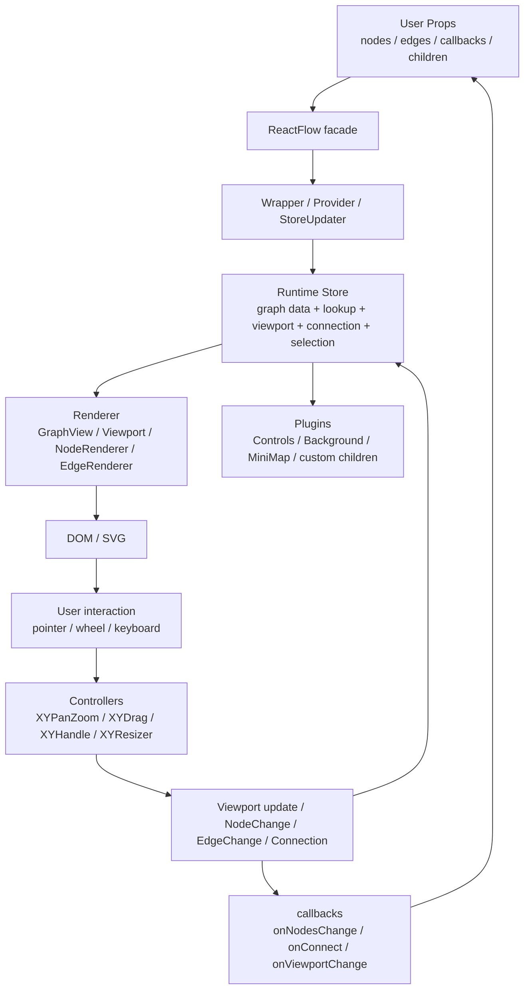

# 第 26 篇：总结：React Flow 源码的架构模式和可复用经验

这组文章一开始就刻意避开了一个诱惑：

```txt
从 0 搭项目
从 0 画节点
从 0 造一个 React Flow
```

不是因为这些不重要。

而是因为如果一上来就写 mini-flow，很容易把 React Flow 学成“造轮子教程”：

```txt
第 1 步：搭 monorepo
第 2 步：画 nodes
第 3 步：画 edges
第 4 步：拖拽
第 5 步：连线
```

这样能做出一个 demo，但未必能读懂 xyflow。

React Flow 真正值得学习的，不是某个组件怎么写，也不是某段拖拽代码怎么抄。

它值得学习的是：

> 一个复杂交互库，如何把图数据、视口、渲染、交互、状态回流和插件扩展拆成稳定协作的运行时架构。

所以这个系列的顺序是：

```txt
先建立概念模型
  ↓
再读核心源码
  ↓
最后用 mini-flow 复刻关键机制
```

这一篇不再继续加功能。

我们把前 24 篇收束成几条架构经验。

---

## 1. 这一篇要解决的问题

最后一篇要回答的不是：

```txt
React Flow 每个文件分别做什么？
```

前面已经回答过。

这一篇要回答的是：

```txt
读完这些源码之后，我能带走什么？
```

更具体一点：

```txt
React Flow 的核心抽象是什么？
system / react 分层解决了什么问题？
store 为什么更像交互运行时的控制面，而不是普通 React state？
viewport / transform 为什么是交互系统的地基？
drag / panzoom / handle 为什么被抽成独立 controller？
controlled / uncontrolled 为什么会影响内部设计？
renderer / interaction / plugin 为什么要分层？
哪些模式适合迁移到自己的项目？
哪些模式不适合过早照搬？
```

这篇的结论先放在前面：

> React Flow 的源码主线不是“React 组件如何渲染图”，而是“一个 graph runtime 如何把数据模型、视口系统、交互控制器、渲染层和对外 API 组织成稳定回路”。

这个稳定回路可以画成：



如果只能记住一张图，就记这张。

React Flow 的很多源码细节，都是为了让这条回路稳定工作。

本篇统一术语：

| 术语 | 本系列里的含义 |
| --- | --- |
| runtime | graph data、store、renderer、interaction、callbacks、plugins 组成的完整运行系统 |
| store | 运行时控制面，保存状态和 actions，不只是全局 state |
| controller | 持续交互单元，如 panzoom、drag、handle、resize |
| plugin | Provider 下的 children 组件模型，不是独立 plugin manager |

---

## 2. 先看用户 API 或运行效果

用户最常见的使用方式仍然很简单：

```tsx
<ReactFlow
  nodes={nodes}
  edges={edges}
  onNodesChange={onNodesChange}
  onEdgesChange={onEdgesChange}
  onConnect={onConnect}
>
  <Background />
  <Controls />
  <MiniMap />
</ReactFlow>
```

这个 API 表面上很 React。

```txt
传 props
渲染 children
接收 callback
```

但它实际暴露了 React Flow 的全部架构边界。

`nodes` / `edges` 暗示数据模型。

`onNodesChange` / `onEdgesChange` 暗示交互不会直接改用户状态，而是产生 change objects。

`onConnect` 暗示连接过程和 edge 创建不是同一件事。

`Background` / `Controls` / `MiniMap` 暗示 children 插件会共享同一个运行时。

如果继续加上：

```tsx
const reactFlow = useReactFlow();
const nodes = useNodes();
const viewport = useViewport();
const storeSlice = useStore(selector);
```

你会看到另一层边界：

```txt
常用 hook
命令式 instance
底层 store escape hatch
```

这就是 React Flow API 设计很有意思的地方：

```txt
它的表面是 React 组件
它的内部是 graph runtime
它的扩展面是 hooks + children
```

所以读源码时，不要只问：

```txt
这个组件渲染了什么？
```

更应该问：

```txt
这个组件在 runtime 回路里承担哪一段？
```

---

## 3. 核心概念解释

总结下来，React Flow 的核心不是一个概念，而是一组互相咬合的概念。

### 3.1 Graph data：图数据不是渲染结果

React Flow 的 graph data 至少包含：

```txt
Node
Edge
Handle
Connection
```

`Node` 是图上的实体。

`Edge` 是实体之间的关系。

`Handle` 是节点上的连接点。

`Connection` 是连接过程或连接结果的最小描述。

这里最容易误解的是 Edge。

很多人会把 Edge 理解成一条 SVG path。

但在 React Flow 里，Edge 首先是：

```txt
source node
target node
source handle
target handle
```

path 是根据这些关系和节点几何信息算出来的渲染结果。

这就是为什么 `addEdge` 接收的是 connection，返回的是 edge array；为什么 `getBezierPath`、`getSmoothStepPath`、`getStraightPath` 是工具函数，而不是 Edge 数据本身。

可迁移经验是：

> 不要把领域关系直接等同于渲染形状。关系要稳定，形状可以派生。

这条经验不只适用于节点编辑器。

工作流编排、白板、流程图、拓扑图、可视化搭建器都一样。

### 3.2 InternalNode：用户数据和运行时数据要分开

用户传入的 Node 是声明式数据：

```ts
{
  id,
  position,
  data
}
```

但运行时需要更多信息：

```txt
measured
positionAbsolute
handleBounds
selected
dragging
z
internals.userNode
```

这就是 `InternalNode` 存在的原因。

React Flow 的 `adoptUserNodes` 会把用户 nodes 转成内部结构，并维护 `nodeLookup`、`parentLookup` 等 lookup map。

这个设计的收益是：

```txt
对外 API 保持干净
内部交互有足够上下文
高频查询不用反复扫描数组
DOM 测量结果不污染用户数据
```

代价是：

```txt
内部结构和用户结构之间必须持续同步
需要处理引用复用、测量更新、parent node、隐藏节点等边界
```

可迁移经验是：

> 当用户数据不足以支撑运行时时，宁愿显式建立 Internal Model，也不要把运行时字段偷偷塞回用户模型。

这是大型前端交互库里非常常见的分界。

### 3.3 Viewport / Transform：交互系统的地基

React Flow 的 viewport 看起来只是：

```txt
x
y
zoom
```

但它是整套交互系统的地基。

它决定：

```txt
鼠标坐标怎么变成 flow 坐标
节点拖拽为什么要除以 zoom
背景网格为什么要跟着 transform 变化
fitView 为什么要算 bounds
MiniMap 如何反算当前主视口
边路径为什么使用 flow 坐标而不是 screen 坐标
```

第 9 篇讲过最核心的公式：

```txt
screen/container point
  ↓
减去 wrapper bounds
  ↓
除以 zoom，并反向应用 translate
  ↓
flow point
```

后面的 `XYPanZoom`、`XYDrag`、`XYHandle`、`Background`、`MiniMap` 都在反复使用这个地基。

可迁移经验是：

> 只要你的应用有 pan/zoom，就应该尽早把 screen 坐标、container 坐标、world 坐标和 viewport transform 分清楚。

如果这层混了，后面所有交互都会变成补丁。

### 3.4 Store：状态中心，也是交互运行时控制面

React Flow 的 store 保存：

```txt
nodes
edges
nodeLookup
edgeLookup
connectionLookup
transform
selection
connection
panZoom
callbacks
options
```

也保存 action：

```txt
setNodes
setEdges
updateNodePositions
triggerNodeChanges
triggerEdgeChanges
panBy
setCenter
cancelConnection
updateConnection
```

这说明 store 不是全局 `useState`。

它更像交互运行时的控制面：

```txt
用户输入
  -> interaction controller
  -> store action
  -> changes / viewport / connection state
  -> renderers / callbacks
```

这也是为什么 React Flow 用 external store，而不是把所有状态塞在 `ReactFlow` 组件里。

交互 controller 需要：

```txt
store.getState()
store.setState()
store.subscribe()
```

插件组件需要：

```txt
useStore(selector)
useReactFlow()
useViewport()
```

两者都围绕同一个 store。

可迁移经验是：

> 当一套状态同时被 React 组件、DOM 事件、外部插件和命令式 API 读写时，它已经不是普通组件状态了。

这时建立独立 runtime store，通常比继续 props drilling 更稳定。

### 3.5 Interaction controllers：把持续交互从 React 组件里拿出来

React Flow 的几个核心交互不是直接写在 JSX 里：

```txt
XYPanZoom
XYDrag
XYHandle
XYMinimap
XYResizer
```

这些 controller 处理的是持续交互：

```txt
pointer down
pointer move
pointer up
wheel
touch
auto pan
constraint
validation
cleanup
```

它们通常需要：

```txt
当前 transform
container bounds
nodeLookup
panZoom instance
callback refs
requestAnimationFrame
全局事件监听
```

如果把这些都写在 React 组件里，组件会同时承担：

```txt
渲染
事件生命周期
坐标转换
状态写入
回调触发
清理副作用
```

边界会很快变乱。

React Flow 的做法是：

```txt
React binding layer
  负责拿 store、拿 DOM、管理 lifecycle

system controller
  负责具体 pointer / wheel / d3 交互
```

可迁移经验是：

> 高频、持续、跨事件的交互逻辑，值得抽成 controller；React 组件只负责把 DOM、store 和配置注入进去。

这条经验尤其适合拖拽、缩放、画布、框选、连接线、resize 这类能力。

### 3.6 Renderer：渲染层要分层，不要平铺

React Flow 的 `GraphView` 不是简单：

```txt
render edges
render nodes
```

它组装的是：

```txt
FlowRenderer
  ↓
Viewport
  ↓
EdgeRenderer
ConnectionLineWrapper
EdgeLabelRenderer container
NodeRenderer
ViewportPortal container
```

每一层都有职责：

```txt
FlowRenderer
  pane 级事件和交互边界

Viewport
  应用 transform

EdgeRenderer
  渲染已有边

ConnectionLine
  渲染正在创建的临时连接

NodeRenderer
  渲染节点

Portal containers
  渲染 label、toolbar、portal 扩展内容
```

这个分层解决的是复杂画布最容易混乱的问题：

```txt
哪些东西跟随 viewport 缩放？
哪些东西浮在 viewport 之上？
哪些东西是 SVG？
哪些东西是 DOM？
哪些东西需要接收 pointer event？
```

可迁移经验是：

> 复杂画布不要把所有元素放进一个平铺容器。先分层，再渲染。

层次清楚后，z-index、pointer events、portal、label、selection box 才会有地方放。

### 3.7 Controlled / Uncontrolled：API 形态会反向塑造内部实现

React Flow 支持：

```tsx
<ReactFlow nodes={nodes} edges={edges} />
```

也支持：

```tsx
<ReactFlow defaultNodes={nodes} defaultEdges={edges} />
```

这不是 API 糖这么简单。

它反向塑造了内部实现。

因为交互发生时，React Flow 不能直接说：

```txt
拖拽 -> 改 nodes
```

它必须说：

```txt
拖拽 -> NodeChange[]
  如果 hasDefaultNodes，内部 applyNodeChanges
  始终调用 onNodesChange
```

这就是 `triggerNodeChanges` 的意义。

连接也是类似：

```txt
Handle pointer up
  -> Connection
  -> onConnect
  -> 用户决定 addEdge
```

可迁移经验是：

> 一旦库支持 controlled 模式，内部交互结果就应该尽量表达成变化描述，而不是直接写死最终状态。

这种模式让用户拥有状态最终控制权，也让库内部能复用同一套交互机制。

### 3.8 Plugin：扩展不是配置项，而是 runtime children

React Flow 的插件组件包括：

```txt
Controls
Background
MiniMap
Panel
NodeToolbar
EdgeToolbar
NodeResizer
```

它们不是 `ReactFlow` 里的硬编码分支。

它们通过：

```txt
children
  ↓
Provider
  ↓
hooks
  ↓
shared store
```

接入同一个 runtime。

这让主组件保持稳定，也让用户能写自己的插件。

可迁移经验是：

> 当系统有多个扩展面时，优先考虑“Provider + hooks + children”的插件模型，而不是不断给主组件加配置项。

但前提是你已经有清晰的 runtime store。

否则 children 插件只是表面组合，实际还是拿不到稳定状态。

---

## 4. 源码入口在哪里

把全系列的承重源码再压缩一下，可以得到这张阅读地图。

### 4.1 包边界

```txt
packages/system/src/index.ts
packages/react/src/index.ts
packages/svelte/src/lib/index.ts
```

这组文件回答：

```txt
哪些能力是框架无关核心？
哪些能力是 React 绑定？
哪些能力被重新导出成 public API？
```

### 4.2 React runtime 外壳

```txt
packages/react/src/container/ReactFlow/index.tsx
packages/react/src/container/ReactFlow/Wrapper.tsx
packages/react/src/components/ReactFlowProvider/index.tsx
packages/react/src/components/StoreUpdater/index.tsx
```

这组文件回答：

```txt
ReactFlow 如何从 public props 进入内部 runtime？
store 在哪里创建？
props 如何同步进 store？
children 插件如何处在同一个 Provider 下？
```

### 4.3 Store 与内部数据

```txt
packages/react/src/store/index.ts
packages/react/src/store/initialState.ts
packages/react/src/types/store.ts
packages/system/src/types/nodes.ts
packages/system/src/utils/store.ts
```

这组文件回答：

```txt
用户 nodes 如何变成 InternalNode？
lookup maps 怎么维护？
triggerNodeChanges / triggerEdgeChanges 如何回流？
store action 如何组织交互运行时控制面？
```

### 4.4 渲染总装层

```txt
packages/react/src/container/GraphView/index.tsx
packages/react/src/container/FlowRenderer/index.tsx
packages/react/src/container/Viewport/index.tsx
packages/react/src/container/NodeRenderer/index.tsx
packages/react/src/container/EdgeRenderer/index.tsx
packages/react/src/components/ConnectionLine/index.tsx
```

这组文件回答：

```txt
画布为什么要分层？
viewport transform 应用在哪里？
节点、边、临时连线、portal 如何分工？
```

### 4.5 Interaction controllers

```txt
packages/system/src/xypanzoom/XYPanZoom.ts
packages/system/src/xydrag/XYDrag.ts
packages/system/src/xyhandle/XYHandle.ts
packages/system/src/xyminimap/index.ts
packages/system/src/xyresizer/XYResizer.ts
```

这组文件回答：

```txt
pan/zoom、drag、connect、minimap、resize 这些持续交互为什么要独立出来？
React 层如何把 store 和 DOM 注入 system 层？
```

### 4.6 Hooks 与插件

```txt
packages/react/src/hooks/useStore.ts
packages/react/src/hooks/useReactFlow.ts
packages/react/src/hooks/useViewport.ts
packages/react/src/hooks/useNodes.ts
packages/react/src/additional-components
packages/react/src/components/Panel/index.tsx
```

这组文件回答：

```txt
用户如何从 runtime 读取状态？
插件如何调用命令式 API？
Controls / Background / MiniMap 为什么能作为 children 工作？
```

这张地图比目录树更重要。

目录树告诉你文件在哪里。

阅读地图告诉你为什么要读它。

---

## 5. 源码调用链

全系列的主调用链，可以压缩成两条。

### 5.1 从用户数据到画布

```txt
nodes / edges props
  ↓
ReactFlow
  ↓
Wrapper
  ↓
ReactFlowProvider
  ↓
createStore / initialState
  ↓
adoptUserNodes / updateConnectionLookup
  ↓
Store
  ↓
GraphView
  ↓
Viewport transform
  ↓
NodeRenderer / EdgeRenderer
  ↓
DOM / SVG
```

这条链路回答：

```txt
用户传入的图数据如何变成可见画布？
```

中间最重要的转折点是：

```txt
用户数据进入 store 后会被增强成运行时数据
```

如果跳过这个转折点，就会误以为 React Flow 只是拿 nodes/edges 直接 map 成 DOM。

### 5.2 从用户交互到状态回流

```txt
pointer / wheel / keyboard
  ↓
FlowRenderer / ZoomPane / Handle / NodeWrapper
  ↓
XYPanZoom / XYDrag / XYHandle
  ↓
store action
  ↓
NodeChange / EdgeChange / Connection / Viewport
  ↓
triggerNodeChanges / triggerEdgeChanges / onConnect
  ↓
user callbacks
  ↓
user state
  ↓
props 再同步回 StoreUpdater
```

这条链路回答：

```txt
用户操作如何变成新的图状态？
```

它也是 React Flow 最像 runtime 的地方。

组件库通常是：

```txt
props -> render
```

React Flow 是：

```txt
props -> runtime -> render -> interaction -> changes -> callbacks -> props
```

这个回路才是源码的主线。

---

## 6. 关键数据结构

最后再把几组最关键的数据结构放在一起。

### 6.1 Node vs InternalNode

```txt
Node
  用户声明的节点

InternalNode
  运行时节点
  measured / positionAbsolute / handleBounds / z / userNode
```

这组结构支撑：

```txt
节点渲染
拖拽
边定位
选择框
parent node
MiniMap
```

### 6.2 Edge vs path

```txt
Edge
  source / target / handles / data

path
  getBezierPath / getSmoothStepPath / getStraightPath 的派生结果
```

这组结构支撑：

```txt
连接关系稳定
路径算法可替换
自定义 edge 可扩展
```

### 6.3 Viewport / Transform

```txt
Viewport
  { x, y, zoom }

Transform
  [x, y, zoom]
```

这组结构支撑：

```txt
pan / zoom
坐标转换
fitView
Background
MiniMap
screenToFlowPosition
```

### 6.4 Changes

```txt
NodeChange
EdgeChange
Connection
```

这组结构支撑：

```txt
controlled / uncontrolled
拖拽回流
选择回流
删除回流
连线回流
```

### 6.5 Lookup maps

```txt
nodeLookup
edgeLookup
connectionLookup
parentLookup
```

这组结构支撑：

```txt
高频 id 查询
边找端点
handle 找连接
parent node 查询
MiniMap 节点读取
```

它们共同说明一件事：

> React Flow 内部不是围绕数组 map 写逻辑，而是围绕运行时索引和派生数据组织交互。

---

## 7. 关键实现思路

如果要把 React Flow 的架构思想迁移到自己的项目，可以按这个顺序想。

### 7.1 先定义领域模型，不要先写组件

先问：

```txt
我的节点是什么？
我的边是什么？
关系和渲染形状是否要分开？
有没有 handle / port / anchor？
有没有运行时内部模型？
```

在这个阶段不要急着写 React 组件。

因为一旦你先写组件，很容易把模型设计成组件需要的样子。

React Flow 的启发是：

```txt
Node / Edge / Handle / Connection 先成立
Renderer 只是消费它们
```

### 7.2 再定义坐标系统

只要你的应用有画布，就先定义：

```txt
screen coordinate
container coordinate
world / flow coordinate
viewport transform
```

并提供两个函数：

```ts
screenToWorld(point)
worldToScreen(point)
```

这比先写拖拽更重要。

拖拽、框选、连线、MiniMap、fitView 都会依赖它。

### 7.3 再建立 runtime store

store 里应该放：

```txt
用户数据的运行时副本
内部 lookup
viewport
selection
connection
interaction flags
callbacks
options
actions
```

但不要把所有东西都放进去。

适合放 store 的状态通常满足：

```txt
多个组件要读
事件 controller 要同步读写
插件要访问
需要和用户 callback 回流
```

单个组件自己的 hover、popover 展开状态，不一定要进全局 store。

### 7.4 然后分离 renderer 和 interaction

渲染层应该回答：

```txt
现在 store 里有什么？
应该画成什么 DOM / SVG？
```

交互层应该回答：

```txt
用户做了什么？
这会产生什么 runtime change？
```

两者通过 store 连接。

不要让节点组件同时处理所有拖拽几何、节点更新、边更新、回调触发、DOM 测量。

那会让组件变成大泥球。

### 7.5 最后再做插件

插件应该建立在稳定 runtime 之上。

如果还没有 Provider、store、hooks，就不要急着设计 children 插件模型。

因为插件要解决的不是“怎么插入 JSX”，而是：

```txt
插件如何读取运行时？
插件如何调用运行时命令？
插件如何和主渲染层共享 viewport？
插件如何避免破坏内部状态？
```

React Flow 的顺序很清楚：

```txt
runtime
  -> hooks
  -> children plugins
```

mini-flow 的实战也是这个顺序。

---

## 8. 这部分源码的设计取舍

总结源码时，不能只讲“好”。

也要讲它的代价。

### 8.1 system / react 分层的收益和代价

收益：

```txt
核心图逻辑可以被 React 和 Svelte 复用
drag / handle / panzoom 等交互不绑死 React
纯工具函数更容易测试和迁移
```

代价：

```txt
阅读成本更高
调用链跨包
类型边界更多
调试时要在 React 层和 system 层来回跳
```

适合迁移的场景：

```txt
你确实有多个框架绑定
或者核心逻辑明显不依赖 React
```

不适合过早照搬的场景：

```txt
你的项目只有一个 React 应用
团队还没有稳定领域模型
抽成 framework-agnostic 只会制造目录复杂度
```

### 8.2 store 运行时控制面的收益和代价

收益：

```txt
高频交互能同步读写状态
组件能用 selector 精准订阅
插件和 hooks 共享同一 runtime
controlled/uncontrolled 能统一处理
```

代价：

```txt
状态入口变多
内部 action 复杂
selector 不当会导致重渲染
用户可能依赖内部 store 结构
```

适合迁移的场景：

```txt
你有复杂画布、编辑器、设计器、流程编排器
状态被组件、事件控制器、插件共同使用
```

不适合过早照搬的场景：

```txt
只是一个静态图展示组件
没有插件
没有高频交互
没有受控状态回流
```

### 8.3 interaction controller 的收益和代价

收益：

```txt
持续交互生命周期清晰
React 组件保持渲染职责
DOM / d3 / pointer 逻辑可以集中管理
```

代价：

```txt
controller 和 store 的接口要设计好
生命周期清理更重要
类型和回调注入更多
```

适合迁移的场景：

```txt
drag
resize
pan/zoom
connect
selection
whiteboard drawing
```

不适合过早照搬的场景：

```txt
只有 click / hover / simple input
组件内事件足够清楚
```

### 8.4 children 插件模型的收益和代价

收益：

```txt
主组件 API 不爆炸
官方插件和用户插件同构
扩展能力自然组合
```

代价：

```txt
Provider 边界必须清晰
插件之间层级和样式可能冲突
公共 hooks 的语义要长期稳定
```

适合迁移的场景：

```txt
主画布周围有多个工具面板
用户会写自定义扩展
扩展需要访问同一个 runtime
```

不适合过早照搬的场景：

```txt
只有一两个固定按钮
未来不需要用户扩展
插件模型会让简单需求变复杂
```

---

## 9. 如果我们自己实现，最小版本应该怎么写

整个 mini-flow 实战可以压缩成这个最小路线。

### 9.1 数据模型

```ts
type MiniNode = {
  id: string;
  position: { x: number; y: number };
  data?: unknown;
};

type MiniEdge = {
  id: string;
  source: string;
  target: string;
  sourceHandle?: string | null;
  targetHandle?: string | null;
};

type Viewport = {
  x: number;
  y: number;
  zoom: number;
};
```

先让模型独立存在。

不要让它被某个组件实现绑死。

### 9.2 Store

```ts
type MiniFlowState = {
  nodes: MiniNode[];
  edges: MiniEdge[];
  nodeLookup: Map<string, MiniNode>;
  edgeLookup: Map<string, MiniEdge>;
  viewport: Viewport;
  connection: ConnectionState | null;

  setNodes(nodes: MiniNode[]): void;
  setEdges(edges: MiniEdge[]): void;
  setViewport(viewport: Viewport): void;
  triggerNodeChanges(changes: NodeChange[]): void;
  updateConnection(connection: ConnectionState | null): void;
};
```

store 是运行时中心。

### 9.3 Renderer

```txt
MiniGraphView
  ↓
MiniViewport
  ↓
MiniEdgeRenderer
MiniConnectionLine
MiniNodeRenderer
```

渲染层只消费 store。

### 9.4 Interaction

```txt
usePanZoom
useNodeDrag
useConnectionDrag
useSelection
```

交互层产生 changes 或 viewport update。

### 9.5 Hooks and plugins

```txt
MiniFlowProvider
useMiniStore
useMiniFlow
useNodes
useEdges
useViewport

MiniControls
MiniBackground
MiniMap
MiniPanel
```

插件通过 hooks 接入 runtime。

这就是 mini-flow 的完整意义。

它不是为了实现一个完整竞品。

它是为了验证我们真的理解了 React Flow 的关键机制：

```txt
数据模型
内部模型
视口系统
渲染分层
交互 controller
store 运行时控制面
受控回流
插件扩展
性能边界
```

---

## 10. 本篇总结

现在回到第一篇的问题：

```txt
React Flow 解决的到底是什么问题？
```

答案不再只是：

```txt
渲染节点和边
```

而是：

```txt
它把 graph data、viewport、renderer、interaction-to-change pipeline 和 public API 组织成一个可扩展的图编辑器运行时。
```

这套运行时的核心经验可以浓缩成七条：

1. 图数据和渲染形状分开。
2. 用户模型和内部运行时模型分开。
3. viewport / transform 是所有交互的坐标地基。
4. store 是交互运行时控制面，不只是全局 state。
5. 持续交互适合抽成 controller。
6. 渲染层要按 viewport、node、edge、connection、portal 分层。
7. 插件通过 Provider + hooks + children 接入 runtime。

每条经验都能回到前面的证据锚点：

| 经验 | 证据锚点 |
| --- | --- |
| 图数据和渲染形状分开 | 第 13 篇 Edge path |
| 用户模型和内部模型分开 | 第 8 篇 InternalNode |
| viewport / transform 是坐标地基 | 第 9、10、20 篇 |
| store 是运行时控制面 | 第 7、14、23 篇 |
| controller 适合持续交互 | 第 10、11、12、22 篇 |
| renderer 需要分层 | 第 6、19 篇 |
| children 插件模型 | 第 17、24 篇 |
| 性能边界 | 第 18 篇 |

不要过早全量照搬。只想迁移 20% 的经验时，优先拿这几条：

```txt
先拿数据模型边界：public data 和 internal model 分开。
再拿坐标系统：screen / container / world / viewport 不混用。
再拿 change protocol：交互产生 changes，不直接改用户数据。
最后再考虑 store、controller、plugin 和性能优化。
```

如果你只是写一个静态图展示组件，不需要全部照搬。

但如果你在做：

```txt
流程编排器
节点编辑器
白板
拓扑图
低代码画布
可视化工作流
agent workflow builder
```

这些模式就很值得认真借鉴。

最后再强调一次：

> React Flow 值得学习的不是某个组件写法，而是它如何把复杂交互拆成一套稳定协作的运行时架构。

读源码的目的不是复制源码。

而是把这套拆分问题、建立边界、组织稳定回路的能力，带回自己的系统里。

---

## 11. 下一篇读什么

这个系列到这里就完成了。

如果继续深入，有三条路线。

第一条：沿着 `@xyflow/system` 深挖。

```txt
XYResizer
更多 graph utils
parent node / extent
visible elements
edge reconnect
```

第二条：沿着生产级能力深挖。

```txt
large graph performance
virtualization
collaboration
undo / redo
layout engine
自定义节点和自定义边的设计规范
```

第三条：把 mini-flow 做成自己的练习项目。

但这一次，顺序应该保持不变：

```txt
先确认概念模型
再确认 runtime 边界
最后才加功能
```

这是 React Flow 源码给我们的最大提醒。
